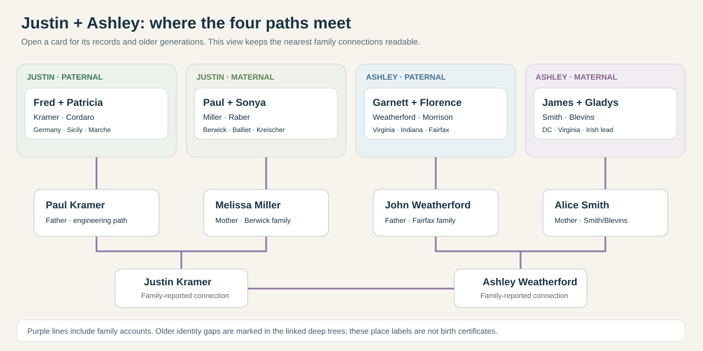
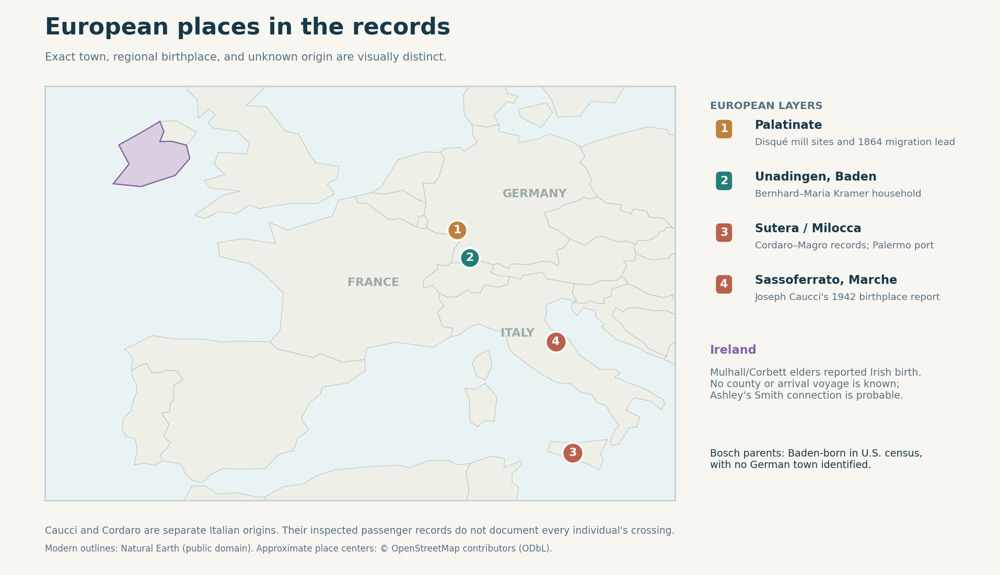
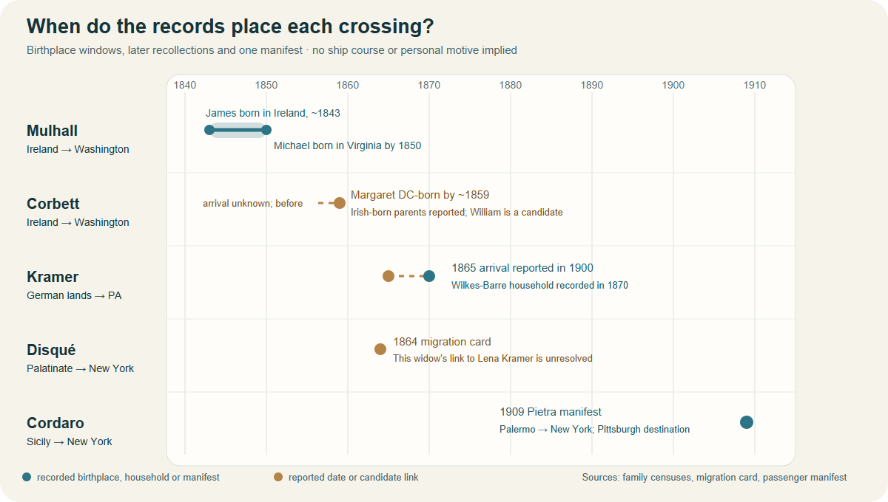

# Family history atlas

An evidence-led map of Justin and Ashley's family history. **Research snapshot: 28 September 2026.** This is a working history, not a certified pedigree.

## Start here

| Start with | Open |
| --- | --- |
| **Explore everyone visually** | [Zoomable, clickable family tree](explore/family-explorer.html) ([preview](explore/family-explorer-preview.png)): search people and places, jump between eight long ancestral paths, and open concise stories with records and maps |
| **Who is connected to whom?** | [Overall linked family tree](FAMILY-TREE.md) → [four deep tree diagrams](context/full-family-trees.md) |
| **What do we know about our own generations?** | [Recent generations: parents, Justin, Alex and Ashley](context/recent-generations.md) |
| **What happened when?** | [Ten clickable line timelines](explore/line-timelines.html) → [interactive overall timeline](explore/timeline.html) |
| **What were their lives like?** | [Four short storyboards](context/family-storyboards.md) → [work and assets](research/assets-by-generation.md) |
| **Where were they?** | [Family geography atlas](context/geography-atlas.md) → [address and photo atlas](context/family-home-photo-atlas.md) → [Sponenberg house photographs](context/family-homes.md) → [migration stories](context/immigration-stories.md) |
| **What is the proof?** | [Photographs and artifacts](context/faces-and-places.md) → [original record gallery](sources/records/README.md) → [source ledger](research/sources.md) |

### The family at a glance

- **Justin Kramer** ← [Paul Kramer](branches/kramer.md) and [Melissa Miller Kramer](branches/maternal-kramer-side.md). Paul's [Kramer and Cordaro ancestors](FAMILY-TREE.md#justins-paternal-paths) reach Germany and Italy; Melissa's [Miller, Raber, Kreischer, Sponenberg and Balliet branches](FAMILY-TREE.md#justins-maternal-paths) center on Pennsylvania.
- **Ashley Weatherford** ← [John Weatherford Sr.](branches/weatherford-smith-generations.md) and [Alice Smith Weatherford](branches/smith.md). John's [Weatherford and Morrison paths](FAMILY-TREE.md#ashleys-paternal-paths) lead through Virginia and Indiana; Alice's [Smith, Mulhall, Corbett, Blevins and Hines paths](FAMILY-TREE.md#ashleys-maternal-paths) include a probable Irish-born layer and older Virginia records.

Open the [linked family tree](FAMILY-TREE.md) to follow names generation by generation. A dashed tree edge or **proposed** label marks a relationship that still needs a decisive record.

<strong>Browse every branch, map, source and research guide</strong> (all existing links preserved)

- [Four paired family storyboards](context/family-storyboards.md): one overview and a work–asset–education sequence for Justin's paternal and maternal, and Ashley's paternal and maternal branches. Short stories and artifact links sit directly below each visual.
- [Visual timelines for each family line](explore/line-timelines.html): ten compact, clickable lanes lead into the detailed stories and records.

- [Explore the full family trees](context/full-family-trees.md): four readable, evidence-marked views follow the Kramer/Cordaro, Miller/Sponenberg, Weatherford/Morrison and Smith/Blevins lines through as many linked generations as the research permits. Dashed links show the specific gaps.
- [Explore the interactive family timeline](explore/timeline.html): filter family lines and centuries, then open events for people, places, evidence and unresolved questions. Open the HTML file in a browser. The [full research timeline](timeline.md) has more detail.
- [Explore the family geography atlas](context/geography-atlas.md): three maps show **Europe**, **Baden versus the Palatinate**, and the **eastern U.S. family regions**, with each marker tied to records and uncertain origins left unpinned.
- [See Sponenberg family homes](context/family-homes.md): three family-attributed house photographs, Edward and Jennie's documented East Second Street address, and a modern view link, with dates and identification limits beside each.
- [Original record-image gallery and Hilda's portrait](sources/records/README.md): the 1915 Sponenberg and Kreischer biographies, signed draft cards, marriage records, a death certificate and obituary clippings, each with a source and identification note. The [visual artifact gallery](context/faces-and-places.md#artifacts-that-show-their-lives) highlights what each item says about a person's life.
- [Read the original languages](sources/records/bernhard-kramer-huber-unadingen-memorial-1878.md): German text and English translation of the 1878 Unadingen memorial gift; the [Italian passport translation](sources/family/italian-passport-translation.md) explains its visible fields and uncertain handwriting.
- [Kramer line](branches/kramer.md): Wilkes-Barre people, German-born Matthew, and the still-unknown German hometown.
- [Baden Matthäus Kramer candidate](branches/kramer-baden-candidate.md): compare the German records with Pennsylvania's Matthew before joining the people.
- [Unadingen Kramer household](branches/kramer-unadingen-household.md): an **1812 original** names Bernhard's parents; a compact [family diagram](maps/kramer-unadingen-household.svg) shows twelve indexed children and four childhood burials. The German household's connection to Justin remains open.
- [Matthew and Lena's children](branches/kramer-eleven-children.md): a visual nine-child reconstruction from the original 1880 and 1900 censuses, with the two unnamed earlier deaths and mismatched 1870 names clearly marked.
- [Cordaro and Caucci family](branches/cordaro-passport-lead.md): original marriage applications and Antonio's [signed 1927 naturalization petition](sources/records/antonio-cordaro-petition-1927.jpg) connect Patricia, Joseph, Antonio and all five of Antonio's named children. A [Sicily map](maps/cordaro-sutera-places.svg) and [crossing diagram](maps/cordaro-crossing-evidence.svg) show their places and staggered move; the page now explains the **1905 Sutera landslide and emigration surge** as local context, without assigning a personal motive. The passport and portrait remain separately identified research leads.
- [Dina Caucci and the Belardinelli branch](branches/caucci-belardinelli.md): the [1938 original](sources/records/cordaro-caucci-marriage-1938.jpg) names her Italian-born parents. Joseph's [1942 draft card](sources/records/joseph-caucci-draft-card-1942.jpg) places a strong family candidate in **Sassoferrato, Marche**; a [1913 Anna manifest](sources/records/anna-belardinelli-1913-passenger-manifest.jpg) gives that town as a same-name traveler's last residence. The [Europe map](maps/europe-family-places.svg) distinguishes Marche from the Cordaros' Sicily; a [short diagram](maps/caucci-belardinelli-evidence.svg) marks the unresolved family bridge. A [1925 death index](sources/records/anna-caucci-death-index-1925.jpg) and [1946 mines report](sources/records/caucci-coal-1946-manager.jpg) give further testable clues.
- [Disqué and Schaaf lines](branches/disque-schaaf.md): Palatinate mill families and a possible migration path, with a [two-lane visual](maps/disque-mills-and-migration.svg) separating the established events from the missing Lena link.
- [Bosch, Greener, Froelich, and Andrews leads](branches/other-paternal-lines.md).
- [Weatherford and Smith neighborhood](branches/weatherford-smith.md), [Weatherford line](branches/weatherford.md), [Smith line](branches/smith.md), [Cowan–Mason line](branches/cowan-mason.md), [Washington, DC, Smith evidence](branches/smith-dc-candidate.md), and [Mulhall–Corbett candidate ancestry](branches/smith-mulhall-corbett.md): Ashley's Fairfax family, Danville roots, Bristol Hines records, Nora's original 1892 birth, James and Gladys's 1957 license notice, a probable Irish-born layer, transit work, and three documented parcels.
- [Weatherford–Smith generations](branches/weatherford-smith-generations.md): birth/death status, named sibling groups and Duffy and Annie's [1930](sources/records/duffy-annie-weatherford-census-1930.jpg) and [1940](sources/records/duffy-annie-weatherford-census-1940.jpg) census pages, with a [family-layer diagram](maps/weatherford-smith-generations.svg).
- [Weatherfords before George](branches/weatherford-early-virginia.md): original 1850–80 Halifax household sheets, Caroline's 1880 school entry, a [census-resources visual](maps/samuel-weatherford-census-resources.svg) with the 1860 gap, [evidence diagram](maps/weatherford-early-virginia.svg), and the earliest supported U.S. residence for Ashley's Weatherford branch.
- [Are the Texas Weatherfords related to Ashley?](branches/weatherford-texas-connection.md): the city namesake's Virginia-to-Texas path, side-by-side lineage diagram, and the still-missing common-ancestor proof.
- [Which Jackson Weatherford?](branches/weatherford-jackson-candidate.md): original 1844 Indiana marriage and 1850 census reveal a likely same-name mix-up in the proposed parent line; [comparison visual](maps/weatherford-jackson-name-collision.svg).
- [Ashley's U.S. family milestones](branches/ashley-us-timeline.md): a short two-branch timeline from the 1829 Weatherford marriage lead and 1931 Blevins–Hines marriage through the Fairfax family.
- [Florence's Morrison–Hollinger household](branches/morrison-hollinger.md): a [three-record diagram](maps/morrison-indiana-evidence-1900-1920.svg) tests Roscoe's probable Indiana grandparents and shows their 1900 farm and schooling entries; other originals trace the family through Fairfax, with the 1954 marriage-age conflict kept visible.
- [Monty's corgi family](branches/monty.md): his AKC certificate, birth and sire timeline, known parents and proposed older paternal line, with an [evidence-marked pedigree](maps/monty-pedigree.svg).
- [Deep Blevins research](branches/blevins-deep-lineage.md): original 1850–1900 households, Ada's named Thompson relatives, Shubiel's veteran headstone application, and the remaining [ancestry gap](maps/blevins-deep-lineage.svg).
- [Oyster Bay / Westerly Blevins leads](branches/blevins-rhode-island-lead.md): printed 1678–87 New York town-book records, a 1691 Westerly family account, a 1771 Virginia land-claim transcript and a separate DNA comparison, with a [dated evidence trail](maps/blevins-northeast-record-timeline.svg) and [missing Ashley links](maps/blevins-rhode-island-evidence.svg).
- [James Blevins and early Virginia settlement](branches/blevins-colonial-james.md): hunters on Smith River, the Peach Bottom land case, and a [timeline that separates the different James men](maps/blevins-early-settlement.svg).
- [Virginia in the 1740s: period views](context/virginia-colonial-views.md): a **1740–70 Williamsburg etching**, near-contemporary regional map, surviving Goochland outbuilding, and Alexandria's original town plan, each labeled by date and evidence limit.
- [James Blevins, Revolutionary pensioner](branches/blevins-revolutionary-james.md): his own 1832 migration and service account, with an [evidence-marked route](maps/blevins-revolutionary-james.svg); his connection to Ashley remains unproved.
- [Justin's maternal Berwick side](branches/maternal-kramer-side.md): the [Miller–Gower–Reese household](branches/miller-gower-reese.md), [Raber–Kreischer–Sponenberg line](branches/raber-kreisher-fairchild.md), [Sponenberg work and immigration deep dive](branches/sponenberg-deep-dive.md), and [Balliet–Raber evidence guide](branches/balliet-raber-candidates.md) with the [original 1940 Crystal-and-eleven-children census](sources/records/crystal-balliet-household-census-1940.jpg), [family diagram](maps/raber-balliet-evidence-paths.svg), and [Berwick street clues](maps/berwick-raber-kreischer-places.svg).
- [Raber, Kreischer and Balliet record trail](branches/raber-kreischer-balliet-record-trail.md): a [three-line visual](maps/raber-kreischer-balliet-record-trail.svg), seven newly saved 1870–1950 census pages, Stanley and Crystal's indexed marriage, jobs, housing snapshots and the exact next parent links.
- [Berwick Miller family timeline](branches/miller-berwick-timeline.md): records and family stories from the early household through the factory closure, Lester and Carl's music, a Vietnam-veteran burial lead, and later family visits. [Six scenes from Paulene's memoir](maps/paulene-miller-moments.svg) offer a shorter way into the family's daily life.
- [Carl Miller and Agent Orange: evidence check](research/carl-miller-agent-orange.md): his reported exposure, VA's location rules, and the military and medical records still needed.
- [Annie Neathery's Phelps and Danville family](branches/neathery-phelps.md): an 1889 North Carolina marriage names both parent pairs; an 1880 candidate household records schooling and farm work; the 1900 census explains why Mary Moring was probably her stepmother.
- [Family places across generations](context/family-place-sequences.md): mapped Muncy Valley → Berwick → Muncy regional return, plus Kramer, Cordaro and Weatherford place sequences with evidence gaps shown.
- [Family home and photo atlas](context/family-home-photo-atlas.md): a six-line visual leads to dated Kramer, Sponenberg, Cordaro, Miller, Blevins, Smith and Weatherford addresses, record scans and current house galleries. Two certificates document the Weatherford family's **824 Noble** address in Danville; Ferdinand Louis's 1976 obituary repeats **19 Flick Street**, first seen in 1940. Mary's [1929 death certificate](https://www.findagrave.com/memorial/126529268/mary-andrews/photo#view-photo=218591682) and [original notice](https://www.findagrave.com/memorial/126529268/mary-andrews/photo#view-photo=218591721) both place the Andrews family at **21 Flick**; Frank's 1930 census says **71 Flick**. [Why those numbers remain separate](branches/andrews-kennedy.md).
- [Ashley's immigration question](branches/ashley-immigration.md): a [four-path evidence visual](maps/ashley-arrival-status.svg) shows what the present records establish and the exact links still needed to date an arrival.
- [Immigration stories and evidence windows](context/immigration-stories.md): a concise comparison of the Kramer, Mulhall, Corbett, Disqué and Cordaro crossings, their period context, and the unanswered personal reasons.
- [Places, education, and events](context/places-and-schools.md).
- [Education across generations](context/education-across-generations.md): a visual school trail including the Kramer radio-to-engineering/computing story, plus Berwick, Fairfax and Virginia Tech. The [Ferdinand Louis NRI evidence graphic](maps/ferdinand-louis-nri-evidence.svg) separates his obituary's graduation report from the still-unknown reason for studying and any personal radio project.
- [Agnes in the family's places](context/agnes-1972.md): a visual comparison of the 1972 flood in Wilkes-Barre, Berwick and northern Virginia, with family impact kept separate from local history.
- [Growing up around Franconia](context/franconia-growing-up.md): schools, suburban growth, racing and crime in the years Ashley's parents remember, with a [population chart](maps/fairfax-growth-1950-1985.svg).
- [The families in their times](context/family-in-its-times.md): local events and carefully bounded migration explanations.
- [Family burial places and headstone visit guide](context/family-burial-places.md): mapped cemeteries in Pennsylvania, Virginia and Maryland, source strength, known plot detail, and the next records to request before a visit.
- [Lives across generations](context/lives-across-generations.md): a six-lane work visual and short, sourced scenes about mills, farms, trades, factory shifts, family music, banking and transit.
- [Faces, places and artifacts gallery](context/faces-and-places.md): saved portraits, a family Bible, the Italian passport, a biography, marriage record and obituary alongside period views; captions say what each image establishes and what remains uncertain.
- [Assets and work by generation](research/assets-by-generation.md): a visual record-coverage map and sourced ledger for each line, including what could explain the 1864 Disqué migration. The [1940 housing snapshot](context/housing-and-work-1940.md) puts two family home estimates beside state medians and shows rent differences across their regions.
- [Civil War across the family lines](context/civil-war-family-lines.md): the 1890 veterans schedule strongly links Gad Marshall Miller to the Union 171st Pennsylvania; Shubiel's federal headstone application records Confederate 61st North Carolina service, while Ashley's full ancestral bridge and any direct encounter remain unproved.
- [Regional family maps](context/geography-atlas.md), [Colette Drive neighborhood map](maps/colette-neighborhood.svg), and [picture guide](media/README.md), with **1911 Danville textile workers**, a **1939 Halifax tobacco-town street**, a WWII Navy scene, eighteenth-century Virginia views and actual-relative photo leads.
- [Kramer family-line diagram](maps/kramer-lineage.svg), [Kramer work timeline](maps/kramer-work.svg), and [Colette property assessment chart](maps/colette-assessments.svg).
- [Source ledger](research/sources.md), [Monty source ledger](research/monty-sources.md), [chart transcription](research/chart-transcription.md), and [open questions](research/open-questions.md).

The [immigration guide](context/immigration-stories.md) explains each date and why the Irish county, Matthew Kramer's German town and personal motives remain open.

## What we can say now

The [original Kramer 1900 census](sources/records/kramer-matthew-lena-census-1900.jpg) places **Ferdinand (c. 1882)** with Germany-born father **Matthew** and mother **Lena**, both reporting 1865 U.S. arrival; [three original census snapshots](branches/kramer-martin-migration.md) trace their probable earlier household; the [original 1930 census](https://www.familysearch.org/ark:/61903/3:1:33S7-9RCJ-Q7S?view=index&personArk=%2Fark%3A%2F61903%2F1%3A1%3AXH7C-PL7&action=view&lang=en) places his sons **Ferdinand L. (1913)** and **Emil C. (1915)** with him and Rose. [Two 1920 sheets](branches/other-paternal-lines.md) identify Rose's parents **Amiel and Hildegard Bosch**, both Baden-born. Emil's [signed 1940 draft card](https://www.familysearch.org/ark:/61903/3:1:3Q9M-CSW4-4QGH-W?view=index&personArk=%2Fark%3A%2F61903%2F1%3A1%3AQ2SF-63JK&action=view&lang=en) identifies **American Chain & Cable** as his employer, and his [1943 Army enlistment](https://www.familysearch.org/ark:/61903/1:1:K8TZ-8YY?lang=en) confirms service entry. A [1950 household](https://1950census.archives.gov/iiif/2/1950census%2F43290879-Pennsylvania%2F43290879-Pennsylvania-135713%2F43290879-Pennsylvania-135713-0005.jpg/full/full/0/default.jpg) strongly matches Ferdinand Louis, wife Mary Andrews and their son **Fred / Ferdinand Francis (1939)**. Matthew's identification with *Matthias*, the earlier **Bernhard** link, and the exact nature of the awards reported in Emil’s obituary remain open.

The chart's long German branch belongs to **Magdalena Disque**, who married into the Kramer family. A specialist Palatinate mill history independently documents Sebastian Disqué, Anna Barbara Schaaf, and their mill operations. The later chain from the 1700s to Magdalena remains a research target; published accounts and the chart disagree on some dates and spouses.

The Weatherford–Smith branch has three mapped family homes in one Fairfax County neighborhood. Alice and John's [1986 marriage return](https://www.familysearch.org/ark:/61903/1:1:QK9V-J612?lang=en) names her parents **James Allen Smith** and **Gladys Louise Blevins** and places the couple at **6330 and 6312 Miller Drive** just before marriage. Gladys's [2008 memorial](https://www.findagrave.com/memorial/45796517/gladys_louise-smith) names all five children; her [1940 census household](https://www.familysearch.org/ark:/61903/1:1:K4HN-TVW?lang=en) and her parents' [1931 marriage](https://www.familysearch.org/ark:/61903/1:1:QKH7-PC1M?lang=en) extend the Blevins/Hines side. A [1929 death certificate](https://www.familysearch.org/ark:/61903/1:1:NSFW-RVB?lang=en) now confirms **Shubiel Blevins and Ada Thompson** as parents of William Elkanah Blevins; the link from him to Gladys's father William Howard remains a [1920-household lead](branches/blevins-deep-lineage.md). The [Smith evidence diagram](maps/smith-blevins-lineage.svg) distinguishes that record-backed link from James's candidate parents. County parcel histories connect the families with **6307 Colette Drive** and the Miller homes. Garnett's [1930 census](https://www.familysearch.org/ark:/61903/1:1:CFG1-7N2?lang=en) and parents' [1966](https://www.familysearch.org/ark:/61903/1:1:QVRZ-2C68?lang=en) and [1969](https://www.familysearch.org/ark:/61903/1:1:QVYL-N4BR?lang=en) death certificates extend Ashley's Weatherford line to **George C. Weatherford and Ella Lumpkin** and **John R. Neathery and Annie Phelps**. The [deeper family diagram](maps/weatherford-deep-lineage.svg) summarizes these links. Garnett's [1946 card](https://www.familysearch.org/ark:/61903/3:1:3Q9M-CSZX-KJ56?view=index&personArk=%2Fark%3A%2F61903%2F1%3A1%3AQ2W5-YQRZ&action=view&lang=en) records a Navy honorable discharge; his obituary adds Pacific service and a long bus-driving career. The Fairfax neighborhood is in **Franconia**, despite its Alexandria postal city.

On Justin's maternal side, his account names **Paul Miller and Sonya Raber** as Melissa's parents. Paul's sister Paulene's [Berwick memoir](https://bhaven.org/paulene/life-journey) describes the older household; [1910 and 1920 censuses](https://www.familysearch.org/ark:/61903/1:1:MG87-BF5?lang=en), a [1937 marriage index](https://www.myheritage.com/research/record-20828-1259334/lester-e-miller-and-velma-p-wilson-in-maryland-marriages), and the [original 1950 household across two sheets](sources/records/README.md) check key names and show Lester's weaving-mill work and Velma's private-home housework. A [parent-naming Social Security index](https://www.familysearch.org/ark:/61903/1:1:6K9G-Y87C?lang=en) identifies their son **Carl Eugene Miller**; his [military and Agent Orange question](research/carl-miller-agent-orange.md) remains open at the service-location step. Original [1919 birth](sources/records/mabel-reese-pa-birth-index-1919.png) and [death](sources/records/meda-reese-pa-death-index-1919.png) index pages put Mabel Reese's birth and Meda Reese's death twelve days apart in Lycoming County; full certificates remain a priority. [Reese evidence diagram](maps/ada-reese-evidence-chain.svg). Sonya's [Kreischer–Sponenberg line](branches/raber-kreisher-fairchild.md) now has a 1940 census, 2018 obituary and a 1915 biography. A [same-name Berwick burial listing](https://peoplelegacy.com/ruth_e_kreischer_fairchild-482j331) strongly places **Fairchild by Ruth Kreischer's marriage**; the earlier remembered Fairchild-born ancestor remains unplaced. For Ashley, [Louisa Straub Hollinger](branches/morrison-hollinger.md) is a **strongly supported immigrant lead** through Florence's mother. Her [1941 certificate](sources/records/louisa-straub-hollinger-death-certificate-1941.jpg) reports **France** for her and father **Nicholas Straub**; censuses say Germany and disagree on arrival year. The Weatherford trail includes George Weatherford and Ella Lumpkin's **1884 Virginia marriage**; its earlier immigrant remains unidentified. [Maternal guide](branches/maternal-kramer-side.md) · [Ashley's arrival question](branches/ashley-immigration.md).

## Evidence rules

**Recorded** means a cited record directly states the fact. **Family-supplied** means the chart or Justin/Ashley gave it. **Proposed** means records fit but identity or relationship still needs proof. **Context** describes a place or era and is never presented as something a named ancestor personally experienced. Dates and spellings are preserved as each source gives them; conflicts stay visible.

The repository is currently private. Justin has authorized recording family-provided living-person details and proposed connections here. Keep them labeled by source and confidence; a family account is valuable evidence but should not be silently upgraded to a verified public record. Publish or share a copy only after checking living-person details. Property prices and assessments are recorded where a county source supports them, with their limits stated. No individual net worth, motive for migration, or lost inheritance is established in this pass.
