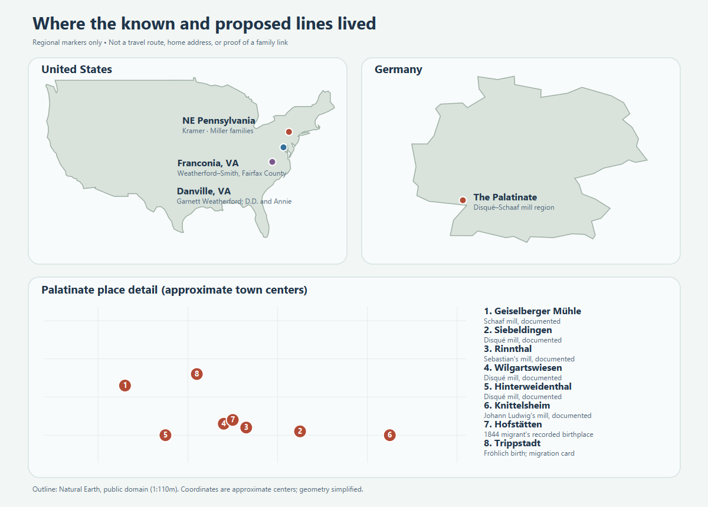

# Family history atlas

An evidence-led map of Justin and Ashley's family history. **Research snapshot: 26 September 2026.** This is a working history, not a certified pedigree.

## Start here

- [Timeline and family circumstances](timeline.md)
- [Kramer line](branches/kramer.md): Wilkes-Barre people and the unresolved surname origin.
- [Sutera Italian passport lead](branches/cordaro-passport-lead.md): family-held photos, a cautious transcription and the open Cordaro/Cadaros-to-Kramer connection.
- [Disqué and Schaaf lines](branches/disque-schaaf.md): Palatinate mill families and a possible migration path.
- [Bosch, Greener, Froelich, and Andrews leads](branches/other-paternal-lines.md).
- [Weatherford and Smith neighborhood](branches/weatherford-smith.md), [Weatherford line](branches/weatherford.md), and [Smith line](branches/smith.md): Ashley's Fairfax family, Danville roots, sibling leads, transit work, and three documented parcels.
- [Weatherford–Smith generations](branches/weatherford-smith-generations.md): birth/death status and the full named sibling groups, with a [family-layer diagram](maps/weatherford-smith-generations.svg).
- [Monty's corgi family](branches/monty.md): his AKC certificate, birth and sire timeline, known parents and proposed older paternal line, with an [evidence-marked pedigree](maps/monty-pedigree.svg).
- [Deep Blevins research](branches/blevins-deep-lineage.md): the colonial member-tree trail, Shubiel's Civil War lead, original records, and [evidence ladder](maps/blevins-deep-lineage.svg).
- [James Blevins and early Virginia settlement](branches/blevins-colonial-james.md): hunters on Smith River, the Peach Bottom land case, and a [timeline that separates the different James men](maps/blevins-early-settlement.svg).
- [James Blevins, Revolutionary pensioner](branches/blevins-revolutionary-james.md): his own 1832 migration and service account, with an [evidence-marked route](maps/blevins-revolutionary-james.svg); his connection to Ashley remains unproved.
- [Justin's maternal Berwick side](branches/maternal-kramer-side.md): the [Miller–Gower–Reese household](branches/miller-gower-reese.md), [Raber–Kreisher–Fairchild line](branches/raber-kreisher-fairchild.md), and [two-branch diagram](maps/miller-raber-family.svg).
- [Ashley's immigration question](branches/ashley-immigration.md): what the present records establish and the exact links still needed to date an arrival.
- [Places, education, and events](context/places-and-schools.md).
- [Growing up around Franconia](context/franconia-growing-up.md): schools, suburban growth, racing and crime in the years Ashley's parents remember, with a [population chart](maps/fairfax-growth-1950-1985.svg).
- [The families in their times](context/family-in-its-times.md): local events and carefully bounded migration explanations.
- [Civil War across the family lines](context/civil-war-family-lines.md): the 1890 veterans schedule strongly links Gad Marshall Miller to the Union 171st Pennsylvania; Shubiel Blevins's Confederate lead and any direct encounter remain unproved.
- [Regional family map](maps/ancestral-places.svg), [Colette Drive neighborhood map](maps/colette-neighborhood.svg), and [picture guide](media/README.md), now with a WWII Navy scene and actual-relative photo leads.
- [Kramer family-line diagram](maps/kramer-lineage.svg), [Kramer work timeline](maps/kramer-work.svg), and [Colette property assessment chart](maps/colette-assessments.svg).
- [Source ledger](research/sources.md), [Monty source ledger](research/monty-sources.md), [chart transcription](research/chart-transcription.md), and [open questions](research/open-questions.md).

## What we can say now

The Kramer [1900 census](https://www.myheritage.com/research/record-10131-47210375/ferdinand-kramer-in-1900-united-states-federal-census?s=OYYV7ARRCL4FQTYCDTGIPASUAVZSK7I) places **Ferdinand (c. 1882)** with father **Matthew** and mother **Lena**; the [original 1930 census](https://www.familysearch.org/ark:/61903/3:1:33S7-9RCJ-Q7S?view=index&personArk=%2Fark%3A%2F61903%2F1%3A1%3AXH7C-PL7&action=view&lang=en) places his sons **Ferdinand L. (1913)** and **Emil C. (1915)** with him and Rose. [Two 1920 sheets](branches/other-paternal-lines.md) identify Rose's parents **Amiel and Hildegard Bosch**, both Baden-born. Emil's [signed 1940 draft card](https://www.familysearch.org/ark:/61903/3:1:3Q9M-CSW4-4QGH-W?view=index&personArk=%2Fark%3A%2F61903%2F1%3A1%3AQ2SF-63JK&action=view&lang=en) identifies **American Chain & Cable** as his employer, and his [1943 Army enlistment](https://www.familysearch.org/ark:/61903/1:1:K8TZ-8YY?lang=en) confirms service entry. A [1950 household](https://1950census.archives.gov/iiif/2/1950census%2F43290879-Pennsylvania%2F43290879-Pennsylvania-135713%2F43290879-Pennsylvania-135713-0005.jpg/full/full/0/default.jpg) strongly matches Ferdinand Louis, wife Mary Andrews and their son **Fred / Ferdinand Francis (1939)**. Matthew's identification with *Matthias*, the earlier **Bernhard** link, and any Emil medals remain open.

The chart's long German branch belongs to **Magdalena Disque**, who married into the Kramer family. A specialist Palatinate mill history independently documents Sebastian Disqué, Anna Barbara Schaaf, and their mill operations. The later chain from the 1700s to Magdalena remains a research target; published accounts and the chart disagree on some dates and spouses.

The Weatherford–Smith branch has three mapped family homes in one Fairfax County neighborhood. Alice and John's [1986 marriage return](https://www.familysearch.org/ark:/61903/1:1:QK9V-J612?lang=en) names her parents **James Allen Smith** and **Gladys Louise Blevins** and places the couple at **6330 and 6312 Miller Drive** just before marriage. Gladys's [2008 memorial](https://www.findagrave.com/memorial/45796517/gladys_louise-smith) names all five children; her [1940 census household](https://www.familysearch.org/ark:/61903/1:1:K4HN-TVW?lang=en) and her parents' [1931 marriage](https://www.familysearch.org/ark:/61903/1:1:QKH7-PC1M?lang=en) extend the Blevins/Hines side. A [1929 death certificate](https://www.familysearch.org/ark:/61903/1:1:NSFW-RVB?lang=en) now confirms **Shubiel Blevins and Ada Thompson** as parents of William Elkanah Blevins; the link from him to Gladys's father William Howard remains a [1920-household lead](branches/blevins-deep-lineage.md). The [Smith evidence diagram](maps/smith-blevins-lineage.svg) distinguishes that record-backed link from James's candidate parents. County parcel histories connect the families with **6307 Colette Drive** and the Miller homes. Garnett's [1930 census](https://www.familysearch.org/ark:/61903/1:1:CFG1-7N2?lang=en) and parents' [1966](https://www.familysearch.org/ark:/61903/1:1:QVRZ-2C68?lang=en) and [1969](https://www.familysearch.org/ark:/61903/1:1:QVYL-N4BR?lang=en) death certificates extend Ashley's Weatherford line to **George C. Weatherford and Ella Lumpkin** and **John R. Neathery and Annie Phelps**. The [deeper family diagram](maps/weatherford-deep-lineage.svg) summarizes these links. Garnett's [1946 card](https://www.familysearch.org/ark:/61903/3:1:3Q9M-CSZX-KJ56?view=index&personArk=%2Fark%3A%2F61903%2F1%3A1%3AQ2W5-YQRZ&action=view&lang=en) records a Navy honorable discharge; his obituary adds Pacific service and a long bus-driving career. The Fairfax neighborhood is in **Franconia**, despite its Alexandria postal city.

On Justin's maternal side, his account names **Paul Miller and Sonya Raber** as Melissa's parents. Paul's sister Paulene's [published Berwick memoir](https://bhaven.org/paulene/category/marqueen-kitta) matches Justin's Miller sibling names and describes the older household's work, schooling and hardship. Sonya's **Kreisher → Fairchild** line remains a family-supplied lead. For Ashley, **no identified family immigration date** is established: George Weatherford and Ella Lumpkin married in Virginia in **1884**, while the earlier immigrant and the Smith/Morrison origins remain open. [Maternal guide](branches/maternal-kramer-side.md) · [Ashley's arrival question](branches/ashley-immigration.md).

## Evidence rules

**Recorded** means a cited record directly states the fact. **Family-supplied** means the chart or Justin/Ashley gave it. **Proposed** means records fit but identity or relationship still needs proof. **Context** describes a place or era and is never presented as something a named ancestor personally experienced. Dates and spellings are preserved as each source gives them; conflicts stay visible.

The repository is currently private. Justin has authorized recording family-provided living-person details and proposed connections here. Keep them labeled by source and confidence; a family account is valuable evidence but should not be silently upgraded to a verified public record. Publish or share a copy only after checking living-person details. Property prices and assessments are recorded where a county source supports them, with their limits stated. No individual net worth, motive for migration, or lost inheritance is established in this pass.
