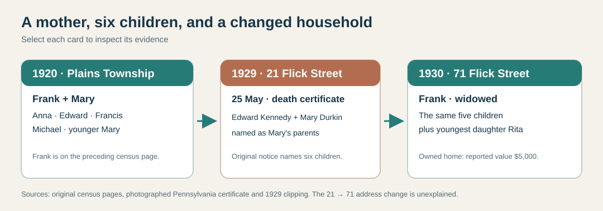
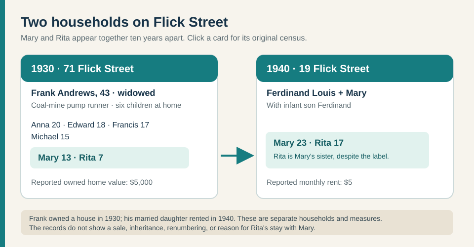
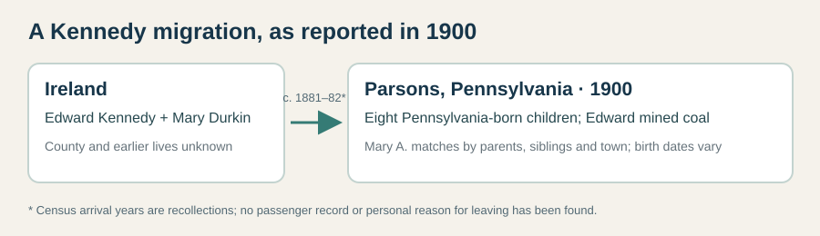

# The Andrews and Kennedy household on Flick Street

**The short version:** The [1920 census, first sheet](../sources/records/frank-andrews-family-census-1920-sheet-3a.jpg) and [continuation](../sources/records/frank-andrews-family-census-1920-sheet-3b.jpg) show Frank and Mary Andrews with five children. A [1929 state death index](../sources/records/mary-andrews-death-index-1929.png) and a [transcribed contemporary notice](https://www.findagrave.com/memorial/126529268/mary-andrews) document Mary's death. The [1930 census](../sources/records/frank-andrews-children-census-1930.jpg) shows Frank widowed with six children, including **Mary and Rita as sisters**. This corrects Rita's misleading “daughter” label in the [1940 Kramer household](../sources/records/ferdinand-mary-kramer-census-1940-continuation.jpg). Younger Mary was Justin Kramer's great-grandmother through her son Fred.

| Date | What the source actually says | Short story and limit |
| --- | --- | --- |
| **18 Jun 1900** | A [Parsons census, sheet 22A](../sources/records/edward-mary-kennedy-census-1900-sheet-22a.jpg), lines **46–50**, names Ireland-born **Edward and Mary Kennedy** with **John, Mary A. and Thomas**; [sheet 22B](../sources/records/edward-mary-kennedy-census-1900-sheet-22b.jpg), lines **51–55**, continues with **Michael, Edward, Margaret, Henry and Patrick**. Edward worked as a **coal miner**. Both adults reported arriving in the U.S. around **1881–82**; the wife reported **eight children born, eight living**. | This is a strong earlier match for Mary Kennedy Andrews: daughter Mary is of the right age and place, and her 1929 notice names brothers John, Thomas, Michael and Henry. The census calls the mother **Mary**, but does **not** give her maiden name. Mary A.'s reported **July 1886** birth differs from the memorial's **20 July 1887**. A reported arrival year is not a passenger record or an explanation of why the couple left Ireland. |
| **29 Dec 1909** | A [Luzerne marriage docket, no. 54285](../sources/records/frank-andrews-mary-kennedy-marriage-docket-1909.jpg), lists **Frank Andrew** and **Mary Kennedy**, both residing in Parsons; it records their marriage that day. Frank's occupation is **laborer**. | The surname lacks the final *s* in this docket. The match to Mary Andrews Kramer's parents is strong from their names, local place, and her [1936 parent-naming marriage form](../sources/records/ferdinand-louis-kramer-mary-andrews-marriage-1936.jpg), but the docket gives **no parents** for either spouse. |
| **1910, candidate** | A [Parsons census](../sources/records/frank-mary-andrews-census-1910-candidate.jpg), sheet 23A, lines 42–44, has **Frank Andrews Jr.**, wife **Mary**, and infant **Anna**. Frank worked as a **coal-mine teamster**. | Likely the newly married couple, but this sheet calls Frank **Russia/Poland-born**, unlike the later **New York** birthplace and 1909 docket's apparent **Albany** entry. Mary's age also differs from the docket. Keep this as a candidate pending a stronger bridge. |
| **Jan 1920** | The [Plains Township census sheet 3A](../sources/records/frank-andrews-family-census-1920-sheet-3a.jpg), line **50**, puts **Frank Andrews, 31**, at the bottom of the page as a coal miner. [Sheet 3B](../sources/records/frank-andrews-family-census-1920-sheet-3b.jpg), lines **51–56**, continues with **wife Mary, 31**, and **Anna 9, Edward 8, Francis 6, Michael 4, Mary 2**. | The children match the first five named in 1930. Frank appeared to be alone in his online index because his family continued onto the next image. The census does not give Mary's maiden name. |
| **25 May 1929** | Pennsylvania's [original death index, p. 33](../sources/records/mary-andrews-death-index-1929.png) lists **Mary Andrews**, **Wilkes-Barre**, **25 May**, certificate **58225**. Her [Find a Grave memorial](https://www.findagrave.com/memorial/126529268/mary-andrews) transcribes a *Wilkes-Barre Record* notice dated **27 May 1929**: Mrs. Frank Andrews died at the family home, **21 Flick Street**, after an illness described only as “complications”; it names **Anna, Edward, Francis, Michael, Mary and Rita**. | The newspaper transcription's exact six-child list ties this death to the 1930 household and gives the family story behind Frank's widowed entry. The index establishes the date but does not name her parents or cause. Inspect the original newspaper and certificate before explaining the illness. The memorial proposes burial at **Saint Mary's Cemetery, Hanover Township**. |
| **17 Apr 1930** | The [original census](../sources/records/frank-andrews-children-census-1930.jpg), Wilkes-Barre Ward 17, ED 40-270, sheet 11A, lines **25–31**, places widowed **Frank, 43**, at **71 Flick Street** with six children: **Anna, 20; Edward, 18; Francis, 17; Michael, 15; Mary, 13; Rita, 7**. He reported owning a house valued at **$5,000** and working as a **pump runner in a coal mine**. | This directly establishes **Mary and Rita as siblings through Frank** and provides a rare home-value snapshot. The $5,000 is a reported property value, **not family net worth**, and the census does not name the children's mother. Frank said he was born in New York and both parents in Poland. |
| **1936–40** | Mary gave **71 Flick** on her [1936 signed marriage form](../sources/records/ferdinand-louis-kramer-mary-andrews-marriage-1936.jpg), which names **Frank Andrews and Mary Kennedy** as her parents. By [1940](../sources/records/ferdinand-mary-kramer-census-1940.jpg), she and Ferdinand Louis rented at **19 Flick** for **$5/month** with their infant son and Rita. | The 1940 “daughter” entry for Rita conflicts with the **1930 father-and-daughters household**; she was Mary's sister. Two recorded house numbers do not by themselves prove a physical move, sale, inheritance, or why Rita stayed with Mary. |
| **1950** | The [original census](https://1950census.archives.gov/iiif/2/1950census%2F43290879-Pennsylvania%2F43290879-Pennsylvania-135713%2F43290879-Pennsylvania-135713-0005.jpg/full/full/0/default.jpg) calls **Frank Andrews, 62**, Ferdinand Louis's **father-in-law** in the Kramer home. | This reconnects Frank to his married daughter. It does not show what happened to his 1930 house or its value. |

**From Ireland to the Parsons coal district:** Edward and Mary Kennedy's 1900 household is a strong, still testable ancestral bridge. The original census puts both adults' birthplaces in **Ireland**, their children in **Pennsylvania**, and Edward at a **coal mine**. It suggests an early-1880s migration and a locally born next generation, but gives **no Irish county, ship, motive, or Mary's maiden name**. The [memorial](https://www.findagrave.com/memorial/126529268/mary-andrews) proposes her mother was **Mary Durkin**; that surname remains a lead. The transcribed 1929 notice independently names Mary's brothers **John, Thomas, Henry and Michael Kennedy**, plus two married sisters, **Mrs. Joseph Dooley** and **Mrs. Thomas McCarthy of New York City**. The 1900 sheet also lists Edward, Margaret and Patrick; their later histories and the sisters' married identities need separate checks. A [Social Security NUMIDENT index for Anna Agnes Andrews Favata](https://www.familysearch.org/ark:/61903/1:1:6K95-L1NX?lang=en) and [one for Francis Anthony Andrews](https://www.familysearch.org/ark:/61903/1:1:6K9P-3M8R?lang=en) each names **Frank Andrews and Mary Kennedy** as parents. Find Mary's full death certificate **58225** and the original 1929 notice to test her parentage and illness; Rita's own parent-naming birth record is still missing.

**Three Flick Street numbers need a property check:** the transcribed 1929 notice says **21**, the 1930 census and 1936 marriage form say **71**, and the 1940 Kramer rental says **19**. They may represent different buildings, an inaccurate notice, or renumbering; no deed, building card or historic street map has settled that. [Open the map for 21 Flick](https://www.google.com/maps/search/?api=1&query=21+Flick+St+Wilkes-Barre+PA), but do not label any present building as the 1929 home yet.

**See the place:** [71 Flick Street on a current map](https://www.google.com/maps/search/?api=1&query=71+Flick+St+Wilkes-Barre+PA+18705) · [present-day photo page for 19 Flick](https://www.zillow.com/homedetails/19-Flick-St-Wilkes-Barre-PA-18705/53510710_zpid/). No dated photograph yet proves that either present structure is the 1930 or 1940 building.
