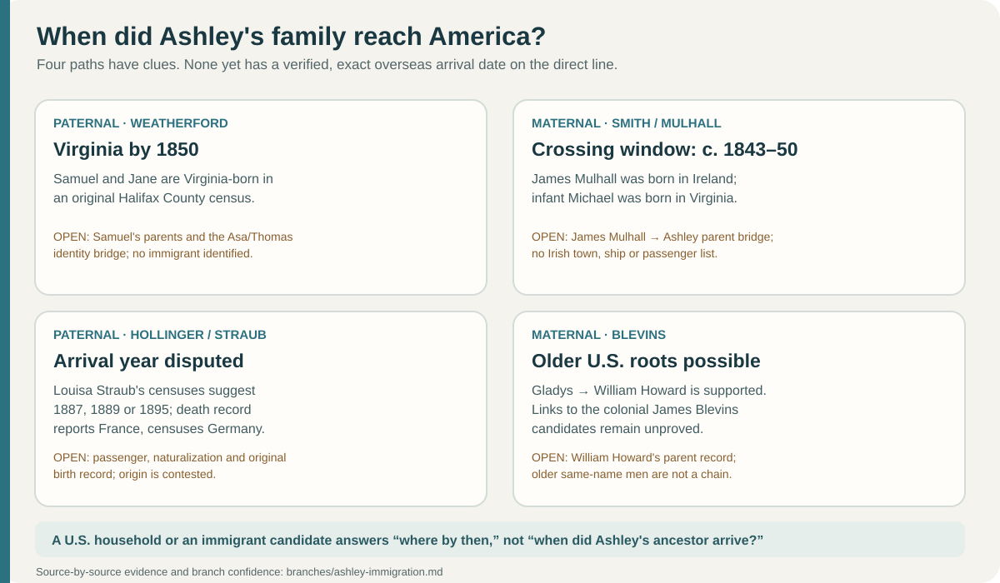

# When did Ashley's family arrive in America?

The cards summarize the [1850 Weatherford household](https://www.familysearch.org/ark:/61903/1:1:M8D3-227?lang=en), [1850 Mulhall birthplace bracket](smith-mulhall-corbett.md), [Louisa Straub's conflicting records](morrison-hollinger.md), and the [Blevins parent-link gap](blevins-deep-lineage.md). A U.S. household or a census arrival estimate is not an original crossing record; each route has its own unresolved bridge.

**We do not yet have a documented exact immigration date for any of Ashley's identified branches.** A [1941 death notice naming Louisa Hollinger's daughter Eleanor Morrison](morrison-hollinger.md#eleanors-earlier-household-a-strong-still-testable-bridge), combined with original 1900–30 censuses, strongly supports a Louisa Hollinger connection on Ashley's Morrison side. Her [full death certificate](../sources/records/louisa-straub-hollinger-death-certificate-1941.jpg) calls her **France-born** and names her father **Nicholas Straub**, also France-born. Census reports call her Germany-born and disagree on her arrival year; the original newspaper notice has not yet been inspected. The Weatherford trail reaches **Samuel and Jane Wetherford**, both recorded as **Virginia-born** in a [1850 Halifax County census](https://www.familysearch.org/ark:/61903/1:1:M8D3-227?lang=en). Their son Thomas is a **probable**, not final, match for George's father because the [1855 marriage](https://familysearch.org/ark:/61903/1:1:68TT-61CV?lang=en) calls him “Thos E,” while later records call George's father “Asa T.” This puts the proposed line in Virginia by approximately **1810**, but neither an immigrant nor an arrival year has been found. See the [record-by-record evidence](weatherford-early-virginia.md).

The newly checked [Samuel W. Weatherford profile KH39-V7H](https://www.familysearch.org/en/tree/person/details/KH39-V7H) is a strong match for that household and links an [1829 Samuel–Jane Ricketts marriage index](https://www.familysearch.org/ark:/61903/1:1:68TK-RBB5?lang=en). **It lists no parents for Samuel**; it adds context within the U.S., not an immigration date. [Short milestones for both of Ashley's parental sides](ashley-us-timeline.md).

The [original 1880 census](../sources/records/samuel-jane-weatherford-census-1880.jpg) says **Samuel's parents were born in Virginia**. This is a valuable generational clue, but it does not name them or date the family's first arrival. MyHeritage member trees naming **Jackson Weatherford and Martha McCampbell** need a direct parent-child record before inclusion in the established line.

| Ashley's branch | Furthest person securely named here | Arrival status |
| --- | --- | --- |
| Paternal Weatherford / Lumpkin | **George C. Weatherford and Ella Lumpkin** are documented in [1884](https://www.familysearch.org/ark:/61903/1:1:6NJ1-VGMH?lang=en); the [1850 Samuel/Jane Virginia household](https://www.familysearch.org/ark:/61903/1:1:M8D3-227?lang=en) is a strongly proposed earlier branch. | No immigrant or arrival year. [George → Asa/Julia](weatherford-early-virginia.md) is supported by the 1870 household; **Asa/Thomas → Samuel/Jane** still has a first-name and initial conflict. |
| Paternal Neathery / Phelps | **John R. Neathery and Annie Phelps**, named on their daughter Annie's [1969 death certificate](https://www.familysearch.org/ark:/61903/3:1:3Q9M-C95D-49MW-W?view=index&personArk=%2Fark%3A%2F61903%2F1%3A1%3AQVYL-N4BR&action=view&lang=en) | [1880 and 1900 censuses plus John's 1953 certificate](neathery-phelps.md) place this Neathery family in Pittsylvania/Danville and name John's parents **James Neathery and Frances Wiles**. Annie Phelps's earlier life and a direct immigration link remain unknown. |
| Paternal Morrison | [Florence Ruth Morrison Weatherford](morrison-hollinger.md), born in Virginia, daughter of **Indiana-born Roscoe Gordon Morrison** and **Pennsylvania-born Eleanor Mae Hollinger**. Roscoe's 1947 certificate names his parents **Porter Morrison and Celia**, also recorded as Indiana-born. | The family can be traced across **Pennsylvania and Virginia** in the 1930s–1950s, and the Morrison branch at least to Roscoe's Indiana-born parents. No overseas arrival record or immigrant identity is established. |
| Paternal Hollinger / Straub, **strongly supported** | [Original 1900–30 census sheets](morrison-hollinger.md#eleanors-earlier-household-a-strong-still-testable-bridge) follow **Linaus and Louisa E. Hollinger** and their daughter Eleanor M. A [1941 death notice transcribed on Louisa's memorial](https://www.findagrave.com/memorial/139916983/louisa_e-hollinger) names daughter **Eleanor Morrison** and sons Theodore and Paul, matching the household. The 1899 marriage docket calls her **Louisa Straub**. Her [full 1941 death certificate](../sources/records/louisa-straub-hollinger-death-certificate-1941.jpg) names **Nicholas Straub** as father and reports both born in **France**. | The 1900 and 1930 censuses report arrivals in **1889** and about **1887**; the 1920 index says **1895**, and the certificate's “50 years in the U.S.” suggests about **1891**. Census birthplaces say **Germany**, while the certificate says **France** and the 1899 docket appears to say **Pennsylvania**. The certificate gives no town or mother, and its birthplace is an informant report. The original notice and passenger/birth/naturalization records are still needed for an exact origin and arrival. |
| Maternal Smith / Blevins / Hines / Cowan | Alice's parents **James Allen Smith** and **Gladys Louise Blevins** appear on her [1986 return](https://www.familysearch.org/ark:/61903/1:1:QK9V-J612?lang=en). Gladys's [1940 household](https://www.familysearch.org/ark:/61903/1:1:K4HN-TVW?lang=en) identifies **William Howard Blevins and Mary Elizabeth Hines**. A [1941 certificate](../sources/records/john-jackson-hines-death-1941.jpg) links Mary to her father **John Jackson Hines** through its informant and matching address; it names his wife **Nora Jane Cowan**. [Nora's 1937 certificate](../sources/records/nora-jane-cowan-hines-death-1937.jpg) reports her parents **Jasper N. Cowan and Mary Ann Mason**, both Virginia-born. Separately, a [1929 certificate](https://www.familysearch.org/ark:/61903/1:1:NSFW-RVB?lang=en) names **Shubiel Blevins and Ada Thompson** as parents of an earlier William E.; his link to William Howard remains imperfect. | **No overseas arrival record or date.** John Hines's reported father **James** conflicts with an earlier census candidate whose father was **William**. The [deep Blevins analysis](blevins-deep-lineage.md) reaches two proposed colonial men named James, but even their father-son link is conjectural. A [1957 original license notice](../sources/records/james-smith-gladys-blevins-marriage-license-notice-1957.jpg) names James Allen Smith and Gladys Blevins together at ages fitting James's [parent-naming Social Security entry](smith-dc-candidate.md). His parents Raymond and Alice Mulhall are **highly likely**, pending the civil return or an obituary tying the groom to them. |
| Maternal **Smith / Mulhall / Corbett candidate** | [Alice Mulhall Smith's 1937 Social Security index](https://www.familysearch.org/ark:/61903/1:1:6K48-HYTQ?lang=en) names parents **John T. Mulhall and Margaret Corbett** and repeats the [1894 DC birth-return date](https://www.familysearch.org/ark:/61903/1:1:F75L-ZVW?lang=en). [Original 1900 and 1910 censuses](smith-mulhall-corbett.md) place Alice with them in Washington. | The [1850 Mulhall household](https://www.familysearch.org/ark:/61903/1:1:MX6M-KYG?lang=en) has an **Ireland-born seven-year-old James** and a **Virginia-born infant Michael**; [1860 and 1870 sibling matches](smith-mulhall-corbett.md) strongly tie that family to the 1880 Ireland-born John and Mary. Their crossing likely occurred **after about 1843 and by about 1850**. The **Corbett** immigrants still lack names and a date, though both Margaret's parents were reported Ireland-born. The James-to-Ashley identity bridge remains **probable**, so this remains conditional for Ashley. [Immigration evidence visual](../context/immigration-stories.md). |

An online [FamilySearch profile of a seventeenth-century William Weatherford](https://ancestors.familysearch.org/en/MX36-GRZ/william-weatherford-ii-1645-1732) places a man of that surname in colonial Virginia. **No parent-child chain connects him to Ashley**, and a same-surname person in colonial Virginia would not establish when *her* line immigrated. The [Library of Virginia](https://www.lva.virginia.gov/public/guides/rn16_biographical.htm) explains that original Virginia land patents, grants, and other colonial records can be searched once a named ancestor is established.

On the maternal side, [Nora Cowan's 1892 Washington County birth register](../sources/records/nora-cowan-birth-register-1892.jpg), her parents' [1900 household](../sources/records/cowan-household-census-1900.jpg), and [Mary Mason's Lee County birth index](https://www.familysearch.org/ark:/61903/1:1:X5DT-1PX?lang=en) extend a documented **Virginia-born** Cowan/Mason line into the nineteenth century. [The record chain](cowan-mason.md) still identifies **no overseas-born person or arrival date**.

A [different James Blevins's 1832 pension application](blevins-revolutionary-james.md) reports that he was born in New England and moved into Virginia as a child. It describes a **move within North America**, and his parentage is unknown. It does not date Ashley's ancestors' arrival from overseas.

The [Westerly, Rhode Island Blevins research lead](blevins-rhode-island-lead.md) adds a **1691 family account, a 1771 Virginia deed transcript claiming Westerly land, and a separate Y-DNA comparison**. These concern a broader surname group; none supplies a parent-child bridge to Ashley's William Howard Blevins or a date when her own Blevins ancestors crossed the Atlantic.

**How to get a defensible date:** Resolve the [1855 Thomas E / Asa T identity](weatherford-early-virginia.md), find Samuel and Jane's parents, then extend the **Weatherford, Lumpkin, Neathery and Phelps** lines through birth, marriage, death, census and church records until one person has an overseas birthplace. Corroborate that person with a passenger, naturalization or early land record. On the Morrison branch, seek **Porter and Celia Morrison's earlier records**; for Eleanor, check the original **21 June 1941 Pittsburgh Press, page 12** notice, then an Eleanor birth or marriage record. Louisa's death certificate **54334** is now saved: search for her original birth/baptism under Straub, Nicholas Straub's household, and the family's passenger and naturalization records to settle town and arrival. Test the FamilySearch tree's **Therese Youngman** and six proposed Straub siblings against records that name Louisa. Separately prove the candidate parents of **James Allen Smith**, and bridge **William Howard Blevins to William E.** with a birth or 1910 record before searching the colonial Blevins line. A surname's apparent national origin or a distant public tree is not a personal arrival record. A same-named [Gladys Blevins tree profile](https://www.familysearch.org/tree/person/details/G91H-5C5) has Alice's marriage attached but describes a **1932–1993 Morgan family**; it conflicts with Alice's mother's **1938–2008** memorial and should not be merged into Ashley's line.
