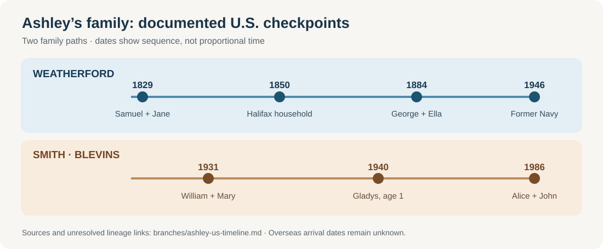

# Ashley's family in the United States: short milestones

*Dates are checkpoints, not a time-to-scale measure. The 1829 marriage and later Weatherford household are a strong match; the 1855 “Thos E” → Asa T. identity remains unresolved. The deeper Blevins links remain separate leads.*

For a visual sense of the earlier Virginia research **without claiming a proven ancestor there**, see the [1755 regional map, Goochland building photograph and 1749 Alexandria plan](../context/virginia-colonial-views.md).

- **1829 · A Virginia marriage.** An [index](https://www.familysearch.org/ark:/61903/1:1:68TK-RBB5?lang=en) pairs **Samuel Weatherford and Jane Ricketts** in Halifax County. It names Jane's father as **James Ricketts**. FamilySearch's person page shows a conflicting marriage day, and the [original register](https://www.familysearch.org/ark:/61903/3:1:3QS7-99XF-29MM-X?view=index&personArk=%2Fark%3A%2F61903%2F1%3A1%3A68TK-RBB5&action=view&cc=4149585&lang=en&groupId=M98Y-PFZ) is access restricted here. [Evidence detail](weatherford-early-virginia.md).
- **1850 · A large Halifax household.** [Samuel and Jane's census](https://www.familysearch.org/ark:/61903/1:1:M8D3-227?lang=en) lists **six younger Weatherfords**, ages **8–20**, including Thomas. Both adults said they were born in Virginia. The census does not explicitly label the younger people as their children. That puts this **candidate direct Weatherford line** in the U.S. by the early nineteenth century, though it does not date an overseas arrival.
- **1854–55 · Their county changes.** The [Virginia historic survey](https://www.dhr.virginia.gov/pdf_files/SpecialCollections/HA-064_HalifaxCountySurvey_2008_HSPC_report.pdf#page=47) describes a tobacco-centered county as the Richmond–Danville railroad reached it. In [1855](https://familysearch.org/ark:/61903/1:1:68TT-61CV?lang=en), a Thomas Weatherford whose parents were Samuel and Jane married Julia Oakes. The railroad and crop are **local context**, not evidence of this family's job or property.
- **1860 · A family and work checkpoint.** The [original Halifax census sheet](https://www.familysearch.org/ark:/61903/3:1:33SQ-GBS6-94FN?view=index&personArk=%2Fark%3A%2F61903%2F1%3A1%3AM41H-SQF&action=view&cc=1473181&lang=en) places indexed **“Acy T” and “July A” Weatherford** with four-year-old **Wm E**. Their names, ages and county strongly match the [1857 William birth](https://familysearch.org/ark:/61903/1:1:X5XM-8Q2?lang=en) and later Asa/Julia household, though the spellings remain uncertain. The man is listed as an **overseer** with **$300 personal estate**; no employer or real-estate value is entered.
- **1880 · A farmer with Virginia-born parents.** The [Black Walnut, Halifax census index](https://www.myheritage.com/research/record-10129-86952756/samuel-wetherford-in-1880-united-states-federal-census) records **Samuel Wetherford** as a farmer with wife Jane and says **both of his parents were born in Virginia**. It gives no names for those parents and does not prove a particular earlier pedigree. Samuel and Jane were still in the county after the Civil War.
- **1884–1946 · From Danville roots to the Navy.** [George C. Weatherford and Ella Lumpkin married](https://www.familysearch.org/ark:/61903/1:1:6NJ1-VGMH?lang=en) in Pittsylvania County in 1884. George's son **Doctor Duffy Weatherford** was reportedly born in neighboring Caswell County, North Carolina, in 1890; his [1966 death certificate](https://www.familysearch.org/ark:/61903/1:1:QVRZ-2C68?lang=en) records a Danville traction-company connection. Duffy's son **Garnett Sr.** had already left the Navy by his [1946 card](https://www.familysearch.org/ark:/61903/3:1:3Q9M-CSZX-KJ56?view=index&personArk=%2Fark%3A%2F61903%2F1%3A1%3AQ2W5-YQRZ&action=view&lang=en); his [obituary](https://www.washingtonpost.com/archive/local/2007/07/03/obituaries/43ba782a-181c-4c59-a78e-7d361d86bf4a/) reports World War II Pacific service. The [line guide](weatherford.md) separates records from the service stories still to verify.
- **1931–40 · Alice's side is also rooted here.** [William Howard Blevins and Mary Elizabeth Hines married](https://www.familysearch.org/ark:/61903/1:1:QKH7-PC1M?lang=en) in the Bristol area in 1931. Their [1940 census](https://www.familysearch.org/ark:/61903/1:1:K4HN-TVW?lang=en) lists young **Gladys Louise**, later Alice's mother. An older [Shubiel Blevins](blevins-deep-lineage.md) lived in North Carolina in the 1800s, but the link from him to Gladys's father is **not yet proved**.
- **1877–1941 · Eleanor's strongly supported Hollinger/Straub family.** [Original 1900–30 census sheets](morrison-hollinger.md#eleanors-earlier-household-a-strong-still-testable-bridge) follow **Linaus and Louisa Hollinger**, sons Theodore and Paul, and daughter Eleanor in Allegheny County. Linaus worked at a Pittsburgh iron mill in 1900. A [1941 newspaper notice transcribed on Louisa's memorial](https://www.findagrave.com/memorial/139916983/louisa_e-hollinger) names those sons and daughter **Eleanor Morrison**, strongly joining this household to Florence's mother. Louisa's [full death certificate](../sources/records/louisa-straub-hollinger-death-certificate-1941.jpg) names father **Nicholas Straub** and reports both born in **France**. Census birthplace labels and arrival years differ; a town and passenger record remain unknown.
- **1920 · Roscoe's earlier marriage.** A [Detroit register](../sources/records/roscoe-helen-marriage-1920.jpg) places Florence's father **Roscoe Gordon Morrison** as a truck driver marrying **Helen Margaret Hanyon**. It names **Porter J. and Celia Morrison** as his parents. His reported age conflicts with his later birth records; the ending of this marriage and his marriage to Eleanor are open. A [candidate 1910 Indiana household](morrison-hollinger.md#eleanors-earlier-household-a-strong-still-testable-bridge) may show him as a child, but needs a parent bridge.
- **1935–54 · Florence's Morrison household.** [Original 1940 and 1950 censuses](morrison-hollinger.md) trace Roscoe and Eleanor Morrison's seven children from Pennsylvania birthplaces into Arlington and Fairfax. Roscoe died in **1947**, when Florence was about nine; Eleanor headed the Fairfax household in 1950. The [1954 marriage certificate](../sources/records/garnett-florence-marriage-1954.jpg) names Florence's parents and records her bookkeeper work. The census does not explain why the family moved. Roscoe's death certificate names his Indiana-born parents **Porter and Celia Morrison**, so this branch is U.S.-based for at least one more generation; an immigration date remains unknown.
- **1986 · Two long Virginia threads meet in Fairfax.** [Alice Marie Smith and John Gordon Weatherford's marriage return](https://www.familysearch.org/ark:/61903/1:1:QK9V-J612?lang=en) names both parent pairs and records their nearby Miller Drive homes. Ashley descends from those two documented parent lines. The [immigration guide](ashley-immigration.md) explains why none of these U.S. records yet supplies a family's overseas arrival date.

**The small but striking conclusion:** Ashley's *candidate* Weatherford branch was in Virginia by **about 1810** and its Samuel–Jane couple appears in an **1829 marriage index**. Her Smith–Blevins branch is securely tied to U.S. records by **1931–40**; older Blevins records exist, but the direct bridge is open. The Morrison branch now has two original household sheets, a 1954 marriage return and death certificates reaching Porter and Celia. No branch yet has a verified overseas-arrival date.
