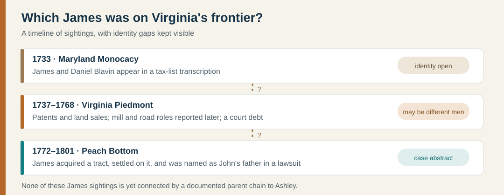

# James Blevins and Virginia's early western settlement

**What did James do?** Original land records show a James acquiring two Goochland tracts in **1737** and selling them in the **1740s**. A later [county history](https://www.seekingmyroots.com/members/files/H011596.pdf) (p. 44) describes **James and Daniel Blevin as hunters** with homes on the **Smith River** and says an early surveyor mentioned their **wagon road**. Clement's [abbreviated history](https://www.victorianvilla.com/sims-mitchell/local/clement/mc/abb/04.htm) also says a James received permission for a **Leatherwood Creek mill** in **1749**. An [1805 lawsuit abstract](https://yanceyfamilygenealogy.org/KenShirleyGenealogyBooks/blevins.pdf#page=168) places a James on a **Peach Bottom** tract in **1772–1801**. **These could be different men; none is yet proved to be Ashley's ancestor.**

| Date | Sighting and what it tells us | Identity limit |
| --- | --- | --- |
| **1733** | A published [Maryland Monocacy Hundred tax-list transcription](https://yanceyfamilygenealogy.org/KenShirleyGenealogyBooks/blevins.pdf#page=171) lists **James and Daniel Blavin**. | The original list and their later identities need checking. This is evidence of a surname group in Maryland, not proof of a migration path to Ashley. |
| **1737** | The Library of Virginia indexes **two 15 August patents** to **James Blevin** in Goochland: [400 acres on both sides of Little Muddy Creek](https://lva.primo.exlibrisgroup.com/discovery/fulldisplay?docid=alma990007249560205756&context=L&vid=01LVA_INST:01LVA&lang=en) and [295 acres on both sides of the same creek adjoining Richard Taylor](https://lva.primo.exlibrisgroup.com/discovery/fulldisplay?docid=alma990007249570205756&context=L&vid=01LVA_INST:01LVA&lang=en). | Primary archive's **patent index**, corroborated for the 295-acre tract by the 1743 deed. This proves grants, not that James occupied both tracts or financed them alone. |
| **1743–1745** | Three original Goochland deeds (see below) show a **James Blevin/Bleavin** selling **295 acres** on Little Muddy Creek to Robert Douglas in **1743**, **400 acres** to Edward Booker Jr. in **1744**, then issuing a **1745 corrective deed** for the Douglas tract. The first two call him **of Goochland**; the last calls him **“James Bleavin Senior of the County of Brunswick.”** | Direct evidence of land transactions and a changed stated residence, **not** proof that he was the later Smith River hunter, the Peach Bottom James, or Ashley's ancestor. “Senior” does not by itself establish a father-son link. |
| **1740s** | Maud Carter Clement's [*History of Pittsylvania County*, p. 44](https://www.seekingmyroots.com/members/files/H011596.pdf) places **James and Daniel's hunting homes on Smith River**, with a wagon road mentioned by a surveyor. | Clement wrote much later and did not establish which James this was or his kinship to Daniel. The underlying survey is the next check. |
| **1749** | Clement's [abbreviated county history](https://www.victorianvilla.com/sims-mitchell/local/clement/mc/abb/04.htm) says the court permitted **James Blevin to build a mill on Leatherwood Creek**. | A permit shows proposed economic activity; **the original Lunenburg order and evidence the mill was built have not been located**. Do not assign it to the Goochland James solely by name. |
| **1756** | The [Library of Virginia's patent index](https://lva.primo.exlibrisgroup.com/discovery/fulldisplay?docid=alma990007249580205756&context=L&vid=01LVA_INST:01LVA&lang=en) records a **10 March grant of 180 acres in Lunenburg County jointly to James and William Blevin** (Patent Book 34, p. 14). | It establishes co-grantees, **not their kinship**, their occupations, or whether this James was the earlier Goochland owner or hunter. The precise tract description still needs reading from the original patent. |
| **1767** | The [Pittsylvania tithable-list transcription](https://yanceyfamilygenealogy.org/KenShirleyGenealogyBooks/blevins.pdf#page=168) includes a **James Blevins Jr.**, plus several other Blevins men. | “Jr.” distinguishes two contemporaries; it does not by itself prove father and son. |
| **August 1767?** | Clement [quotes a Pittsylvania court order](https://www.seekingmyroots.com/members/files/H011596.pdf) directing **James Blevin, John Morton, Thomas Calloway and William Roberts** to mark a road from the courthouse toward Hickey's Road and the upper Saura Towns. Another order names a road beginning at **John Blevin's on Smith River**. | The quote shows a James entrusted with **marking a route**, not proof that he built the earlier wagon road or that John was his son. A check of the original book's apparent August 1767 pages **7–11** did not locate this order; Clement's date or the record location needs reconciling. |
| **June 1768** | The [original Pittsylvania court book, pp. 61–62](https://www.familysearch.org/ark:/61903/3:1:3Q9M-CS4N-99ZM-C?view=fullText&lang=en&groupId=M9JC-26V) records **John Pigg v. James Blevins** (an account of **£1 8s 8d**) and **David Caldwell v. James Blevins** (a debt judgment of **£18 10s**, dischargeable by **£9 5s** plus interest, with **£4 10s** credited as already paid). The sheriff had attached a **spoon** in the Caldwell case; James did not appear in either proceeding. | A concrete glimpse of credit and litigation on the frontier, **not a net-worth estimate**. The book supplies no age, spouse, or parents to prove this James was the 1737 landholder, the road marker, or Ashley's ancestor. The book spans [film images 49–50](https://www.familysearch.org/search/catalog/koha:376738); FamilySearch's automated transcript was checked against the page images. |
| **1772–1801** | [Chalkley's abstract of an 1805 lawsuit](https://yanceyfamilygenealogy.org/KenShirleyGenealogyBooks/blevins.pdf#page=168) traces a Peach Bottom tract from Andrew Baker through Jeremiah Harrison and James Mulkey to **James Blevins** in **1772**. It calls James the father of plaintiff **John Blevins** and says James lived there until **1801**. | A lawsuit summary is stronger for this **James → John** relationship than a same-name tree match, but it does not establish the older James → younger James → Joseph chain proposed for Ashley. |
| **1776–1779** | A [transcription of Fincastle and Montgomery court material](https://www.newrivernotes.com/tbuilder-layout-part/dunmore-herberts-company/) says William, James, and John Blevins were summoned in **1776** over refusal to muster and alleged Loyalist ties; a James and John appeared after a **1779 insurrection** and gave security for good behavior. | At least **three James Blevins men** appear in related records. We cannot assign this political story or a side in the Revolution to Ashley's proposed James without identifying evidence. |

The **1737 Goochland James**, the **1740s Smith River hunter**, the **1756 Lunenburg co-grantee**, the **1767 road marker**, the **1768 debtor**, and the **1772 Peach Bottom landholder** may not be one man. The member tree's **James c. 1708–1801 → James c. 1740–1779** conflicts with the Peach Bottom account's 1801 death if its younger James is the landholder. [Kenneth W. Shirley's study, p. 149](https://yanceyfamilygenealogy.org/KenShirleyGenealogyBooks/blevins.pdf#page=160) expressly calls that father-son assignment circumstantial. Another [local-history compilation](https://www.newrivernotes.com/tbuilder-layout-part/dunmore-herberts-company/) distinguishes at least two revolutionary-era James men and presents some parent assignments more confidently than the underlying documents justify. **The dates in the tree should be treated as search clues.**

A [different James's 1832 Revolutionary pension application](blevins-revolutionary-james.md) says he was born about **1761–62** and taken from New England to Virginia as a child. His age rules out the adult 1737 grantee, and no record yet joins him to the Peach Bottom James or Ashley.

**Peach Bottom case-file lead:** The [Library of Virginia chancery index](https://old.lva.virginia.gov/chancery/case_detail.asp?CFN=015-1812-023) lists **John Cox v. James Newell ETC**, 1812-023, original case **62**. Chalkley's 1805 *Blevins v. Newell* abstract cites new-series **62**. The number and Newell name are worth checking, but the index does **not** name Blevins. Until the scanned pages are read, this is not an original-file verification of the abstract.

### The Goochland landholder in his own records

- **13 August 1743:** [Deed Book 4, pp. 218–219](https://www.familysearch.org/ark:/61903/3:1:3QSQ-G9P6-9S5Q?view=index&lang=en&groupId=M9N6-YVD) records James of Goochland conveying **295 acres on Little Muddy Creek**, south of the James River, to **Robert Douglas of James City County**. The deed refers to the tract's **15 August 1737 patent**. James signed by a mark. The deed was acknowledged in court on **20 September 1743**.
- **9 August 1744:** [Deed Book 4, pp. 262–263](https://www.familysearch.org/ark:/61903/3:1:3QSQ-G9P6-9SPT?view=index&lang=en&groupId=M9N6-YVD) records James of Goochland conveying **400 acres around Muddy Creek** to **Edward Booker Jr. of Essex County**; it was acknowledged on **18 October 1744**. The pages do not show that James lived on either tract or describe his occupation.
- **17 May 1745:** [Deed Book 4, pp. 562–563](https://www.familysearch.org/ark:/61903/3:1:3QSQ-G9P6-9SVJ?view=index&lang=en&groupId=M9N6-YVD) calls the seller **“James Bleavin Senior of the County of Brunswick”** and corrects the earlier **295-acre Douglas conveyance**. It is **not another 295 acres sold**. His Brunswick residence fits an east-to-west frontier story but gives no precise home, destination, or reason for moving.

These are sizeable **land areas, not a wealth estimate**: acreage alone says nothing dependable about net worth, improvements, debts, or what descendants inherited. The Library of Virginia's **original-record index** resolves the previously uncertain citation: [Patent Book 17, p. 394](https://lva.primo.exlibrisgroup.com/discovery/fulldisplay?docid=alma990007249560205756&context=L&vid=01LVA_INST:01LVA&lang=en) is the **400-acre** grant and [p. 395](https://lva.primo.exlibrisgroup.com/discovery/fulldisplay?docid=alma990007249570205756&context=L&vid=01LVA_INST:01LVA&lang=en) is the **295-acre** grant. The handwriting in the [digitized volume](https://www.familysearch.org/search/catalog/584564) was not clear enough to transcribe independently. The [Library of Virginia's guide](https://lva-virginia.libguides.com/land-grants) explains that treasury rights had largely supplanted headrights by 1715, so these patents **do not reveal James's immigration date or prove he brought other people to Virginia**. A later researcher's claimed match between James's Goochland mark and an earlier Rhode Island mark still needs side-by-side original deeds.

## What was happening around them?

These men lived amid colonial expansion from the settled Piedmont toward the Blue Ridge and New River valleys. A [Virginia Department of Historic Resources survey](https://dhr.ar.virginia.gov/pdf_files/SpecialCollections/MY-057_Montgomery_Co_Recon_Survey_1986_CRMI_report_Vol_I.pdf) dates sustained European settlement in the New River region to the **mid-1740s**, shaped by land speculation, transport routes, and contested Indigenous land claims. The Smith River homes and wagon-road reference show how hunters and households helped create routes for later settlement. The 1772 Peach Bottom story shows land changing hands through several settlers before James lived there. This context explains the kind of frontier activity recorded; it **does not prove why a particular Blevins moved**, that James built the road himself, or that he was the region's first settler.

The road network is visible in an [original Lunenburg court order of 2 October 1751, Order Book 2, p. 464](https://www.familysearch.org/ark:/61903/3:1:3Q9M-CS4X-941R-Z?view=fullText&lang=en). The court assigned **William Williams** the Smith River–Leatherwood stretch and **Merry Webb** the stretch from Leatherwood to the north fork of Sandy River. This confirms that those routes required clearing and maintenance by local labor at the time. **It does not name James or Daniel Blevin**, so Clement's separate claim about a Blevin wagon road still needs its underlying survey. The [Virginia Transportation Research Council's transcription, pp. 37–38](https://vtrc.virginia.gov/media/vtrc/vtrc-pdf/vtrc-pdf/93-r17.pdf#page=42) helps locate and read the court entry.

**Best next records:** read the **1749 Lunenburg mill order**, the **1767 Pittsylvania road order**, and the survey behind Clement's wagon-road sentence; read the full **1805 Blevins v. Newell** case (Chalkley, vol. 2, p. 142); compare original Rhode Island and Goochland marks; and find a will, deed, or probate record explicitly joining **James → Joseph → Daniel**. See the [full Ashley Blevins evidence ladder](blevins-deep-lineage.md) and [source ledger](../research/sources.md).
