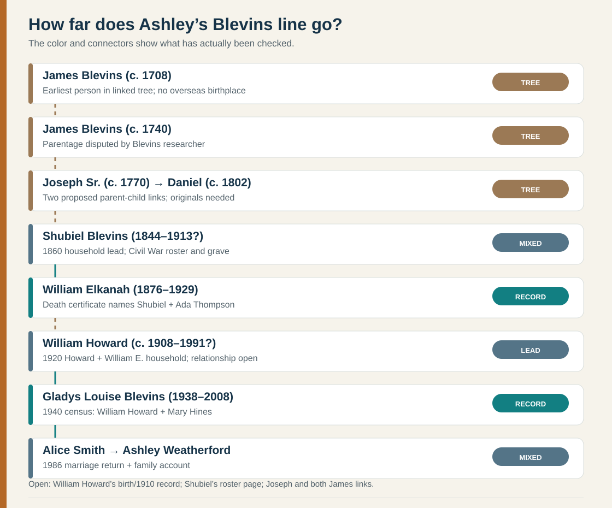
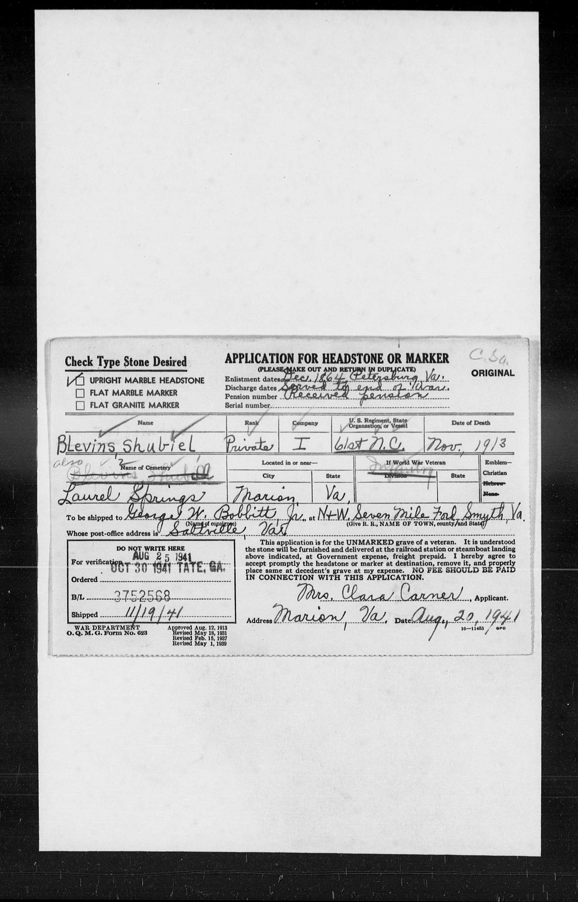

# Ashley's Blevins line: the long-tree lead

**Short answer:** The records take Gladys's family through her father **William Howard Blevins**. A 1929 death certificate independently names **Shubiel Blevins and Ada Thompson** as the parents of an earlier **William E. Blevins**. The [original 1920 census sheet](https://www.familysearch.org/ark:/61903/3:1:33S7-9RV4-4L4?view=index&personArk=%2Fark%3A%2F61903%2F1%3A1%3AMN2T-TZX&action=view&cc=1488411&lang=en) places William E., Tancy, and a boy named Howard together, but labels Howard the household head's **nephew** and William E. a **boarder**. It is a candidate for the missing William Howard → William E. link, not proof. The 1700s chain in the [MyHeritage member tree](https://www.myheritage.com/research/record-1-OYYV7J5XTEFREVRUIRE7UD4GYZEXYGI-2-7554/myheritage-family-trees) is worth investigating; it is **not yet Ashley's proved colonial pedigree**. [See what the records say about the older James Blevins men](blevins-colonial-james.md).

| Generation, oldest first | What the sources say | Standing |
| --- | --- | --- |
| **James Blevins (c. 1708–1801 in tree)** → **James Blevins (c. 1740–1779 in tree)** | The [member tree](https://www.myheritage.com/research/record-1-OYYV7J5XTEFREVRUIRE7UD4GYZEXYGI-2-7554/myheritage-family-trees) calls them father and son. A [detailed Blevins study, p. 149](https://yanceyfamilygenealogy.org/KenShirleyGenealogyBooks/blevins.pdf#page=160) says this link is conjectural. An [1805 court-case abstract](https://yanceyfamilygenealogy.org/KenShirleyGenealogyBooks/blevins.pdf#page=168) describes a James who died in **1801**, but which James he was is unresolved. | **Unproved.** The two tree death years may reflect conflated men. [Colonial James research](blevins-colonial-james.md). |
| **James (c. 1740)** → **Joseph Blevins Sr. (c. 1770–1840)** → **Daniel Blevins (c. 1802–1875)** | Proposed across the member tree's [James](https://www.myheritage.com/research/record-1-OYYV7J5XTEFREVRUIRE7UD4GYZEXYGI-2-7554/myheritage-family-trees), [Joseph](https://www.myheritage.com/research/record-1-OYYV7J5XTEFREVRUIRE7UD4GYZEXYGI-2-5660/myheritage-family-trees), and [Daniel](https://www.myheritage.com/research/record-1-OYYV7J5XTEFREVRUIRE7UD4GYZEXYGI-2-3143/myheritage-family-trees) pages. Other public trees assign Daniel different parents. | **Tree lead only.** Seek wills, deeds, tax lists, and original census sheets across each link. |
| **Daniel and Elizabeth Blevins** → **Shubiel Blevins (1844–1913 on cemetery transcription)** | Original [1850](../sources/records/daniel-elizabeth-blevins-census-1850.jpg) and [1860 pages 85–86](../sources/records/daniel-elizabeth-blevins-census-1860-page85.jpg) · [86](../sources/records/daniel-elizabeth-blevins-census-1860-page86.jpg) place **Shubel/Shubal** in the same couple's household. His ages, **6** and **12**, disagree. A later [1954 death certificate](../sources/records/elizabeth-blevins-hodge-death-1954.jpg) for likely daughter Elizabeth Blevins Hodge names **Daniel Blevins and Elizabeth Brackins** as her parents. | **Strong household and parent-name evidence, with caveats.** Pre-1880 censuses omit relationship labels, and the daughter's certificate reports her parents retrospectively. |
| **Shubiel and Ada Thompson** → **William Elkanah / William E. Blevins (1876–1929)** | William's [original Tennessee death certificate and index](https://www.familysearch.org/ark:/61903/1:1:NSFW-RVB?lang=en) name **Shubiel Blevins** and **Ada Thompson** as parents, give **17 May 1876** as birth date, **30 August 1929** as death date, and **carpenter** as occupation. A [cemetery transcription](https://www.newrivernotes.com/smyth-thomas-cemetery/) expands the middle name to *Elkanah*. | **Record-backed parent link.** Prefer May 17 over the member tree's March 17. |
| **William E. and Mary Earnest** → **William Howard Blevins (c. 1908–1991 in tree)** | The [member tree](https://www.myheritage.com/research/record-1-OYYV7J5XTEFREVRUIRE7UD4GYZEXYGI-2-7615/myheritage-family-trees) names Mary as Howard's mother. [The original 1920 census](https://www.familysearch.org/ark:/61903/3:1:33S7-9RV4-4L4?view=index&personArk=%2Fark%3A%2F61903%2F1%3A1%3AMN2T-TZX&action=view&cc=1488411&lang=en), Big Creek, McDowell County, West Virginia, lines 53–59, places ten-year-old **Howard** with **William E., Tancy, Hallie, and Maud**. It calls Howard the head Joseph R.'s *nephew* and William E. a *boarder*. It actually records Tancy as male, age 19; this is not merely a website indexing error. The [1918 marriage record](https://www.familysearch.org/ark:/61903/1:1:QKH7-PCBN?lang=en) documents a William E. Blevins marrying **Tancy B. Barker**. A [1930 Bristol census](../sources/records/william-howard-blevins-candidate-census-1930.jpg) has a 21-year-old **W. Howard Blevins** boarding with Robert L. Earnest and working in a **furniture plant**. Gladys's confirmed father worked in furniture manufacturing in 1940; neither census calls an Earnest his parent. | **Strong 1930-to-1940 worker match, unproved parentage.** The job, age and place fit the later husband, but birthplace conflicts with 1940; boarding with an Earnest does not establish maternal kinship. The unusual 1920 Tancy entry and marital/age conflicts need another record. |
| **William Howard and Mary Elizabeth Hines** → **Gladys Louise Blevins** → **Alice Smith Weatherford** | Their [1931 marriage](https://www.familysearch.org/ark:/61903/1:1:QKH7-PC1M?lang=en), [1940 census with one-year-old G. Louise](https://www.familysearch.org/ark:/61903/1:1:K4HN-TVW?lang=en), Mary's [original 1961 notice](../sources/records/mary-hines-blevins-death-notice-1961.jpg) naming **Gladys Lou Smith**, and [Alice's 1986 marriage return](https://www.familysearch.org/ark:/61903/1:1:QK9V-J612?lang=en) connect these generations. A [federal NUMIDENT entry for Bobby Jack Blevins](https://www.familysearch.org/ark:/61903/1:1:6K4X-R1BZ?lang=en) separately names William H. Blevins and Mary E. Hines as his parents. | **Record-backed** for Gladys and Alice. The notice dates Mary's death **3 December 1961** and names all four children then listed; Bobby's 1940 age conflicts by about a year with his NUMIDENT birth date. [Smith details](smith.md). |

## A Civil War story, with its limits

The [original 1941 federal veteran headstone application](https://www.familysearch.org/ark:/61903/3:1:3QS7-89WL-SXZ2?view=index&personArk=%2Fark%3A%2F61903%2F1%3A1%3AQVS1-14G7&action=view&cc=1916249&lang=en) names **Shubiel Blevins**, **private, Company I, 61st North Carolina**, and **Laurel Springs Cemetery, Marion, Virginia**. It records death in **November 1913**; the [cemetery transcription](https://www.newrivernotes.com/smyth-laurel-springs-cemetery/) supplies **7 November** and names wife Ada Thompson. This is strong direct evidence that the Marion man served in the **Confederate** regiment, independently of the [state roster index](https://www.dncr.nc.gov/documents/files/civil-war-roster-may-2020/download), which lists “Blevins, Shubill: 14:740.” The FamilySearch **index mislabels the burial state Texas**; the handwritten application reads **Va.** The 1998 roster's individual page and service cards remain unread, so his exact enlistment, battles, wounds, capture, motives and decorations are unknown. The record does not tell us what he believed about slavery or secession.

### Daniel's farm household and Ada's kin

| Original record | Glimpse of their lives | Limit |
| --- | --- | --- |
| **1850 · Ashe County** | [Daniel, 50, farmer](../sources/records/daniel-elizabeth-blevins-census-1850.jpg), reported **$600 in real estate**. Elizabeth, 40, and young **Shubel, 6**, lived with several other younger Blevins household members. | This is a reported real-estate value, not household wealth or proof that each younger resident was their child. |
| **1860 · Gap Civil, newly formed Alleghany County** | [Daniel, 58, farmer](../sources/records/daniel-elizabeth-blevins-census-1860-page85.jpg), reported **$150 in personal estate** and no entry in the real-estate column. [The next sheet](../sources/records/daniel-elizabeth-blevins-census-1860-page86.jpg) continues the same numbered household with **Shubel, 12**. | The blank real-estate cell cannot establish a sale or financial loss. Shubel's age implies c.1848, against 1850's c.1844. |
| **1870 · Gap Civil, Alleghany County** | A matching [Daniel and Elizabeth household](../sources/records/daniel-elizabeth-blevins-census-1870.jpg) reports a farmer Daniel, **$200 real estate**, and younger residents including John and Elizabeth. Shubal was then [working in another Ashe household](../sources/records/shubal-adia-blevins-census-1870.jpg). | Daniel's and Elizabeth's ages vary substantially between sheets. These three census amounts are nominal reports in different categories; they cannot trace an inheritance. |
| **1880 · Piney Creek, Ashe County** | [Shubal, 33, farmed](../sources/records/shubal-ada-blevins-census-1880.jpg) with wife **Ada, 40**, and sons **Roby, Joseph R., James M., William J.** and daughter **Martha C.** The sheet explicitly calls **Mary Thompson, 81, his mother-in-law** and **Wiley Thompson, 55, his brother-in-law**. | Those labels strongly support Ada's Thompson surname. The 1870 **John Thompson** relationship remains unknown. Roby's stated age **14** predates the couple's 1869 marriage; his maternity or age needs checking. **William J.**, 5, may be the later William E./Elkanah, but the initial conflicts. |

The [1954 original certificate](../sources/records/elizabeth-blevins-hodge-death-1954.jpg) identifies Elizabeth Blevins Hodge's parents as Daniel Blevins and Elizabeth **Brackins**. Her reported 1853 birth fits the younger Elizabeth in the 1860 household, making this a useful second-generation parent report. It is not Elizabeth Brackins's own birth or marriage record. The original 1850 page also has an elderly **Nancy Bracins** in Daniel's household; her relationship to Elizabeth is not stated.

### Shubiel and Ada's later household snapshots

| Year and place | What the original page records | What it can tell us |
| --- | --- | --- |
| **1870 · Piney Creek, Ashe County, North Carolina** | [Shubal, 22, worked on a farm](../sources/records/shubal-adia-blevins-census-1870.jpg); Adia, 30, kept house. Both appear in John Thompson's household. A [marriage index](https://www.familysearch.org/ark:/61903/1:1:F84F-NBS?lang=en) records a Shubril/Shubil Blevins and Ada Blevins wedding in Ashe County on **22 October 1869**. | This is a plausible early married couple and shows farm work, but the 1870 census gives **no relationship labels**. John Thompson's reported property is **his**, not evidence of Shubal's own assets or Ada's parentage. |
| **1880 · Piney Creek, Ashe County, North Carolina** | The [original page](../sources/records/shubal-ada-blevins-census-1880.jpg) names five children and labels Mary and Wiley Thompson as Shubal's in-laws. | This clarifies Ada's family network, but William's middle initial and Roby's age create questions about the children. |
| **1900 · Marion District, Smyth County, Virginia** | [James M. Blevins's household](../sources/records/james-shubiel-ada-blevins-census-1900.jpg) explicitly labels **Shubiel, 54, “Father”** and **Ada, 57, “Mother.”** They report **31 years married**; Ada reports **10 children born, 6 living**. | This identifies James as their son and places the couple in Virginia by 1900. It does not name all ten children or explain the move. The census gives Shubiel's birth as **April 1846**, conflicting with the cemetery's **April 1844**; neither is a birth certificate. |

The likely sequence is **Ashe County farm work (1870–80) → a grown son's Smyth County household (1900) → a Marion-area burial (1913) → a federal stone application (1941)**. The 1870 couple lacks relationship labels and an explicit bridge to 1880, so treat that first step as a strong match. These are snapshots, not a continuous account of residence or wealth. The 1880 sheet identifies five children; the 1900 census says Ada bore ten, six then living, so this is not a complete sibling list.

The 1929 [death certificate](https://www.familysearch.org/ark:/61903/1:1:NSFW-RVB?lang=en) later calls William E. a **carpenter** in Tennessee. The evidence suggests a route from the North Carolina Blue Ridge to Virginia, West Virginia, and Tennessee, but **none of these records states why anyone moved**. For local context, [Alleghany County](https://alleghanycounty-nc.gov/register-of-deeds/) was formed from Ashe in **1859**; Shubiel's supposed 1844 “Alleghany County” birthplace uses a later county name.

## Tancy, siblings, and source conflicts

The [1918 Sullivan County marriage register](https://www.familysearch.org/ark:/61903/1:1:QKH7-PCBN?lang=en) records **William E. Blevins and Tancy B. Barker**. The [Thomas Cemetery transcription](https://www.newrivernotes.com/smyth-thomas-cemetery/) gives an earlier **Mary M. E. Blevins** a **16 June 1914** death, whereas the member tree gives William's first wife Mary Earnest **1916**. Mary's identity and death year need a vital or church record. Justin and Ashley recognize Tancy Blanche as a likely family namesake; if the father-son hypothesis is right, she was **William Howard's stepmother and Gladys's step-grandmother**, rather than Gladys's biological aunt. The exact naming relationship remains family tradition.

The one-year-old [1910 William H. Blevins in Glade Spring](https://www.familysearch.org/ark:/61903/1:1:MPPL-SYY?lang=en), recorded with **Joseph and Emma Blevins** in John H. Trent's household, is a **different man**. The [1938 marriage return](https://www.familysearch.org/ark:/61903/1:1:QVB1-SD52?lang=en) and [1948 original death certificate](../sources/records/william-howard-blevins-namesake-death-1948.jpg) identify Joseph and Emma's son as the William Howard who married **Grace Shuler** and died in Winston-Salem; the [1940 census](https://www.familysearch.org/ark:/61903/1:1:KW3H-9XX?lang=en) places him there while Gladys's father was [in Johnson City with Mary](../sources/records/blevins-household-census-1940.jpg). FamilySearch currently offers [this other man's North Carolina draft card](https://www.familysearch.org/ark:/61903/1:1:QVRL-SBKB?lang=en), naming **Grace Evangeline Blevins** as contact, as a hint on Gladys's father's tree profile. It is a **false match**. **Do not attach Joseph and Emma to Ashley's pedigree.** A second [Georgia household with wife Pauline in 1940](https://www.familysearch.org/ark:/61903/1:1:K72Y-D2K?lang=en) rules out that William H./Henry Blevins too, despite his [1991 death index](https://www.familysearch.org/ark:/61903/1:1:JP1R-T2H?lang=en) resembling the member tree's year. The [Smith comparison table](smith.md) gives the records; the actual father's **9 March 1991** tree date has no attached death source. The 1920 Howard and 1930 Bristol boarder remain separate candidates. A birth or other parent-naming record must still bridge Gladys's father to William E. before extending her line through Shubiel.

The [1920 census index](https://www.familysearch.org/ark:/61903/1:1:MN2T-TZ6?lang=en) also names **Hallie** and **Maud** near Howard; the member tree lists **Nannie, Edgar, Pearlie, Walter, Maud, Hallie, infant John**, and later **Herbert, Mabel, Luther**. This is a **search list, not a verified complete sibling group**. The [1880 original](../sources/records/shubal-ada-blevins-census-1880.jpg) confirms the five names above and the **William J.** initial, which conflicts with *Elkanah*. A Joseph R. heads the 1920 household, suggesting a possible brother, but a common name alone does not prove it.

## When did this family reach America?

**Unknown.** The earliest man in this member tree, **James (c. 1708)**, has no supported birthplace, parents, passenger record, or arrival date. Even his link to **James (c. 1740)** is questioned by a [specialist Blevins study](https://yanceyfamilygenealogy.org/KenShirleyGenealogyBooks/blevins.pdf). Other online trees extend the surname to an alleged Wales-born William or to Rhode Island; those lines **cannot yet be attached to Ashley**. The same study describes a possible **Rhode Island → mid-Atlantic → Virginia** movement for a broader Blevins/Bliven group, partly based on tradition. Separately, a [Revolutionary pensioner named James](blevins-revolutionary-james.md) recalled a **New England → Virginia** childhood move. Neither account proves this family's overseas arrival or joins the pensioner to Ashley.

The younger James's tree labels his 1740 birth “Montgomery County” and 1779 death “Grayson County,” but [Montgomery County was created in 1776](https://montgomerycountyva.gov/2/living-here/about-montgomery-county) and [Grayson County in 1793](https://www.graysoncountyva.gov/160/Circuit-Court-Clerk). These may be modern place descriptions; they are not contemporary county names. A [FamilySearch tree](https://ancestors.familysearch.org/en/LBFC-YWL/chief-james-blevins-1740-1779) calls him “Chief,” but no original record reviewed establishes any such title. **Do not infer an Indigenous identity or an immigration date from those labels.**

**Next best documents:** Howard's birth certificate or 1910 household to identify his parents; Shubiel's **volume 14, p. 740** roster entry and Confederate service cards for service details; a parent-naming Shubiel record; and colonial probate/land records that name children. No securely identified photograph of Shubiel or these earlier Blevins relatives surfaced in the image search; a labeled family album or archive portrait would be a valuable addition. [All Ashley branches' immigration status](ashley-immigration.md) · [source ledger](../research/sources.md).
