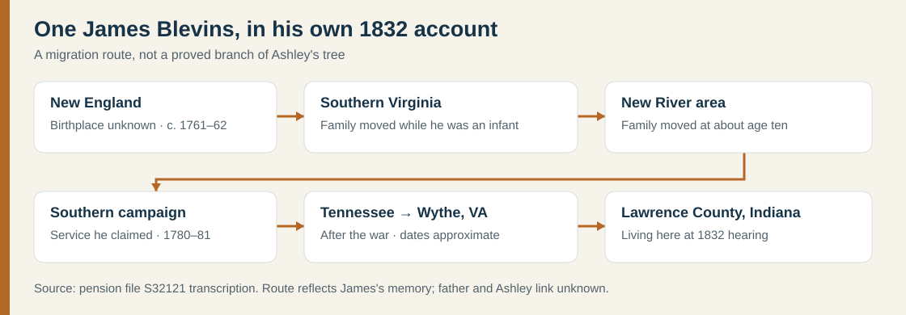

# James Blevins (born about 1761–62): a Revolutionary pensioner's route

**Why this James matters:** In a **12 November 1832** Indiana pension application, James Blevens/Blevins said he was born **somewhere in New England**, moved with his father to the area later called **Henry County, Virginia**, while an infant, and moved again to the area later called **Montgomery County** at about age ten. This is a valuable **first-person report of one Blevins family's domestic migration**, not an immigrant arrival record and not a proved connection to Ashley. We read [Will Graves's transcription of pension file S32121](https://revwarapps.org/s32121.pdf); the complete original federal file still needs comparison. [Source note](../research/sources.md).

| When | What James reported or the file records | What remains uncertain |
| --- | --- | --- |
| **About 1761–62** | He recalled seeing **25 December 1762** in his father's now-lost Bible, but at the November 1832 hearing said he had turned **70 the previous December**, implying **1761**. He did not know his New England birth town. | Both dates are recollections from late life; neither identifies his father. |
| **Childhood** | The family moved from New England to southern Virginia during his infancy, then to the New River area at about ten, according to family tradition he repeated. | These moves predate the creation of **Henry County in 1776–77** and **Montgomery County in 1776**; those county names describe later geography. No deed or household has yet identified the father or exact places. [Henry formation](https://www.henrycountyva.gov/DocumentCenter/View/845/APPENDIX-1---Historic-Resources-PDF) · [Montgomery formation](https://montgomerycountyva.gov/2/living-here/about-montgomery-county). |
| **1780–81** | James said he volunteered from the Montgomery area under **Captain William Love** and **Colonel William Campbell**, fought at **King's Mountain**, later served under **Captain John Carroll**, and was present at **Ninety Six** and **Eutaw Springs**. | These are his claims, not a battle-by-battle service roll. Witness **John Stone** said the two volunteered together and that James left Salisbury toward King's Mountain; Stone did **not** say he saw James in that battle. Witness **Robert Ellis** said he served with James at Ninety Six and Eutaw and recognized a scar on James's left hand. |
| **After the war → 1832** | James reported **8–10 more years** in the Montgomery area, **18 months near Knoxville, Tennessee**, then years in **Wythe County, Virginia**, before moving to **Lawrence County, Indiana, about 1821**. The pension file says he was awarded **$20 per year** for **six months' Virginia militia service**. | The $20 is a pension rate, not an estimate of household wealth. The itinerary is his 1832 memory; dated tax or deed records are needed for each move. |

The testimony preserves a vivid personal episode: James said he fell ill near **Hanging Rock** while returning from South Carolina and friends eventually took him home. Ellis instead described a **sword cut on James's left hand** and said he saw the scar in 1833. Both statements occur in the pension file; they may describe different parts of his return, but the file does not settle their sequence. [Pension transcription, pp. 1–4](https://revwarapps.org/s32121.pdf).

## Keep the James men separate

This pensioner was a child in the **1760s**. He cannot be the adult **1737 Goochland grantee**. Nor does his account name his father, the **Peach Bottom James** who reportedly died in **1801**, or the **James and John** involved in a **1779 Montgomery insurrection**. His claimed Patriot service therefore cannot be assigned to Ashley's proposed colonial line or used to cancel the separate Loyalist-era account. The [colonial James timeline](blevins-colonial-james.md) keeps those sightings apart.

**Next checks:** locate all images of federal pension **S32121**; compare the claimant's signature, age and residence with Virginia and Indiana tax/census records; seek a record naming his father; then test whether any record joins him to the Peach Bottom or Goochland men.
