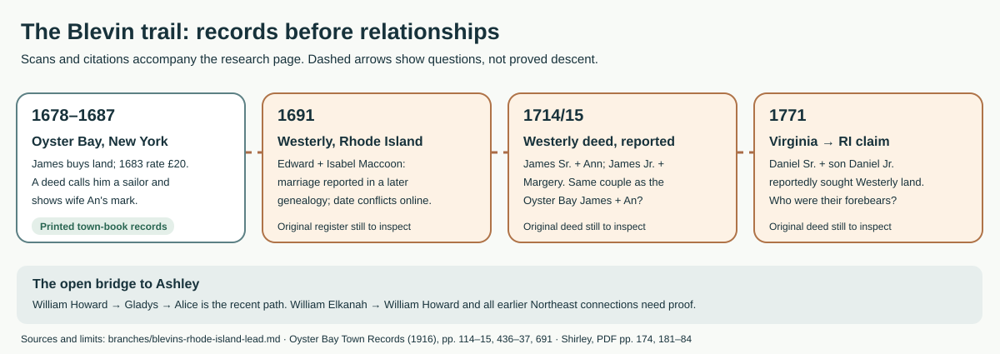

# Oyster Bay and Westerly: the early Blevin leads

**Finding:** A published transcription of Oyster Bay, New York, town books documents a **James Bleving/Blevin in 1678–1687**, including his work as a sailor and a deed signed by his wife **An**. Blevins/Bliven households appear in Westerly, Rhode Island, by the 1690s. A **1771 Virginia deed transcript** says two Daniels claimed Westerly land. A later Y-DNA comparison suggests that a *different* Virginia branch shares a paternal line with a Westerly descendant. **No checked parent record yet joins these Northeast people to Ashley's documented line.** Her line's Atlantic crossing date is unknown.

## Read the book by its actual pages

The URL's [`#page=171`](https://yanceyfamilygenealogy.org/KenShirleyGenealogyBooks/blevins.pdf#page=171) is **PDF page 171, printed page 160**, chiefly about Maryland and Goochland. The Westerly discussion begins on [PDF page 173 / printed page 162](https://yanceyfamilygenealogy.org/KenShirleyGenealogyBooks/blevins.pdf#page=173), followed by the deed transcript on [PDF page 174](https://yanceyfamilygenealogy.org/KenShirleyGenealogyBooks/blevins.pdf#page=174), DNA discussion on [PDF pages 176–79](https://yanceyfamilygenealogy.org/KenShirleyGenealogyBooks/blevins.pdf#page=176), and early Westerly families on [PDF pages 181–84](https://yanceyfamilygenealogy.org/KenShirleyGenealogyBooks/blevins.pdf#page=181). The **newer Oyster Bay evidence** comes from a [1916 edition of town books](https://archive.org/details/oysterbaytownrec01coxj), whose printed pages cite original Book A or B pages; it is a transcription of records, **not an image of the seventeenth-century manuscript**. Page numbers below mean **PDF** pages for Shirley and **printed** pages for Oyster Bay.

| Date | What the sources actually report | Limit |
|---|---|---|
| **1678, as printed** | The Oyster Bay town book records **John Rogers selling four acres and a half right of commons to James Bleving**, described as living in Oyster Bay. Nearby entries lay out additional tracts and a **two-acre swamp allotment jointly with Rogers**. [Printed pp. 114–15](https://archive.org/download/oysterbaytownrec01coxj/oysterbaytownrec01coxj.pdf#page=132). | The date is reproduced as printed; its old-style calendar conversion has not been checked. Several allocations and exchanges are described, so their acreages must **not** simply be added into a single holding. This James is not identified as Edward's relative or Ashley's ancestor. |
| **1683** | A published **29 September Oyster Bay country-rate list** includes “Jeames Bleving” at **£20**. [Printed p. 691](https://archive.org/download/oysterbaytownrec01coxj/oysterbaytownrec01coxj.pdf#page=709). | A tax assessment is **not net worth, cash, sale price or inheritance**. The appendix says some residents did not submit lists; the original assessment and method remain to inspect. |
| **1686/7** | A [14 January deed, printed pp. 436–37](https://archive.org/download/oysterbaytownrec01coxj/oysterbaytownrec01coxj.pdf#page=454), calls **James Blevin of Oyster Bay a “Sayler”** and shows **An Blevin** making a mark beside his. He sold his house/home lot, hillside land, swamp and commons rights to John Townsend for **£14**, **except** land bought from John Applegate. | A recorded occupation, wife and property transaction; **not** evidence of an Atlantic voyage or his entire fortune. The marks are *transcribed* in the printed book, not independently compared with manuscript signatures. |
| **1691** | A 1915 New England family history places **Edward Bliven** and **Isabel Maccoon**'s marriage in Westerly on **2 October 1691**. It names five children: Joan/Jane, Edward, Rachel, James and John. [Read the saved printed page](../sources/records/edward-bliven-profile-cutter-1915-p42.jpg) or [LOC scan, p. 56](https://tile.loc.gov/storage-services/master/gdc/gdcebookspublic/17/00/38/95/17003895/17003895.pdf#page=56). | Retrospective published genealogy; the marriage register, 1716/1718 will and Isabel's 1742/1753 probate need original-page inspection. His **c. 1665** birth is an estimate, and neither birthplace nor immigrant ship is supplied. |
| **1698–1703** | Shirley [p. 184](https://yanceyfamilygenealogy.org/KenShirleyGenealogyBooks/blevins.pdf#page=184) describes a **James Bliven Sr.** licensed as a Westerly innkeeper and discusses land transactions, including land bought from **Ninecraft**. | This James is **not established as Edward's brother** or as the James later seen in Maryland/Virginia. Licensing, deeds, identity and family links should be checked in the original Westerly records. No wealth or Indigenous ancestry follows from the land reference. |
| **1714/15, reported** | Shirley [p. 184](https://yanceyfamilygenealogy.org/KenShirleyGenealogyBooks/blevins.pdf#page=184) reports a Westerly deed naming **James Bliven Sr. and wife Ann**, alongside **James Jr. and wife Margery**. The wife's name and timing make it plausible that the Oyster Bay James/An and Westerly James/Ann are the **same couple**. | **Identity hypothesis only.** The original Westerly deed and Oyster Bay manuscript have not been compared. Same names and spouse do not prove migration, fatherhood beyond what the 1714 deed may say, Edward kinship or Ashley descent. |
| **1733–44** | James and Daniel Blavin/Blevin appear in the Monocacy tax list; a James Blevin later held/sold Goochland tracts. [Virginia analysis](blevins-colonial-james.md). | Shirley [pp. 160–61](https://yanceyfamilygenealogy.org/KenShirleyGenealogyBooks/blevins.pdf#page=171) expressly warns that the Goochland men may not be the same family group. Names and chronology alone cannot make a Westerly → Maryland → Virginia pedigree. |
| **1771** | A transcribed **1 July power of attorney**, reportedly recorded **27 September in Pittsylvania Deed Book 2, p. 317**, calls **Daniel Blevins Sr. of Pittsylvania** and **Daniel Jr., his son, of Botetourt** claimants to **100 acres in Westerly**. Sarah is named as the elder Daniel's wife. They empowered James Rentfrow Sr. to seek land from Joseph Stantone. [Shirley, p. 174](https://yanceyfamilygenealogy.org/KenShirleyGenealogyBooks/blevins.pdf#page=174). | **Transcript, not an inspected original deed.** It supports a father–son relationship and a **property claim**, not residence in Rhode Island, the route south, or an Ashley link. The book's “Washington County, RI” heading uses a county name adopted later. The [Library of Virginia catalog](https://www.lva.virginia.gov/collections/ccmf/VA/VA213) confirms Book 2 covers 1770–72. |
| **2017 comparison** | Shirley [pp. 176, 178–79](https://yanceyfamilygenealogy.org/KenShirleyGenealogyBooks/blevins.pdf#page=176) reports a **66/67 Y-STR marker** match: kit **75986**, attributed to a descendant of **Nathan Blevins (c. 1763–1834)**, and kit **57381**, attributed to Edward Bliven's line. Both kits remain listed in subgroup A of the [public Blevins Y-DNA project](https://www.familytreedna.com/public/Blevins?iframe=ydna-results-overview). | The public project supports that the kits are grouped, while their *specific ancestral assignments* are Shirley's report. Y-DNA suggests a shared paternal lineage, but **does not name the common ancestor, prove a particular migration, or test Ashley's chain**. The reported Nathan line is not shown to be hers. |

## The missing connection, in plain terms

The earliest vivid occupation clue is the **Oyster Bay sailor**. His 1686/7 deed shows a household able to dispose of a home lot and commons rights while keeping the Applegate field. His **£14 sale** and the **£20 country-rate figure** answer different questions and cannot show whether the family's wealth rose or fell. The deed's An/Ann clue points to a worthwhile New York → Rhode Island identity test, not a proved journey.

A [member-edited James Jr. tree](https://www.familysearch.org/en/tree/person/details/G4DN-88S) and a [copied WikiTree narrative](https://www.ancientfaces.com/photo/john-jack-james-blevin-ii-is-your-7th-great-grandf/1426633) propose that a distinctive **“cursive J” mark** on the 1714 Westerly and 1743–45 Goochland deeds identifies the **same younger James**. This is a promising *test*: the original Goochland pages have been viewed [here](blevins-colonial-james.md), but the **Westerly manuscript marks have not**. A mark comparison could establish one man's movements; it would still need separate evidence to make him the father of the Southern Daniel, or an ancestor of Ashley. The tree's exact **1688 Oyster Bay birth, Margery Tosh marriage and named children** remain proposals, not dates or kinship independently established by the town-book pages viewed here.

### See the scanned pages

[1678 deed opening, p. 114](../sources/records/james-bleving-oyster-bay-land-1678-p114.jpg) · [1678 deed continuation and allocations, p. 115](../sources/records/james-bleving-oyster-bay-land-1678-p115.jpg) · [1683 assessment, p. 691](../sources/records/james-bleving-oyster-bay-estate-list-1683-p691.jpg) · [1686/7 deed opening, p. 436](../sources/records/james-blevin-oyster-bay-deed-1687-p436.jpg) · [1686/7 deed continuation and marks, p. 437](../sources/records/james-blevin-oyster-bay-deed-1687-p437.jpg). These images reproduce **1916 printed transcriptions**, not portraits, original deeds, or a confirmed Ashley ancestor.

The 1771 scene is striking on its own: a father in Pittsylvania and his son in Botetourt jointly authorized another man to pursue a **100-acre claim hundreds of miles away**. That is a glimpse of a long-distance family property matter, even though the transcript leaves the property's origin and outcome unanswered. The Westerly **innkeeper James** is similarly a vivid occupational clue for a different early namesake; it would be premature to make him the Daniels' father or Ashley's ancestor.

The closest firmly traced segment toward Ashley remains **Gladys Blevins Smith → William Howard Blevins and Mary Hines**. A separate set of original households connects **Daniel Blevins and Elizabeth Brackins → Shubiel Blevins → William Elkanah Blevins**. The proposed **William Elkanah → William Howard** bridge still needs a parent-naming original. Beyond Daniel, Shirley calls a proposed **Joseph Blevins Sr. → Daniel** grouping *theoretical* ([PDF pp. 159–60](https://yanceyfamilygenealogy.org/KenShirleyGenealogyBooks/blevins.pdf#page=159)); it cannot be extended confidently to the Westerly Daniels, Edward, or the DNA-tested Nathan. See the [generation-by-generation evidence ladder](blevins-deep-lineage.md) and [Ashley's immigration answer](ashley-immigration.md).

The **Revolutionary pensioner James** recalled being born in *New England* before moving to Virginia as an infant, but did not specify Rhode Island. His [separate story](blevins-revolutionary-james.md) should not be merged with the 1771 Daniel pair or Ashley's pedigree. A nineteenth-century claim that three Bliven brothers came from England before 1650 is likewise a **family tradition**, not a passenger or parent record ([Shirley, pp. 183–84](https://yanceyfamilygenealogy.org/KenShirleyGenealogyBooks/blevins.pdf#page=183)).

## Best records to settle it

1. Obtain and transcribe **Pittsylvania Deed Book 2, p. 317** and its adjacent pages from the [county historical-records route](https://www.pittsylvaniacountyva.gov/640/Historical-Records) or [Library of Virginia microfilm catalog](https://www.lva.virginia.gov/collections/ccmf/VA/VA213). Compare names, signatures/marks, witnesses and the *basis* for the Westerly claim. The original image was **not available in this signed-out FamilySearch session**.
2. Obtain the **Westerly marriage entry, Edward/Isabel probate originals, the 1698–1703 inn licenses and land deeds**, then test any named relationships against the 1771 Daniels. The 1915 profile and Shirley are useful finding aids, not substitutes.
   Specifically compare **Westerly Land Evidence vol. 2, pp. 161–62**, reported for the 1714/15 James/Ann deed, with original **Oyster Bay Book A p. 89 and Book B pp. 109–10**. Ask whether marks, neighbors, land history or a sale/arrival record establishes that the two James/Ann couples are identical. The [Westerly town site](https://www.westerlyri.gov/402/Land-Records) describes its online land images as beginning in **1909**; colonial books need another archive route. The [Rhode Island Historical Society's finding-aid index](https://www.rihs.org/library/master-list-of-finding-aids/) lists a **Westerly Town Records Collection, 1669–1823**.
   On the **younger James**, compare his reported 1714/18 Westerly mark with those on the already saved **1743–45 Goochland deeds**. A modern tree's statement that they match is a lead, not an inspected cross-record proof. Also seek the **1708 Westerly father–son land deed** it cites; original page not located here.
3. Find **William Howard's parent-naming birth, marriage, death, or probate record** before attaching Ashley's line to older Blevins men; then work one generation at a time through the Virginia/North Carolina records. A contemporary exact relationship beats a long unsourced tree.

**Date conflict to resolve:** Shirley cites a Westerly register copy entered in **1742** for Edward/Isabel's marriage on **2 October 1691**, consistent with the 1915 profile; a [member-edited WeRelate tree](https://www.werelate.org/wiki/Person:Edward_Bliven_%281%29) gives **31 October 1691**. Read the register image before choosing a final day; neither date proves a connection to Oyster Bay James.

**Source note:** This page cites Shirley as a researcher and distinguishes his **transcriptions, interpretations and genetic inference** from images independently viewed. The saved 1915 page is a period-published **biography**, not an original vital record or a photograph of a relative. The five Oyster Bay page images were extracted from the [public 1916 town-record edition](https://archive.org/details/oysterbaytownrec01coxj) and visually checked; the original town-book pages remain uninspected.
