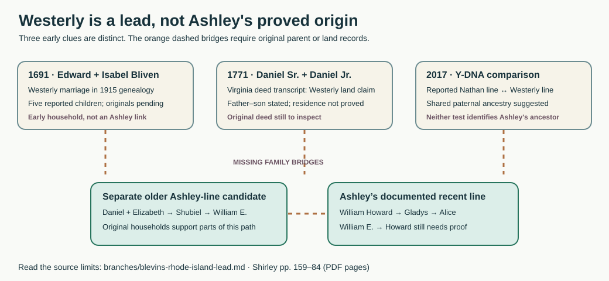

# The Westerly Blevins lead: what Rhode Island does—and does not—connect

**Finding:** Blevins/Bliven families were in Westerly, Rhode Island, by the 1690s. A **1771 Virginia deed transcript** says two Daniels there claimed Westerly land. A published Y-DNA comparison suggests that one *other* Virginia Blevins branch shares a paternal line with a Westerly Bliven descendant. **None of these items yet joins the Westerly people to Ashley's documented Blevins ancestors.** There is no proved Atlantic crossing date or colonial migration itinerary for her line.

## Read the book by its actual pages

The URL's [`#page=171`](https://yanceyfamilygenealogy.org/KenShirleyGenealogyBooks/blevins.pdf#page=171) is **PDF page 171, printed page 160**, chiefly about Maryland and Goochland. The Westerly discussion begins on [PDF page 173 / printed page 162](https://yanceyfamilygenealogy.org/KenShirleyGenealogyBooks/blevins.pdf#page=173), followed by the deed transcript on [PDF page 174](https://yanceyfamilygenealogy.org/KenShirleyGenealogyBooks/blevins.pdf#page=174), DNA discussion on [PDF pages 176–79](https://yanceyfamilygenealogy.org/KenShirleyGenealogyBooks/blevins.pdf#page=176), and early Westerly families on [PDF pages 181–84](https://yanceyfamilygenealogy.org/KenShirleyGenealogyBooks/blevins.pdf#page=181). Page numbers below mean **PDF** pages.

| Date | What the sources actually report | Limit |
|---|---|---|
| **1691** | A 1915 New England family history places **Edward Bliven** and **Isabel Maccoon**'s marriage in Westerly on **2 October 1691**. It names five children: Joan/Jane, Edward, Rachel, James and John. [Read the saved printed page](../sources/records/edward-bliven-profile-cutter-1915-p42.jpg) or [LOC scan, p. 56](https://tile.loc.gov/storage-services/master/gdc/gdcebookspublic/17/00/38/95/17003895/17003895.pdf#page=56). | Retrospective published genealogy; the marriage register, 1716/1718 will and Isabel's 1742/1753 probate need original-page inspection. His **c. 1665** birth is an estimate, and neither birthplace nor immigrant ship is supplied. |
| **1698–1703** | Shirley [p. 184](https://yanceyfamilygenealogy.org/KenShirleyGenealogyBooks/blevins.pdf#page=184) describes a **James Bliven Sr.** licensed as a Westerly innkeeper and discusses land transactions, including land bought from **Ninecraft**. | This James is **not established as Edward's brother** or as the James later seen in Maryland/Virginia. Licensing, deeds, identity and family links should be checked in the original Westerly records. No wealth or Indigenous ancestry follows from the land reference. |
| **1733–44** | James and Daniel Blavin/Blevin appear in the Monocacy tax list; a James Blevin later held/sold Goochland tracts. [Virginia analysis](blevins-colonial-james.md). | Shirley [pp. 160–61](https://yanceyfamilygenealogy.org/KenShirleyGenealogyBooks/blevins.pdf#page=171) expressly warns that the Goochland men may not be the same family group. Names and chronology alone cannot make a Westerly → Maryland → Virginia pedigree. |
| **1771** | A transcribed **1 July power of attorney**, reportedly recorded **27 September in Pittsylvania Deed Book 2, p. 317**, calls **Daniel Blevins Sr. of Pittsylvania** and **Daniel Jr., his son, of Botetourt** claimants to **100 acres in Westerly**. Sarah is named as the elder Daniel's wife. They empowered James Rentfrow Sr. to seek land from Joseph Stantone. [Shirley, p. 174](https://yanceyfamilygenealogy.org/KenShirleyGenealogyBooks/blevins.pdf#page=174). | **Transcript, not an inspected original deed.** It supports a father–son relationship and a **property claim**, not residence in Rhode Island, the route south, or an Ashley link. The book's “Washington County, RI” heading uses a county name adopted later. The [Library of Virginia catalog](https://www.lva.virginia.gov/collections/ccmf/VA/VA213) confirms Book 2 covers 1770–72. |
| **2017 comparison** | Shirley [pp. 176, 178–79](https://yanceyfamilygenealogy.org/KenShirleyGenealogyBooks/blevins.pdf#page=176) reports a **66/67 Y-STR marker** match: kit **75986**, attributed to a descendant of **Nathan Blevins (c. 1763–1834)**, and kit **57381**, attributed to Edward Bliven's line. Both kits remain listed in subgroup A of the [public Blevins Y-DNA project](https://www.familytreedna.com/public/Blevins?iframe=ydna-results-overview). | The public project supports that the kits are grouped, while their *specific ancestral assignments* are Shirley's report. Y-DNA suggests a shared paternal lineage, but **does not name the common ancestor, prove a particular migration, or test Ashley's chain**. The reported Nathan line is not shown to be hers. |

## The missing connection, in plain terms

The 1771 scene is striking on its own: a father in Pittsylvania and his son in Botetourt jointly authorized another man to pursue a **100-acre claim hundreds of miles away**. That is a glimpse of a long-distance family property matter, even though the transcript leaves the property's origin and outcome unanswered. The Westerly **innkeeper James** is similarly a vivid occupational clue for a different early namesake; it would be premature to make him the Daniels' father or Ashley's ancestor.

The closest firmly traced segment toward Ashley remains **Gladys Blevins Smith → William Howard Blevins and Mary Hines**. A separate set of original households connects **Daniel Blevins and Elizabeth Brackins → Shubiel Blevins → William Elkanah Blevins**. The proposed **William Elkanah → William Howard** bridge still needs a parent-naming original. Beyond Daniel, Shirley calls a proposed **Joseph Blevins Sr. → Daniel** grouping *theoretical* ([PDF pp. 159–60](https://yanceyfamilygenealogy.org/KenShirleyGenealogyBooks/blevins.pdf#page=159)); it cannot be extended confidently to the Westerly Daniels, Edward, or the DNA-tested Nathan. See the [generation-by-generation evidence ladder](blevins-deep-lineage.md) and [Ashley's immigration answer](ashley-immigration.md).

The **Revolutionary pensioner James** recalled being born in *New England* before moving to Virginia as an infant, but did not specify Rhode Island. His [separate story](blevins-revolutionary-james.md) should not be merged with the 1771 Daniel pair or Ashley's pedigree. A nineteenth-century claim that three Bliven brothers came from England before 1650 is likewise a **family tradition**, not a passenger or parent record ([Shirley, pp. 183–84](https://yanceyfamilygenealogy.org/KenShirleyGenealogyBooks/blevins.pdf#page=183)).

## Best records to settle it

1. Obtain and transcribe **Pittsylvania Deed Book 2, p. 317** and its adjacent pages from the [county historical-records route](https://www.pittsylvaniacountyva.gov/640/Historical-Records) or [Library of Virginia microfilm catalog](https://www.lva.virginia.gov/collections/ccmf/VA/VA213). Compare names, signatures/marks, witnesses and the *basis* for the Westerly claim. The original image was **not available in this signed-out FamilySearch session**.
2. Obtain the **Westerly marriage entry, Edward/Isabel probate originals, the 1698–1703 inn licenses and land deeds**, then test any named relationships against the 1771 Daniels. The 1915 profile and Shirley are useful finding aids, not substitutes.
3. Find **William Howard's parent-naming birth, marriage, death, or probate record** before attaching Ashley's line to older Blevins men; then work one generation at a time through the Virginia/North Carolina records. A contemporary exact relationship beats a long unsourced tree.

**Source note:** This page cites Shirley as a researcher and distinguishes his **transcriptions, interpretations and genetic inference** from images independently viewed. The saved 1915 page is a period-published **biography**, not an original vital record and not a photograph of a relative.
