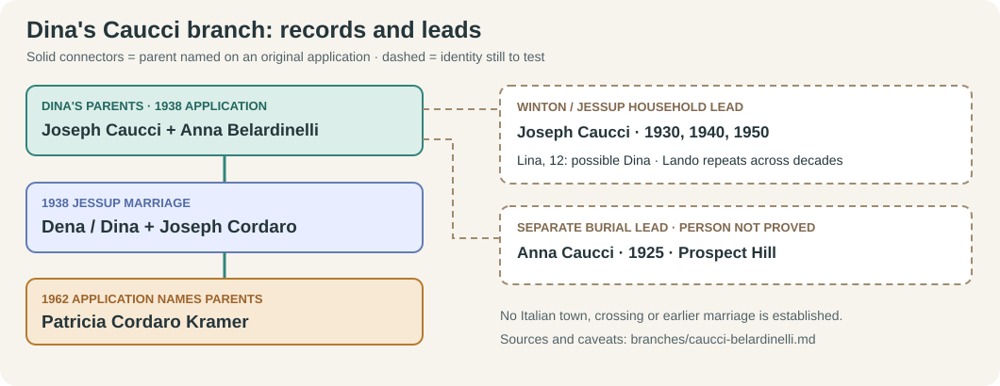
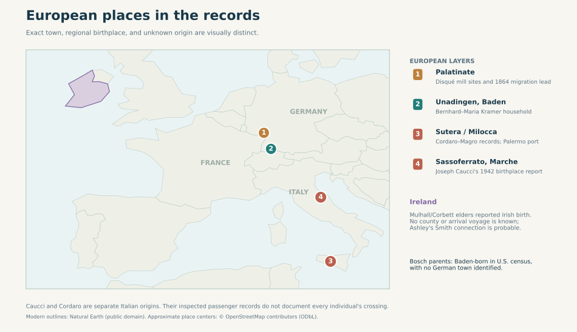

# Dina Caucci's Jessup family

**The new Italian place:** Joseph Caucci's [signed 1942 draft registration](../sources/records/joseph-caucci-draft-card-1942.jpg) gives his birthplace as **Sassoferrato, Italy**. That is in **Ancona province, Marche**, in the central Italian hills near Umbria—not Sicily, where the separate Cordaro line lived. The card names **Londo Caucci** in Jessup as his contact. The unusual Londo/Lando name and Jessup location connect this registrant strongly to the Winton census household below. Dena's 1938 marriage form calls her father Joseph Caucci but does not supply his town, so the **final Dena-to-this-Joseph bridge remains to check**. [Map and location notes](../context/geography-atlas.md#europe-how-specific-is-each-origin)

The spelling Justin remembered as **“Ciucchi”** appears **Caucci** on the original [1938 Lackawanna County marriage application](../sources/records/cordaro-caucci-marriage-1938.jpg). That form calls her **Dena Caucci**, born in **Jessup, Pennsylvania**, and names **Joseph Caucci** and **Anna Belardinelli** as her parents. The mother's surname is handwritten; FamilySearch indexed it *Belardinelle*. Dina is the spelling on her husband's [1940 draft card](../sources/records/joseph-anthony-cordaro-draft-card-1940.jpg) and their daughter's later marriage application. The variant first names belong to the same woman through spouse, birthplace and parent links, rather than pronunciation alone. [Source notes](../research/sources.md)

| Generation | Evidence and a glimpse of life |
| --- | --- |
| **Joseph Caucci + Anna Belardinelli** | Both are named as Dena's parents on her **1938 original application**. Joseph was then living in **Jessup**; Anna was marked **deceased**. Dena reported both born in **Italy**, but gave no town. Joseph's occupation on the form is **laborer**; Anna's is blank. A strong Joseph candidate's **1942 original** names **Sassoferrato** as his birthplace. |
| **Dena/Dina Caucci + Joseph Cordaro** | Married **30 April 1938** in Jessup. The [1940 West Wyoming census](../sources/records/joseph-dina-cordaro-census-1940.jpg) gives her highest completed grade as **8** and Joseph's work as a **coal cutter**. A grade is not a named school or proof of when schooling ended. |
| **Patricia Cordaro Kramer** | Her [1962 Luzerne marriage application](https://www.searchiqs.com/paluze/) names **Joseph Cordaro and Dina Caucci** as her parents; she later married Fred / Ferdinand Francis Kramer. |

## The Winton household: strong clues, an unfinished bridge

FamilySearch's [1930 index](https://www.familysearch.org/ark:/61903/1:1:XHQ9-JXD?lang=en) places an **Italy-born Joseph Caucci**, about 42, in **Winton**, near Jessup. It lists children **Ida, Lina, Londo, Louise and Guido**. The indexed **Lina, 12**, could be Dena/Dina, born in Jessup in late 1917. The matching age, father name, surname and area make this a **strong lead**, but the 1930 image required login during this pass and has **not been read**. The index calls Joseph *married* yet lists no wife in his linked household; it does not identify the children's mother. Do not assign every child to Anna until an original census, birth, obituary or marriage record connects them.

A [1940 Winton index](https://www.familysearch.org/ark:/61903/1:1:KQDC-VD4?lang=en) again lists Joseph with **Lando and Guido**. A [1950 index and open original viewer](https://www.familysearch.org/ark:/61903/1:1:6X19-71GR?lang=en) place a **widowed, Italy-born Joseph**, about 62, in son **Lando's** Winton household. The original is **ED 35-233, sheet 15, lines 15–21**. It calls Lando a **coal loader** and Joseph a **bartender** at a **hotel/café** (the machine index says “hotel and cape”). Lando's repeat appearance across 1930, 1940 and 1950 supports this Joseph's identity. The **1938 application** is still the record that proves *Dina's* parent pair; no located census explicitly labels her Dena.

### An origin clue on each side of the couple

The **1942 card** gives Joseph's birth as **13 November 1887** in Sassoferrato. Its Jessup contact **Londo** makes the match to the Winton household stronger than a name alone. It lists Joseph **unemployed in 1942**; that is one dated work snapshot, not a measure of the household's wealth. A [1918 draft *index* for Guiseppi Caucci](https://www.myheritage.com/research/record-20883-3550799/guiseppi-caucci-in-united-states-world-war-i-draft-registrations) also says Sassoferrato but gives **12 November 1887**. The one-day discrepancy is unresolved; the original 1918 card has not been inspected. Neither draft registration proves military service.

An [original *Madonna* passenger manifest, line 30](../sources/records/anna-belardinelli-1913-passenger-manifest.jpg), names **Anna Belardinelli**, 24, unmarried, with **Sassoferrato as her last permanent residence**. It says she was joining a **sister Maria in the Scranton area**; the [indexed record](https://www.myheritage.com/research/record-10512-59600903/anna-belardinelli-in-ellis-island-other-new-york-passenger-lists) gives a **31 May 1913 New York arrival** after departure from Naples. Name, area, timing and nearby destination make her a **promising candidate** for Dena's mother, but the manifest does not name Joseph, Dena or a later married surname. Another Anna Belardinelli appears in passenger records, so this match needs a U.S. marriage, child's birth or death certificate.

A [December 1936 Social Security application *index*](https://www.myheritage.com/research/record-10863-11056409/giuseppe-caucci-in-us-social-security-applications-claims) for **Giuseppe Caucci**, born **13 November 1887** in Italy, names parents **Luigi Caucci and Teresa Giovannini**. The exact date fits Joseph's 1942 card, so these are valuable **older-generation leads**. The index image and an Italian birth act have not been checked; do not yet extend Dina's confirmed tree through them.

Sassoferrato is an **inland Marche town near Umbria**, with a landscape of Apennine hills and the Sentino river described by the [municipality](https://www.comune.sassoferrato.an.it/vivere_il_comune/territorio/territorio_2.html). That describes the place around the family, not Joseph's own home, job or reason for leaving. His travel year and motive remain unknown.

### A small coal operation in the same household's orbit

Pennsylvania's [1946 anthracite mines report](https://northernfield.info/Documents/doc01/1946.pdf#page=37) names **Lando Caucci of Jessup** as **general manager of Caucci Coal Co.** Its [production table](../sources/records/caucci-coal-1946-production.jpg) records **5,124 net tons**, **nine employees**, and **196 days worked** that year. This puts a named Caucci at the center of a small local mining operation between the Winton census snapshots. It does **not** name the owner, give profit or wages, or prove that this Lando was Dina's brother. The shared unusual name and area make that identification a strong lead to test with a business filing or a record linking Dina to Lando. In 1950 the census calls Lando a coal loader; neither source explains the change in reported role.

An [index of Prospect Hill Cemetery burials](https://www.lackawannapagenweb.com/cemeteries/PropectHillCemetery.html) lists **Anna Caucci**, age **37**, buried **6 December 1925** in a “Poor Lot.” The [original Pennsylvania death index page](../sources/records/anna-caucci-death-index-1925.jpg) separately records **Anna Caucci, Blakely, 6 December 1925, certificate 118013**. It confirms a same-name death on that date, but gives **no maiden name, husband, parents or burial place**. A separate cemetery row mentions a **1930 move to Jessup**; the list does not prove the rows describe one person. The 1925 Anna is a candidate for Dena's mother, deceased by 1938, **not yet identified as Anna Belardinelli**. The lot label is a cemetery category, **not evidence of the family's finances**. Certificate **118013** is the precise next record to obtain through the [State Archives request route](https://www.pa.gov/services/phmc/request-a-birth-or-death-certificate) to test her identity.

**Migration question:** Joseph and Anna reported Italian birthplaces on the 1938 application, while Dena was born in Pennsylvania. Thus Dina's **parents' generation crossed from Italy**. The likely Joseph's card now gives **Sassoferrato**, and Anna's **candidate** manifest gives the same last residence and a 1913 crossing. No inspected record yet says when Joseph sailed, where Anna was born, why either left, or when they married. Seek Joseph's **1887 Sassoferrato birth act**, Anna's civil birth and a **parent-naming U.S. record** tying the 1913 passenger to Dena before turning this plausible shared hometown into a proved couple's origin.
