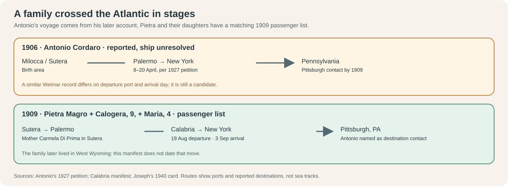
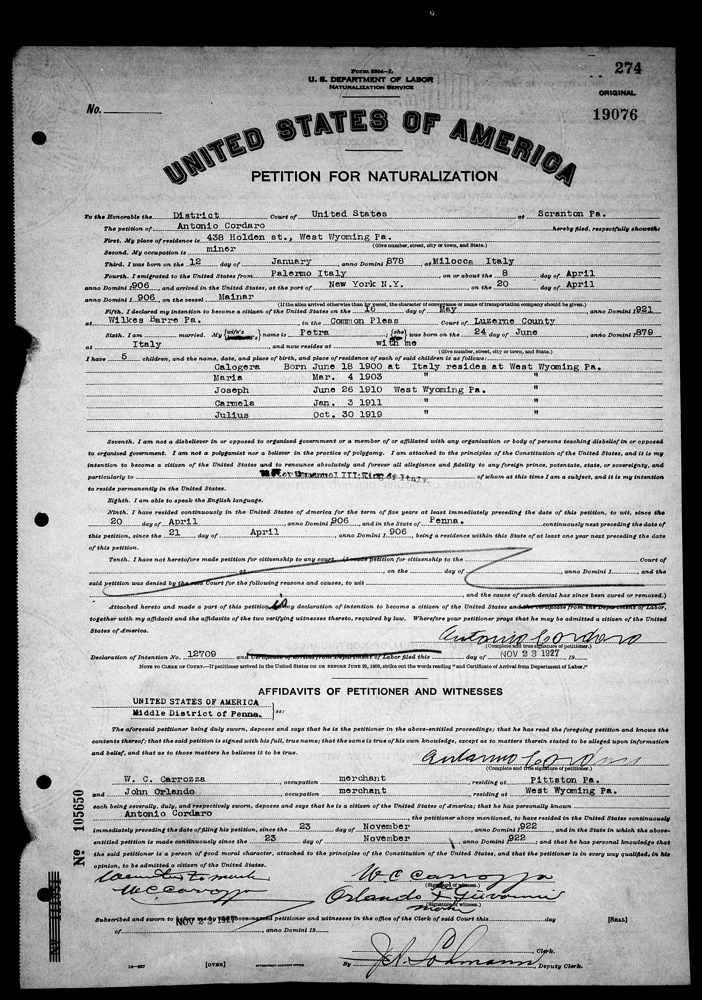
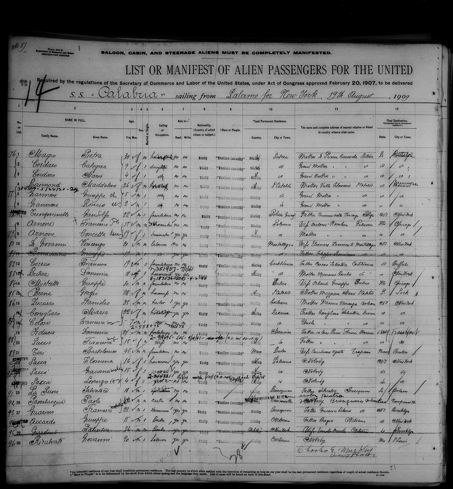
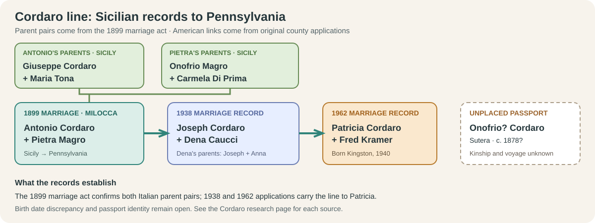
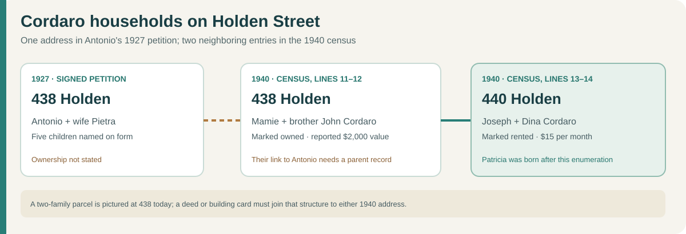
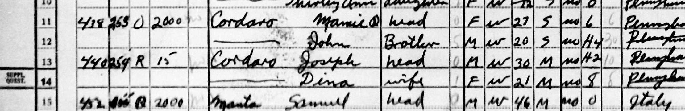
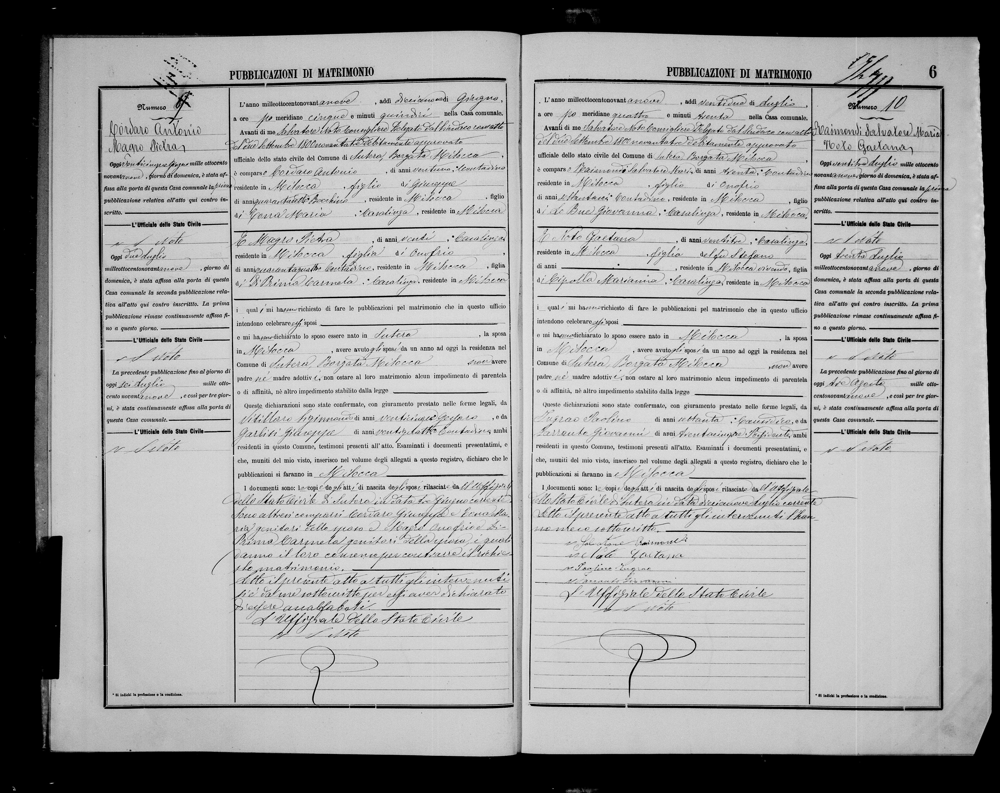
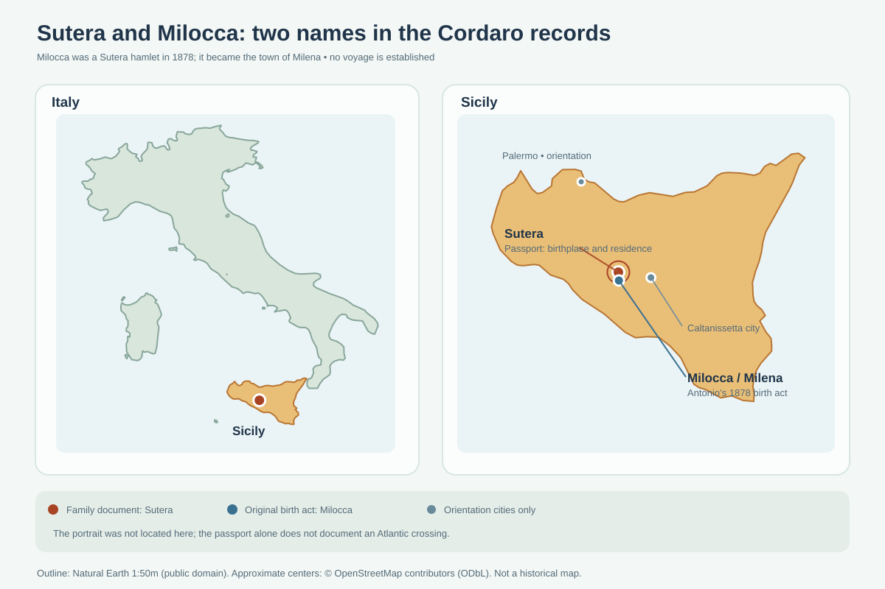
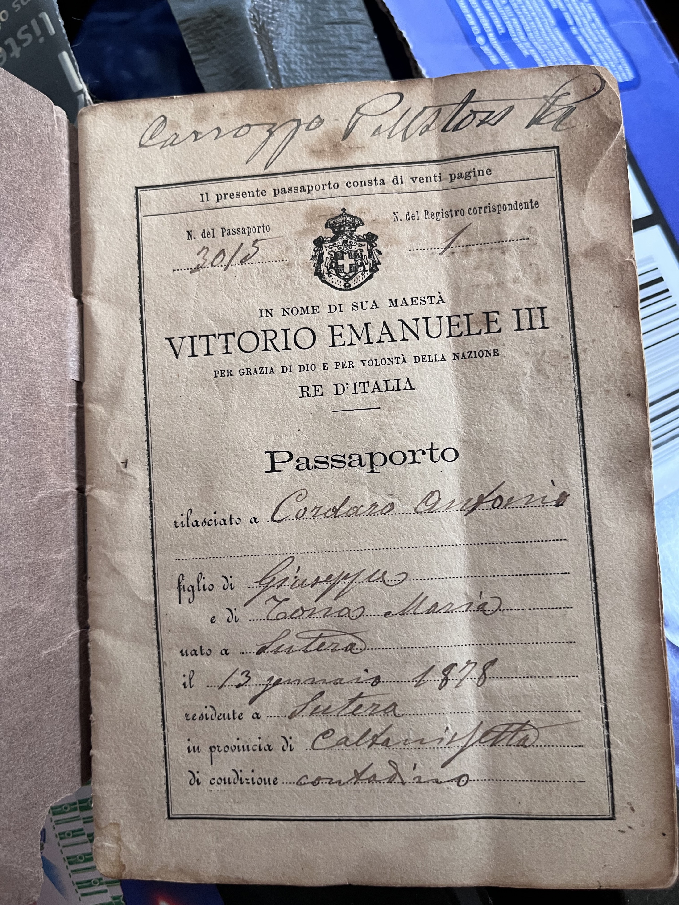
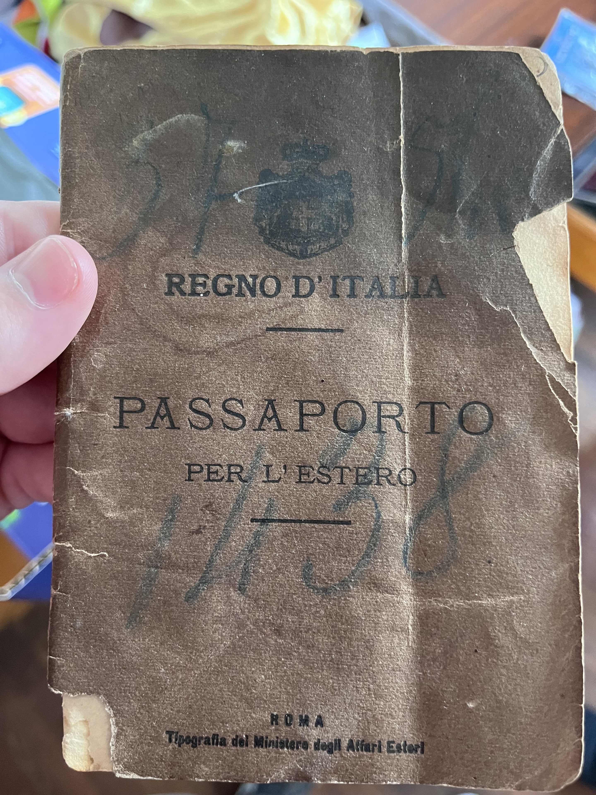

# The Sutera passport: a paternal-family lead

Justin supplied two photographs of an Italian passport kept on his father's side and recalls that it may have belonged to his grandmother's grandparents. **That relationship is family tradition, not yet a documented parent–child chain.** The holder's surname appears to be **Cordaro** (Justin remembers “Cadaros”); the given name appears to be **Onofrio**. Both readings need a second record because the handwriting is difficult.

**Documented American line:** Patricia Cordaro married Fred / Ferdinand Francis Kramer on **22 November 1962**. Her original [Luzerne County marriage application](https://www.searchiqs.com/paluze/) names **Joseph Cordaro and Dina Caucci** as her parents (Marriages book **191**, page/license **2785 L**). Their own [1938 Lackawanna County application](https://www.familysearch.org/ark:/61903/3:1:S3HY-6BBF-2V?view=index&personArk=%2Fark%3A%2F61903%2F1%3A1%3AVF7D-NP2&action=view&cc=1589502&lang=en) names the next generation. The passport holder's relationship to them remains open.

**New Caucci path:** Dina's name appears **Dena Caucci** on her 1938 original, which names parents **Joseph Caucci and Anna Belardinelli**. The remembered “Ciucchi” spelling led to this branch, but no inspected record uses it for Dina. [See the focused Caucci–Belardinelli diagram, Winton household leads and open migration question](caucci-belardinelli.md).

Justin names **Joan Cordaro, Mary Cordaro, and Toni Cordaro** as Patricia's sisters. This is a **family account**; their parentage has not yet been independently verified. A childhood census or a parent's obituary should test whether all four were Joseph and Dina's daughters. [Family-supplied, 26 September 2026]

## Antonio's crossing and citizenship: an original record chain

### What changed around their Sicilian home?

The family lived around **Milocca and Sutera**, inland in Caltanissetta province. The [1899 marriage notices](../sources/records/cordaro-magro-banns-1899.jpg) call Antonio a farm worker and his father Giuseppe a day laborer; the [strongly matching 1878 birth act](https://antenati.cultura.gov.it/ark:/12657/an_ua18544377/) calls Giuseppe an agricultural worker and Maria Tona a seamstress. The [1899 marriage act](https://antenati.cultura.gov.it/ark:/12657/an_ua18541487/) confirms **Maria Tona** as the groom's mother. These occupations are **not evidence that they owned or lacked land**.

One local turning point is unusually close to their migration dates. In [research on Sutera and Milocca held by Italy's archival administration](https://dgagaeta.cultura.gov.it/public/uploads/documents/Saggi/6593ab8704a1d.pdf), historians **Claudio Torrisi and Linda Reeder** describe a **1905 landslide at Monte San Paolino**, the loss of the local sulfur mines, and a subsequent rise in departures for North America. They say most residents worked in agriculture, while the mines also supported other local business. Antonio's **reported 1906** crossing and Pietra's **documented 1909** voyage fall in this period. **No Cordaro testimony or record says the landslide caused their decision**, and Antonio is recorded as a farm worker rather than a sulfur miner. The study describes **Birmingham** as a common destination for Suteresi; this family instead has a **Pittsburgh destination on the 1909 manifest** and a later **West Wyoming** household.

The documents show a staggered move: Antonio's later naturalization papers place him in America first, then Pietra traveled with Calogera and Maria to join him. Pietra listed her mother **Carmela Di Prima** back in Sutera, a specific link between the two shores. In Pennsylvania Antonio is recorded as a **miner**, and Joseph's 1940 card names **Lehigh Valley Coal Co.** as his employer without specifying his job. This is a shift in the family's recorded work from **Sicilian agriculture toward Pennsylvania mining and coal employment**, not a measured change in family wealth. [Sicily map](../maps/cordaro-sutera-places.svg) · [interactive timeline](../explore/timeline.html).

**Possible family resting place:** Contributor memorials place [Antonio](https://www.findagrave.com/memorial/153512121/antonio-cordaro) (1878–1940) and [Pietra](https://www.findagrave.com/memorial/153512074/pietra_a-cordaro) (1879–1930) at **Saint Cecilia's Cemetery, Exeter, Pennsylvania**. The names, spouse link, years, and Luzerne County location fit the original records here. A [Mary Cordaro Pardi memorial](https://www.findagrave.com/memorial/153511892/mary-pardi) there, 1904–1939, may be their Italy-born daughter Maria, but no original parent-naming record has yet closed that link. **Treat the graves as leads** until Pennsylvania death certificates or cemetery registers confirm them; the memorials do not verify headstones. [Burial map and visit guide](../context/family-burial-places.md).

[Larger route preview](../maps/cordaro-crossing-evidence-preview.png).

The [signed 1927 petition](../sources/records/antonio-cordaro-petition-1927.jpg) names **Antonio Cordaro**, wife **Petra**, and five children: **Calogera** and **Maria**, born in Italy, followed by **Joseph**, **Carmela**, and **Julius**, born in **West Wyoming, Pennsylvania**. Joseph's name and birthplace tie this petition to the [1938 marriage application](../sources/records/cordaro-caucci-marriage-1938.jpg) identifying Anthony/Antonio and Petra Magro as Joseph's parents. This is a much firmer identification than surname and age alone. The petition calls Antonio a **miner** in 1927. The earlier [1921 declaration](../sources/records/antonio-cordaro-declaration-1921.jpg) also calls him a miner and places his birth in **Milocca**; Petra was born in **Sutera**.

| Date | What the original says | Interpretation |
| --- | --- | --- |
| **April 1906** | Antonio's [petition](../sources/records/antonio-cordaro-petition-1927.jpg) reports leaving **Palermo on 8 April** and reaching **New York on 20 April**, aboard a vessel typed *Mainar*; his [declaration](../sources/records/antonio-cordaro-declaration-1921.jpg) types *Meimar German Line*. | Two records repeat **his reported crossing**, but both originate with his naturalization account. The ship spelling and exact dates need a passenger-list match. |
| **3 September 1909** | The [*Calabria* manifest, front](../sources/records/pietra-cordaro-calabria-manifest-1909-front.jpg) and [reverse](../sources/records/pietra-cordaro-calabria-manifest-1909-back.jpg), list **Pietra Magro**, 30, with **Calogera Cordaro**, 9, and **Maria Cordaro**, 4. They sailed from **Palermo on 19 August** and arrived in **New York on 3 September**. The manifest gives **Sutera** as their last home, Pietra's mother **Carmela Di Prima** as their contact there, and husband/father **Antonio Cordaro** as their contact in **Pittsburgh, Pennsylvania**. | A direct passenger-list match across **three names, ages, the mother in Sutera, and Antonio in Pennsylvania**. This establishes Pietra and the two older daughters' U.S. arrival. The FamilySearch index misreads Pietra's surname as *Magio*. The manifest names Pittsburgh as the destination; it does not date their later move to West Wyoming. |
| **16 May 1921** | Antonio signed a [declaration of intention](../sources/records/antonio-cordaro-declaration-1921.jpg) in Luzerne County. | Intention to seek citizenship, **not citizenship itself**. |
| **23 November 1927** | He signed [petition no. 19076](../sources/records/antonio-cordaro-petition-1927.jpg) in the federal court at Scranton. It names wife Petra and five children and two merchant witnesses, W. C. Carrozza of Pittston and John Orlando of West Wyoming. | The FamilySearch index wrongly labels **23 November 1922** as the petition's naturalization date. The original plainly says **1927**. Witnesses are not shown to be relatives. |
| **20 November 1928** | A federal [naturalization index card](../sources/records/antonio-cordaro-naturalization-index-1928.jpg) gives a citizenship certificate number and this naturalization date, referencing petition **19076** and the same address. | **Antonio was naturalized by this date**, according to the official index. The final oath/certificate page has not yet been inspected. |

The **first three rows** are the family; the [reverse](../sources/records/pietra-cordaro-calabria-manifest-1909-back.jpg) names Antonio as their Pennsylvania contact. The family traveled in **steerage**, the class printed on the reverse. This records a travel class, not a measure of their total assets. Joseph's later [signed 1940 draft card](../sources/records/joseph-anthony-cordaro-draft-card-1940.jpg) says he was born in **West Wyoming on 26 July 1910**. Thus a family member was there within eleven months of Pietra's New York arrival, though the manifest's Pittsburgh destination is not proof they actually resided in that city.

A [23 April 1906 Ellis Island manifest](../sources/records/antonino-cordaro-weimar-manifest-candidate-1906.jpg) has an **Antonino Cordaro**, age 27, married, last residence indexed *Suttra* (likely Sutera), on the **Weimar**. Name, age, Sicilian place and ship spelling make him a **promising Antonio candidate**. But the manifest says the *Weimar* sailed from **Naples** and arrived **23 April**, while Antonio's petition says Palermo and **20 April**. Its stated New York destination has not yet been connected to his later West Wyoming home. **Do not treat this manifest as proved to be his crossing** until the destination/contact and any other voyages are reconciled. The 1909 *Calabria* manifest independently places an **Antonio Cordaro** in Pittsburgh, though it does not prove that the *Weimar* passenger was him. [1906 passenger index](https://www.familysearch.org/ark:/61903/1:1:JFCS-32G?lang=en) · [1909 Calogera index](https://www.familysearch.org/ark:/61903/1:1:JX1V-G2J?lang=en).

The original [Milocca 1878 birth act](https://antenati.cultura.gov.it/ark:/12657/an_ua18544377/) records **13 January**, while Antonio's naturalization papers and index say **12 January**. The [1899 marriage act](https://antenati.cultura.gov.it/ark:/12657/an_ua18541487/) confirms the matching parent pair but does not resolve that one-day difference. The family-held passport's apparent 1878 date and Giuseppe father remain intriguing, but its given name still reads uncertainly and **it is not yet assigned to Antonio**. [Original-record gallery](../sources/records/README.md) · [Sicily map](../maps/cordaro-sutera-places.svg).

### What Patricia's FamilySearch result actually contains

The [page Justin found](https://www.familysearch.org/ark:/61903/1:1:6L83-L29V?lang=en) is **Patricia's mention in Fred's 2023 obituary index**, not a birth, marriage, or death record for Patricia. It lists **Patricia Gould, John Kramer, Karen Horn, and Paul Kramer** as her children, without birth dates or proof that every relationship was biological. **Ferdinand Louis and Mary Andrews Kramer are her parents-in-law**, not her parents. Its “Other People” list supplies no stated kinship. That explains why this result did not lead back to the Cordaros.

## Three-generation record path

[Larger diagram preview](../maps/cordaro-passport-evidence-preview.png).

| Generation | What the records establish |
| --- | --- |
| Patricia Cordaro Kramer | The [original 1962 application](https://www.searchiqs.com/paluze/) gives birth **9 June 1940 in Kingston, Pennsylvania**, occupation **secretary**, and parents Joseph Cordaro and Dina Caucci. She married **Fred / Ferdinand Francis Kramer**, a shoe-factory employee, at **West Wyoming** on **22 November 1962**. Find **Marriages book 191, page 2785** using *Go To Document*. The county [explains access to its marriage archive](https://www.luzernecounty.org/614/Register-of-Wills). |
| Joseph Cordaro and Dena/Dina Caucci | Their [original 1938 application and return](../sources/records/cordaro-caucci-marriage-1938.jpg) record their marriage on **30 April 1938 in Jessup, Pennsylvania** (Lackawanna docket **567**, right-hand page). Joseph, **28**, was a laborer born in West Wyoming; Dena, **20**, was born in Jessup. By the [1940 census](https://www.familysearch.org/ark:/61903/1:1:KQ7W-L64?lang=en) they lived in West Wyoming. His [signed draft registration](../sources/records/joseph-anthony-cordaro-draft-card-1940.jpg) gives **26 July 1910** as his West Wyoming birth date, names **Dina** as wife, and lists **Lehigh Valley Coal Co.** as his employer in October 1940. **Registration is not evidence of military service.** Patricia was born two months after the census enumeration. |

| Joseph's parents: Anthony/Antonio Cordaro and Pietra/Petra Magro | The [1938 application](../sources/records/cordaro-caucci-marriage-1938.jpg) names Joseph's parents **Anthony** and **Petra**, with her maiden surname written **Magro** (indexed *Magra*). Both are reported born in **Italy**. The [1920 West Wyoming census](https://www.familysearch.org/ark:/61903/1:1:M611-V9M?lang=en) has Anthony/Antonio, wife Petria, and son Joseph, 10; it reports Anthony's arrival as **1895** and Petria's as **1909**. The [1909 *Calabria* manifest](../sources/records/pietra-cordaro-calabria-manifest-1909-front.jpg) now verifies **Pietra's 1909 arrival with Calogera and Maria**. The [1927 petition](../sources/records/antonio-cordaro-petition-1927.jpg) reports Antonio's **1906** crossing and names Joseph among five children. Antonio's conflicting census year needs resolution. |
| Dina's parents: Joseph Caucci and Anna Belardinelli | The [1938 application](../sources/records/cordaro-caucci-marriage-1938.jpg) names Joseph and Anna; Anna's surname is hard to read and indexed **Belardinelle**. A [Social Security NUMIDENT index](https://www.familysearch.org/ark:/61903/1:1:6K95-YJSQ?lang=en) independently links **Dina M. Caucci/Cordaro**, born **25 November 1917 in Jessup**, to father **Joseph Caucci** and records her death **9 January 1989**. The FamilySearch tree shows **26 November** instead; use the underlying records for this one-day discrepancy. |

**A work and school snapshot before Patricia's birth:** The [original 1940 census, sheet 15A, lines 13–14](../sources/records/joseph-dina-cordaro-census-1940.jpg) gives Joseph's highest completed grade as **H2** (second year of high school) and Dina's as **8** (eighth grade). It calls Joseph a **cutter in coal mining** and reports **26 weeks worked and $800 in wages during 1939**. This is a reported annual wage for one person, **not the family's assets or net worth**. Joseph's October draft card separately names Lehigh Valley Coal Co.; together these records describe coal work more specifically than the 1938 application's “laborer.” The census gives no named school and does not explain the education levels. Its indexed page lists no children in their household; Patricia's recorded June 1940 birth followed the spring enumeration.

### Two Holden Street numbers on one census page

The [1927 petition](../sources/records/antonio-cordaro-petition-1927.jpg) gives Antonio **438 Holden Street**. On the [6 May 1940 original, sheet 15A, lines 11–14](../sources/records/joseph-dina-cordaro-census-1940.jpg), **Mamie Cordaro**, 27, is head at **438**, with **John Cordaro**, 20, recorded as her brother. The household reports an **owned home valued at $2,000** and “same house” in 1935. **Joseph and Dina** are the next household at **440 Holden**, paying **$15 monthly rent**. Joseph's 1938 marriage application independently names Antonio and Pietra as his parents, so the adjacent entry places their son one number away from Antonio's earlier address. The same surname and proximity do **not** establish that Mamie and John were Antonio's children, that he transferred title, or that 438 and 440 were units of the same building. The [FamilySearch profile for Mamie](https://www.familysearch.org/en/tree/person/details/L29K-V5V) proposes “Carmella” as an alternate name and links her to Antonio, but that name has **no cited source** there; the petition instead names a daughter **Carmela** born in 1911, while the census gives Mamie an approximate 1912–13 birth. Test them with a parent-naming record. The present [438 Holden property page](https://www.redfin.com/PA/Wyoming/438-Holden-St-18644/home/134024604) labels today's parcel two-family and built **1920**; it does not prove the 1940 layout or the pictured structure's continuity. The crop is from a U.S. census image and leaves out the sheet's street label; use the full page to inspect it. Antonio's exact 1940 death date remains unverified, so whether he was alive at this enumeration is also open.

An [original marriage-banns page](../sources/records/cordaro-magro-banns-1899.jpg) records **Antonio Cordaro, 21**, and **Pietra Magro, 20**, requesting marriage notices in Milocca on **19 June 1899** (act **9**, left page). Antonio was a *contadino* (farm worker); Pietra a *casalinga* (homemaker). Both lived in Milocca. His father was **Giuseppe Cordaro**, about 47 and a *bracciante* (day laborer); her parents were **Onofrio Magro** and **Carmela Di Prima**. The banns call Antonio's mother **Maria**, but her surname is faint and was indexed as *Gorra*. The [1879 Sutera birth act, no. 62](https://antenati.cultura.gov.it/ark:/12657/an_ua18882638/0Myg1d7) begins on scan **47** and [continues on scan 48](https://antenati.cultura.gov.it/ark:/12657/an_ua18882638/57QZmvO); the margin reads **Magro Petra**. Its [FamilySearch index](https://www.familysearch.org/ark:/61903/1:1:QV98-LDK9?lang=en) gives a **24 June** birth and names **Onofrio Magro** and **Carmela Di Prima** as parents. That pair agrees with the 1899 marriage and the mother named on Pietra's 1909 passenger list. The original image is faint, so the exact birth day and further handwritten detail still need a careful independent transcription.

The [original Milocca marriage register](https://antenati.cultura.gov.it/ark:/12657/an_ua18541487/), **page 14, act 11**, records the ceremony on **1 August 1899**. The margin names **Cordaro Antonio / Magro Pietra**. The body names Antonio's parents **Giuseppe Cordaro and Maria Tona** and Pietra's **Onofrio Magro and Carmela Di Prima**. It calls Antonio a **21-year-old farm worker**, born in Sutera and living in Milocca, and Pietra a **20-year-old homemaker**, born and living in Milocca. This original confirms the [FamilySearch marriage index](https://www.familysearch.org/ark:/61903/1:1:6NCZ-7RPP?lang=en) and resolves the mother's surname for the married couple: **Tona**, despite the different apparent banns reading. The groom's Sutera birthplace in this form is compatible with Milocca's status as a Sutera hamlet; the [municipality's history](https://www.comune.milena.cl.it/vivere-il-comune/territorio/la-storia/) says Milocca became independent in 1923 and was renamed Milena in 1933.

A [1878 Milocca birth act, no. 6](https://antenati.cultura.gov.it/ark:/12657/an_ua18544377/) (page **7** of the register) names **Antonio Cordaro**, born **13 January** to **Giuseppe Cordaro and Maria Tona**; Giuseppe was a *villico* (agricultural worker) and Maria a *cucitrice* (seamstress). The parent pair, groom's age, and Milocca/Sutera location now make this a **strong match** to the man who married Pietra, though no single record explicitly cites his birth act number. Antonio's [1927 petition](../sources/records/antonio-cordaro-petition-1927.jpg) reports **12 January 1878**, leaving a **one-day birth-date discrepancy**. The family passport appears to share the 1878 date and Giuseppe's name, but its given name remains difficult to read; **do not assign the passport to Antonio** without another identifying record.

**1899 correction:** an earlier inspection mistakenly described act **11** in the Milocca marriage volume as another couple. Reopening **page 14** at full screen showed the marginal names **Cordaro Antonio / Magro Pietra** and the **Tona** parent entry. The FamilySearch image for its index is restricted, but this separate Antenati original is openly viewable. The **19 June banns** and **1 August ceremony** are different records.

| Search checked, 26 September 2026 | What it established |
| --- | --- |
| FamilySearch 1950 census search for *Patricia Cordaro*, including a 1939–41 birth range | Several unrelated Patricia/Pat households appeared, but none with Joseph and Dina in West Wyoming. Misindexing or omission remains possible. |
| Web searches combining Patricia, Fred, and reported sisters Joan, Mary, and Toni | No independent record joining the four sisters was found. The county marriage records supplied the parent link instead. |
| FamilySearch full-text search for “Patricia Cordaro” | Six results appeared in Brazilian registers and did not identify the Pennsylvania family; this collection search does not cover every newspaper or civil record. |

**Next records:** a 1950 Joseph/Dina household or a parent's obituary for Patricia's reported sisters; a second record linking the *Weimar* passenger to Antonio's West Wyoming household; and a separate register entry identifying the passport holder. The original 1899 marriage act has now been found and read.

| What the photographed page says | Reading and limit |
| --- | --- |
| *Nato a* / *residente a* | **Sutera**, in the province of **Caltanissetta**, Sicily. The residence is at the time the form was completed, not proof of where he later settled. |
| *Il 13 gennaio 1878* | Appears to give **13 January 1878** as the holder's birth date; the final year digit should be checked against Sutera's birth register. |
| *Figlio di* / *e di* | Father appears **Giuseppe**; mother appears **Maria**, with an undeciphered surname or preceding name. Do not assign her a maiden name yet. |
| *Di condizione* | **Contadino**: farm worker or farmer. It does not distinguish tenant, laborer, or landowner and says nothing about household wealth. |
| Passport heading | Issued in the name of **King Vittorio Emanuele III**. The photographed page has no legible issue date, visa, route, ship, or U.S. arrival stamp. The number appears **3015**, but needs checking against the original. |

## Where is Sutera?

The passport places its holder's **birth and residence in Sutera**, an inland town in Sicily's **Caltanissetta** area. Antonio's petition and the original birth and marriage acts place **him in Milocca**, then a hamlet of Sutera a few kilometers south. The map distinguishes the two recorded place names. **Palermo** is documented as Pietra and her daughters' **1909 departure port**, and Antonio's 1927 petition also reports leaving there in 1906, though his candidate passenger list says Naples. Neither port is documented as a family residence. [Sutera municipal history](https://www.comune.sutera.cl.it/vivere-il-comune/territorio/la-storia/) describes a hill town around **Monte San Paolino** with narrow old lanes; [Italy's tourism office](https://www.italia.it/it/sicilia/sutera) describes the historic Rabato district. [Milena's history](https://www.comune.milena.cl.it/vivere-il-comune/territorio/la-storia/) says the district produced wheat, olives and almonds; Giuseppe's agricultural work and Maria's sewing fit this rural economy, but no record names their employer, earnings or property. [Larger map preview](../maps/cordaro-sutera-places-preview.png).

The [inside page](../sources/family/italian-passport-details.jpg) and [cover](../sources/family/italian-passport-cover.jpg) are Justin's photographs of a family-held document, added without editing. The cover reads *Regno d'Italia, Passaporto per l'Estero* (“Kingdom of Italy, passport for travel abroad”). **This passport alone** does not establish a voyage or its bearer's identity; Antonio's separate naturalization file now supplies his own reported crossing.

[Read the photographed Italian fields in English](../sources/family/italian-passport-translation.md), with uncertain handwritten names marked. The visible page calls the holder a *contadino* and places his birth and residence in Sutera, but gives no visible issue date, ship, destination or land ownership.

## Record trail to test

The [Caltanissetta State Archive's civil registers](https://antenati.cultura.gov.it/archivio/state-archives-of-caltanissetta/?lang=en) and [FamilySearch's indexed/image collection](https://www.familysearch.org/en/search/collection/1986780) cover this area. The [1878 Milocca original](https://antenati.cultura.gov.it/ark:/12657/an_ua18544377/) resolves **Antonio's** indexed birth; it does **not** identify the passport holder. The 1878 Sutera register also needs a full search for an **Onofrio Cordaro** born around 13 January. A preliminary FamilySearch search did **not** produce a confident matching index entry; indexing may be incomplete.

One potentially confusing [indexed Sutera birth](https://www.familysearch.org/ark:/61903/1:1:QV98-LSW2?lang=en) names **Onofrio Cordaro**, father **Giuseppe**, mother **Maria Raimondi**, but dates the birth **31 January 1898**. A [matching death index](https://www.familysearch.org/ark:/61903/1:1:Q2HC-JQBM?lang=en) says that child **died in Sutera in April 1899**. He therefore cannot be the adult passport holder. The passport appears to say **13 January 1878**, twenty years earlier. A signed-in FamilySearch search of indexed Onofrio Cordaro records around **1875–81** did not reveal a matching birth; indexing may be incomplete, so the [1878 original register](https://antenati.cultura.gov.it/archivio/state-archives-of-caltanissetta/?lang=en) remains necessary.

The [Library of Congress history of Italian immigration](https://www.loc.gov/classroom-materials/immigration/italian/the-great-arrival/) describes limited prospects for many rural Sicilians and cheaper transatlantic passage during the late nineteenth and early twentieth centuries. This gives context for a Sutera **contadino** acquiring a foreign-travel passport; it **does not establish his personal motive, voyage, destination, or success abroad**. Separately, the 1920 census places **Italy-born Antonio and Pietra** in West Wyoming with their Pennsylvania-born son Joseph.

## Unidentified family portrait

Justin also supplied a photograph described by his family as **Cordaros** and guesses it may be from the **1930s**. It shows six people: two adult women at left, a young person standing behind a child in the center, and two men at right. **Working visual estimate: the 1920s, with a broad possible range of about 1915–1935 (low confidence).** The formal studio grouping, dark suits and dresses, young person's prominent pale collar or bow, and child's short trousers with long socks fit an early-twentieth-century portrait; none is a unique dating marker. The sepia appearance, scratches, and torn print show aging or storage damage, **not a measurable photo age**. A modern photo of the print has no original exposure date in its metadata. As the [Library of Congress explains](https://guides.loc.gov/local-history-and-family-photos/photographic-evidence), visual clues need comparison with dated records. The original print has no visible studio imprint, names, place or date on the front. The seated man **cannot yet be identified as the passport holder**, and the image cannot be placed in **Sutera or the U.S.** by appearance. A photograph of the back, any studio stamp, or a relative's labeled copy would narrow both questions.

The [Caltanissetta archive](https://antenati.cultura.gov.it/archivio/state-archives-of-caltanissetta/?lang=en) also lists military recruitment records for men of this era. **Antonio's own records report a 1906 crossing; Pietra and daughters' 1909 crossing is confirmed by a passenger manifest; and a federal index dates Antonio's naturalization to 1928.** The 1906 *Weimar* manifest is a promising but unresolved match; the family passport has not been placed in this proven chain. The portrait's six people remain unidentified.
