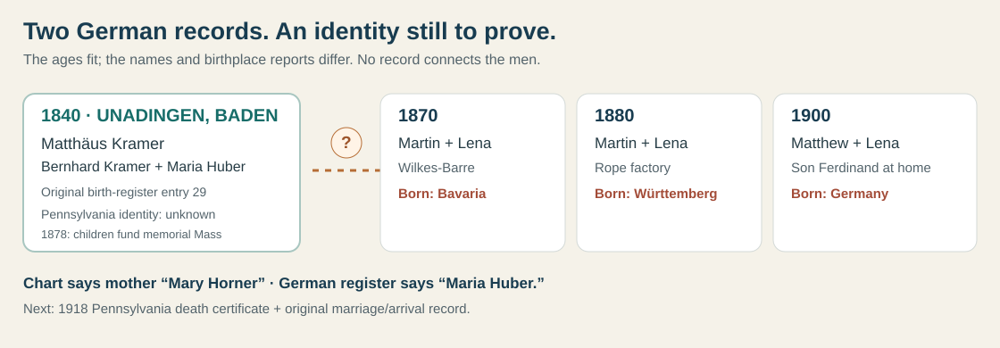
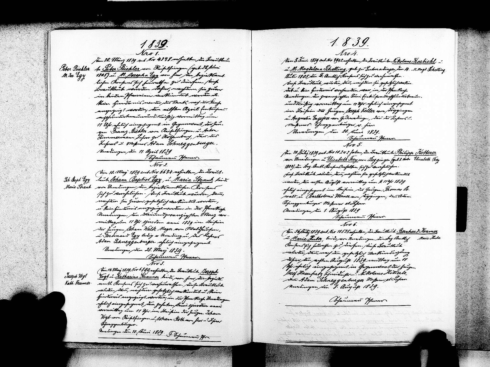
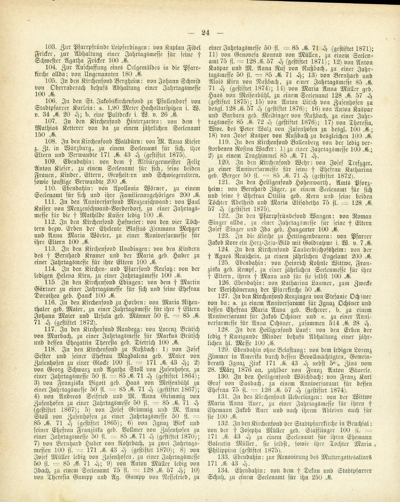

# A Baden birth record: is this Justin's Matthew Kramer?

**Finding:** An [1839 Unadingen marriage entry](../sources/records/bernhard-kramer-maria-huber-marriage-1839.jpg) joins **Bernhard Kramer and Maria/Marie Huber**, both described as from Unadingen. The register page is dated **8 August 1839**; the precise ceremony day needs a closer transcription. Their [1840 birth-register page](../sources/records/unadingen-matthaeus-kramer-register-1840-candidate.jpg) names them as parents of **Matthäus Kramer**. The [FamilySearch baptism index](https://www.familysearch.org/ark:/61903/1:1:Q18T-5K3Z?lang=en) points to the same birth entry, no. **29**, on **29 August 1840**. An **1878 official church notice** again names the couple and their children in Unadingen. A newly read [1812 original](../sources/records/bernhard-kramer-baptism-1812.jpg) names Bernhard's parents **Blasius Kramer and Agathe Huber**; the [Unadingen household page](kramer-unadingen-household.md) maps twelve separately indexed children, four childhood burials and Bernhard's **1874** indexed burial. These records establish a real Baden household; they do **not yet prove** that Matthäus became the Matthew/Matthias Kramer of Wilkes-Barre or fathered Ferdinand.

| Evidence | What it supports | What it cannot establish |
| --- | --- | --- |
| [Unadingen marriage register, 1839, entry 6](https://www.landesarchiv-bw.de/plink/?f=5-477661-19) · [saved full page](../sources/records/bernhard-kramer-maria-huber-marriage-1839.jpg) | Directly pairs **Bernhard Kramer and Marie Huber** in Unadingen. The page bears an **8 August 1839** closing date. The source is Staatsarchiv Freiburg **L 10 Nr. 1023**. | It names no Pennsylvania relative. The handwriting has not been fully transcribed, so the closing date is not yet asserted as the ceremony date. |
| [Unadingen birth register, 1840, entry 29](https://www.landesarchiv-bw.de/plink/?f=5-477660-85) | A Matthäus Kramer was recorded in Unadingen, with Bernhard Kramer and Maria Huber as parents. The page is from the [Staatsarchiv Freiburg series L 10 Nr. 1022](https://www.leo-bw.de/web/guest/detail/-/Detail/details/DOKUMENT/labw_findmittel/labw-5-477660/Unadingen%20L%C3%B6ffingen%20FR%3B%20Katholische%20Gemeinde%20Geburtenbuch%201810-1870). | It says nothing about Pennsylvania, Magdalena/Lena, or Ferdinand. |
| [Unadingen birth register, 1812](https://www.landesarchiv-bw.de/plink/?f=5-477660-7) · [saved original](../sources/records/bernhard-kramer-baptism-1812.jpg) | Bernhard/Bernardus was baptized on **15 August 1812**; the page directly names **Blasius Kramer and Agathe Huber** as parents. The [Freiburg index](https://www.familysearch.org/ark:/61903/1:1:QBGX-G5PZ?lang=en) mistranscribes the surname *Garner*. | It identifies the German Bernhard, not a father or grandfather of Pennsylvania Matthew without the missing identity bridge. |
| [Bernhard burial index, 1874](https://www.familysearch.org/ark:/61903/1:1:WFDG-3LT2?lang=en) | **1 March 1874**, Unadingen, age **62**, wife **Maria Huber**. This fits the original 1812 child and 1839 groom. | The church original is center/affiliate restricted; **burial is not a death date**. It gives no occupation, property or U.S. child. |
| [Freiburg archdiocesan *Anzeigeblatt*, 1878, printed p. 24, item 113](../sources/records/bernhard-kramer-huber-unadingen-memorial-1878.jpg) · [official full issue, PDF p. 6](https://www.kirchenrecht-ebfr.de/kabl/7963.pdf#page=6) | Names the **children of the late Bernhard Kramer and Maria née Huber** in a **100-mark endowment** to the Unadingen church fund for an annual memorial Mass for their parents. This independently anchors the exact parent pair and at least two children in Unadingen by 1878. | It does not name the children, Bernhard's death date, Maria's death status, their wealth or any emigrant. The 100 marks were a collective gift, not an estate or household valuation. |
| [1870 Wilkes-Barre census](../sources/records/kramer-martin-lena-census-1870.jpg) | Martin Cramer, 30, lives with Lena and children; birthplace **Bavaria**. | It gives no parents or German town. |
| [1880 Wilkes-Barre census](../sources/records/kramer-martin-lena-census-1880.jpg) | Martin Cramer, 40, with Lena and children; birthplace **Württemberg**. | It does not explain the Bavaria/Württemberg discrepancy. |
| [1900 Wilkes-Barre census](../sources/records/kramer-matthew-lena-census-1900.jpg) | Matthew Kramer, 59, with Lena and son **Ferdinand**; birth recorded **August 1840** in **Germany**, reported arrival **1865**. The month and year independently fit the Unadingen entry. | It gives no parents, town, exact birth day, or passenger vessel. |

**The month-and-year match is useful but insufficient.** The 1900 census's **August 1840** was recorded in Pennsylvania decades after the Unadingen child's August 1840 entry. Unlike the inherited chart's exact **29 August** date, it is a separately recorded household answer. Two conflicts remain: the chart names Matthew's mother **Mary Horner** while the Unadingen original names **Maria Huber**; and **Unadingen was in Baden**, while the American censuses variously say Bavaria and Württemberg. These could be inaccurate or loosely reported census answers, or evidence of different men. We cannot choose between them yet.

**A small glimpse of Bernhard's household:** Their [1839 marriage entry](../sources/records/bernhard-kramer-maria-huber-marriage-1839.jpg) shows the couple was locally registered before Matthäus's birth. [Eleven baptism indexes, including Matthäus's, and Marcus's marriage entry](kramer-unadingen-household.md) identify **twelve children** by this parent pair; four have indexed childhood burials. A **Bernhard Kramer** is also a named witness in the village's [1837 Georg Kramer–Theresia Ochsenwald marriage](https://www.landesarchiv-bw.de/plink/?f=5-477661-17) and [1838 Johann Evangelist Ketterer–Genoveva Kramer marriage](https://www.landesarchiv-bw.de/plink/?f=5-477661-18). This may be Matthäus's father participating in community ceremonies, but the entries do not identify the witness's wife or parents, so that identification and any kinship with the brides or grooms remain open. The 1878 [church notice](../sources/records/bernhard-kramer-huber-unadingen-memorial-1878.jpg) uses a † before **Bernhard**, consistent with his 1874 burial index. It says their unnamed children provided **100 marks** for a yearly memorial Mass. This is evidence of family religious practice and a specific collective donation; it cannot tell us which children paid, their occupations, property, or whether the Pennsylvania Matthew helped fund it.

[Read item 113 in German and English](../sources/records/bernhard-kramer-huber-unadingen-memorial-1878.md). Its 100 marks were one reported gift to support a **recurring** Mass, not an annual payment or a measure of the couple's estate.

**A passenger namesake stays separate:** An [1866 New York passenger list](https://www.familysearch.org/ark:/61903/3:1:939V-5298-Y3?view=index&personArk=%2Fark%3A%2F61903%2F1%3A1%3AQVPJ-63WB&action=view&cc=1849782&lang=en), line 319, includes a **Matthias Kramer, 23**, traveling without an adjacent Lena. The family's 1900 census reports **1865** arrivals for both spouses. The passenger page names no Wilkes-Barre destination and does not identify parents, wife, or child. It is an **unassigned research lead**, not this family's proven crossing.

**Best bridge:** Obtain Matthias Kramer's Pennsylvania death certificate **81722** (15 July 1918) and Matthew/Magdalena's original marriage record, then compare any parents and birthplace with the Unadingen register. A [Find A Grave memorial](https://www.findagrave.com/memorial/124590191) points to [Ancestry death-certificate record 1830584](https://www.ancestry.com/search/collections/5164/records/1830584), but the current Chrome account reaches a membership offer rather than the image; **its contents have not been read**. The memorial's full birth date and family links are contributor entries and may derive from the same chart, so they do not independently prove the German identity. An original naturalization or passenger file could test the reported arrival. [Three American census snapshots](kramer-martin-migration.md) · [children across the censuses](kramer-eleven-children.md) · [source ledger](../research/sources.md).
