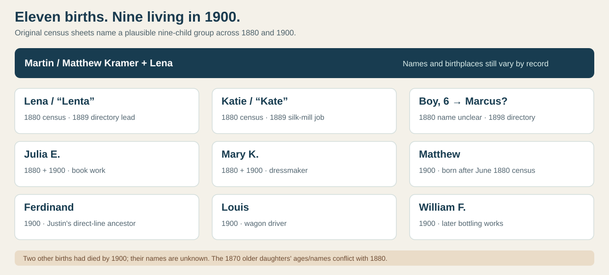

# Matthew and Lena's children: nine living in 1900

The [1900 census](../sources/records/kramer-matthew-lena-census-1900.jpg) says **Lena had borne 11 children, nine living**. It names six at home. The [1880 census](../sources/records/kramer-martin-lena-census-1880.jpg) names three older children no longer at home in 1900, as well as Julia and Mary, who appear on both sheets. Together, these form a **plausible nine-child living group**. It does not prove that every 1880 child survived to 1900; two children who died before 1900 are still unidentified. The 1870 names/ages add a conflict rather than a tenth secure name.

| Child as recorded | Dated evidence | Identification limit |
| --- | --- | --- |
| **Lena**, 12 in 1880 | [1880 household](../sources/records/kramer-martin-lena-census-1880.jpg); [1889 directory](https://pagenweb.org/~luzerne/towns/donnacd.htm) lists **Lenta Kramer** at 22 Susquehanna. | Probably the older daughter later called **Magdelena Helena Haefele** on a [contributor memorial](https://www.findagrave.com/memorial/114632458), but no marriage record checked here joins those names. The **1870 infant Lena** is younger than 1880 Lena, so do not silently align the ages. |
| **Katie**, 10 in 1880 | [1880 household](../sources/records/kramer-martin-lena-census-1880.jpg); [1889 directory](https://pagenweb.org/~luzerne/towns/donnacd.htm) lists **Kate**, silk-mill *beamer*, at 22 Susquehanna. | A [contributor memorial](https://www.findagrave.com/memorial/107787343) calls her Catherine J. Loefflad. The **1870 Catherine, age 3**, is older than 1880 Katie, so the cross-census identification remains unresolved. |
| **Six-year-old son, name unclear**, 1880 | [1880 original](../sources/records/kramer-martin-lena-census-1880.jpg); FamilySearch index reads **Marx**. A [1898 directory](https://pagenweb.org/~luzerne/towns/donnacd.htm) has **Marcus G. Kramer**, ropemaker, at the family's Susquehanna address. | **Marcus G. / George Marcus is probable**, not proved from the handwriting or a parent-naming record. A [contributor memorial](https://www.findagrave.com/memorial/113777439) gives George Marcus, 1874–1938. |
| **Julia E.**, 4 in 1880, 24 in 1900 | [1880](../sources/records/kramer-martin-lena-census-1880.jpg) and [1900](../sources/records/kramer-matthew-lena-census-1900.jpg) households; 1898 directory calls Julia a book sewer. | Strong same-person match across ages, household and workplace. A [contributor memorial](https://www.findagrave.com/memorial/153804145) proposes later surname Burkle; original marriage pending. |
| **Mary K.**, 2 in 1880, 21 in 1900 | Both original censuses; 1898 directory lists Mary as a dressmaker. | Strong same-person match, with roughly one-year age variation. A [contributor memorial](https://www.findagrave.com/memorial/153805057) proposes later surname Erwin; original marriage pending. |
| **Matthew**, 19 in 1900 | [1900 household](../sources/records/kramer-matthew-lena-census-1900.jpg) gives **July 1880** birth and day labor. | Born **after** the June 1880 enumeration, if the reported month is right. The **Martin/“Martin Jr.”** directory entries at the family address may refer to him, but this is not proved. |
| **Ferdinand**, 17 in 1900 | [1900 household](../sources/records/kramer-matthew-lena-census-1900.jpg); his [1951 original certificate](../sources/records/ferdinand-kramer-1882-death-certificate-1951.jpg) independently names father Matthew. | **Direct-line son established.** The certificate calls his mother **Matilda Dasque**, which still needs comparison with Lena/Magdalena. |
| **Louis**, 14 in 1900 | [1900 household](../sources/records/kramer-matthew-lena-census-1900.jpg) calls him a wagon driver. | The [contributor memorial](https://www.findagrave.com/memorial/6226417) gives 1885–1969, but the page alone does not establish a later life or death date. |
| **William F.**, 12 in 1900 | [1900 household](../sources/records/kramer-matthew-lena-census-1900.jpg); [1904 directory](https://pagenweb.org/~luzerne/towns/donnacd.htm) has William F. at 17 Susquehanna, employed at Wilkes-Barre Bottling Works. | Same-name/address match is strong; no later vital record checked. |

**Where the count still breaks:** The [1870 sheet](../sources/records/kramer-martin-lena-census-1870.jpg) records **Catherine, 3**, and **Lena, an infant**; in 1880 the apparent order and ages are **Lena, 12**, then **Katie, 10**. A name swap or inaccurate age is possible, but we cannot prove which. The [1900 six at home](../sources/records/kramer-matthew-lena-census-1900.jpg) plus the [1880 three older children](../sources/records/kramer-martin-lena-census-1880.jpg) is a reconstruction, not a complete birth register. Two of Lena's reported eleven births had died by 1900; no reliable names or dates have been found for them.

**Next records:** original marriage applications or death certificates for the older girls and Marcus, which could name Matthew/Matthias and Lena; 1910 household(s) and probate for the father; a church baptism or burial register for the two unnamed children. [Paternal line](kramer.md) · [migration/name conflict](kramer-martin-migration.md).
