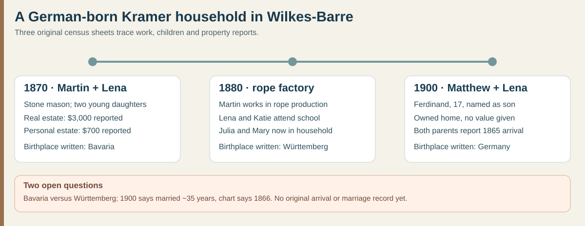

# Martin/Matthew Kramer: three original census snapshots

**A firmer paternal migration clue:** the [original 1900 Wilkes-Barre census](../sources/records/kramer-matthew-lena-census-1900.jpg) calls **Matthew Kramer** and wife **Lena** Germany-born, reports **1865** as each person's U.S. arrival year, and names their son **Ferdinand**, born in Pennsylvania in December 1882. The arrival year is a census report, **not a passenger manifest**. It places a German-born father directly in Justin's paternal line without relying on the chart's still unproved **Bernhard Kramer**.

| Record | Family and work | Assets or schooling |
| --- | --- | --- |
| **1 June 1870**, Wilkes-Barre Ward 3, p. 44, lines 26–29 | [Original sheet](../sources/records/kramer-martin-lena-census-1870.jpg): **Martin Cramer**, 30, **stone mason**; **Lena**, 26; children **Catherine**, 3, and **Lena**, recorded as an infant. Both adults' birthplaces are written **Bavaria**. | Martin reported **$3,000 real estate** and **$700 personal estate**. These are census valuations, before any debts, not a complete net worth. |
| **9 June 1880**, Wilkes-Barre Ward 12, p. 33A, lines 28–34 | [Original sheet](../sources/records/kramer-martin-lena-census-1880.jpg): **Martin Cramer**, 40, **working in a rope factory**; wife **Lena**, 35; daughters **Lena, Katie, Julia, Mary** and a six-year-old son whose name the index reads **Marx**. Martin's birthplace is written **Württemberg**; Lena's is **Germany**. | Lena and Katie are marked **at school**. No property or wage amount appears in this census schedule. |
| **1900**, Wilkes-Barre Ward 12, ED 173, sheet 5A, lines 34–41 | [Original sheet](../sources/records/kramer-matthew-lena-census-1900.jpg): **Matthew Kramer**, 59, and **Lena**, 56, with **Julia E., Mary K., Matthew, Ferdinand, Louis and William F.** Both parents report Germany birth and **1865** U.S. arrival. Matthew and young Matthew and Ferdinand are **day laborers**; Julia works in a **book-bindery**, Louis drives a wagon, and William attends school. | The home is marked **owned free of mortgage**, with **no value** supplied. Lena reports **11 children born, 9 living**; this sheet names only the six still at home. |

**Why these appear to be one line:** Martin/Matthew and Lena recur in Wilkes-Barre at fitting ages. The 1880 daughters **Julia** and **Mary** recur in 1900, and 1880 rope-factory work matches later city-directory rope work for a Matthias Kramer. The 1900 Ferdinand is directly named as Matthew's son; his [1951 certificate](../sources/records/ferdinand-kramer-1882-death-certificate-1951.jpg) independently calls his father **Matthew**. The 1870-to-1900 Martin/Matthew identification is **strong, not final**, until a parent-naming death record or another contemporary bridge resolves name differences.

**Conflicts to keep:** the 1870 sheet says **Bavaria** for Martin, the 1880 sheet says **Württemberg**, and 1900 says only **Germany**. Do not place a German hometown on the map. The older daughters' **names and ages** also fail to align neatly between 1870 and 1880: Catherine/Lena become Lena/Katie. The 1900 reported **35 years married** points roughly to **1865**, while the inherited chart gives an **1866** Wilkes-Barre wedding; neither is the original marriage return. Lena's surname **Disque** appears in the chart and later derivative family sources, not on these census sheets; Ferdinand's 1951 certificate instead calls his mother **“Matilda Dasque.”**

**What was happening around them:** a [German History in Documents and Images overview](https://germanhistorydocs.org/en/from-vormaerz-to-prussian-dominance-1815-1866/introduction) describes a German emigration wave beginning in **1864**. Matthew and Lena's reported 1865 arrival fits that period, but no record says *why they left*, which port they used, or whether they traveled together. Martin's recorded shift from masonry in 1870 to rope work in 1880 is a personal work sequence, **not proof of financial rise or loss**. The $3,000 property report and the owned home in 1900 do not establish the same parcel or show what passed to Ferdinand.

**Next records:** an 1864–66 passenger list or naturalization file naming Martin/Matthew and Lena; their original marriage entry; Matthias Kramer's **1918 death certificate 81722**; the 1918 Martin Kramer will; and deeds for the 1870 and 1900 properties. Each could test the name, birthplace, immigration, and inheritance questions.
