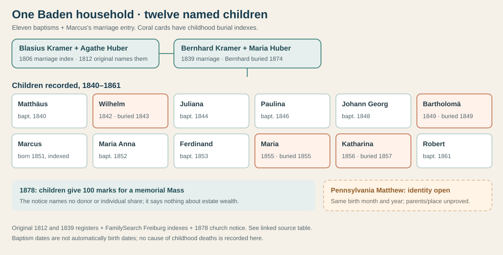
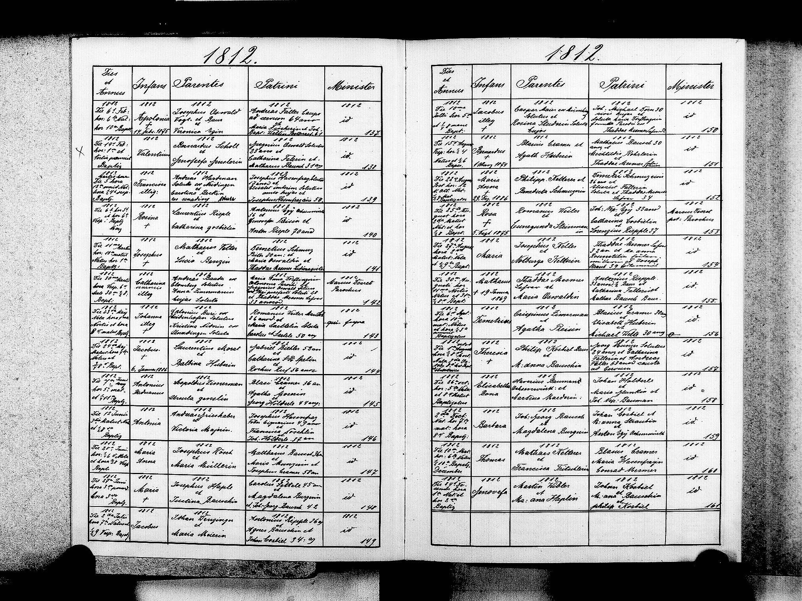

# A Kramer household in Unadingen, Baden

[Locate Unadingen on the Germany map](../maps/germany-family-places.svg) and compare its place with the separate Palatinate mill sites in the [geography atlas](../context/geography-atlas.md).

**Established in Baden, conditional for Justin:** An [original 1812 Unadingen register page](../sources/records/bernhard-kramer-baptism-1812.jpg) records **Bernardus (Bernhard) Kramer**, baptized **15 August**, with parents **Blasius Kramer and Agathe Huber**. The FamilySearch [index](https://www.familysearch.org/ark:/61903/1:1:QBGX-G5PZ?lang=en) misreads both Kramer surnames as *Garner*; the names, date and parent pair can be checked against the page itself. Blasius and Agathe also appear together in an [indexed 21 July 1806 marriage](https://www.familysearch.org/ark:/61903/1:1:QBYQ-VVZM?lang=en). Bernhard married **Maria/Marie Huber** in an [1839 Unadingen original](../sources/records/bernhard-kramer-maria-huber-marriage-1839.jpg). Their son **Matthäus** is in an [1840 original](../sources/records/unadingen-matthaeus-kramer-register-1840-candidate.jpg). These are **not yet proved** to be Justin's Pennsylvania ancestors; see the [identity test](kramer-baden-candidate.md).

## Twelve children in the church index

Each row below has a separate FamilySearch [Freiburg Catholic collection](https://www.familysearch.org/en/search/collection/2790181) entry with **Bernhard/Bernard Kramer and Maria Huber** as parents. First-column dates are **baptisms**, except Marcus's date, which comes from his marriage index. The index often displays generic “Freiburg, Baden” as place; the original 1840 book and three burial indexes specifically say **Unadingen**. The parent pair and chronology make one household strongly likely, but the other birth originals have not all been checked. The [FamilySearch tree](https://www.familysearch.org/en/tree/person/details/K4N9-VKR) independently groups twelve children; this table uses the **record entries**, not the tree's unsupported later lifespan dates.

| Indexed event | Child | Further record found |
| --- | --- | --- |
| [29 Aug 1840](https://www.familysearch.org/ark:/61903/1:1:Q18T-5K3Z?lang=en) | **Matthäus** | [Original birth entry 29](../sources/records/unadingen-matthaeus-kramer-register-1840-candidate.jpg); Pennsylvania identity **open**. |
| [6 Sep 1842](https://www.familysearch.org/ark:/61903/1:1:Q18Y-HJZM?lang=en) | **Wilhelm** | [Burial 14 May 1843](https://www.familysearch.org/ark:/61903/1:1:Q18T-NMZM?lang=en). Its estimated 1843 birth conflicts with the 1842 baptism; compare originals. |
| [8 Feb 1844](https://www.familysearch.org/ark:/61903/1:1:Q18Y-BKMM?lang=en) | **Juliana** | No independently checked later record here. |
| [28 Jun 1846](https://www.familysearch.org/ark:/61903/1:1:Q18R-L42M?lang=en) | **Paulina** | [1876 marriage index](https://www.familysearch.org/ark:/61903/1:1:Q1KS-MPMM?lang=en) names Joh. Georg Hauser. |
| [16 Apr 1848](https://www.familysearch.org/ark:/61903/1:1:Q185-J82M?lang=en) | **Johann Georg** | [1875 marriage index](https://www.familysearch.org/ark:/61903/1:1:Q1K3-MRW2?lang=en) names Maria Weh. |
| [3 Aug 1849](https://www.familysearch.org/ark:/61903/1:1:Q185-VH6Z?lang=en) | **Bartholomä** | [Burial 24 Sep 1849](https://www.familysearch.org/ark:/61903/1:1:WFD5-5T6Z?lang=en). |
| [30 Mar 1851, marriage-index birth date](https://www.familysearch.org/ark:/61903/1:1:Q1K7-NYN2?lang=en) | **Marcus** | [1876 marriage index](https://www.familysearch.org/ark:/61903/1:1:Q1K7-NYN2?lang=en) names Jakobine Wintermantel; baptism still to locate. |
| [17 Jul 1852](https://www.familysearch.org/ark:/61903/1:1:Q18R-8DT2?lang=en) | **Maria Anna** | [1876 marriage index](https://www.familysearch.org/ark:/61903/1:1:Q1K7-P7PZ?lang=en) names Michael Müller. |
| [9 Oct 1853](https://www.familysearch.org/ark:/61903/1:1:Q18T-N2T2?lang=en) | **Ferdinand** | German son born 1853. **Different** from Pennsylvania Ferdinand (c. 1882), Ferdinand Louis (1913), and Fred / Ferdinand Francis (1939). |
| [25 Mar 1855](https://www.familysearch.org/ark:/61903/1:1:Q18R-8Z3Z?lang=en) | **Maria** | [Burial 1 Sep 1855](https://www.familysearch.org/ark:/61903/1:1:WFDP-4G6Z?lang=en). Distinct from sister Maria Anna, who married in 1876. |
| [24 Nov 1856](https://www.familysearch.org/ark:/61903/1:1:Q18T-2Q2M?lang=en) | **Katharina** | [Burial 9 Jan 1857](https://www.familysearch.org/ark:/61903/1:1:WFDP-N7PZ?lang=en). |
| [31 May 1861](https://www.familysearch.org/ark:/61903/1:1:Q18T-XD2M?lang=en) | **Robert** | No independently checked later record here. |

The list contains **eleven baptism indexes and Marcus's parent-naming marriage entry**, so “twelve named children” is stronger than “twelve baptisms.” Four children have indexed burials before their second birthdays. The indexes provide **no causes of death**. Life in this household included those losses; we should not assign a particular disease or claim the family was poor from them.

## Three generations, with a stopping point

- **Bernhard's parents:** The [1812 original](../sources/records/bernhard-kramer-baptism-1812.jpg) directly names Blasius and Agathe. A [1776 baptism index](https://www.familysearch.org/ark:/61903/1:1:QBGX-31MM?lang=en) for **Blasius Cromer** names **Johann Georg Cromer and Agatha Dur** as parents. Their spelling varies from the later Kramer/Dury tree. The indexed person is an earlier candidate because of name, place and age, but its **original has not been inspected**; do not extend the proven line above Blasius yet.
- **The parents' later years:** An [indexed Bernhard burial](https://www.familysearch.org/ark:/61903/1:1:WFDG-3LT2?lang=en) says **1 March 1874**, Unadingen, age **62**, spouse **Maria Huber**. Place, spouse and age fit the 1812 child and 1839 groom. An [indexed Maria Huber burial](https://www.familysearch.org/ark:/61903/1:1:WFD2-GHPZ?lang=en) says **10 September 1875**, Unadingen, age **59**, but **does not name a spouse**; this is a strong match, not a fully resolved identity. Both originals require a FamilySearch center or affiliate library. The date is a **burial**, not an asserted death date.
- **A rare personal act:** In [1878 the archdiocesan bulletin](../sources/records/bernhard-kramer-huber-unadingen-memorial-1878.md) credited their **unnamed children** with giving **100 marks to the Unadingen church fund** for a yearly memorial Mass for their parents. [Read the German line beside its translation](../sources/records/bernhard-kramer-huber-unadingen-memorial-1878.md#what-the-notice-says). The notice marks **Bernhard**, but not explicitly Maria, as deceased. It shows the children's connection to the local parish, while giving **no child names, shares of the gift, estate value or evidence that Pennsylvania Matthäus contributed**.

The Freiburg [church-book digitization project](https://www.ebfr.de/archivblog/detail/nachricht/id/243551-fragen-und-antworten-zum-digitalisierungsprojekt-der-kirchenbuecher-in-der-erzdioezese-freiburg/?cb-id=12327217) may eventually make the pre-1810 originals easier to inspect. The [state archive's Unadingen duplicate catalog](https://data.matricula-online.eu/de/deutschland/baden_wuerttemberg/bw-8670/) begins in **1810**. The next decisive record for Justin remains **Pennsylvania Matthias/Matthew Kramer's 1918 death certificate or an original marriage/naturalization document** naming his German parents or town.

**A place you can still see:** [Rauenstein's 2020 photograph](https://commons.wikimedia.org/wiki/File:Unadingen,_Kirche_St._Georg.jpg) shows Unadingen's St. Georg church. The [village's own history](https://unadingen.de/kirche/) dates the tower roughly to the **1500s**, says the nave was rebuilt in the **1930s**, and describes older bells. Thus the image shows a surviving element of the village's church setting, **not an 1800s view** or proof of where any Kramer sat or stood. Photograph: Rauenstein, [CC BY-SA 3.0](https://creativecommons.org/licenses/by-sa/3.0/), unmodified.

