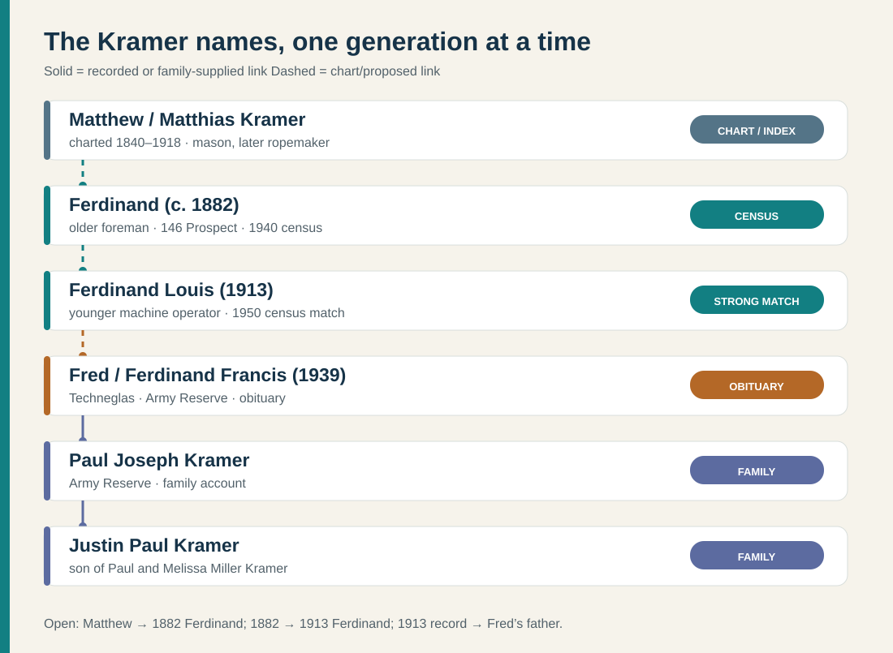
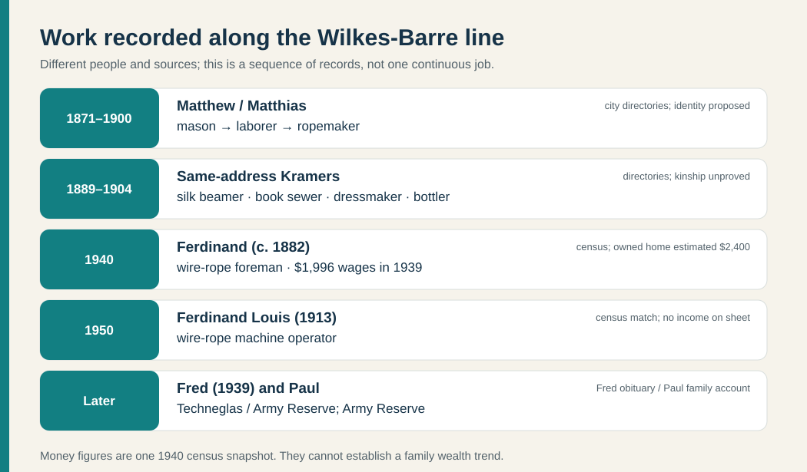
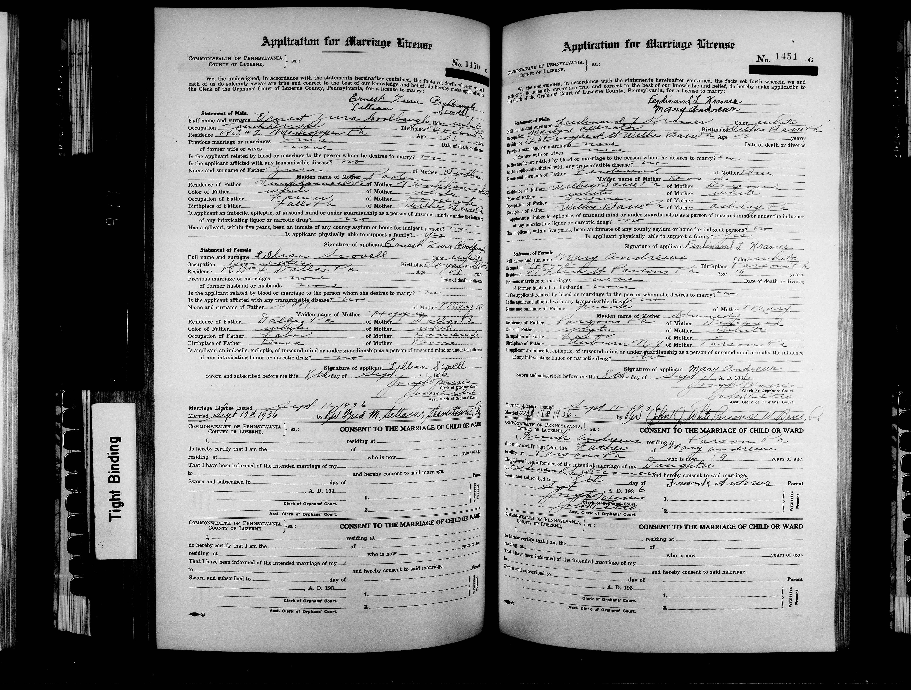
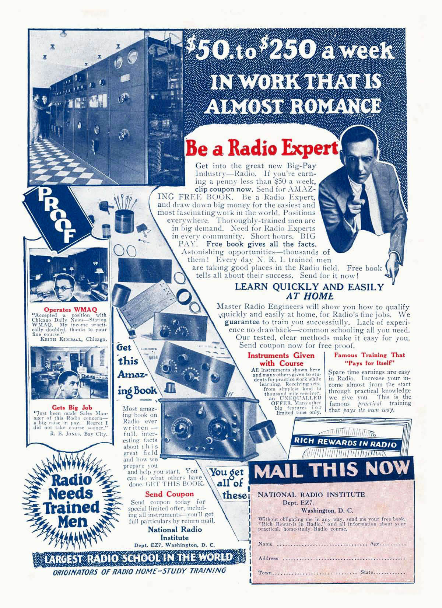
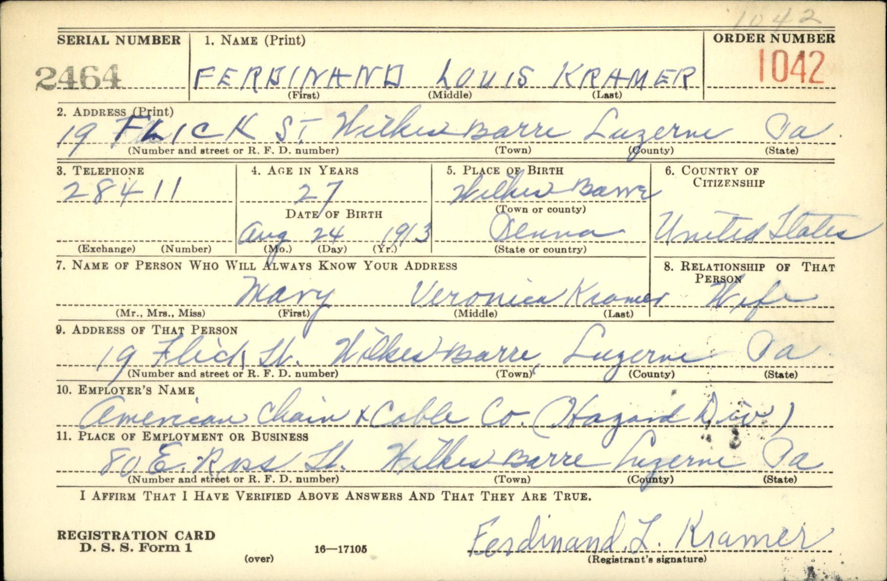

# Kramer: the Wilkes-Barre line

[See the paternal family storyboard](../context/family-storyboards.md#justins-paternal-lines) for Kramer and Cordaro work, asset clues and schooling by generation beside short source-linked scenes.

The [Unadingen household diagram and source table](kramer-unadingen-household.md) show a Baden Kramer family with twelve indexed children. Their son Matthäus shares the Pennsylvania Matthew's reported August 1840 birth month, but an American parent or birthplace record is still needed to join the two men.

## Working lineage

[Open the dated record-image gallery](../sources/records/README.md) for the **1870, 1880 and 1900 original Kramer censuses**, Emil's signed draft card, two marriage applications, the older Ferdinand's death certificate, two obituaries, and an identified portrait of Hilda.

**Name key:** **Ferdinand (c. 1882)** = older wire-rope foreman; **Ferdinand Louis (1913)** = younger wire-rope machine operator and Fred's father; **Fred (1939)** = Ferdinand Francis Kramer. These years identify chart/obituary people; they are not official “Sr./Jr./III” suffixes. [Family chart](../research/chart-transcription.md) · [Fred's obituary](https://www.legacy.com/person/ferdinand-francis-kramer-%28fred%29-52588560) · [saved 1940 census](../sources/records/ferdinand-kramer-household-census-1940.jpg) · [1950 census](https://1950census.archives.gov/iiif/2/1950census%2F43290879-Pennsylvania%2F43290879-Pennsylvania-135713%2F43290879-Pennsylvania-135713-0005.jpg/full/full/0/default.jpg).

The [original 1900 census household](../sources/records/kramer-matthew-lena-census-1900.jpg) names Ferdinand as **Matthew and Lena Kramer's son**. Both parents reported birth in **Germany** and **1865** arrival in the United States; the arrival year still needs a passenger list. The [original 1870 and 1880 sheets](kramer-martin-migration.md) trace a strongly matching **Martin and Lena Cramer** household in Wilkes-Barre, though the Martin/Matthew name and German birthplace details conflict. An [1839 Baden marriage](../sources/records/bernhard-kramer-maria-huber-marriage-1839.jpg) and [1840 birth entry](kramer-baden-candidate.md) join Bernhard Kramer and **Maria/Marie Huber** to son Matthäus; an [1878 Unadingen church notice](../sources/records/bernhard-kramer-huber-unadingen-memorial-1878.jpg) independently repeats the couple. No Pennsylvania record yet joins their child to this household; the inherited chart names **Mary Horner** instead. The [original 1930 census sheet](https://www.familysearch.org/ark:/61903/3:1:33S7-9RCJ-Q7S?view=index&personArk=%2Fark%3A%2F61903%2F1%3A1%3AXH7C-PL7&action=view&lang=en) then places 16-year-old Ferdinand L. with parents Ferdinand and Rose. Fred's [obituary](https://www.legacy.com/person/ferdinand-francis-kramer-%28fred%29-52588560) names Ferdinand Louis and Mary Andrews as his parents; a matching [1950 household](https://1950census.archives.gov/iiif/2/1950census%2F43290879-Pennsylvania%2F43290879-Pennsylvania-135713%2F43290879-Pennsylvania-135713-0005.jpg/full/full/0/default.jpg) records their son as 11 rather than the 10 implied by Fred's July 1939 birth.

## People and work

This is a record-by-record work sequence, not a claim that occupations or wealth passed continuously between generations. The 1939 wages come from **two different households**; the older father's home value and younger son's rent are different measures. [Directory extracts](https://pagenweb.org/~luzerne/towns/donnacd.htm) · [older Ferdinand's 1940 census](https://catalog.archives.gov/medialz/census-1940/T627/PA/m-t0627-03563/m-t0627-03563-00103.jpg) · [younger Ferdinand's 1940 census](../sources/records/ferdinand-mary-kramer-census-1940.jpg) · [1950 census](https://1950census.archives.gov/iiif/2/1950census%2F43290879-Pennsylvania%2F43290879-Pennsylvania-135713%2F43290879-Pennsylvania-135713-0005.jpg/full/full/0/default.jpg) · [Fred's obituary](https://www.legacy.com/person/ferdinand-francis-kramer-%28fred%29-52588560) · family account.

- **Martin/Matthew/Matthias: a stronger, still testable identity.** The [1870 Martin Cramer original](../sources/records/kramer-martin-lena-census-1870.jpg) records a **stone mason**, wife Lena, two children, **$3,000 real estate** and **$700 personal estate**. The [1880 Martin household](../sources/records/kramer-martin-lena-census-1880.jpg) places him in a **rope factory** with Lena, Julia and Mary among the children. The [1900 Matthew household](../sources/records/kramer-matthew-lena-census-1900.jpg) retains Lena, Julia and Mary and adds Ferdinand. The matching city, ages and family group make the Martin/Matthew identification strong, but the 1870/1880 daughters' names and Martin's Bavaria/Württemberg birthplace disagree. The chart's **1866 marriage** also conflicts with both adults' **1865** reported arrival and approximately **1865** marriage duration in 1900. [Short visual record trail](kramer-martin-migration.md).
- **The 1900 sibling snapshot.** The original, Wilkes-Barre Ward 12, ED 173, sheet 5A, names **Matthew, 59**, wife **Lena, 56**, and children **Julia E., 24; Mary K., 21; Matthew, 19; Ferdinand, 17; Louis, 14; William F., 12**. Lena reported **11 births and nine living children**; six lived at home. An [1880-to-1900 sibling reconstruction](kramer-eleven-children.md) shows the three probable older children and the unresolved 1870 age/name conflict. The 1900 sheet gives Matthew **August 1840** birth, independently matching the month and year of the [Unadingen candidate](kramer-baden-candidate.md), though no identity bridge proves that they were one man. Pennsylvania's [1918 death index](https://www.phmc.state.pa.us/bah/dam/rg/di/r11_090_DeathIndexes/Death_1918/D-18%20K-L.pdf) lists **Matthias Kramer**, Wilkes-Barre, **15 July**, certificate **81722**; the original certificate is needed before equating the indexed death with the 1900 Matthew.
- **Work around the Susquehanna Street address.** The [1898 directory, page 280](https://pagenweb.org/~luzerne/towns/donnacd.htm) lists **Matthias** as a ropemaker and householder at **22 Susquehanna**; **Marcus G.** and **Martin** boarded there and also made rope. **Julia** boarded there and sewed books at 54 W. Market; **Mary** boarded there and worked as a dressmaker. In [1900, page 140](https://pagenweb.org/~luzerne/towns/donnacd.htm), Matthias was a ropemaker and householder at **17 Susquehanna**, with Julia (book binder), Martin (laborer), and Mary C. at the same address. These are listings from a volunteer transcription; the shared address suggests a working household, but it does not prove kinship, wages, or why the address number changed.
- **More work at the same address.** The [1889 directory, page 221](https://pagenweb.org/~luzerne/towns/donnacd.htm) lists **Kate Kramer**, a silk-mill *beamer*, boarding at 22 Susquehanna, with **Lenta Kramer** boarding and **Martin Kramer** listed as a laborer and householder there. The [1904 directory, page 228](https://pagenweb.org/~luzerne/towns/donnacd.htm) lists **William F. Kramer**, a bottler for Wilkes-Barre Bottling Works, boarding at 17 Susquehanna; Martin and **Martin Jr.** are listed there as laborers. The “Jr.” label identifies two Martins in that directory, but their relationship to Matthew/Matthias or Ferdinand (c. 1882) still needs a household record. The directory gives Kate's job, not her age or employer's name.
- **Ferdinand (c. 1882), the older foreman.** A 1904 [directory](https://pagenweb.org/~luzerne/towns/donnacd.htm) lists Ferdinand Kramer, laborer, boarding at 17 Susquehanna alongside other Kramers; a 1914 directory lists a Ferdinand Kramer, laborer and householder at 146 Prospect. A [1948 telephone directory](https://westpittstonhistory.org/wp-content/uploads/2021/08/1948-Bell-Telephone-Directory-Pittston-_-Nearby-Points.pdf) again lists Ferdinand Kramer at 146 Prospect. His [original 1951 death certificate](../sources/records/ferdinand-kramer-1882-death-certificate-1951.jpg), file **54227**, gives **5 June 1951** in Mahoning Township, age **68**, a Wilkes-Barre birth, usual home **146 Prospect**, occupation **retired foreman in wire rope**, father **Matthew Kramer**, and mother **“Matilda Dasque.”** The shared address, age, occupation and index file link this certificate to the 1940/1950 older Ferdinand. Its attachment to **Ferdinand Louis (1913)** in FamilySearch is erroneous. “Matilda Dasque” conflicts with the chart's **Magdalena Disque** and the 1900 census **Lena**; compare the original marriage/death records before deciding whether these are variants for one woman.
- **The older Ferdinand's block across time.** A [1910 Sanborn map, volume 2, plate 34](../sources/records/sanborn-wilkes-barre-prospect-1910-plate34.jpg) shows **144 Prospect** followed by **150–152**, without a marked 146 building between them. A [1950 revision of plate 34](../sources/records/sanborn-wilkes-barre-prospect-1950-plate34.jpg) shows a **two story dwelling numbered 146** and labels a rear structure **“R. of 146 Prospect.”** The [paired readable details and source note](../context/family-home-photo-atlas.md#a-street-before-the-kramer-house-number-appears) show the change. The first map predates the 1914 directory sighting; neither map dates construction or proves the pictured modern house is identical.
- **Ferdinand (c. 1882) in 1950.** The original [1950 census, ED 80-71, sheet 13, lines 22–24](https://1950census.archives.gov/iiif/2/1950census%2F43290879-Pennsylvania%2F43290879-Pennsylvania-135659%2F43290879-Pennsylvania-135659-0014.jpg/full/full/0/default.jpg) lists Ferdinand Kramer, 67, widowed, at house number **146**, with son-in-law **Joseph Wolosz**, 36, and daughter **Hilda**, 28. Hilda's obituary independently names the older Ferdinand as her father and Joseph as her husband. Joseph was a **timekeeper in a garment factory**; Ferdinand was recorded as not working that week. The street is not clear on this sheet, but the 1948 telephone book gives Ferdinand at **146 Prospect**. His age and household fit the chart's elder Ferdinand; the census gives neither his middle initial nor a son named Ferdinand, and does not itself establish that he was Ferdinand Louis (1913)'s father.
- **Ferdinand (c. 1882) in 1940.** The original [1940 census, ED 40-311, sheet 11B, lines 44–46](../sources/records/ferdinand-kramer-household-census-1940.jpg) places widowed **Ferdinand Kramer, 57**, at **146 Prospect Street**, with a son aged 24 and **Hilda, 18**. The son's handwritten name is hard to read, but [Emil Carl Kramer's signed 1940 draft card](https://www.familysearch.org/ark:/61903/3:1:3Q9M-CSW4-4QGH-W?view=index&personArk=%2Fark%3A%2F61903%2F1%3A1%3AQ2SF-63JK&action=view&lang=en) independently gives the same address, age and father; he is a strong identification. Ferdinand reported owning the home, valued at **$2,400**, and living there in 1935. He had completed **eighth grade** and worked as a **wire-rope foreman**: **52 weeks and $1,996 in 1939 wages**. The son worked as a wire-rope **winder**, with **52 weeks and $1,234**. Hilda had completed **three years of high school** and was attending school on 11 April, consistent with her reported G.A.R. graduation that year. The [1940 Pennsylvania home-value median](../context/housing-and-work-1940.md) offers broad context; his home estimate is not net worth.
- **The family in 1930.** The [original census, ED 40-250, sheet 6B, lines 93–97](https://www.familysearch.org/ark:/61903/3:1:33S7-9RCJ-Q7S?view=index&personArk=%2Fark%3A%2F61903%2F1%3A1%3AXH7C-PL7&action=view&lang=en) lists **Ferdinand, 47; Rose A., 47; Ferdinand L., 16; Emil C., 14; and Hilda M., 8**. This directly establishes the two sons as brothers and their father as the older Ferdinand. A different [sheet 2B household](https://archive.org/details/fifteenthcensus00reel2073/page/n675/mode/1up) was previously identified at house number 146 and assigned a $7,000 home value. Street labels and repeated house numbers across sheets need reconciliation; that other household's value is **not** a Kramer asset.
- **The family in 1920, with Rose's parents.** The [original census sheet 8A](https://www.familysearch.org/ark:/61903/3:1:33SQ-GRFQ-J6P?view=index&lang=en), lines 49–50, has Ferdinand as household head and Rose A. as wife. [Sheet 8B](https://www.familysearch.org/ark:/61903/3:1:33S7-9RFQ-J7P?view=index&personArk=%2Fark%3A%2F61903%2F1%3A1%3AMFBB-JCW&action=view&lang=en) continues with **Amiel and Hildegard Bosch**, explicitly *father-in-law* and *mother-in-law*, then sons **Ferdinand L., 6**, and **Amiel C., 4** (the later Emil Carl). The Bosch couple reported birth in **Baden** and immigration around **1880**; their original arrival records and Hildegard's Greener maiden name still need proof. Emil's 1941 marriage application explicitly names Rose **Bosch**, tying the pages together. See the [Bosch diagram](other-paternal-lines.md).
- **Ferdinand Louis (1913), the younger generation.** Pennsylvania's [1913 birth index, printed page 2,460](https://www.pa.gov/content/dam/copapwp-pagov/en/phmc/documents/archives/research-online/documents/1913-K.PDF#page=323) records **Ferdinand Kramer**, born **24 August 1913** in Wilkes-Barre, mother **“Bosch R”**, file **132258**. His [1976 obituary clipping](../sources/records/ferdinand-louis-kramer-obituary-1976.jpg) repeats that date, names brother Emil and sister Hilda, and calls Mary Andrews his wife and Fred and Paul his sons. It says he graduated **G.A.R. High School and the Washington, D.C.-based National Radio Institute**, worked **over 44 years for American Chain & Cable**, then at **Bridon Industries in Exeter**, retiring in **1975**. These are obituary reports; no NRI diploma, completion year, personal project or reason for enrolling has yet been found. [What the NRI sources actually show](../context/education-across-generations.md#a-radio-lesson-by-mail) and [the family-home photo atlas](../context/family-home-photo-atlas.md) provide context.

  **A couple starting out, 1936–40.** Ferdinand Louis and Mary Andrews [signed their Luzerne County marriage application](../sources/records/ferdinand-louis-kramer-mary-andrews-marriage-1936.jpg) in September 1936. He called himself a **machinist apprentice**; she lived at **71 Flick Street in Parsons**, listed “home” as her occupation, and needed her father **Frank Andrews's written consent** because she was 19. They married **19 September**. The form names their parents: **Ferdinand Kramer and Rose Bosch** (Rose marked deceased), and **Frank Andrews and Mary Kennedy**. This directly documents another family generation on Mary's side. It does not say when Ferdinand attended NRI or why he chose radio study.

  

  The [1940 census first sheet](../sources/records/ferdinand-mary-kramer-census-1940.jpg) and [continuation](../sources/records/ferdinand-mary-kramer-census-1940-continuation.jpg) place them at **19 Flick Street** with a son Ferdinand recorded as **nine months old**. They reported **$5 monthly rent** and Ferdinand's roughly **$2,000 wages for 1939**, after 52 weeks worked. This is a snapshot of income and housing costs, not household wealth. The enumerator labeled **Rita Andrews, 17**, “daughter” after the infant. The [original 1930 census](../sources/records/frank-andrews-children-census-1930.jpg) settles the relationship: **Mary and Rita were both daughters of Frank Andrews**, so Rita was Mary's sister. Frank and six children had lived at **71 Flick Street**; the [Andrews–Kennedy household guide](andrews-kennedy.md) shows both addresses, siblings and the reported 1930 house value. The [MyHeritage index](https://www.myheritage.com/research/record-10053-190110551/ferinand-kromer-in-1940-united-states-federal-census) incorrectly gives the infant “0M.”

  

  A [1926 institute advertisement](https://commons.wikimedia.org/wiki/File:Amazing_Stories_v01_n01_front_cover_National_Radio_Institute.jpg) invited readers to mail a coupon for radio lessons **at home** and showed practice instruments. It predates Ferdinand Louis's **undated** study and illustrates the training model and period sales pitch, not his actual curriculum, earnings or a visit to Washington. The [education guide](../context/education-across-generations.md#a-radio-lesson-by-mail) gives the image credit and caveat.
- **Ferdinand Louis (1913) and Mary in 1950.** The original [1950 census, ED 80-125, sheet 4, lines 25–29](https://1950census.archives.gov/iiif/2/1950census%2F43290879-Pennsylvania%2F43290879-Pennsylvania-135713%2F43290879-Pennsylvania-135713-0005.jpg/full/full/0/default.jpg) lists Ferdinand, 36, working as a **machine operator at a wire-rope works**. Mary's row, age 33, names **machine operator in a dress factory** in its occupation fields, but marks her **keeping house** during the census week; her sampled response records no 1949 wages. Her factory work may have been earlier or entered inconsistently, so two current wages cannot be assumed. Their sons Fred / Ferdinand Francis (recorded 11) and Paul (5) were at home. **Frank Andrews**, 62, appears as Ferdinand's father-in-law, making Andrews Mary's birth surname as recorded by this census. Mary's sampled answers say she **completed seventh grade** and had borne **four children** by 1950. The two other children are not identified by this record; it does not prove that the 1943 Mary M. Kramer was one of them. The sheet does not establish household income, property ownership, or wealth.

  **A signed work-and-home snapshot, about 1940.** Ferdinand Louis's [own draft card](../sources/records/ferdinand-louis-kramer-draft-registration-1940.jpg) places him and **Mary Veronica Kramer** at **19 Flick Street** and names **American Chain & Cable Co. (Hazard Division)** as employer, with the worksite on East Ross Street. This is firmer evidence for his employer than the later obituary. A [1948 local telephone directory](https://westpittstonhistory.org/wp-content/uploads/2021/08/1948-Bell-Telephone-Directory-Pittston-_-Nearby-Points.pdf) lists **Hazard Wire Rope Co. at 81 E. Ross**, independently identifying the industrial site. A [1952 Hazard product advertisement](https://illinoismininginstitute.org/wp-content/uploads/proceedings/1952-imi.pdf) and [Cornell's circa-1961 photograph of its rail siding](https://www.flickr.com/photos/kheelcenter/40225302032) show the kind of rope operation around him; neither identifies Ferdinand or his precise task. His [1976 obituary](../sources/records/ferdinand-louis-kramer-obituary-1976.jpg) again names **19 Flick as home**, but the records do not establish uninterrupted residence or whether today's building is the same one. The [home photo atlas](../context/family-home-photo-atlas.md) links a current view. His card records **draft registration, not military service**, and says nothing about his National Radio Institute enrollment or any radio equipment he built.

  
- **Emil Carl Kramer (1915–2004), Ferdinand Louis's brother.** The 1930 census names him in the family home. His [signed 1940 draft card](../sources/records/emil-carl-kramer-draft-registration-1940.jpg) identifies father Ferdinand, **146 Prospect Street**, and employer **American Chain & Cable Co.** His [original marriage application](../sources/records/emil-kramer-victoria-giampietro-marriage-1941.jpg) calls him a **strander**, names parents Ferdinand and Rose Bosch, and records marriage to **Victoria Giampietro on 12 February 1941**. The [Army enlistment index](https://www.familysearch.org/ark:/61903/1:1:K8TZ-8YY?lang=en) records entry at Wilkes-Barre on **27 July 1943**, as a selectee/private. A [2004 obituary clipping](../sources/records/emil-carl-kramer-obituary-2004.jpg) says he served in the **Middle Eastern Theater**, received a **Purple Heart** and “**three Bronze Stars**,” and retired as an **ACCO machinist after 36 years**. This substantially supports the family's wartime and machinist account. The obituary does **not** identify his unit, award dates, wounds, or whether “Bronze Stars” means medals or campaign/service stars; verify with his discharge or award record. Hilda's [2020 obituary](https://www.legacy.com/us/obituaries/citizensvoice/name/hilda-wolosz-obituary?id=7822560) calls a brother **Paul**, still to reconcile with Emil.
- **Which rope company?** Emil's 1940 card directly names **American Chain & Cable**; the [2004 obituary](../sources/records/emil-carl-kramer-obituary-2004.jpg) says he was a machinist there for 36 years. Ferdinand Louis's [1976 obituary](../sources/records/ferdinand-louis-kramer-obituary-1976.jpg) independently reports **over 44 years at ACCO** and a final job at **Bridon Industries in Exeter**. The older Ferdinand's census and death certificate say **wire rope**, but no employer; his ACCO connection remains unproved. A [government industry study](https://publications.gc.ca/collections/collection_2019/isde-ised/RG54-1-4-eng.pdf) dates Bridon's acquisition of ACCO rope assets to **1972**, consistent with the younger Ferdinand's reported late-career change.
- **Ferdinand (c. 1882) and Rose Bosch Kramer.** Their daughter Hilda M. Kramer Wolosz's [2020 obituary](https://www.legacy.com/us/obituaries/citizensvoice/name/hilda-wolosz-obituary?id=7822560) names them as parents and Ferdinand Louis (1913) and Paul as her brothers. G.A.R.'s [1940 senior yearbook, page 21](https://www.e-yearbook.com/yearbooks/G_A_R_Memorial_High_School_Garchive_Yearbook/1940/Page_21.html) names **Hilda Kramer** in its **Commercial** course; the obituary reports she graduated that year and later worked for Pennsylvania Millers Mutual Insurance. The school-to-job connection is suggestive context, not a documented hiring path. The yearbook image is restricted and the site's terms bar copying; its searchable text identifies the entry. A [family-contributed portrait](../sources/family/hilda-kramer-wolosz-portrait-undated.jpg) is tagged as Hilda, with **no photograph date**; [source and attribution](../sources/records/README.md#a-person-not-just-paperwork). Her obituary's “Paul” brother remains a separate naming question.
- **A possible child, Karl, in 1910.** The [Pennsylvania death index](https://www.phmc.state.pa.us/bah/dam/rg/di/r11_090_DeathIndexes/Death_1910/D-10%20K-L.pdf#page=135) lists **Karl Kramer**, died **7 July 1910** in Wilkes-Barre, certificate **72159**. A [cemetery compilation](https://peoplelegacy.net/rose_a_rosie_bosch_kramer-7h4.5Y) lists a Karl Kramer (1910–1910) as Ferdinand (c. 1882) and Rose's child. The index confirms a death with that name, city, and year, but gives no age or parents; the family relationship is still a lead.
- **Possible death record for Rose.** The [1931 Pennsylvania index](https://www.phmc.state.pa.us/bah/dam/rg/di/r11_090_DeathIndexes/Death_1931/D-31%20K-L.pdf#page=126) lists **Rose E. Kramer**, Wilkes-Barre, **12 June 1931**, certificate **62866**. A [cemetery compilation](https://peoplelegacy.net/rose_a_rosie_bosch_kramer-7h4.5Y) gives the same date for Rose **A.** Bosch Kramer. The initials differ and the index omits relatives, so the identification awaits the certificate or obituary. See the [Bosch branch note](other-paternal-lines.md#rose-bosch-a-1931-death-record-to-test).
- **Fred / Ferdinand Francis (1939–2023).** His [obituary](https://www.legacy.com/person/ferdinand-francis-kramer-%28fred%29-52588560) reports birth in Wilkes-Barre on 8 July 1939, death on 29 July 2023, Army Reserves service, and employment at Techneglas. The [FamilySearch newspaper-obituary index](https://www.familysearch.org/ark:/61903/1:1:6L83-L29X?lang=en) makes the relationships searchable: his parents are **Ferdinand Louis Kramer** and **Mary Andrews Kramer**, and his brother is **Paul Carl Kramer**. This Paul Carl is Fred's brother, a different person from Fred's son Paul Joseph. The index transcribes the 2023 obituary, so it is a second access point to the same report rather than independent proof of earlier Kramer parent links.
- **Fred and Patricia Cordaro's 1962 marriage.** Their original Luzerne County application records marriage **22 November 1962** in West Wyoming; Fred worked in a shoe factory and Patricia as a secretary. It names Patricia's parents **Joseph Cordaro and Dina Caucci**, opening the [Cordaro–Caucci line](cordaro-passport-lead.md). View at the [county marriage archive](https://www.searchiqs.com/paluze/), Marriages book **191**, page **2785**. The record also names Fred's parents **Ferdinand L. Kramer and Mary Andrews**, independently matching the obituary.
- **Paul Joseph Kramer, Fred’s son.** Justin says Paul also served in the **U.S. Army Reserve**. His unit and service years are unknown; this is a family account, separate from the obituary evidence for Fred’s Reserve service. Justin also identifies **Melissa Miller Kramer** as his mother and Paul’s wife of about 30 years. He says she worked as a **real-estate agent in Pennsylvania in the 2000s**; her employer and exact years are unknown. [Family-supplied, 26 September 2026]

### A technical-study thread

The [1976 obituary report and Justin's family account](../context/education-across-generations.md#from-radio-study-to-engineering-and-computing) support the different study paths. The shared interest does not establish that one person's choice caused another's.

Ferdinand Louis's obituary-reported [National Radio Institute graduation](../context/education-across-generations.md#a-radio-lesson-by-mail) has an interesting later echo. Justin says his father **Paul Joseph Kramer** attended **RIT in New York around 1986** and completed an **electrical-engineering degree** there; his graduation year is unknown. Justin's brother **Alex**, also Paul's son, began a **four-year Penn State electrical-engineering bachelor's in 2014** and started an **electrical-engineering master's at Georgia Tech about two years after graduating** (roughly **2020**). Justin completed a combined **computer-science bachelor's and master's at Pitt, 2017–21**. Fred / Ferdinand Francis sits between Ferdinand Louis and Paul in the family sequence. The [four-study-path graphic](../context/education-across-generations.md#from-radio-study-to-engineering-and-computing) shows the theme; direct influence remains unproved. [Family account, 27 September 2026](../research/sources.md)
- **Possible infant sibling, 1943.** Pennsylvania's [1943 death index, printed page 1,180](https://www.phmc.state.pa.us/bah/dam/rg/di/r11_090_DeathIndexes/Death_1943/D-43%20K-L.pdf#page=131) records **Mary M. Kramer**, died **10 April 1943** in Wilkes-Barre, certificate **39407**. A [user-submitted Ancestry tree](https://www.ancestry.co.uk/genealogy/records/mary-m-kramer-24-1nqxf5k) assigns her to Ferdinand L. Kramer (1913–1976) and Mary Veronica Andrews. The death is independently indexed; **the claimed parents and sibling relationship still need the certificate**.
- **A 1918 will lead, not yet assigned.** A [Luzerne County will-book index transcription](https://pagenweb.org/~luzerne/wills/kindex.htm) lists **Martin Kramer**, Wilkes-Barre, 1918, estate 524, will book 38, page 107. The chart's Matthew/Matthias also died in 1918, while directories list a **Martin** and a **Matthias** at the same Susquehanna Street address. The index does not say whether the testator was either man. Read the will before drawing conclusions about kinship or property.

## Their setting

The directories document masonry, labor and ropemaking. They do **not** establish that Matthew or Ferdinand (c. 1882) mined coal. A separate William Kramer is listed as a miner, but no relationship is proven. The shared conversation suggests a family coal story; keep it as oral history until a census, employer, or mine record links a named ancestor. [Directory](https://pagenweb.org/~luzerne/towns/donnacd.htm).

Kate's 1889 silk-mill job places someone at the Susquehanna address in a growing regional industry. [Pennsylvania Heritage's silk history](https://paheritage.wpengine.com/article/if-looms-could-speak-story-pennsylvanias-silk-industry/) describes northeastern Pennsylvania's mills as employers of women and girls alongside coal and railroad families. That is context for the occupation, not evidence of Kate's age, pay, school attendance, or experience inside a particular mill.

What did a *beamer* do? A later [U.S. Bureau of Labor Statistics silk-industry glossary](https://fraser.stlouisfed.org/title/wages-hours-labor-manufacture-silk-rayon-goods-1931-4101/fulltext) describes the job as tending a machine that moved warp threads from drums or creels onto smaller beams for weaving. That explains the directory term; it is not a description of Kate's particular workday in 1889.

The 1972 Agnes flood reshaped Wilkes-Barre's commercial Main Street; [Wilkes University's photo walking tour](https://www.wilkes.edu/academics/library/agnes-flood-walking-tour/main-street.aspx) shows the damage and rebuilding, while a [USGS map surveyed just after the flood](https://pubs.usgs.gov/publication/ofr72119) shows its reach. This was a city backdrop for younger generations, not evidence about any person's house or school. [Compare Agnes in the family's three regions](../context/agnes-1972.md). The shared chat suggests Paul attended Coughlin High School around 1978–82; a [name-only alumni index](https://coughlinhighschool.org/alumni-list-k.html) lists **Paul Kramer, class of 1982**, but the actual yearbook page and identity have not been checked. [Education trail](../context/education-across-generations.md).

## Oral histories

**“Nine Ferdinands”:** the three charted direct-line people are Ferdinand (c. 1882), Ferdinand Louis (1913), and Fred / Ferdinand Francis (1939). The proposed direct line then reaches Matthew and Bernhard. The larger count could refer to collateral relatives; it is not established as a father-to-son sequence.

**“The Kramer surname came from Germany”:** the [original 1900 census](../sources/records/kramer-matthew-lena-census-1900.jpg) now directly identifies **Ferdinand's father Matthew Kramer** as Germany-born and reports his arrival as **1865**. The [1870/1880 Martin Cramer trail](kramer-martin-migration.md) supports an earlier Wilkes-Barre life but conflicts on **Bavaria versus Württemberg**; his exact town and ship are unproved. The chart's preceding **Bernhard Kramer/Kraemer** and Mary Horner remain unverified.

The [family-in-its-times comparison](../context/family-in-its-times.md#the-migration-questions) sets out the different evidence for a Disque departure and a possible Kramer one.
