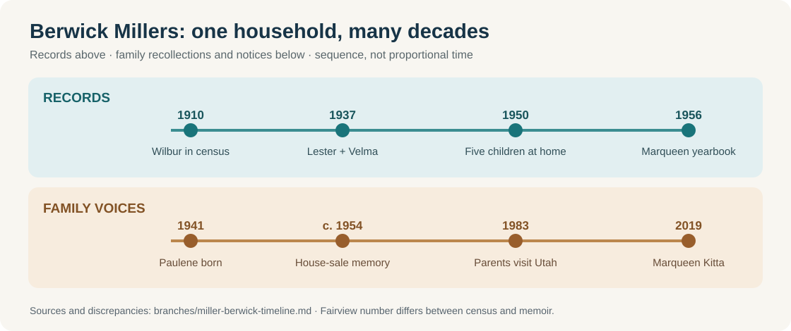

# The Berwick Millers across generations

The records place **Amos and Mary → Lester and Velma/Pearl → Marqueen** in one Berwick household by 1940. Paulene's writing adds the everyday scenes, but her later recollections and online posts are different kinds of evidence from the censuses. [Full family breakdown](miller-gower-reese.md).

| When | Small piece of the story | Basis |
| --- | --- | --- |
| **1900, likely earlier household** | [Ada A. Corderman appears with widowed mother Rosa E., siblings Ella and Emery, and maternal grandparents John and Sarah Wilson](../sources/records/ada-corderman-wilson-household-1900.jpg) in Davidson Township, Sullivan County. The census gives **October 1890** for Ada's birth; Paulene later gave **1888**. Her match to 1910 Elmeda is strong but still circumstantial. | Original census image, ED 64, sheet 2A, lines 25–31 |
| **1910–18, Reese household** | An [original 1910 census](../sources/records/elmeda-william-reese-household-1910.jpg) places **William and Elmeda Reese** with their daughter **Ruth** in Davidson Township. William's [September 1918 draft card](../sources/records/william-harrison-reese-draft-card-1918.jpg) names **Meda Reese** as his nearest relative in Muncy Valley and gives his work as a **woods laborer**. It reports a right-eye disability; registration does not prove service. | Original census, ED 131, sheet 18A, lines 12–14; original draft card |
| **1910–20** | **Wilbur C. Miller**, a previously omitted son, appears with parents **Amos and Mary** in [1910](https://www.familysearch.org/ark:/61903/1:1:MG87-BF5?lang=en), then with **Mary, Lester and three other siblings** in [1920](https://www.familysearch.org/ark:/61903/1:1:M61V-W79?lang=en). A [later memorial index](https://www.familysearch.org/ark:/61903/1:1:QVV4-SZYW?lang=en) says he died in 1923, but the exact day conflicts with the [shared tree](https://www.familysearch.org/en/tree/person/details/K8VZ-WPJ). | Census indexes; death-date lead |
| **1916** | A [Pennsylvania birth index](https://www.myheritage.com/research/record-21058-1619193/lester-miller-in-pennsylvania-birth-index) records **Lester Miller**, born in Berwick on 1 July, with mother **May Gower**. This matches Paulene's Lester and Mary Emma Gower household. | Birth index; original certificate pending |
| **1919** | Paulene recalled that **Mabel/Pearl** was born in “Muncy Vally, Lycoming County” on **31 January**. [Ada's memorial](https://www.findagrave.com/memorial/89675425) gives **12 February** as her death, 12 days later. The [Muncy regional map](../context/family-place-sequences.md) flags the county mismatch. Paulene said influenza; the memorial's bio says pneumonia. Neither diagnosis has been checked against the death certificate. | [Paulene's memoir](https://bhaven.org/paulene/life-journey) + memorial, both derivative for vital facts |
| **1937** | [Lester E. Miller and Velma P. Wilson](https://www.myheritage.com/research/record-20828-1259334/lester-e-miller-and-velma-p-wilson-in-maryland-marriages), both Berwick residents, married in **Hagerstown, Maryland, on 5 April**. Paulene said Velma Pearl Wilson was the name under which her birth mother **Mabel Reese** had been raised; the marriage index confirms the *Wilson* name, not the Reese link. | Marriage index + memoir |
| **1940** | The [census index](https://www.myheritage.com/research/record-10053-108307645/marqueen-miller-in-1940-united-states-federal-census) places **Amos, Mary, Lester, Velma, one-year-old Marqueen, and Florence Klinger** together. Its **1912 Fairview Avenue** differs from Paulene's remembered **1908**. These may be a move, renumbering or error; the original sheet is still needed. | Census index + memoir |
| **1941–mid-1950s** | Paulene says she was born in 1941; the children shared the crowded home with their grandparents. She recalls a 1954 house sale after Mary's death and pooling babysitting earnings with Marqueen to buy their parents a dinette. Those scenes and the **$1,500** sale price are **her account**, not yet a deed or estate finding. | [Paulene's memoir](https://bhaven.org/paulene/life-journey) |
| **1956** | The [Berwick High School yearbook](https://www.myheritage.com/research/record-10568-186808139/berwick-high-school?snippet=17c0f0735761bb46e39cd73c69feb7d3) gives Marqueen the nickname **“Queenie,”** a secretarial ambition and a portrait. The page says what she hoped to do, not what job she later held. | Digitized yearbook page |
| **June 1972** | Agnes damaged the Berwick area's already declining railroad and the Wise potato-chip plant. It also devastated Wilkes-Barre farther up the Susquehanna. The [side-by-side local account](../context/agnes-1972.md) shows the different effects; no Miller home or work loss is established. | Local history and oral history, not a family loss record |
| **1983–84** | A [1983 diary entry](https://bhaven.org/paulene/picking-up-the-millers) records Lester and Pearl visiting Paulene's family in Utah by bus. An [October 1984 recap](https://bhaven.org/paulene/accidents-teeth-and-a-pileup) still mentions Marqueen in Paulene's family news. | Dated journal entries, posted later |
| **1997** | A [transcription of Grace E. Reese Smith's obituary](https://www.our-royal-titled-noble-and-commoner-ancestors.com/lundahlbower/p177.htm) names **William H. and Ada A. Reese** as her parents and **Pearl Miller, Hazel Lechler and Ruth Ritter** as sisters. It is the clearest later bridge between Pearl and the Reese children; find the printed obituary and Pearl's own birth record. | Derivative transcription of a reported 22 August *Daily Item* obituary |
| **Before 31 January 1999, if Mabel's reported birth date is right** | Paulene said her brother **Paul Miller** sent their mother **Mabel/Pearl** and Paulene on an island cruise before Mabel's 80th birthday. Mabel later called it her favorite trip; the family celebrated her birthday after their return. The ship, islands and exact date are unrecorded. [More family moments](miller-gower-reese.md#small-stories-paulene-preserved). | [Paulene's memoir](https://bhaven.org/paulene/life-journey), with birthday year calculated from her stated 1919 birth |
| **7 April 2008** | The [family funeral program](https://bhaven.org/uploads/3/4/0/3/34038663/vol14sec2.pdf#page=1) gives Pearl Miller's death date, reproduces her portrait, and carries grandson Michael Beach's account of home, music and travel. It independently supports Paulene's **31 January 1919** birth date for Pearl. | Contemporary family program and tribute |
| **2019** | A [notice for Joseph Kitta](https://bhaven.org/old-headlines/joseph-kitta-passing) names his wife **Marqueen Kitta (Miller)** and calls him Paulene's brother-in-law. It connects the schoolgirl in the earlier records with her later married name. | Family-site notice |

**Open links:** get the original 1940 schedule and 1937 license; obtain Wilbur's Pennsylvania death certificate to settle **16 versus 18 October 1923**; trace Mabel's Reese-to-Wilson identity in a birth, guardianship or adoption record; and inspect the 1954 Berwick deed/estate before drawing a conclusion about inheritance.
