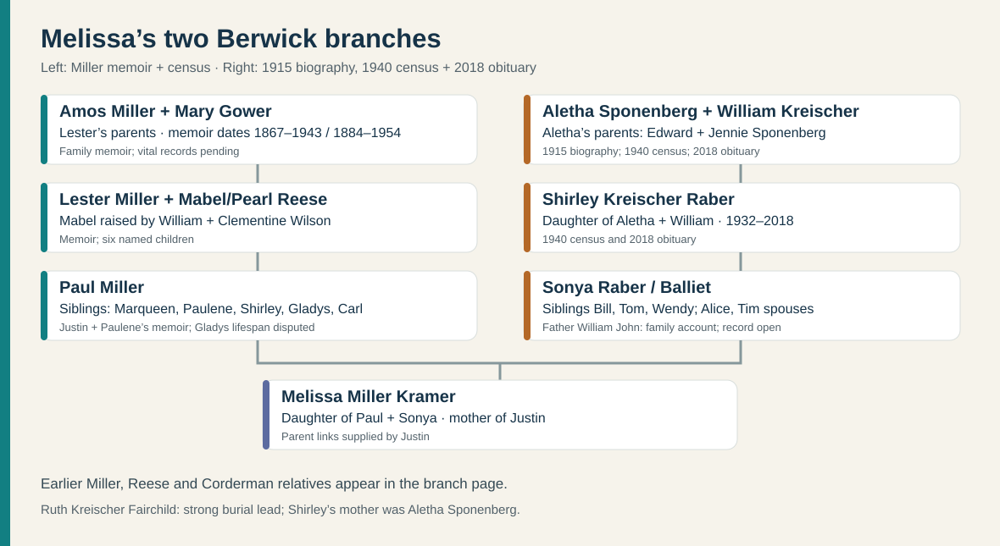

# Miller, Gower, Reese and Corderman: the Berwick household

**Source key:** Justin's account establishes that Melissa's father is **Paul Miller**. [Paulene Fay Miller Beach's first-person *Life Journey*](https://bhaven.org/paulene/life-journey) calls Paul her younger brother and gives the same unusual sibling group Justin recalled. This is a strong **family-account match**, not yet a birth-certificate chain. Her son published the undated memoir in 2024 with light spelling and punctuation edits.

| Layer | People and dates | What the evidence says |
| --- | --- | --- |
| Melissa's parents | **Paul Miller** + **Sonya Raber**; dates open | Named by Justin. Paulene's account independently names a younger brother Paul; a [derivative correspondence index](https://genpol.us/showsource.php?sourceID=S58&tree=Capet) also pairs a Paul Richard Miller with Sonya Raber, but its underlying correspondence has not been read. |
| Paul's parents | **Lester Edmond Miller** (Paulene: 1916–1998) + **Mabel Louella Reese**, raised as **Velma Pearl Wilson** (Paulene: 1919–2008) | A [1937 Maryland marriage index](https://www.myheritage.com/research/record-20828-1259334/lester-e-miller-and-velma-p-wilson-in-maryland-marriages) names **Lester E. Miller and Velma P. Wilson** of Berwick; a [1940 census index](https://www.myheritage.com/research/record-10053-108307645/marqueen-miller-in-1940-united-states-federal-census) places them with daughter Marqueen. Their marriage and household now have dated record support; Mabel's Reese birth identity still needs a direct record. |
| Lester's parents | **Amos Raphel Miller** (Paulene: 1867–1943) + **Mary Emma Gower** (Paulene: 1884–1954) | A [1910 census](https://www.familysearch.org/ark:/61903/1:1:MG87-BF5?lang=en) places **Wilbur C. Miller** with Amos and Mary; a [Pennsylvania birth index](https://www.myheritage.com/research/record-21058-1619193/lester-miller-in-pennsylvania-birth-index) names Lester's mother **May Gower**. Paulene says Amos built the Berwick home. Their five named children are Florence “Peg,” **Wilbur**, Lillian “Lilly,” Robert “Bob,” and Lester. Wilbur died young, but the exact date conflicts in derivative sources. |
| Amos's parents | **Gad Marshall Miller** (1830–1904 in family genealogy) + **Elizabeth Hess** (1836–1901 there) | An [1870 Sugarloaf Township census transcription](https://www.pa-roots.com/columbia/census/1870sugarloaftownship.html) lists Marshall, Elizabeth, and two-year-old Amos together. The [genealogy](https://genpol.us/getperson.php?personID=I22298&tree=Capet) supplies full names and dates; original vital records remain to be checked. An [1890 Union veterans schedule](https://www.familysearch.org/ark:/61903/3:1:939V-R9SW-RK?view=index&personArk=%2Fark%3A%2F61903%2F1%3A1%3AK89T-N4L&action=view&cc=1877095&lang=en) places Marshall in **Company K, 171st Pennsylvania** at **Coles Creek**, the same township; this strongly matches Amos's father. [Service story](../context/civil-war-family-lines.md). |
| Mabel's birth parents | **William Harrison Reese** (Paulene: 1882–1968) + **Ada Alamedia Corderman** (Paulene: 1888–1919) | Paulene says Ada died soon after Mabel's birth and William and Clementine Wilson raised Mabel. Influenza is her reported cause, not yet confirmed by a death certificate. |
| Mabel's raising parents | **William Harrison Wilson** + **Clementine Cornelia Pleasant** | Paulene describes them as relatives who raised Mabel under the name Pearl Wilson. This is a raising relationship, not a second biological parent pair. |

## Paul's brothers and sisters

**Marqueen, Paulene** (her own spelling; Justin recalled *Pauleen*), **Shirley, Paul, Gladys, and Carl** are the six named children in the combined family account and Paulene memoir. Their birth order and most vital dates need records. Paulene gives her own birth as **7 March 1941**; she says Carl served in Vietnam and died at **52**, but no military or death record has been checked. Justin recalls that baby **Gladus/Gladys** lived about **ten days**. Paulene instead wrote that **Gladys lived five minutes**. Even the spelling differs. A birth/death certificate, cemetery entry or family paper should settle both questions. [Memoir](https://bhaven.org/paulene/life-journey).

**Marqueen across records:** The [1940 census index](https://www.myheritage.com/research/record-10053-108307645/marqueen-miller-in-1940-united-states-federal-census) calls one-year-old Marqueen **Amos and Mary's granddaughter** and names her parents Lester and Velma in the same Berwick home. A [1956 Berwick High School yearbook page](https://www.myheritage.com/research/record-10568-186808139/berwick-high-school?snippet=17c0f0735761bb46e39cd73c69feb7d3) gives her nickname **“Queenie”** and an ambition to be a secretary; it includes a portrait, linked here rather than copied. A [2019 family-site notice for Joseph Kitta](https://bhaven.org/old-headlines/joseph-kitta-passing) identifies **Marqueen Kitta (Miller)** as his wife, matching the married surname in the [Marqueen category](https://bhaven.org/paulene/category/marqueen-kitta). The yearbook records an ambition, **not an occupation**. The census index gives **1912 Fairview Avenue**, whereas Paulene remembered **1908 Fairview Avenue**; the original schedule and address history are needed to explain the difference.

**A fifth child in the earlier household:** Paulene listed four children of Amos and Mary in her memoir, but the [1910 census](https://www.familysearch.org/ark:/61903/1:1:MG87-BF5?lang=en) names their son **Wilbur C. Miller**. In [1920](https://www.familysearch.org/ark:/61903/1:1:M61V-W79?lang=en), Wilbur appears with mother Mary and siblings **Florence, Robert, Lilly, and Lester**; Amos is not listed in that indexed household. A [shared tree](https://www.familysearch.org/en/tree/person/details/K8VZ-WPJ) expands Wilbur's name to **Wilbur Clayton** and says he died in 1923. Its death day is **18 October**, while the [Find a Grave index](https://www.familysearch.org/ark:/61903/1:1:QVV4-SZYW?lang=en) says **16 October**. The latter also misplaces Berwick's Roselawn Cemetery in Northern Ireland through place matching. His existence and parentage have census support; his full name and death day still need a Pennsylvania death certificate or contemporary notice.

## Small stories Paulene preserved

| When, in her telling | The moment | Why it matters |
| --- | --- | --- |
| **1941** | Lester and Mabel expected a boy and had chosen **Paul**. When their second daughter arrived, they adapted the name to **Paulene**; she joked that she was named after her *younger* brother Paul, who received the intended name later. She also said a doctor misspelled her name on the certificate. | Explains Paulene's spelling and the name shared with Justin's grandfather. The certificate and the doctor's part of the story have not been checked. |
| **Her birth and childhood** | Paulene said her father went ice skating while waiting for the midwife. As a small child she heard him call her “pooch,” mistook a visiting dog catcher's question as a threat to take *her*, and fled to neighbor Phema Heller. Lester also climbed into an outhouse to rescue three abandoned puppies. | These are remembered family scenes, with no independently dated record. |
| **Berwick years** | Sunday dinners brought cousins and Aunt Florence “Peg” Miller to the house; Paulene said Peg taught the children to drive a stick shift around age ten. Neighborhood children made a hideout in a Fairchild wheat field for ghost stories. | Names a close aunt and shows how the extended family and neighboring farms fit into daily life. The Fairchild farm is not yet linked to Sonya Raber's Fairchild line. |
| **About 1954–1956** | After Mary Gower Miller's 1954 death and the reported house sale, Paulene and Marqueen pooled babysitting money for their parents' first dinette set. Paulene recalled one school year in Millville around age 15, then a return to Berwick. | A personal view of the move and schooling; the deed, purchase and school years need records. |
| **1983–84** | A [1 January 1983 journal entry](https://bhaven.org/paulene/picking-up-the-millers) records Lester and Pearl arriving at the Salt Lake City bus station for a Utah visit; luggage went astray. An [October 1984 recap](https://bhaven.org/paulene/accidents-teeth-and-a-pileup) mentions Paulene's sister Marqueen among family news. | These are dated, first-person glimpses of the siblings and parents staying connected after Paulene moved west. The posts appeared online decades later. |
| **Later years** | Paulene recalled Lester's country band and trips with her mother Mabel/Pearl and sister Marqueen to Branson. | Shows the family's travel and music after the hard early Berwick years. |
| **Before Mabel's 80th birthday** | Paulene said her brother **Paul Miller**—Justin's maternal grandfather—sent **his mother Mabel/Pearl and Paulene** on an island cruise. Paulene remembered it warmly; Mabel called it her favorite trip, and the family held an 80th-birthday party when they returned. | A vivid three-generation connection in Paulene's [first-person memoir](https://bhaven.org/paulene/life-journey). Her stated 31 January 1919 birth date for Mabel places the 80th birthday in **1999**, but the sailing date, ship and islands are unnamed. The memoir says Paul *sent* them; it does not give the booking or payment details. |

The memoir scenes are paraphrased from [Paulene's *Life Journey*](https://bhaven.org/paulene/life-journey); the 1983–84 row comes from her dated journal posts. The memoir's original writing date is unknown; her son posted it in **2024**. Years inferred from her account are labeled estimates.

## What life looked like

Paulene describes a crowded house on Berwick's edge, heated by coal, with a porch water pump and an outhouse. She remembers kerosene lamps into the early 1940s, washing clothes by hand, and meals that sometimes amounted to cracker soup. Mabel cleaned and ironed for others, helped at the **Fairchild dairy across the road**, and later worked for **Grants** and **K-Mart**. Lester had drafting training, but Paulene says trembling hands limited that work; he took labor jobs and later led a **country and western band**. These are her recollections, not independently verified payroll or school records. The dairy mention does **not** identify Sonya's Fairchild ancestor. [Memoir](https://bhaven.org/paulene/life-journey).

**A possible inheritance break:** Paulene says that after Mary Gower Miller died in 1954, other heirs sold the house for **$1,500** and Lester's caregiving household received no proceeds. This is a valuable lead for the user's question about money passing between generations, but it is **one person's recollection**; no deed, estate file, title share, debts or distribution record has been examined. It cannot yet support a conclusion that a fortune was lost. [Memoir](https://bhaven.org/paulene/life-journey).

**The 1919 disruption:** Paulene says Mabel's mother Ada died of influenza when Mabel was only weeks old, after which relatives raised Mabel. The [Pennsylvania State Archives](https://www.pa.gov/agencies/phmc/pa-state-archives/research-online/research-guides/1918-influenza-epidemic) documents the epidemic's state-wide context. Ada's cause and Mabel's exact parent/guardian trail need original records. Paulene names Mabel's sisters **Ruth Ritter, Grace Smith, Hazel Lechler**, and an unnamed brother. [Memoir](https://bhaven.org/paulene/life-journey).

**A return to the Muncy region:** Paulene places Mabel's **31 January 1919** birth in “Muncy Vally, Lycoming County.” Today's [Muncy Valley is in Sullivan County](https://www.sullivancountypa.gov/municipalities/shrewsbury-township), while the Muncy area where Justin says **Melissa and her husband Paul Kramer now live** is in Lycoming County. A birth certificate is needed to settle Mabel's exact 1919 locality; the later move date is unknown. [See the mapped generational sequence](../context/family-place-sequences.md).

**Next records:** original images for the [1940 Berwick household](https://www.myheritage.com/research/record-10053-108307645/marqueen-miller-in-1940-united-states-federal-census) and [1937 Maryland marriage](https://www.myheritage.com/research/record-20828-1259334/lester-e-miller-and-velma-p-wilson-in-maryland-marriages); a 1950 household; Wilbur's death certificate; Amos and Mary's estate/deed; Pennsylvania death certificates for Ada and Gladys; Paul's birth or marriage record naming parents. These would test the memoir's address, dates and inheritance story.
