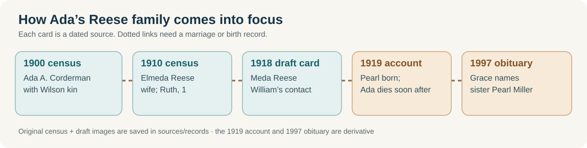
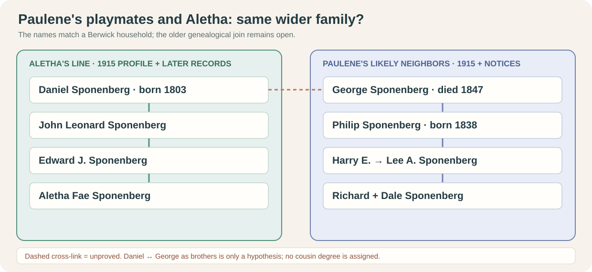
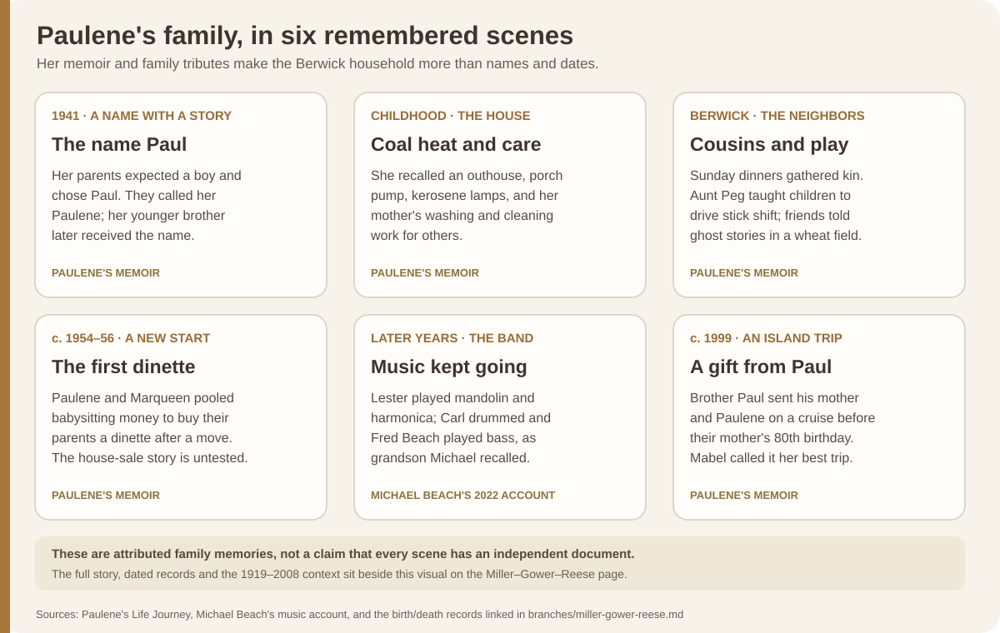

# Miller, Gower, Reese and Corderman: the Berwick household

[See the maternal family storyboard](../context/family-storyboards.md#justins-maternal-lines) for Miller and Raber work, asset clues and schooling by generation beside short source-linked scenes.

**Source key:** Justin's account establishes that Melissa's father is **Paul Miller**. [Paulene Fay Miller Beach's first-person *Life Journey*](https://bhaven.org/paulene/life-journey) calls Paul her younger brother and gives the same unusual sibling group Justin recalled. This is a strong **family-account match**, not yet a birth-certificate chain. Her son published the undated memoir in 2024 with light spelling and punctuation edits.

| Layer | People and dates | What the evidence says |
| --- | --- | --- |
| Melissa's parents | **Paul Miller** + **Sonya Raber**; dates open | Named by Justin. Paulene's account independently names a younger brother Paul; a [derivative correspondence index](https://genpol.us/showsource.php?sourceID=S58&tree=Capet) also pairs a Paul Richard Miller with Sonya Raber, but its underlying correspondence has not been read. |
| Paul's parents | **Lester Edmond Miller** (Paulene: 1916–1998) + **Mabel Louella Reese**, raised as **Velma Pearl Wilson** (Paulene: 1919–2008) | A [1937 Maryland marriage index](https://www.myheritage.com/research/record-20828-1259334/lester-e-miller-and-velma-p-wilson-in-maryland-marriages) names **Lester E. Miller and Velma P. Wilson** of Berwick; the [original 1950 census, sheets 15–16](../sources/records/README.md), places them with five children in Mary Miller's home. Carl's [Social Security application index](https://www.familysearch.org/ark:/61903/1:1:6K9G-Y87C?lang=en) explicitly names **Lester E. Miller and Velma P. Wilson** as his parents. A [1919 birth index](../sources/records/mabel-reese-pa-birth-index-1919.png) lists a matching Mabel Reese, but a direct record connecting her to the later **Wilson** name is still needed. |
| Lester's parents | **Amos Raphel Miller** (Paulene: 1867–1943) + **Mary Emma Gower** (Paulene: 1884–1954) | A [1910 census](https://www.familysearch.org/ark:/61903/1:1:MG87-BF5?lang=en) places **Wilbur C. Miller** with Amos and Mary; a [Pennsylvania birth index](https://www.myheritage.com/research/record-21058-1619193/lester-miller-in-pennsylvania-birth-index) names Lester's mother **May Gower**. Paulene says Amos built the Berwick home. Their five named children are Florence “Peg,” **Wilbur**, Lillian “Lilly,” Robert “Bob,” and Lester. Wilbur died young, but the exact date conflicts in derivative sources. |
| Amos's parents | **Gad Marshall Miller** (1830–1904 in family genealogy) + **Elizabeth Hess** (1836–1901 there) | Original [1870](../sources/records/marshall-elizabeth-miller-census-1870.jpg) and [1880](../sources/records/marshall-elizabeth-miller-census-1880.jpg) Sugarloaf censuses place Marshall, Elizabeth and Amos together; **1880 explicitly calls Amos Marshall's son**. The [genealogy](https://genpol.us/getperson.php?personID=I22298&tree=Capet) supplies full names and dates; original vital records remain to be checked. An [1890 Union veterans schedule](https://www.familysearch.org/ark:/61903/3:1:939V-R9SW-RK?view=index&personArk=%2Fark%3A%2F61903%2F1%3A1%3AK89T-N4L&action=view&cc=1877095&lang=en) places Marshall in **Company K, 171st Pennsylvania** at **Coles Creek**, also the family's 1870 post office; this strongly matches Amos's father. [Service story](../context/civil-war-family-lines.md). |
| Mabel's reported birth parents | **William Harrison Reese** (his 1918 draft card: born **12 March 1884**; Paulene: 1882–1968) + **Ada Alamedia Corderman** (1900 census: born **October 1890**; Paulene: 1888–1919) | An [original 1910 census](../sources/records/elmeda-william-reese-household-1910.jpg) puts William, wife **Elmeda**, and daughter **Ruth** in Davidson Township. [William's signed 1918 draft card](../sources/records/william-harrison-reese-draft-card-1918.jpg) names **Meda Reese** as his nearest relative in Muncy Valley; the [state birth index](../sources/records/mabel-reese-pa-birth-index-1919.png) lists **Mabel Reese**, **31 January 1919**, Lycoming County, and the [death index](../sources/records/meda-reese-pa-death-index-1919.png) records Meda's death **12 February**. A [transcription of Grace Reese Smith's 1997 obituary](https://www.our-royal-titled-noble-and-commoner-ancestors.com/lundahlbower/p177.htm) names parents **William H. and Ada A. Reese** and sister **Pearl Miller**. These strongly support Paulene's account, but the birth index's mother field is transcribed **“M. Catteman”**, not Corderman. Full birth and death certificates, and the Reese-to-Wilson identity bridge, are still needed. |
| Mabel's raising parents | **William Harrison Wilson** + **Clementine Cornelia Pleasant** | Paulene describes them as relatives who raised Mabel under the name Pearl Wilson. This is a raising relationship, not a second biological parent pair. |

## Marshall and Elizabeth's farm household, 1870–80

| Census | People and work | What it says about resources and schooling |
| --- | --- | --- |
| [1870 original](../sources/records/marshall-elizabeth-miller-census-1870.jpg) · [FamilySearch viewer](https://www.familysearch.org/ark:/61903/3:1:S3HY-DT6Q-V18?view=index&personArk=%2Fark%3A%2F61903%2F1%3AMZG8-B6P&action=view&lang=en) | **Marshall, 40, farmer**; **Elizabeth, 34, keeping house**; Clarissa, 8; Sarah, 4; **Amos, 2**; Nancy, 9 months. Post office **Coles Creek**, Sugarloaf Township. | **$600 real estate** entered for Marshall; personal-estate field blank. The schedule does not label relationships. |
| [1880 original](../sources/records/marshall-elizabeth-miller-census-1880.jpg) · [FamilySearch viewer](https://www.familysearch.org/ark:/61903/3:1:33SQ-GYBJ-9P7P?view=index&personArk=%2Fark%3A%2F61903%2F1%3AMWXT-FBL&action=view&cc=1417683&lang=en) | **Marshall, 50, farmer**; **Elizabeth, 44, keeping house**; children Sarah, 14; **Amos, 12**; Adaline, 10; Miles, 9; Jesse, 6; Minnie, 5; Murray, 1. Sugarloaf Township again. | The census has **no estate-value columns**. Amos is listed **“at home”**; his school-attendance cell appears blank. That does not establish his lifetime schooling or literacy. |

The two ages and place make **1870 Nancy** and **1880 Adaline** a likely match, consistent with the [family genealogy's “Nancy Adaline”](https://genpol.us/getperson.php?personID=I22301&tree=Capet), but neither census alone gives both names. Clarissa's absence in the 1880 household does not establish death or a move. The **$600** is a one-year nominal real-estate report, not net worth, an acreage count, or evidence that Amos inherited property. The 1880 **son** label links Amos to Marshall; Elizabeth is identified as Marshall's wife. If the farmer and the 171st Pennsylvania veteran are the same man, he had returned to Sugarloaf farming by 1870 after the recorded fever and hospital stay. [Civil War note](../context/civil-war-family-lines.md).

## Paul's brothers and sisters

**Marqueen, Paulene** (her own spelling; Justin recalled *Pauleen*), **Shirley, Paul, Gladys, and Carl** are the six named children in the combined family account and Paulene memoir. The [original 1950 census](../sources/records/README.md) names **Marqueen, Paulene, Shirley, Paul and Carl** across two sheets; Gladys does not appear there. Paulene gives her own birth as **7 March 1941**. Carl's [Social Security application/death index](https://www.familysearch.org/ark:/61903/1:1:6K9G-Y87C?lang=en) names him **Carl Eugene Miller**, born **17 February 1948** to **Lester E. Miller and Velma P. Wilson**, died **12 February 2001**. A separate [Death Index](https://www.familysearch.org/ark:/61903/1:1:J2MT-DJW?lang=en) agrees on the death day; a [grave index](https://www.familysearch.org/ark:/61903/1:1:QVK4-XMNV?lang=en) instead says **18 February**, so an original death certificate is needed. The [1998 family calendar](https://bhaven.org/uploads/3/4/0/3/34038663/vol4sec1.pdf#page=4) independently lists his **17 February** birthday and a **31 January 1981** anniversary with Julia. A [Berwick veterans' burial index](https://www.interment.net/united-states/pennsylvania/veterans-burials/records.php?page=1482) lists a matching Carl E. Miller as **U.S. Army SP4, Vietnam**; the match is very strong but the military listing itself does not name parents or duty locations. Justin recalls that baby **Gladus/Gladys** lived about **ten days**. Paulene instead wrote that **Gladys lived five minutes**. Even the spelling differs. Her birth/death records would settle that question. [Memoir](https://bhaven.org/paulene/life-journey).

**1950 at Fairview Avenue:** [Sheet 15](../sources/records/miller-berwick-household-census-1950-sheet15.jpg) lists widowed **Mary E. Miller** as head, daughter **Florence Klinger**, son **Robert**, son **Lester**, daughter-in-law **Velma**, and grandchildren **Marqueen** and **Paulene**. [Sheet 16](../sources/records/miller-berwick-household-census-1950-sheet16.jpg) continues the children with **Shirley, Paul and Carl**. Lester reported **quilling at a weaving mill** and Velma **housework in a private home** during the previous week. The enumerator wrote **1912 Fairview Avenue**; the page offers no explanation for Paulene's later **1908** memory. It reports occupations, not annual household wealth.

**Marqueen across records:** The [1940 census index](https://www.myheritage.com/research/record-10053-108307645/marqueen-miller-in-1940-united-states-federal-census) calls one-year-old Marqueen **Amos and Mary's granddaughter** and names her parents Lester and Velma in the same Berwick home. A [1956 Berwick High School yearbook page](https://www.myheritage.com/research/record-10568-186808139/berwick-high-school?snippet=17c0f0735761bb46e39cd73c69feb7d3) gives her nickname **“Queenie”** and an ambition to be a secretary; it includes a portrait, linked here rather than copied. A [2019 family-site notice for Joseph Kitta](https://bhaven.org/old-headlines/joseph-kitta-passing) identifies **Marqueen Kitta (Miller)** as his wife, matching the married surname in the [Marqueen category](https://bhaven.org/paulene/category/marqueen-kitta). The yearbook records an ambition, **not an occupation**. The census index gives **1912 Fairview Avenue**, whereas Paulene remembered **1908 Fairview Avenue**; the original schedule and address history are needed to explain the difference.

**A fifth child in the earlier household:** Paulene listed four children of Amos and Mary in her memoir, but the [1910 census](https://www.familysearch.org/ark:/61903/1:1:MG87-BF5?lang=en) names their son **Wilbur C. Miller**. In [1920](https://www.familysearch.org/ark:/61903/1:1:M61V-W79?lang=en), Wilbur appears with mother Mary and siblings **Florence, Robert, Lilly, and Lester**; Amos is not listed in that indexed household. A [shared tree](https://www.familysearch.org/en/tree/person/details/K8VZ-WPJ) expands Wilbur's name to **Wilbur Clayton** and says he died in 1923. Its death day is **18 October**, while the [Find a Grave index](https://www.familysearch.org/ark:/61903/1:1:QVV4-SZYW?lang=en) says **16 October**. The latter also misplaces Berwick's Roselawn Cemetery in Northern Ireland through place matching. His existence and parentage have census support; his full name and death day still need a Pennsylvania death certificate or contemporary notice.

## Were the neighborhood Sponenbergs related to Aletha?

Paulene remembered **“Spoonenbergs” Richard and Dale** visiting the Miller house from about two blocks away. The unusual **name pair, town and childhood period** fit [Dale A. Sponenberg's 2025 family obituary](https://www.kelchnerfuneralhome.com/obituaries/dale-sponenberg): Dale was born in Berwick in 1944, and it names brother **Richard** and parents **Lee and Mary (Slusser) Sponenberg**. This is a strong identification of her playmates, though no childhood address or nearby-household record has yet confirmed the **two-block distance**.

A [transcribed 1995 *Press Enterprise* notice for Lee](https://jowest.net/Genealogy/John/Christian/SponenbergObituaries.htm) names **Harry E. and Bertha (Ashton) Sponenberg** as his parents. [Philip's 1915 county biography](../sources/records/philip-sponenberg-biography-1915-p646.jpg) names **Harry E.**, married to Bertha Ashton, among **Philip and Sarah Eckroth's children**, and names Philip's father **George**. Aletha's [1915 family profile](../sources/records/edward-sponenberg-biography-1915-187.jpg) runs through **Edward J. → John Leonard → Daniel Sponenberg**. A [researcher tree](https://jowest.net/Genealogy/John/Christian/Sponenberg.htm) explicitly says **George's brotherhood with Daniel is unproven**. That tree's **1914** death year for Philip also conflicts with a [transcription of a contemporary October 1915 death notice](https://jowest.net/Genealogy/John/Christian/SponenbergObituaries.htm). They may belong to the same extended Berwick family; **a specific cousin relationship to Aletha is not yet established**. A George–Daniel parent or sibling record is the decisive next check. [Deeper work, place and immigration guide](sponenberg-deep-dive.md).

## Small stories Paulene preserved

These scenes come from [Paulene's memoir](https://bhaven.org/paulene/life-journey) and [Michael Beach's music recollection](https://bhaven.org/mm-gang/harmonica-selections). The dates and record checks are below; the individual scenes remain attributed memories unless a separate record is named.

| When, in her telling | The moment | Why it matters |
| --- | --- | --- |
| **1941** | Lester and Mabel expected a boy and had chosen **Paul**. When their second daughter arrived, they adapted the name to **Paulene**; she joked that she was named after her *younger* brother Paul, who received the intended name later. She also said a doctor misspelled her name on the certificate. | Explains Paulene's spelling and the name shared with Justin's grandfather. The certificate and the doctor's part of the story have not been checked. |
| **Her birth and childhood** | Paulene said her father went ice skating while waiting for the midwife. As a small child she heard him call her “pooch,” mistook a visiting dog catcher's question as a threat to take *her*, and fled to neighbor Phema Heller. Lester also climbed into an outhouse to rescue three abandoned puppies. | These are remembered family scenes, with no independently dated record. |
| **Berwick years** | Sunday dinners brought cousins and Aunt Florence “Peg” Miller to the house; Paulene said Peg taught the children to drive a stick shift around age ten. Neighborhood children made a hideout in a Fairchild wheat field for ghost stories. | Names a close aunt and shows how the extended family and neighboring farms fit into daily life. The Fairchild farm is not yet linked to Sonya Raber's Fairchild line. |
| **About 1954–1956** | After Mary Gower Miller's 1954 death and the reported house sale, Paulene and Marqueen pooled babysitting money for their parents' first dinette set. Paulene recalled one school year in Millville around age 15, then a return to Berwick. | A personal view of the move and schooling; the deed, purchase and school years need records. |
| **1983–84** | A [1 January 1983 journal entry](https://bhaven.org/paulene/picking-up-the-millers) records Lester and Pearl arriving at the Salt Lake City bus station for a Utah visit; luggage went astray. An [October 1984 recap](https://bhaven.org/paulene/accidents-teeth-and-a-pileup) mentions Paulene's sister Marqueen among family news. | These are dated, first-person glimpses of the siblings and parents staying connected after Paulene moved west. The posts appeared online decades later. |
| **Later years** | Paulene recalled Lester's country band and trips with her mother Mabel/Pearl and sister Marqueen to Branson. | Shows the family's travel and music after the hard early Berwick years. |
| **Before Lester's reported 1998 death** | Grandson [Michael Beach](https://bhaven.org/mm-gang/harmonica-selections) recalls **Lester on mandolin and harmonica, son Carl on drums, and son-in-law Fred Beach on bass** in a local country band. Carl taught Michael drums. Pearl later gave Michael Lester's harmonica case marked **“Shorty”**, a handmade stage belt, and handwritten song/key lists; Michael's page reproduces Lester's portrait and the lists. | Names the players and preserves a tangible piece of family art. Michael's 2022 account is first-person family testimony; band dates, venues and recordings remain unknown. |
| **Before Mabel's 80th birthday** | Paulene said her brother **Paul Miller**—Justin's maternal grandfather—sent **his mother Mabel/Pearl and Paulene** on an island cruise. Paulene remembered it warmly; Mabel called it her favorite trip, and the family held an 80th-birthday party when they returned. | A vivid three-generation connection in Paulene's [first-person memoir](https://bhaven.org/paulene/life-journey). The [1919 birth index](../sources/records/mabel-reese-pa-birth-index-1919.png) supports the birthday used to place her 80th in **1999**, but the sailing date, ship and islands are unnamed. The memoir says Paul *sent* them; it does not give the booking or payment details. |
| **2008** | Mabel/Pearl's [funeral program and grandson Michael Beach's tribute](https://bhaven.org/uploads/3/4/0/3/34038663/vol14sec2.pdf#page=1) preserve her portrait and dates. Michael remembered cousins filling her home, music from Lester, Carl and Fred, motorhome trips, and her trying to hug a bear at a campsite. | The program gives **31 January 1919–7 April 2008** and a **12 April** service in Berwick; the bear story is Michael's memory, not an independently documented event. The portrait's exposure date is unknown. |

The memoir scenes are paraphrased from [Paulene's *Life Journey*](https://bhaven.org/paulene/life-journey); the 1983–84 row comes from her dated journal posts. The memoir's original writing date is unknown; her son posted it in **2024**. Years inferred from her account are labeled estimates.

**Carl's death account:** Paulene says he collapsed at work from a heart attack and reports Agent Orange exposure. His family identity and 1948–2001 lifespan now have federal-record support; the reported circumstances, deployment, exposure and medical cause do not yet have a death certificate or service/medical file. [Evidence check against VA's qualifying locations and heart-disease rules](../research/carl-miller-agent-orange.md) · [memoir](https://bhaven.org/paulene/life-journey) · [burial index](https://www.interment.net/united-states/pennsylvania/veterans-burials/records.php?page=1482).

## What life looked like

Paulene describes a crowded house on Berwick's edge, heated by coal, with a porch water pump and an outhouse. She remembers kerosene lamps into the early 1940s, washing clothes by hand, and meals that sometimes amounted to cracker soup. Mabel cleaned and ironed for others, helped at the **Fairchild dairy across the road**, and later worked for **Grants** and **K-Mart**. Lester had drafting training, but Paulene says trembling hands limited that work; he took labor jobs and later led a **country and western band**. These are her recollections, not independently verified payroll or school records. The dairy's relationship to Sonya's line is unknown. [Memoir](https://bhaven.org/paulene/life-journey).

**A possible inheritance break:** Paulene says that after Mary Gower Miller died in 1954, other heirs sold the house for **$1,500** and Lester's caregiving household received no proceeds. This is a valuable lead for the user's question about money passing between generations, but it is **one person's recollection**; no deed, estate file, title share, debts or distribution record has been examined. It cannot yet support a conclusion that a fortune was lost. [Memoir](https://bhaven.org/paulene/life-journey).

### Ada and William, 1900–1918

The [1900 census](../sources/records/ada-corderman-wilson-household-1900.jpg) shows **Ada A. Corderman**, about nine, siblings **Ella M.** and **Emery W.**, and widowed mother **Rosa E.** with Rosa's parents **John and Sarah Wilson** in Davidson Township. The [1910 census image](../sources/records/elmeda-william-reese-household-1910.jpg), in the same township, shows **William Reese, 26**, wife **Elmeda, 20**, and daughter **Ruth, 1**. The given-name variant, age, place, and Wilson connection strongly suggest the 1900 Ada became the 1910 Elmeda Reese, although the 1910 schedule does not give a maiden name. In [September 1918 William registered for the draft](../sources/records/william-harrison-reese-draft-card-1918.jpg) as **William Harrison Reese**, born **12 March 1884**, living at rural route 2 in Muncy Valley. He named **Meda Reese** as his nearest relative, reported working as a **laborer in the woods** for Joseph Nolan near Eagles Mere, and reported being **blind in his right eye**. Draft registration is not proof of military service. The 1900 census gives Ada an **October 1890** birth; her [memorial](https://www.findagrave.com/memorial/89675425) says **26 October 1891**, and Paulene said **1888**. Original vital records should resolve the dates and identity.

### The 1919 disruption

Paulene says Mabel's mother Ada died of influenza about two weeks after Mabel's birth, after which Wilson relatives raised her. Pennsylvania's [original birth index](../sources/records/mabel-reese-pa-birth-index-1919.png) lists **Mabel Reese**, **31 January 1919 in Lycoming County**, certificate **53653**. The [original death index](../sources/records/meda-reese-pa-death-index-1919.png) records **Meda Reese** dying there on **12 February 1919**, certificate **21836**—**12 days** later. The birth entry strongly matches Pearl's reported name and birthday. But its faint mother field is [transcribed by MyHeritage](https://www.myheritage.com/research/record-21058-3011731/mabel-reese-in-pennsylvania-birth-index) as **“M. Catteman,”** a conflict with **Corderman** that requires the full certificate. Neither index by itself identifies Mabel as the later **Velma Pearl Wilson Miller** or explains her placement with Wilson relatives. The 1918 draft contact makes Meda's identification with William's wife strong; it does not give her maiden name. [Ada's memorial](https://www.findagrave.com/memorial/89675425) says *pneumonia*, whereas Paulene remembered *influenza*; the index gives **no cause**. The [Pennsylvania State Archives](https://www.pa.gov/agencies/phmc/pa-state-archives/research-online/research-guides/1918-influenza-epidemic) documents epidemic context, not this woman's diagnosis. Paulene names Mabel's sisters **Ruth Ritter, Grace Smith, Hazel Lechler**, and an unnamed brother. Grace's [obituary transcription](https://www.our-royal-titled-noble-and-commoner-ancestors.com/lundahlbower/p177.htm) independently names **Pearl Miller**, Hazel and Ruth as sisters. Full birth certificate **53653**, death certificate **21836**, and the printed obituary are the next sources. [Memoir](https://bhaven.org/paulene/life-journey).

**A return to the Muncy region:** The state birth index supports Paulene's **31 January 1919** date and **Lycoming County**, but does not give a town. She called it “Muncy Vally”; today's [Muncy Valley is in Sullivan County](https://www.sullivancountypa.gov/municipalities/shrewsbury-township), while the Muncy area where Justin says **Melissa and her husband Paul Kramer now live** is in Lycoming County. A birth certificate is needed to settle Mabel's exact 1919 locality; the later move date is unknown. [See the mapped generational sequence](../context/family-place-sequences.md).

**Next records:** obtain Mabel Reese's **1919 Pennsylvania birth certificate 53653** to resolve the mother-field conflict and Meda Reese's **1919 death certificate 21836**; seek the original **1997 Grace Reese Smith obituary**, Wilson guardianship/adoption evidence, and a Reese–Corderman marriage record. Inspect original images for the [1940 Berwick household](https://www.myheritage.com/research/record-10053-108307645/marqueen-miller-in-1940-united-states-federal-census) and [1937 Maryland marriage](https://www.myheritage.com/research/record-20828-1259334/lester-e-miller-and-velma-p-wilson-in-maryland-marriages); then seek Wilbur's death certificate, Amos and Mary's estate/deed, Gladys's death certificate, Paul's parent-naming record, Carl's death certificate, and Carl's DD-214/OMPF. These would test the memoir's address, dates, inheritance and Vietnam account.
