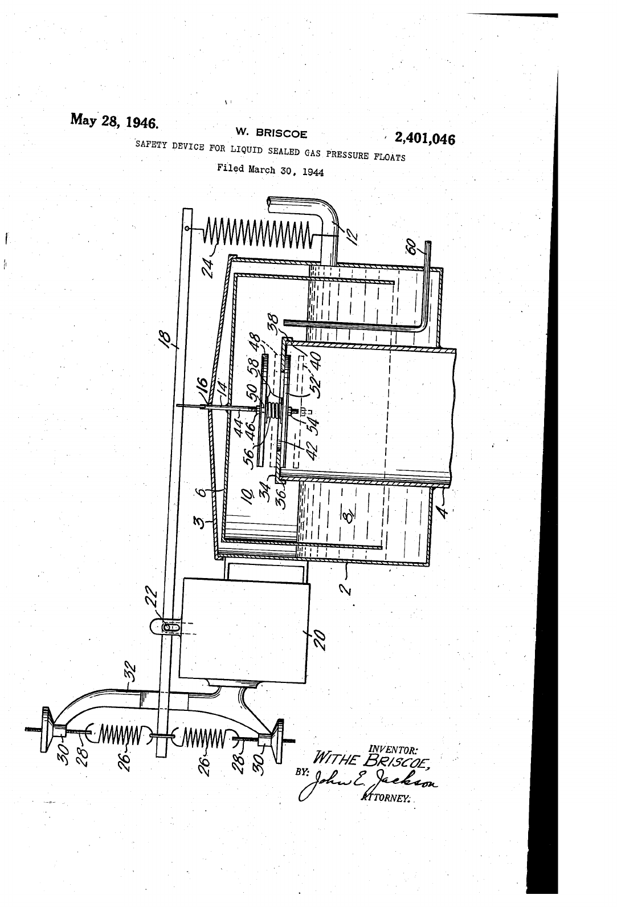
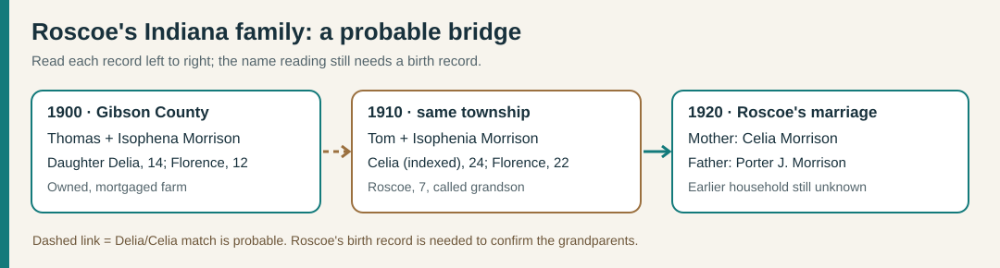
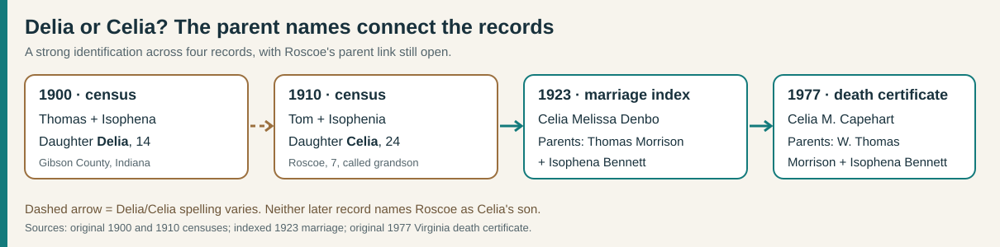
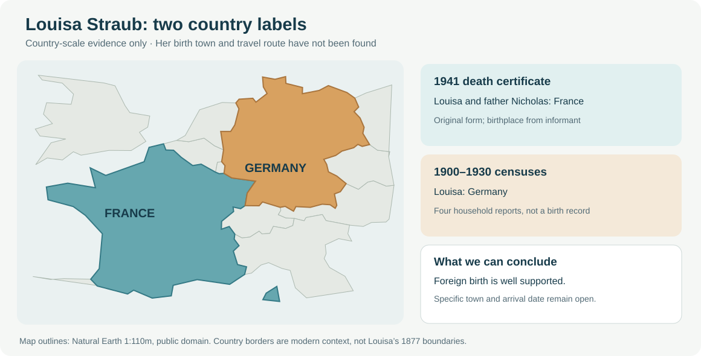
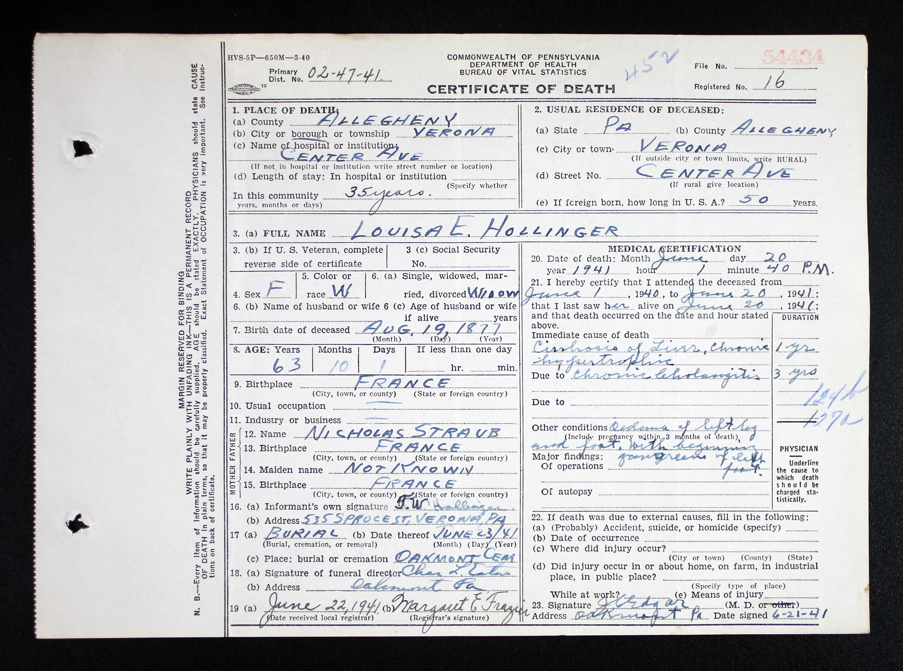

# Florence Morrison Weatherford: a Pennsylvania–Virginia household

**Documented chain:** **Porter J. Morrison and Celia Morrison** (as named on Roscoe's 1920 marriage return) → **Roscoe Gordon Morrison** (**2 February 1903–2 March 1947**) and **Eleanor Mae Hollinger** (**13 June 1909–22 November 1968**) → **Florence Ruth Morrison Weatherford** (**20 May 1937–17 February 2019**, obituary dates) → **John Gordon Weatherford Sr.** → **Ashley Marie Weatherford**. Roscoe's [original death certificate](../sources/records/roscoe-gordon-morrison-death-1947.jpg) names Porter and Celia; the [original 1954 marriage return](../sources/records/garnett-florence-marriage-1954.jpg) names Roscoe and Eleanor as Florence's parents. John-to-Ashley is family-supplied. A [1941 newspaper notice transcribed on Louisa's memorial](https://www.findagrave.com/memorial/139916983/louisa_e-hollinger) names her daughter **Eleanor Morrison** and sons **Theodore W.** and **Paul L. Hollinger**. Along with the 1910–30 census sequence, this makes **Linaus P. Hollinger and Louisa E. Straub** strongly supported as Eleanor's parents and Ashley's probable ancestors. Louisa's [original death certificate](../sources/records/louisa-straub-hollinger-death-certificate-1941.jpg) names **Nicholas Straub** as her father. The original notice and Eleanor's birth or marriage certificate would make the bridge firmer. Porter's own earlier household, why both parents were reported as Morrison, the precise Celia/Delia name reading, and Louisa's precise birthplace and immigration date remain open.

| When | What the records show | What remains uncertain |
| --- | --- | --- |
| **1920** | A [Detroit marriage register](../sources/records/roscoe-helen-marriage-1920.jpg) records **Roscoe Gordon Morrison**, Indiana-born truck driver, marrying **Helen Margaret Hanyon** on **25 May**. It names his father **Porter J. Morrison** and mother **Celia Morrison**. The unusual full name and parent pair match the later Virginia death certificate. | The groom reported age **19**, incompatible with the death certificate's February **1903** birth (he would have been 17). Neither record explains the difference. This was a marriage **before Eleanor**; its ending and the date of Roscoe and Eleanor's marriage have not been found. |
| **12 and 21 April 1930** | A [Jefferson Township census sheet](../sources/records/roscoe-morrison-candidate-census-1930.jpg), ED 2-642, sheet 6B, line 75, records **Roscoe Morrison**, 27, Indiana-born, **single**, a **steel-mill laborer**, in **Withe and Callie Briscoe's** household. It calls him the head's **cousin**. The unusual name, age, birth state and Allegheny location make him a strong match to Florence's father. On **21 April**, [Eleanor's separate Verona sheet](../sources/records/hollinger-candidate-census-1930.jpg), ED 2-841, sheet 18B, lines 79–80, lists her as an **unmarried 20-year-old** with widowed mother Louisa. | Roscoe's census omits his middle name and parents, so the identity and exact Briscoe relationship remain inferred. “Single” is the enumerator's entry, not a divorce decree. A [member tree](https://gw.geneanet.org/mtngoddess?lang=en&n=morrison&p=roscoe+gordon) proposes a 1924 divorce from Helen and a **26 November 1930** marriage to Eleanor; neither original civil record has been inspected. |
| **1935–40** | The [1940 census](../sources/records/morrison-household-census-1940.jpg), Arlington County sheet 7A, lines 23–30, places Roscoe, Eleanor and six children together. It reports **Pennsylvania** as the older children's birth state and **Virginia** for Florence and Catherine. The 1935 residence fields point to **Allegheny County, Pennsylvania** for most of the household. Roscoe is recorded as a **sheet-metal worker in private work**; the family rented its home, listed at **$15 monthly**. | The census does not say why they moved or identify Roscoe's clients. Rent is not net worth. |
| **Wartime draft** | Roscoe's [signed registration](../sources/records/roscoe-gordon-morrison-draft-card-1942.jpg) gives **19 February 1903, Hazleton, Indiana**, names **Mrs. Eleanor Morrison** as contact, and calls him **self-employed** in the Alexandria area. | His [1947 certificate](../sources/records/roscoe-gordon-morrison-death-1947.jpg) instead says **2 February 1903**. The card establishes registration, not military service. |
| **1947** | Roscoe's [Virginia death certificate](../sources/records/roscoe-gordon-morrison-death-1947.jpg) records death at **44**, identifies wife Eleanor as informant, parents **Porter Morrison and Celia**, and occupation **sheet-metal contractor**. Florence was about **nine**. | Celia's surname is omitted here. Later parent-naming records strongly identify a Celia Morrison in Roscoe's childhood household, but his mother-and-son link and Porter’s earlier records remain open. |
| **1950** | The [census main sheet](../sources/records/morrison-household-census-1950.jpg), Providence District, Fairfax County, sheet 46, lists **Eleanor, 40, widowed**, as head; [sheet 47](../sources/records/morrison-household-census-1950-continuation.jpg) carries youngest daughter Evelyn. Eleanor's work field says **“washes clothes”** and her industry field **“family work”**. **Edwin, 18**, was a carpenter's helper for a construction company; **Paul, 15**, a grocery-store clerk. Florence is **12**. | The sheets do not state wages or establish whether Eleanor's laundry field meant paid work. |
| **1954** | The [marriage certificate](../sources/records/garnett-florence-marriage-1954.jpg) records Florence as a **bookkeeper at First National Bank** and Garnett as a **transit-company bus operator**. The license was issued **14 January**; a proposed date of 15 January appears above the minister's signed **16 January** ceremony in Alexandria. The groom's first name is typed **“Garrett”** on this original, although other records call him **Garnett**. | Florence's later Burke & Herbert Bank role is family testimony, with dates still unknown. |

### A possible cousin's invention

The 1930 census calls Roscoe **Withe Briscoe's cousin**. A [1946 U.S. patent](https://patents.google.com/patent/US2401046A/en) names **Withe Briscoe of Elizabeth, Pennsylvania** as the inventor of a safety valve for gas-pressure controls used around coke ovens. Its aim was to stop a liquid seal from escaping during abrupt pressure changes, reducing the fire danger described in the patent. Withe and Callie Briscoe are also listed together in an [Elizabeth-area cemetery index](https://www.interment.net/data/us/pa/allegheny/roundhill/records-b.htm), making the inventor a strong match to the 1930 household head. The census's **cousin** label has not yet been traced through parents, and no record connects Roscoe to the invention, its use, or any proceeds.

*The [three-page patent](../sources/records/withe-briscoe-patent-1946.pdf) is saved with its drawing. It illustrates the industrial setting near a likely Roscoe Morrison in 1930; a family relationship beyond the census entry remains open.*

### Florence's brothers and sisters

The [1940](../sources/records/morrison-household-census-1940.jpg), [1950 main](../sources/records/morrison-household-census-1950.jpg), and [1950 continuation](../sources/records/morrison-household-census-1950-continuation.jpg) original sheets identify **seven children** of Roscoe and Eleanor: **Edwin Wayne**, **Celia May**, **Paul Frederick**, **William G.**, **Florence Ruth**, **Catherine Rose**, and **Evelyn Louise Morrison**. The 1950 schedule puts Edwin at about **18**, Celia **17**, Paul **15**, William **14**, Florence **12**, Catherine **10**, and Evelyn **7**. These ages are census reports, not verified birth dates. The older four were recorded as Pennsylvania-born; the younger three as Virginia-born. Marriage records separately repeat the distinctive parent pair for [Edwin](https://www.familysearch.org/ark:/61903/1:1:QVBB-Y2SK?lang=en), [Celia](https://www.familysearch.org/ark:/61903/1:1:QK9N-TFVM?lang=en), [Paul](https://www.familysearch.org/ark:/61903/1:1:QV17-2TVM?lang=en), [Catherine](https://www.familysearch.org/ark:/61903/1:1:QV1M-XGVG?lang=en), and [Evelyn](https://www.familysearch.org/ark:/61903/1:1:QVBY-PHHD?lang=en). William has not yet been matched to an adult record.

### The birth-age conflict

Florence's [2019 obituary transcription](https://www.familysearch.org/ark:/61903/1:1:61JY-8KNX?lang=en) gives **20 May 1937** and **17 February 2019**. Both censuses support a **1937/38** birth: age **2** in April 1940 and **12** in May 1950. Her [1954 marriage form](../sources/records/garnett-florence-marriage-1954.jpg), however, states **21**; a 1937 birth would make her **16** on the ceremony date. The marriage age conflicts with the independent earlier records and the obituary. The reason is unknown; a birth certificate could settle the exact day and year. Do not infer why the form says 21.

**Family story and context:** Florence reportedly later worked for **Burke & Herbert Bank**. The 1954 certificate anchors a different bank job at that time, providing a starting point for finding a staff listing or work document. Roscoe's death and the 1950 combination of Eleanor heading the house and two sons listing jobs are documented turning points. Their wages, a reason for the Pennsylvania–Virginia move, and any claim about family wealth would need more records.

### Eleanor's earlier household: a strong, still testable bridge

*Roscoe's original records repeat his full name and parents. Louisa's 1941 death notice supplies the missing married surname for her daughter Eleanor; only a transcription of that notice has been inspected so far.*

- **1865, Bennett name established for the earlier household:** the [original Gibson County marriage register](../sources/records/thomas-morrison-isaphinia-bennett-marriage-1865.jpg), entry **1258**, records **Thomas Morrison and Isaphinia Bennett** with a license and marriage on **31 August 1865**. The handwriting spells her given name differently from the later *Isophena/Isophenia* censuses; the unusual names, county and [1920 marriage index for daughter Lilly Florence](https://www.familysearch.org/ark:/61903/1:1:4135-KCMM?lang=en), which independently names **William Thomas Morrison and Jsophena Bennett** as her parents, support this as the same couple. The 1920 original image is restricted to a FamilySearch Center or affiliate library. These records strengthen **Bennett** as Isophena's birth surname and **William Thomas** as Thomas's fuller name; they do **not** by themselves prove that their grandson Roscoe was Celia's child.

- **1900–10, probable earlier Morrison household:** an [original 1900 Gibson County census](../sources/records/morrison-gibson-census-1900-candidate.jpg), sheet 7A, lines 21–25, has **Thomas and Isophena Morrison**, son William, daughters **Delia** (the name appears this way and is indexed Delia) and Florence. Thomas was a **farmer**; the census marks the farm **owned with a mortgage**, without a dollar value. William, Delia and Florence were each marked **at school for seven months** in the preceding year, but no school is named. The [1910 sheet](../sources/records/roscoe-morrison-candidate-census-1910.jpg), lines 79–83, has **Tom and Isophenia**, daughters indexed **Celia** and Florence, and **Roscoe, 7**, labeled Tom's *grandson*. Delia/Celia's age advances from 14 to 24, and Florence from 12 to 22, in the same Gibson County township. Roscoe's [1920 marriage return](../sources/records/roscoe-helen-marriage-1920.jpg) names his mother **Celia Morrison**. Together, these records make Thomas and Isophena **probable maternal grandparents of Florence's father Roscoe**, hence probable earlier ancestors of Ashley. The 1910 sheet does **not** label Celia as Roscoe's mother; his 1903 birth record would settle the identity and name variation. It also does not place father **Porter J. Morrison** in this household or explain why both reported parents had the surname Morrison.

- **1923–77, Celia's parentage and Virginia move:** a [1923 Knox County marriage index](https://www.familysearch.org/ark:/61903/1:1:4YZ7-3HW2?lang=en) names **Celia Melissa Denbo** (born Morrison), marrying George Capehart, with parents **Thomas Morrison and Isophena Bennett**. Her [original amended 1977 Virginia death certificate](../sources/records/celia-melissa-morrison-capehart-death-1977.jpg) independently names **William Thomas Morrison and Isophena Bennett** and reports an Indiana birth in 1886. The distinctive parents, place and age make her a strong identification with the Gibson County daughter called **Delia** in 1900 and **Celia** in 1910. A [1930 index](https://www.familysearch.org/ark:/61903/1:1:XHMN-1M9?lang=en) still places Celia in Gibson County; the [original 1950 census](../sources/records/capehart-denbo-household-census-1950.jpg) places Celia, George and her adult son **William C. Denbo** in Fairfax County, Virginia. George and William were both recorded as sheet-metal workers, an occupational overlap with Roscoe, but **no shared employer or work relationship is documented**. The 1977 death was recorded at Alexandria Hospital. Neither Celia's marriage, census nor death record names Roscoe as her son. The combination of Roscoe's own parent-naming records and the 1910 grandson census is compelling, but his birth entry or another explicit mother-and-son record is still needed to prove this generation link.

- **1903, possible birth entry:** a [FamilySearch index](https://www.familysearch.org/ark:/61903/1:1:4KY3-2PPZ?lang=en) from the Gibson County birth register records an **unnamed boy Morrison**, born **20 February 1903** in **Washington Township**, mother indexed **“Clair Morrison,”** father **“Unknown.”** The catalog identifies the underlying [1896–1907 Gibson birth volume](https://www.familysearch.org/en/search/catalog/koha:132328), film **549364**, digital group **7578554**; the index cites **page 27, line 6**. The image currently requires a FamilySearch Center or affiliate library. This is a **candidate, not Roscoe's established birth record**: his signed 1942 draft card gives **19 February 1903** at **Hazleton**, a town placed in **White River Township** by [Indiana's county land-order map](https://www.in.gov/dlgf/files/2026-reports/Gibson-County-2025-Land-Order.pdf), and his later marriage/death records name **Celia** and **Porter** as parents. A one-day date difference, common surname and county make comparison worthwhile, while the **township, mother's name, unnamed child and missing father all remain unresolved**. A copy of page 27 or a county-issued record is the next check.

For the local setting, the [Indiana State Library's Gibson County atlas guide](https://www.in.gov/library/collections-and-services/indiana/indiana-county-maps-atlases-and-plat-books/gibson-county-maps/) links historical land maps, including a **1906 atlas** near this household's census years. A deed or farm schedule would be needed before placing **their** farm on one. The [state's historic school survey](https://www.in.gov/dnr/historic/files/schoolsmpdf.pdf) illustrates rural Indiana school buildings of the period; it does not identify which school the Morrison children attended.
- **1900, Pittsburgh:** the [original census sheet](../sources/records/hollinger-household-census-1900.jpg), ward 15, ED 185, sheet 12A, lines 16–18, places **Linaus and Louisa Hollinger** with newborn son **Theodore**. Linaus, Pennsylvania-born, worked as a **laborer at an iron mill**. Louisa was recorded as **born August 1877 in Germany**, married one year, mother of one living child, and arriving in **1889** according to this census. These names and dates fit their [June 1899 marriage docket](../sources/records/hollinger-straub-candidate-marriage-1899.jpg); the year 1889 is an enumerator's report, not a passenger record.
- **1910–30, Penn Township and Verona:** [1910](../sources/records/hollinger-candidate-census-1910.jpg), [1920](../sources/records/hollinger-candidate-census-1920.jpg) and [1930](../sources/records/hollinger-candidate-census-1930.jpg) sheets follow an **Eleanor/Elanore Hollinger**, born about 1909–10 in Pennsylvania, with **Louise/Louisa Hollinger**. Only the 1930 sheet supplies middle initial **M.** The 1910 sheet names **Linaus P. Hollinger** as her father; the later sheets call Louisa widowed. In the [1941 Pittsburgh Press notice transcribed by Find a Grave](https://www.findagrave.com/memorial/139916983/louisa_e-hollinger), Louisa's children are **Theodore W.**, **Paul L. Hollinger**, and **Eleanor Morrison**. Theodore and Paul match the census children; daughter Eleanor's married name matches Florence's mother, who was Pennsylvania-born, about the same age, and living in Allegheny County in 1935. **This is a strong identification**, although the original newspaper page or an Eleanor parent-naming certificate has not been inspected. A public tree's middle name **Katherine** for the census child conflicts with the proven **Mae** and remains unsubstantiated.
- **1941, Verona:** the [full Pennsylvania death certificate](../sources/records/louisa-straub-hollinger-death-certificate-1941.jpg), downloaded from a [FamilySearch memory](https://www.familysearch.org/memories/memory/175026156), matches state index certificate **54334**. It records **20 June 1941** death, **19 August 1877** birth, birthplace **France**, and father **Nicholas Straub**, also reported born in France. Her mother's name is explicitly **not known** on the form. The certificate says she had lived **50 years in the United States**, suggesting an arrival around **1891**, but this is a retrospective estimate. It does not name her children. The [state index page](../sources/records/louisa-hollinger-pa-death-index-1941.png) independently confirms the name, date and Verona location.
- **Immigration and birthplace still unresolved at town and date level:** the [1900 census](../sources/records/hollinger-household-census-1900.jpg) reports Louisa arrived in **1889**; the [1930 sheet](../sources/records/hollinger-candidate-census-1930.jpg) appears to say **1887**, the [1920 index](https://www.familysearch.org/ark:/61903/1:1:M6BK-2ZQ?lang=en) says **1895** (its handwritten sheet is hard to read), and the 1941 certificate's **50 years in the U.S.** implies approximately **1891**. The 1900–30 censuses report **Germany** as her birthplace; the death certificate reports **France**, and her [1899 marriage docket](../sources/records/hollinger-straub-candidate-marriage-1899.jpg) appears to say **Pennsylvania**. The death certificate gives stronger support to a foreign birth and to **France as reported by its informant**, but it does not name a town or independently prove where the birth happened. [France's military history service](https://www.cheminsdememoire.gouv.fr/fr/un-enjeu-specifique-franco-allemand-la-memoire-des-conflits-contemporains-en-alsace-moselle) explains that Alsace-Lorraine changed sovereignty in 1871–1918; this could explain changing country labels **if** she came from that region, which no inspected original names. Seek her birth/baptism, passenger, and naturalization records before assigning a place or arrival year.

*The map shows the [1941 certificate's](../sources/records/louisa-straub-hollinger-death-certificate-1941.jpg) France report against the [1900](../sources/records/hollinger-household-census-1900.jpg), [1910](../sources/records/hollinger-candidate-census-1910.jpg), [1920](../sources/records/hollinger-candidate-census-1920.jpg), and [1930](../sources/records/hollinger-candidate-census-1930.jpg) census Germany reports. It marks neither a birth town nor a travel route. [Map method and outline credit](../maps/README.md#geographic-map).*

*The certificate supplies Nicholas Straub and a reported French birthplace. It does not identify Louisa's mother. [FamilySearch memory and image provenance](https://www.familysearch.org/memories/memory/175026156).*

**A proposed Straub household:** a [FamilySearch tree](https://www.familysearch.org/en/tree/person/details/G2QM-RH3) places **Therese Jungmann/Youngman** as Louisa's mother and lists six other Straub children: **John Nicholas, Peter, Mary, Catherine, Lena, and Joseph Michael**. The certificate confirms Nicholas as Louisa's father but **does not confirm Therese or the sibling list**. An [indexed 1908 marriage for Peter Straub](https://familysearch.org/ark:/61903/1:1:XFWB-43J?lang=en) names his parents **Nichlos Straub and Theresa Youngman**; Peter's own birth is indexed as **19 December 1871 in Germany**. This supports that parent pair for Peter, but a record linking Peter and Louisa as siblings has not been found. Treat the wider household as a research lead.

*A [Library of Congress Pittsburgh photograph, about 1910–20](https://www.loc.gov/pictures/item/2016815590/), shows the riverside iron-mill landscape a decade or two after Linaus's 1900 census job. It is context for the city's industry; the census does **not** identify his employer or connect him to the pictured plant. [Image credit and rights](../sources/places/README.md).*
