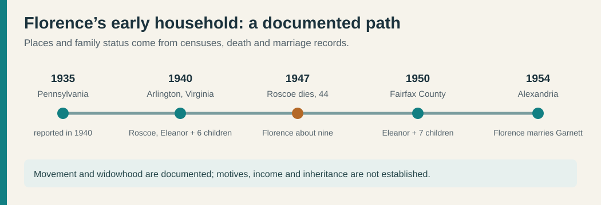
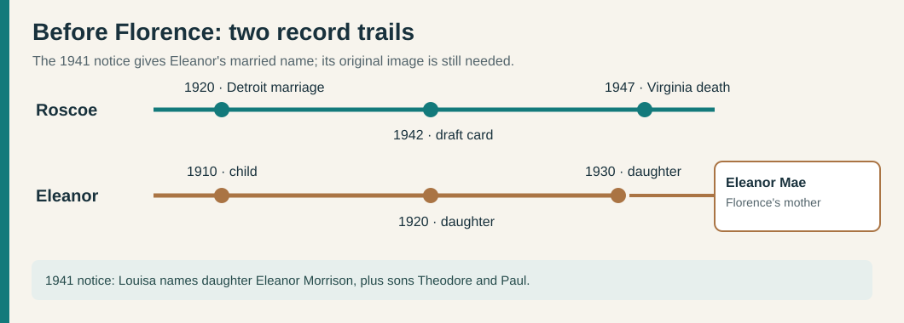

# Florence Morrison Weatherford: a Pennsylvania–Virginia household

**Documented chain:** **Porter Morrison and Celia (surname unrecorded)** → **Roscoe Gordon Morrison** (**2 February 1903–2 March 1947**) and **Eleanor Mae Hollinger** (**13 June 1909–22 November 1968**) → **Florence Ruth Morrison Weatherford** (**20 May 1937–17 February 2019**, obituary dates) → **John Gordon Weatherford Sr.** → **Ashley Marie Weatherford**. Roscoe's [original death certificate](../sources/records/roscoe-gordon-morrison-death-1947.jpg) names Porter and Celia; the [original 1954 marriage return](../sources/records/garnett-florence-marriage-1954.jpg) names Roscoe and Eleanor as Florence's parents. John-to-Ashley is family-supplied. Porter and Celia's own dates, marriage, Celia's maiden name, and Eleanor's parents remain open.

| When | What the records show | What remains uncertain |
| --- | --- | --- |
| **1920** | A [Detroit marriage register](../sources/records/roscoe-helen-marriage-1920.jpg) records **Roscoe Gordon Morrison**, Indiana-born truck driver, marrying **Helen Margaret Hanyon** on **25 May**. It names his father **Porter J. Morrison** and mother **Celia Morrison**. The unusual full name and parent pair match the later Virginia death certificate. | The groom reported age **19**, incompatible with the death certificate's February **1903** birth (he would have been 17). Neither record explains the difference. This was a marriage **before Eleanor**; its ending and the date of Roscoe and Eleanor's marriage have not been found. |
| **1935–40** | The [1940 census](../sources/records/morrison-household-census-1940.jpg), Arlington County sheet 7A, lines 23–30, places Roscoe, Eleanor and six children together. It reports **Pennsylvania** as the older children's birth state and **Virginia** for Florence and Catherine. The 1935 residence fields point to **Allegheny County, Pennsylvania** for most of the household. Roscoe is recorded as a **sheet-metal worker in private work**; the family rented its home, listed at **$15 monthly**. | The census does not say why they moved or identify Roscoe's clients. Rent is not net worth. |
| **Wartime draft** | Roscoe's [signed registration](../sources/records/roscoe-gordon-morrison-draft-card-1942.jpg) gives **19 February 1903, Hazleton, Indiana**, names **Mrs. Eleanor Morrison** as contact, and calls him **self-employed** in the Alexandria area. | His [1947 certificate](../sources/records/roscoe-gordon-morrison-death-1947.jpg) instead says **2 February 1903**. The card establishes registration, not military service. |
| **1947** | Roscoe's [Virginia death certificate](../sources/records/roscoe-gordon-morrison-death-1947.jpg) records death at **44**, identifies wife Eleanor as informant, parents **Porter Morrison and Celia**, and occupation **sheet-metal contractor**. Florence was about **nine**. | Celia's surname and Porter/Celia's earlier records remain unproved. |
| **1950** | The [census main sheet](../sources/records/morrison-household-census-1950.jpg), Providence District, Fairfax County, sheet 46, lists **Eleanor, 40, widowed**, as head; [sheet 47](../sources/records/morrison-household-census-1950-continuation.jpg) carries youngest daughter Evelyn. Eleanor's work field says **“washes clothes”** and her industry field **“family work”**. **Edwin, 18**, was a carpenter's helper for a construction company; **Paul, 15**, a grocery-store clerk. Florence is **12**. | The sheets do not state wages or establish whether Eleanor's laundry field meant paid work. |
| **1954** | The [marriage certificate](../sources/records/garnett-florence-marriage-1954.jpg) records Florence as a **bookkeeper at First National Bank** and Garnett as a **transit-company bus operator**. The license was issued **14 January**; a proposed date of 15 January appears above the minister's signed **16 January** ceremony in Alexandria. The groom's first name is typed **“Garrett”** on this original, although other records call him **Garnett**. | Florence's later Burke & Herbert Bank role is family testimony, with dates still unknown. |

### Florence's brothers and sisters

The [1940](../sources/records/morrison-household-census-1940.jpg), [1950 main](../sources/records/morrison-household-census-1950.jpg), and [1950 continuation](../sources/records/morrison-household-census-1950-continuation.jpg) original sheets identify **seven children** of Roscoe and Eleanor: **Edwin Wayne**, **Celia May**, **Paul Frederick**, **William G.**, **Florence Ruth**, **Catherine Rose**, and **Evelyn Louise Morrison**. The 1950 schedule puts Edwin at about **18**, Celia **17**, Paul **15**, William **14**, Florence **12**, Catherine **10**, and Evelyn **7**. These ages are census reports, not verified birth dates. The older four were recorded as Pennsylvania-born; the younger three as Virginia-born. Marriage records separately repeat the distinctive parent pair for [Edwin](https://www.familysearch.org/ark:/61903/1:1:QVBB-Y2SK?lang=en), [Celia](https://www.familysearch.org/ark:/61903/1:1:QK9N-TFVM?lang=en), [Paul](https://www.familysearch.org/ark:/61903/1:1:QV17-2TVM?lang=en), [Catherine](https://www.familysearch.org/ark:/61903/1:1:QV1M-XGVG?lang=en), and [Evelyn](https://www.familysearch.org/ark:/61903/1:1:QVBY-PHHD?lang=en). William has not yet been matched to an adult record.

### The birth-age conflict

Florence's [2019 obituary transcription](https://www.familysearch.org/ark:/61903/1:1:61JY-8KNX?lang=en) gives **20 May 1937** and **17 February 2019**. Both censuses support a **1937/38** birth: age **2** in April 1940 and **12** in May 1950. Her [1954 marriage form](../sources/records/garnett-florence-marriage-1954.jpg), however, states **21**; a 1937 birth would make her **16** on the ceremony date. The marriage age conflicts with the independent earlier records and the obituary. The reason is unknown; a birth certificate could settle the exact day and year. Do not infer why the form says 21.

**Family story and context:** Florence reportedly later worked for **Burke & Herbert Bank**. The 1954 certificate anchors a different bank job at that time, providing a starting point for finding a staff listing or work document. Roscoe's death and the 1950 combination of Eleanor heading the house and two sons listing jobs are documented turning points. Their wages, a reason for the Pennsylvania–Virginia move, and any claim about family wealth would need more records.

### Earlier household leads, still being tested

*The solid Roscoe record pair repeats his full name and parents. The Hollinger census trail is coherent internally, but no record yet joins its Eleanor to Florence's mother.*

- **Roscoe in Indiana, probable:** a [1910 Gibson County census sheet](../sources/records/roscoe-morrison-candidate-census-1910.jpg) has **Roscoe Morrison, 7**, called grandson of household head **Tom Morrison**, with **Celia Morrison, 24**, in the same home. His name, age, Indiana location and Celia fit the later groom/decedent. The sheet does not say which daughter was his mother or name his father. Tom and his wife are **not yet proved** as Ashley's ancestors.
- **Eleanor in Pennsylvania, candidate:** [1910](../sources/records/hollinger-candidate-census-1910.jpg), [1920](../sources/records/hollinger-candidate-census-1920.jpg) and [1930](../sources/records/hollinger-candidate-census-1930.jpg) Allegheny County sheets follow an **Eleanor/Elanore Hollinger**, born about 1909–10 in Pennsylvania, with **Louise/Louisa Hollinger**. Only the **1930** sheet supplies middle initial **M.** The 1910 sheet names **Linaus P. Hollinger** as her father; the later sheets call Louise widowed. Those details fit the age, maiden surname and 1935 county of **Eleanor Mae Hollinger Morrison**, but her death certificate gives **no parents**. A marriage, birth, Social Security or probate record must bridge the two identities before Linaus and Louise are placed in Ashley's direct tree.
- **A possible overseas clue, with a conflict:** the [1930 sheet](../sources/records/hollinger-candidate-census-1930.jpg) calls Louisa **German-born** and appears to give **1887** as her immigration year; the [1920 index](https://www.familysearch.org/ark:/61903/1:1:M6BK-2ZQ?lang=en) transcribes **1895**, while the handwritten year on its [original sheet](../sources/records/hollinger-candidate-census-1920.jpg) is difficult to read. These are inconsistent census reports, not passenger records. An [1899 Allegheny marriage docket](../sources/records/hollinger-straub-candidate-marriage-1899.jpg) pairs **Linaus Hollinger** with **Louisa Straub** and appears to give **Pennsylvania** as *both* birthplaces. The birthplace conflict concerns **Louisa**, whom the 1910–30 censuses call German-born. The pairing is a lead, not proof of Louisa's maiden name or Ashley's immigration date. An original passenger/naturalization record and a direct Eleanor identity bridge are needed.
