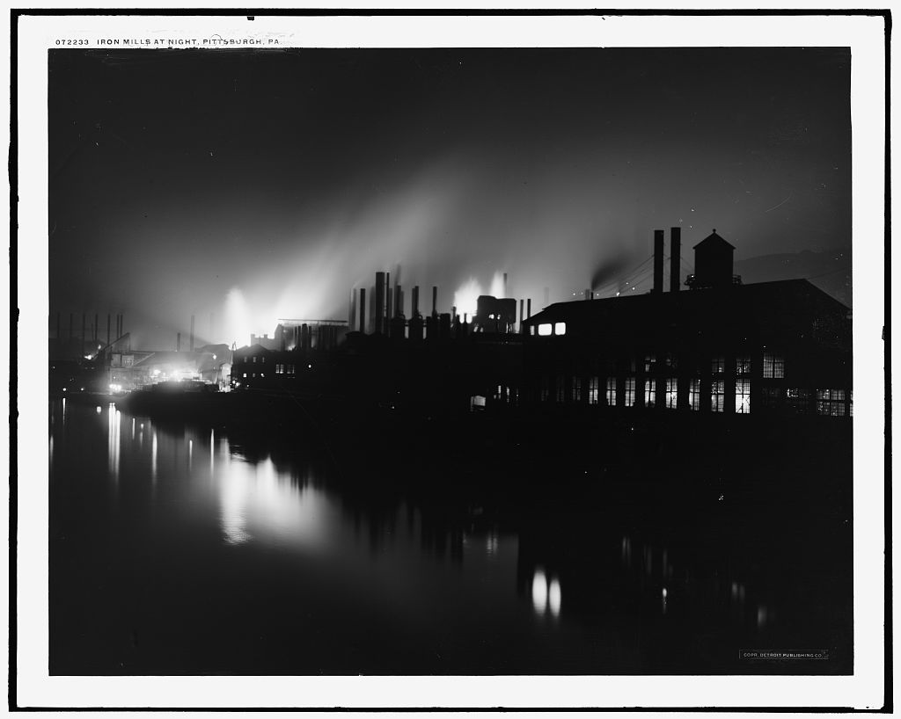

# Florence Morrison Weatherford: a Pennsylvania–Virginia household

**Documented chain:** **Porter Morrison and Celia (surname unrecorded)** → **Roscoe Gordon Morrison** (**2 February 1903–2 March 1947**) and **Eleanor Mae Hollinger** (**13 June 1909–22 November 1968**) → **Florence Ruth Morrison Weatherford** (**20 May 1937–17 February 2019**, obituary dates) → **John Gordon Weatherford Sr.** → **Ashley Marie Weatherford**. Roscoe's [original death certificate](../sources/records/roscoe-gordon-morrison-death-1947.jpg) names Porter and Celia; the [original 1954 marriage return](../sources/records/garnett-florence-marriage-1954.jpg) names Roscoe and Eleanor as Florence's parents. John-to-Ashley is family-supplied. A [1941 newspaper notice transcribed on Louisa's memorial](https://www.findagrave.com/memorial/139916983/louisa_e-hollinger) names her daughter **Eleanor Morrison** and sons **Theodore W.** and **Paul L. Hollinger**. Along with the 1910–30 census sequence, this makes **Linaus P. Hollinger and Louisa E. Straub** strongly supported as Eleanor's parents and Ashley's probable ancestors. The original notice and Eleanor's birth or marriage certificate would make the bridge firmer. Porter and Celia's own dates and marriage, Celia's maiden name, and Louisa's birthplace and immigration date remain open.

| When | What the records show | What remains uncertain |
| --- | --- | --- |
| **1920** | A [Detroit marriage register](../sources/records/roscoe-helen-marriage-1920.jpg) records **Roscoe Gordon Morrison**, Indiana-born truck driver, marrying **Helen Margaret Hanyon** on **25 May**. It names his father **Porter J. Morrison** and mother **Celia Morrison**. The unusual full name and parent pair match the later Virginia death certificate. | The groom reported age **19**, incompatible with the death certificate's February **1903** birth (he would have been 17). Neither record explains the difference. This was a marriage **before Eleanor**; its ending and the date of Roscoe and Eleanor's marriage have not been found. |
| **1935–40** | The [1940 census](../sources/records/morrison-household-census-1940.jpg), Arlington County sheet 7A, lines 23–30, places Roscoe, Eleanor and six children together. It reports **Pennsylvania** as the older children's birth state and **Virginia** for Florence and Catherine. The 1935 residence fields point to **Allegheny County, Pennsylvania** for most of the household. Roscoe is recorded as a **sheet-metal worker in private work**; the family rented its home, listed at **$15 monthly**. | The census does not say why they moved or identify Roscoe's clients. Rent is not net worth. |
| **Wartime draft** | Roscoe's [signed registration](../sources/records/roscoe-gordon-morrison-draft-card-1942.jpg) gives **19 February 1903, Hazleton, Indiana**, names **Mrs. Eleanor Morrison** as contact, and calls him **self-employed** in the Alexandria area. | His [1947 certificate](../sources/records/roscoe-gordon-morrison-death-1947.jpg) instead says **2 February 1903**. The card establishes registration, not military service. |
| **1947** | Roscoe's [Virginia death certificate](../sources/records/roscoe-gordon-morrison-death-1947.jpg) records death at **44**, identifies wife Eleanor as informant, parents **Porter Morrison and Celia**, and occupation **sheet-metal contractor**. Florence was about **nine**. | Celia's surname and Porter/Celia's earlier records remain unproved. |
| **1950** | The [census main sheet](../sources/records/morrison-household-census-1950.jpg), Providence District, Fairfax County, sheet 46, lists **Eleanor, 40, widowed**, as head; [sheet 47](../sources/records/morrison-household-census-1950-continuation.jpg) carries youngest daughter Evelyn. Eleanor's work field says **“washes clothes”** and her industry field **“family work”**. **Edwin, 18**, was a carpenter's helper for a construction company; **Paul, 15**, a grocery-store clerk. Florence is **12**. | The sheets do not state wages or establish whether Eleanor's laundry field meant paid work. |
| **1954** | The [marriage certificate](../sources/records/garnett-florence-marriage-1954.jpg) records Florence as a **bookkeeper at First National Bank** and Garnett as a **transit-company bus operator**. The license was issued **14 January**; a proposed date of 15 January appears above the minister's signed **16 January** ceremony in Alexandria. The groom's first name is typed **“Garrett”** on this original, although other records call him **Garnett**. | Florence's later Burke & Herbert Bank role is family testimony, with dates still unknown. |

### Florence's brothers and sisters

The [1940](../sources/records/morrison-household-census-1940.jpg), [1950 main](../sources/records/morrison-household-census-1950.jpg), and [1950 continuation](../sources/records/morrison-household-census-1950-continuation.jpg) original sheets identify **seven children** of Roscoe and Eleanor: **Edwin Wayne**, **Celia May**, **Paul Frederick**, **William G.**, **Florence Ruth**, **Catherine Rose**, and **Evelyn Louise Morrison**. The 1950 schedule puts Edwin at about **18**, Celia **17**, Paul **15**, William **14**, Florence **12**, Catherine **10**, and Evelyn **7**. These ages are census reports, not verified birth dates. The older four were recorded as Pennsylvania-born; the younger three as Virginia-born. Marriage records separately repeat the distinctive parent pair for [Edwin](https://www.familysearch.org/ark:/61903/1:1:QVBB-Y2SK?lang=en), [Celia](https://www.familysearch.org/ark:/61903/1:1:QK9N-TFVM?lang=en), [Paul](https://www.familysearch.org/ark:/61903/1:1:QV17-2TVM?lang=en), [Catherine](https://www.familysearch.org/ark:/61903/1:1:QV1M-XGVG?lang=en), and [Evelyn](https://www.familysearch.org/ark:/61903/1:1:QVBY-PHHD?lang=en). William has not yet been matched to an adult record.

### The birth-age conflict

Florence's [2019 obituary transcription](https://www.familysearch.org/ark:/61903/1:1:61JY-8KNX?lang=en) gives **20 May 1937** and **17 February 2019**. Both censuses support a **1937/38** birth: age **2** in April 1940 and **12** in May 1950. Her [1954 marriage form](../sources/records/garnett-florence-marriage-1954.jpg), however, states **21**; a 1937 birth would make her **16** on the ceremony date. The marriage age conflicts with the independent earlier records and the obituary. The reason is unknown; a birth certificate could settle the exact day and year. Do not infer why the form says 21.

**Family story and context:** Florence reportedly later worked for **Burke & Herbert Bank**. The 1954 certificate anchors a different bank job at that time, providing a starting point for finding a staff listing or work document. Roscoe's death and the 1950 combination of Eleanor heading the house and two sons listing jobs are documented turning points. Their wages, a reason for the Pennsylvania–Virginia move, and any claim about family wealth would need more records.

### Eleanor's earlier household: a strong, still testable bridge

*Roscoe's original records repeat his full name and parents. Louisa's 1941 death notice supplies the missing married surname for her daughter Eleanor; only a transcription of that notice has been inspected so far.*

- **Roscoe in Indiana, probable:** a [1910 Gibson County census sheet](../sources/records/roscoe-morrison-candidate-census-1910.jpg) has **Roscoe Morrison, 7**, called grandson of household head **Tom Morrison**, with **Celia Morrison, 24**, in the same home. His name, age, Indiana location and Celia fit the later groom/decedent. The sheet does not say which daughter was his mother or name his father. Tom and his wife are **not yet proved** as Ashley's ancestors.
- **1900, Pittsburgh:** the [original census sheet](../sources/records/hollinger-household-census-1900.jpg), ward 15, ED 185, sheet 12A, lines 16–18, places **Linaus and Louisa Hollinger** with newborn son **Theodore**. Linaus, Pennsylvania-born, worked as a **laborer at an iron mill**. Louisa was recorded as **born August 1877 in Germany**, married one year, mother of one living child, and arriving in **1889** according to this census. These names and dates fit their [June 1899 marriage docket](../sources/records/hollinger-straub-candidate-marriage-1899.jpg); the year 1889 is an enumerator's report, not a passenger record.
- **1910–30, Penn Township and Verona:** [1910](../sources/records/hollinger-candidate-census-1910.jpg), [1920](../sources/records/hollinger-candidate-census-1920.jpg) and [1930](../sources/records/hollinger-candidate-census-1930.jpg) sheets follow an **Eleanor/Elanore Hollinger**, born about 1909–10 in Pennsylvania, with **Louise/Louisa Hollinger**. Only the 1930 sheet supplies middle initial **M.** The 1910 sheet names **Linaus P. Hollinger** as her father; the later sheets call Louisa widowed. In the [1941 Pittsburgh Press notice transcribed by Find a Grave](https://www.findagrave.com/memorial/139916983/louisa_e-hollinger), Louisa's children are **Theodore W.**, **Paul L. Hollinger**, and **Eleanor Morrison**. Theodore and Paul match the census children; daughter Eleanor's married name matches Florence's mother, who was Pennsylvania-born, about the same age, and living in Allegheny County in 1935. **This is a strong identification**, although the original newspaper page or an Eleanor parent-naming certificate has not been inspected. A public tree's middle name **Katherine** for the census child conflicts with the proven **Mae** and remains unsubstantiated.
- **Immigration and birthplace still unresolved:** the [1900 census](../sources/records/hollinger-household-census-1900.jpg) reports Louisa arrived in **1889**; the [1930 sheet](../sources/records/hollinger-candidate-census-1930.jpg) appears to say **1887**, and the [1920 index](https://www.familysearch.org/ark:/61903/1:1:M6BK-2ZQ?lang=en) says **1895** although its [handwritten sheet](../sources/records/hollinger-candidate-census-1920.jpg) is hard to read. The 1900–30 censuses report **Germany** as her birthplace; her [1899 marriage docket](../sources/records/hollinger-straub-candidate-marriage-1899.jpg) appears to say **Pennsylvania**, and her [cemetery memorial](https://www.findagrave.com/memorial/139916983/louisa_e-hollinger) says **France** without showing a birthplace source. Neither the exact country at her birth nor a precise arrival year is settled. An original birth, passenger, naturalization or death certificate could resolve the conflicting entries; do not infer a particular border region from them.

*A [Library of Congress Pittsburgh photograph, about 1910–20](https://www.loc.gov/pictures/item/2016815590/), shows the riverside iron-mill landscape a decade or two after Linaus's 1900 census job. It is context for the city's industry; the census does **not** identify his employer or connect him to the pictured plant. [Image credit and rights](../sources/places/README.md).*
