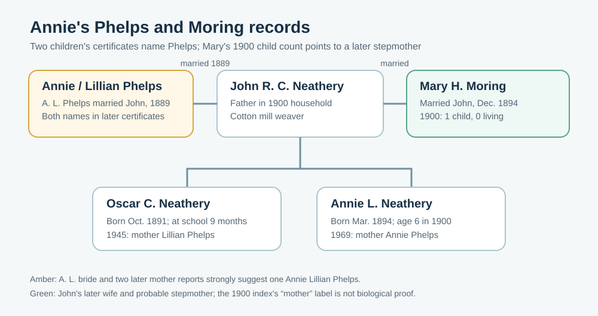
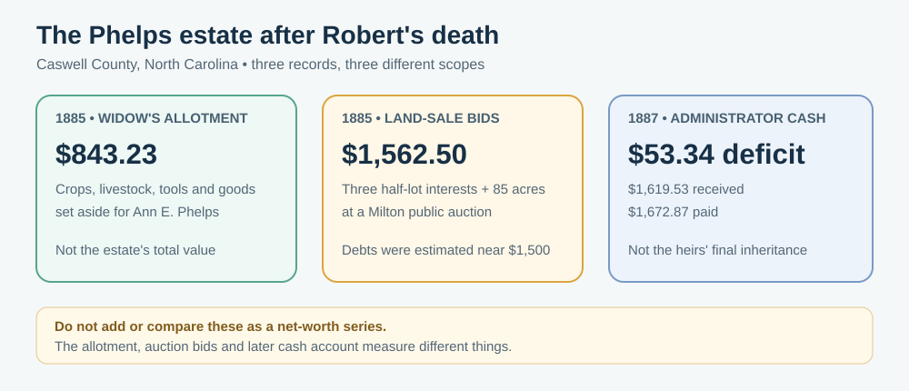

# Annie Neathery's Danville family: two mothers in one census index

**The finding:** Ashley's great-grandmother **Annie Lillian Neathery Weatherford (1894–1969)** appears as a six-year-old in her father **John R. C. Neathery's** 1900 Danville household. Her [1969 death certificate](https://www.familysearch.org/ark:/61903/3:1:3Q9M-C95D-49MW-W?view=index&personArk=%2Fark%3A%2F61903%2F1%3A1%3AQVYL-N4BR&action=view&lang=en) names **Annie Phelps** as her mother. An [1889 marriage register](../sources/records/phelps-neathery-marriage-register-1889.jpg) now independently joins **J. R. C. Neathery** and **A. L. Phelps** in Milton, North Carolina. The 1900 census instead places **Mary H. Neathery** in the home. Mary was John's later wife and probably **Annie's stepmother**; its automatic “mother” index label should not replace Phelps in the ancestral line.

| Date | What the record actually says | What it supports |
| --- | --- | --- |
| **1880, Milton, Caswell County, NC** | [Original census](../sources/records/phelps-household-census-1880.jpg) and [A. E. Phelps index](https://www.familysearch.org/ark:/61903/1:1:MC6X-5J4?lang=en): **R. O. Phelps**, 45, farmer, and wife **A. E.**, 38, have a daughter **A. E.**, 12, marked **at school**. Eight children are enumerated. | A strong candidate childhood home for the 1889 bride: the parents' names, place and her age fit. Her indexed initials **A. E.** differ from the marriage's **A. L.**, so this identification is probable, not final. The census gives no school name, grade or attendance length. |
| **1880, Dan River District** | [Original census](../sources/records/frances-neathery-household-census-1880.jpg) and [continuation](../sources/records/frances-neathery-household-census-1880-continuation.jpg): **Francis J. Neathery**, 44, heads a household with son **John R. C.**, 9, and other children. Francis is marked widowed and keeping house. The continuation names **Charles, Mary, Martha and Robert**. | A strong childhood match for the later J. R. C. Neathery. His father is not in this home. [FamilySearch index](https://www.familysearch.org/ark:/61903/1:1:MC51-459?lang=en). |
| **Early February 1889, Milton, NC** | [Original Caswell marriage register](../sources/records/phelps-neathery-marriage-register-1889.jpg), fifth row, pairs **J. R. C. Neathery** (indexed “Mathery”) and **A. L. Phelps**. It gives his parents **James and Frances Neathery**, and hers **Robert and A. E. Phelps**. [FamilySearch bride entry](https://www.familysearch.org/ark:/61903/1:1:QPS9-PMC7?lang=en). | A contemporary link between John and a Phelps bride, plus both parent pairs. The index says **3 February**, while the handwritten day and online tree differ; exact marriage day needs closer reading. The register only uses her initials, so **Annie Lillian** is supported by later family records, not spelled out here. |
| **1891 and 1894** | The [1900 original census](../sources/records/neathery-household-census-1900-sheet2a.jpg) calls **Oscar C.** a son born **October 1891**; [continuation sheet](../sources/records/neathery-household-census-1900-sheet2b.jpg) calls **Annie L.** a daughter born **March 1894**. | Oscar is an identified brother of Annie. The March 1894 entry agrees with her later certificate's **13 March 1894** report. These are not birth registrations. |
| **26 December 1894** | A [Prince Edward County marriage-register index](https://www.familysearch.org/ark:/61903/1:1:68R4-QK7L?lang=en) records **J. R. C. Neathery** marrying **Mary H. Moring**, after Annie's reported birth. It names Mary's parents **Jno and Mary Ellen Moring** and indexes the groom's parents as **J. R. and F. J. Neathery**. | Confirms Mary as a later wife. The original marriage image requires a FamilySearch center or affiliate, so the parent initials still need inspection. |
| **2 June 1900, Danville** | [Sheet 2A](../sources/records/neathery-household-census-1900-sheet2a.jpg), lines 48–50, lists **J. R. C.**, **Mary H.**, and **Oscar C.**; [sheet 2B](../sources/records/neathery-household-census-1900-sheet2b.jpg), line 51, adds **Annie L.** John is a **cotton mill weaver**, the home is **rented**, and Oscar is recorded at school for **nine months**. Mary reports **five years married, one child born, none living**. | The marriage length fits the 1894 register. Mary's own child count excludes both living children in the household, reinforcing that she was **not their biological mother**. The census does not say what happened to their earlier mother. [FamilySearch index](https://www.familysearch.org/ark:/61903/1:1:MMJJ-4YQ?lang=en). |
| **12 March 1953** | [John Cabell Neathery's original death certificate](../sources/records/john-cabell-neathery-death-1953.jpg) names wife **Mary Moring**, parents **James Neathery and Frances Wiles Neathery**, and usual work **textile, retired**. He died in Danville at 84. | Wife and trade make this a strong match to the 1900 father. **Cabell** is on the original; the expanded *Richard Cabell* used by an online tree is not on this certificate. Father **James** versus the marriage index's **J. R.** remains a name detail to reconcile. [Original viewer](https://www.familysearch.org/ark:/61903/3:1:3Q9M-C95D-7W74?view=index&personArk=%2Fark%3A%2F61903%2F1%3A1%3AQVRD-QV3B&action=view&lang=en). |

**The setting:** In 1900 Annie's family lived in Danville's **Fourth Ward**, near the tobacco and textile economy that drew workers into the city. John's census occupation and the rented-home mark describe his household on that one enumeration day; they do not establish wages, poverty, or why the family moved there. Annie's age-six line says **zero months at school**, which may simply mean she had not yet attended during that census year. Oscar's nine months show that at least one child was attending school; **no school name appears**. For a later image of the working environment, see [Lewis Hine's 1911 Riverside Cotton Mills photograph](../media/danville-riverside-mill-workers-1911.jpg). It depicts **no identified Neathery relative**. [Photo provenance](../media/README.md#danville-textile-workers-1911).

## The Phelps farm after Robert's death

An [1858 Caswell marriage index](https://www.familysearch.org/ark:/61903/1:1:F8R5-XYX?lang=en) pairs **Robert C. Phelps** and **Ann E. Foster**. Their names match the 1889 bride's parent pair, subject to the **R. C./R. O.** variance in the 1880 census index. Robert's middle name **Calvin** and Ann's fuller name **Annie Eliza** remain [tree claims](https://www.familysearch.org/en/tree/person/details/9KPQ-BTP), not names proved by these originals.

Robert died in **December 1884**, according to Ann's [6 May 1885 dower petition](../sources/records/robert-phelps-dower-petition-1885.jpg). She listed their surviving children, including **Emma Taylor**, **C. G.**, **W. M.**, **L. G.**, **C. C.**, **Lula**, **Jasper**, **O. M.**, and **Henry Phelps**. Another daughter is written **“Ann E. Phelps, Jr.”** in that petition; the [land-sale petition](../sources/records/robert-phelps-land-sale-petition-1885.jpg) appears to use different initials for a **17-year-old daughter**. That may be the **A. L. Phelps** who married John Neathery in 1889, but the name variants should not be erased. An [October 1885 court application](../sources/records/phelps-minor-heirs-guardian-petition-1885.jpg) calls eight of the children minors and asks for a guardian to represent them in the land case. The petitions are stronger proof of Robert and Ann's children than a shared tree, yet they do not alone settle this daughter's full name.

The household was a **working tobacco farm with assets and debt**. Commissioners allotted Ann [personal property valued at **$843.23**](../sources/records/robert-phelps-widow-allotment-1885.jpg): two horses, three cows, two wagons, corn, oats, household goods, tobacco in the current crop, and older tobacco already in **Danville**. This list puts the family in the Caswell–Danville tobacco trade; it is **Ann's widow's allotment**, not Robert's complete estate or a family net-worth figure. Her dower petition describes **about 200 acres** and a **half interest in three Milton town lots**. A later petition seeking to sell land to pay debts instead estimates **270 acres** for the farm tract and debts of **about $1,500**. The acreage discrepancy remains unresolved, and the debt number is an estimate in a petition.

Ann's [sale report, page 1](../sources/records/robert-phelps-land-sale-report-1885-page1.jpg) and [page 2](../sources/records/robert-phelps-land-sale-report-1885-page2.jpg) state that a public auction took place in **Milton on 12 December 1885**. The report lists these winning bids, totaling **$1,562.50**:

| Estate interest offered | Reported bid |
| --- | ---: |
| Half interest in the Main Street **Gatewood lot** | $510 |
| Half interest in a **Bridge Street lot** associated with Francis | $195 |
| **85 acres** remaining from Robert's home tract after Ann's dower | $345 |
| Half interest in the **A. L. Ball lot**, Bridge Street | $512.50 |

The report names **Joseph A. Fowler** with the Main Street bid and **J. Morgan Smith** with the Ball lot; the buyer wording for the other items needs a closer reading. The [1887 final administrator's account, page 1](../sources/records/robert-phelps-final-account-1887-page1.jpg) and [page 2](../sources/records/robert-phelps-final-account-1887-page2.jpg) subsequently show **$1,619.53 received** against **$1,672.87 paid out**, closing **$53.34 in deficit**. Sale bids and later cash receipts are **different accounting stages**. Some disbursements are medical bills, tax, court and attorney costs; one entry is **$775 to Ann E. Phelps for land money**. The record demonstrates financial pressure and sale of *part* of the estate after Robert's death. It does **not** establish what each child inherited or that the family lost all its land. The final deeds and will remain to be checked.

**What is still unknown:** The [shared tree](https://www.familysearch.org/en/tree/person/details/LKXM-V9V) gives Annie Phelps a **22 March 1894** death, nine days after her daughter's reported birth, but attaches **no death source**. Childbirth death is a possibility, not established. Neither the 1894 remarriage nor the 1900 household proves whether she died or the parents separated. Oscar's birth mother is inferred, not named in a record. The 1880 daughter **A. E.**, the 1885 petitions' differently written daughter, and the 1889 bride **A. L.** need a record spelling out her name. The 1880 Francis J. household and 1953 Frances Wiles report fit, and the 1889 marriage also names James and Frances, but John's varying birth years remain unresolved. Mary's Moring parents belong to the **stepfamily**, unless another connection is found.
