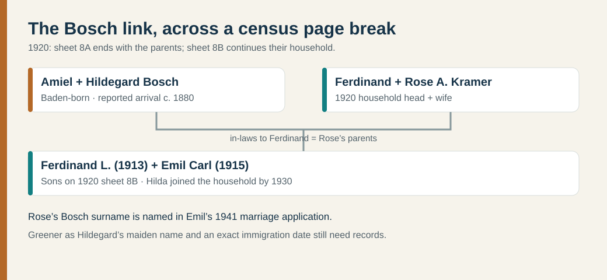

# Other paternal-side leads

These are distinct branches in the [supplied chart](../research/chart-transcription.md). The Bosch parent link is now supported by the 1920 census across two consecutive sheets; earlier names remain chart leads.

| Branch | People and current status | Record and next proof |
| --- | --- | --- |
| **Bosch** | Rose A. Bosch, wife of Ferdinand Kramer; **Amiel Bosch**, her father, born in Baden by the 1920 census. | [1920 sheet 8A](https://www.familysearch.org/ark:/61903/3:1:33SQ-GRFQ-J6P?view=index&lang=en), image 833, has Ferdinand and Rose; [sheet 8B](https://www.familysearch.org/ark:/61903/3:1:33S7-9RFQ-J7P?view=index&personArk=%2Fark%3A%2F61903%2F1%3A1%3AMFBB-JCW&action=view&lang=en), image 834, continues their household with Amiel labeled *father-in-law*. Emil's [1941 marriage application](https://www.familysearch.org/ark:/61903/3:1:33S7-9PR4-97SS?view=index&personArk=%2Fark%3A%2F61903%2F1%3A1%3AKHFH-X3X&action=view&lang=en) supplies Rose's Bosch surname. Seek Amiel's original immigration and Baden birth records. |
| **Greener** | **Hildegard Bosch**, Rose's mother, also born in Baden by the 1920 census. The chart proposes her maiden name **Greener** and parents Thomas and Elizabeth Greener. | [1920 sheet 8B](https://www.familysearch.org/ark:/61903/3:1:33S7-9RFQ-J7P?view=index&personArk=%2Fark%3A%2F61903%2F1%3A1%3AMFBB-JCW&action=view&lang=en), image 834, labels Hildegard *mother-in-law* in Ferdinand and Rose's continuing household. A birth, marriage or death record is needed for **Greener** and her parents. |
| **Froelich/Fröhlich** | Magdalena Froelich (born Trippstadt, 14 November 1808), chart's mother of Magdalena Disque; proposed parents Philippe Froelich and Eleonora Kreb. | German marriage/baptism records. A [migration card](https://migration.pfalzgeschichte.de/person/98258) independently pairs Johann Ludwig Disque and Magdalena Fröhlich as parents of **Johannes Ludwig**, but does not name Magdalena Kramer. |
| **Andrews** | Mary Andrews, mother of Ferdinand Francis Kramer; **Frank Andrews**, her father in the [1950 census](https://1950census.archives.gov/iiif/2/1950census%2F43290879-Pennsylvania%2F43290879-Pennsylvania-135713%2F43290879-Pennsylvania-135713-0005.jpg/full/full/0/default.jpg). | The census lists Frank, 62, born in New York, as Ferdinand Kramer's father-in-law in Mary and Ferdinand's household. Find Mary's birth or marriage record to confirm her mother and Frank's fuller identity. The [1939-born Ferdinand's obituary](https://www.legacy.com/person/ferdinand-francis-kramer-%28fred%29-52588560) also names Mary Andrews as his mother. |
| **Horner** | Mary Horner, chart's proposed mother of Matthew Kramer. | Matthew's birth, marriage, or death record naming both parents. |

The [1920 census continuation](https://www.familysearch.org/ark:/61903/3:1:33S7-9RFQ-J7P?view=index&personArk=%2Fark%3A%2F61903%2F1%3A1%3AMFBB-JCW&action=view&lang=en) records **Amiel, 63, and Hildegard, 68, as Baden-born** and reports immigration around **1880**. That is a reported year, not a passenger record or reason for leaving. The chart cannot justify assigning the other branches the same migration, occupations, religion, education, or wealth.

## Rose Bosch: a 1931 death record to test

Pennsylvania's [1931 death index, printed page 1,156](https://www.phmc.state.pa.us/bah/dam/rg/di/r11_090_DeathIndexes/Death_1931/D-31%20K-L.pdf#page=126) lists **Rose E. Kramer**, Wilkes-Barre, **12 June 1931**, certificate **62866**. A [cemetery compilation](https://peoplelegacy.net/rose_a_rosie_bosch_kramer-7h4.5Y) gives that same date for **Rose A. “Rosie” Bosch Kramer** and names Emil Bosch and Hilda Greener as parents. The date and place make the index entry a useful candidate for the chart's Rose Bosch, but the middle initials conflict. Neither source by itself proves that the indexed woman was Ferdinand Kramer's wife or establishes her parents. The death certificate or a contemporary obituary could resolve both questions.
