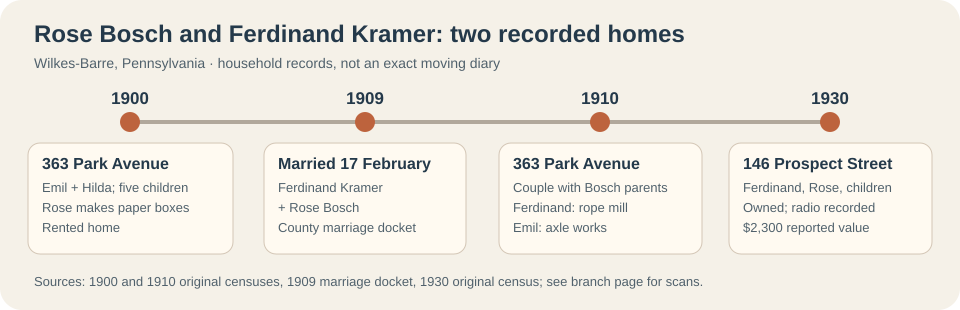

# Other paternal-side leads

These are distinct branches in the [supplied chart](../research/chart-transcription.md). The Bosch parent link is now supported by the 1920 census across two consecutive sheets; earlier names remain chart leads.

| Branch | People and current status | Record and next proof |
| --- | --- | --- |
| **Bosch** | Rose A. Bosch, wife of Ferdinand Kramer; **Amiel Bosch**, her father, born in Baden by the 1920 census. | [1920 sheet 8A](https://www.familysearch.org/ark:/61903/3:1:33SQ-GRFQ-J6P?view=index&lang=en), image 833, has Ferdinand and Rose; [sheet 8B](https://www.familysearch.org/ark:/61903/3:1:33S7-9RFQ-J7P?view=index&personArk=%2Fark%3A%2F61903%2F1%3A1%3AMFBB-JCW&action=view&lang=en), image 834, continues their household with Amiel labeled *father-in-law*. Emil's [1941 marriage application](https://www.familysearch.org/ark:/61903/3:1:33S7-9PR4-97SS?view=index&personArk=%2Fark%3A%2F61903%2F1%3A1%3AKHFH-X3X&action=view&lang=en) supplies Rose's Bosch surname. Seek Amiel's original immigration and Baden birth records. |
| **Greener** | **Hildegard Bosch**, Rose's mother, also born in Baden by the 1920 census. The chart proposes her maiden name **Greener** and parents Thomas and Elizabeth Greener. | [1920 sheet 8B](https://www.familysearch.org/ark:/61903/3:1:33S7-9RFQ-J7P?view=index&personArk=%2Fark%3A%2F61903%2F1%3A1%3AMFBB-JCW&action=view&lang=en), image 834, labels Hildegard *mother-in-law* in Ferdinand and Rose's continuing household. A birth, marriage or death record is needed for **Greener** and her parents. |
| **Froelich/Fröhlich** | Magdalena Froelich (born Trippstadt, 14 November 1808), chart's mother of Magdalena Disque; proposed parents Philippe Froelich and Eleonora Kreb. | German marriage/baptism records. A [migration card](https://migration.pfalzgeschichte.de/person/98258) independently pairs Johann Ludwig Disque and Magdalena Fröhlich as parents of **Johannes Ludwig**, but does not name Magdalena Kramer. |
| **Andrews** | Mary Andrews, mother of Ferdinand Francis Kramer; **Frank Andrews**, her father in the [1950 census](https://1950census.archives.gov/iiif/2/1950census%2F43290879-Pennsylvania%2F43290879-Pennsylvania-135713%2F43290879-Pennsylvania-135713-0005.jpg/full/full/0/default.jpg). | The census lists Frank, 62, born in New York, as Ferdinand Kramer's father-in-law in Mary and Ferdinand's household. Find Mary's birth or marriage record to confirm her mother and Frank's fuller identity. The [1939-born Ferdinand's obituary](https://www.legacy.com/person/ferdinand-francis-kramer-%28fred%29-52588560) also names Mary Andrews as his mother. |
| **Horner** | Mary Horner, chart's proposed mother of Matthew Kramer. | Matthew's birth, marriage, or death record naming both parents. |

The [1920 census continuation](https://www.familysearch.org/ark:/61903/3:1:33S7-9RFQ-J7P?view=index&personArk=%2Fark%3A%2F61903%2F1%3A1%3AMFBB-JCW&action=view&lang=en) records **Amiel, 63, and Hildegard, 68, as Baden-born** and reports immigration around **1880**. That is a reported year, not a passenger record or reason for leaving. The chart cannot justify assigning the other branches the same migration, occupations, religion, education, or wealth.

## A shared Bosch–Kramer home on Park Avenue

**Before Rose's Park Avenue years:** A run of [Ashley directories, 1890–95](https://www.myheritage.com/research/record-10705-189068458/emil-bosch-in-us-city-directories) lists **Emil Bosch's meat market at 52 Main Street** and gives “h. do.” for his home, meaning the same address in directory shorthand. The 1896 [Ashley entry](https://www.myheritage.com/research/record-10705-189068460/emil-bosch-in-us-city-directories) says he had “removed to Wilkes-Barre”; the city's [1896–98 entries](https://www.myheritage.com/research/record-10705-189068459/emil-bosch-in-us-city-directories) place him at **13 Jones Street**, first as a butcher and then a **driver**. The [1900–09 directory group](https://www.myheritage.com/research/record-10705-189068461/emil-bosch-in-us-city-directories) next places him at **363 Park Avenue**, with “butcher” in 1900–01 and “laborer” in later listed years. The [1891 Ashley Main Street map](../media/ashley-main-street-sanborn-1891.jpg) shows the commercial street where he worked, **not an identified 52 Main building**: its numbering does not give a secure match. The directory's automatic “homeowner” tag is not title evidence; neither a shop deed nor business accounts have been found. We can trace a change in listed work, but cannot say whether he sold a profitable shop, lost one, or chose different work.

The [original 1900 census](../sources/records/emil-hilda-bosch-household-census-1900.jpg) places butcher **Emil Bosch** and wife **Hilda** at **363 Park Avenue, Wilkes-Barre**, with children Lucy, Rose, Mary, Carl and Raymond. The household **rented**. Rose, about 17, worked as a **paper-box maker**; Lucy was a laundress and Mary a servant. This is a more specific view of how the family worked than the later surname tree. Emil and Hilda reported different immigration years, which need passenger or naturalization records before dating their move from Germany precisely.

The [1909 original marriage docket](../sources/records/ferdinand-rose-bosch-marriage-docket-1909.jpg) records **Ferdinand Kramer and Rose Bosch marrying on 17 February**. In the [1910 original census](../sources/records/emil-hilda-bosch-kramer-household-census-1910.jpg), Rose and Ferdinand are listed as daughter and son-in-law in **Emil and Hildegard's household at 363 Park Avenue**. The [preceding census sheet](../sources/records/bosch-park-avenue-census-1910-previous-sheet.jpg) labels the street Park Avenue. Ferdinand worked as a **rope-mill laborer**; Emil was an **axle-works oiler**, not a rope-mill worker. The next [directory group](https://www.myheritage.com/research/record-10705-189068462/emil-bosch-in-us-city-directories) lists Emil at **146 Prospect Street beginning in 1911**; an [independent 1914 transcription](https://pagenweb.org/~luzerne/towns/donnacd.htm) puts older Ferdinand there. By [1920](https://www.familysearch.org/ark:/61903/3:1:33S7-9RFQ-J7P?view=index&personArk=%2Fark%3A%2F61903%2F1%3A1%3AMFBB-JCW&action=view&lang=en), Emil and Hildegard were in their daughter's household, and [1930's original census](../sources/records/ferdinand-rose-kramer-household-census-1930.jpg) calls **146 Prospect** Ferdinand and Rose's owned home. The **1910→1911** records narrow the address change to that interval without proving a moving day, construction date or who held title in 1911.

**The house on a map:** The [1910 Sanborn insurance map, plate 36](https://www.loc.gov/resource/g3824wm.g3824wm_g08049191002/?sp=39), labels a separate dwelling **363** between **367** and **361 Park Avenue**, immediately west of **Holy Rosary R.C. Church**. Combined with both census addresses, this locates the household's **mapped building footprint during the 1910 census period**. A [1950 revised plate](https://www.loc.gov/resource/g3824wm.g3824wm_g08049195002/?sp=41) still labels a dwelling at 363, but the maps alone cannot prove the structure was unchanged, who owned it, or when the Bosch and Kramer households left. [Compare the two maps](../context/family-home-photo-atlas.md#363-park-avenue-a-mapped-house-beside-holy-rosary).

The [Holy Rosary parish history](https://www.standrewwilkesbarre.org/about-our-parish) has an **approximately 1910 photograph** of its Park Avenue church, founded in 1906. A modern [353–363 Park Avenue listing](https://www.jjnre.com/sold/353-363-park-avenue-wilkes-barre-pa-18702-11-4190.html) covers church property. The church photo gives a rare view of the block around the couple's census years, but **does not identify their house or show that the family attended the parish**. The maps distinguish the 363 dwelling from the church; the modern combined listing must not be mistaken for a photograph of that dwelling.

The 1910 schedule says Rose had **one child born and one living**, although the household list names no baby. A [FamilySearch member tree](https://www.familysearch.org/en/tree/person/details/GHY4-FZH) proposes an infant **Karl Kramer** in 1910; the [state death index](https://www.phmc.state.pa.us/bah/dam/rg/di/r11_090_DeathIndexes/Death_1910/D-10%20K-L.pdf#page=135) confirms a same-name Wilkes-Barre death that July but does not name parents. Karl's relationship remains a lead until certificate **72159** or another parent-naming record is read. [Current 363 Park Avenue view and continuity caution](../context/family-home-photo-atlas.md).

## Rose Bosch: a 1931 death record to test

Pennsylvania's [1931 death index, printed page 1,156](https://www.phmc.state.pa.us/bah/dam/rg/di/r11_090_DeathIndexes/Death_1931/D-31%20K-L.pdf#page=126) lists **Rose E. Kramer**, Wilkes-Barre, **12 June 1931**, certificate **62866**. A [cemetery compilation](https://peoplelegacy.net/rose_a_rosie_bosch_kramer-7h4.5Y) gives that same date for **Rose A. “Rosie” Bosch Kramer** and names Emil Bosch and Hilda Greener as parents. The date and place make the index entry a useful candidate for the chart's Rose Bosch, but the middle initials conflict. Neither source by itself proves that the indexed woman was Ferdinand Kramer's wife or establishes her parents. The death certificate or a contemporary obituary could resolve both questions.
