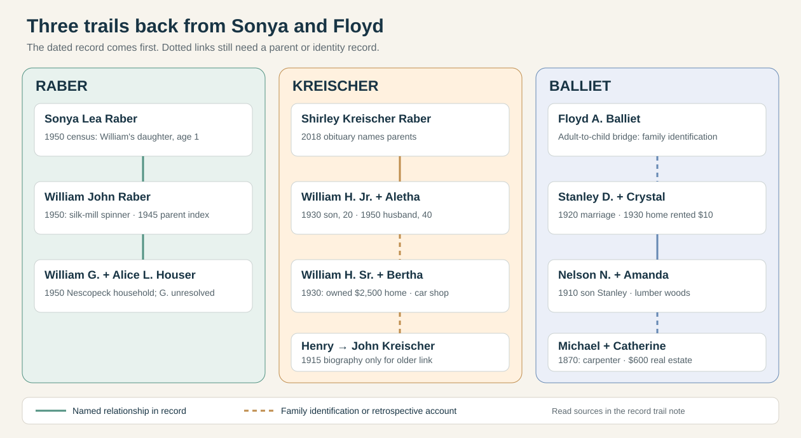
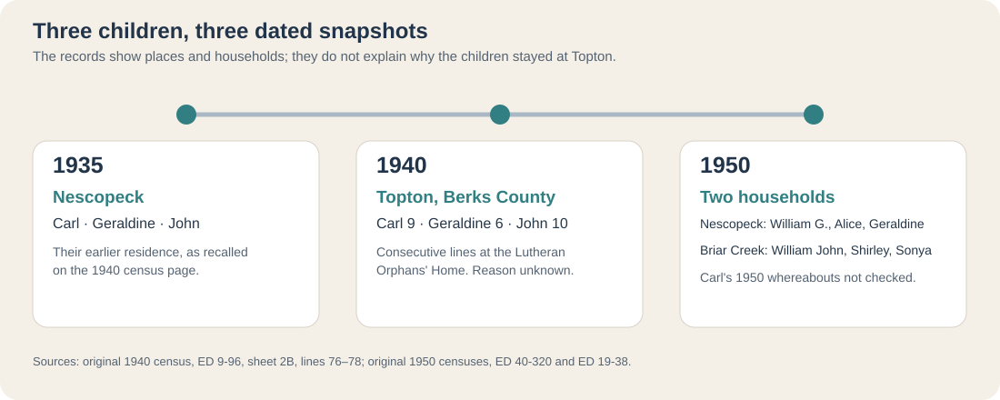
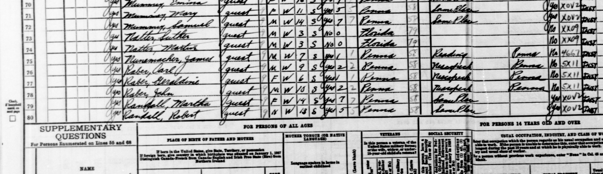
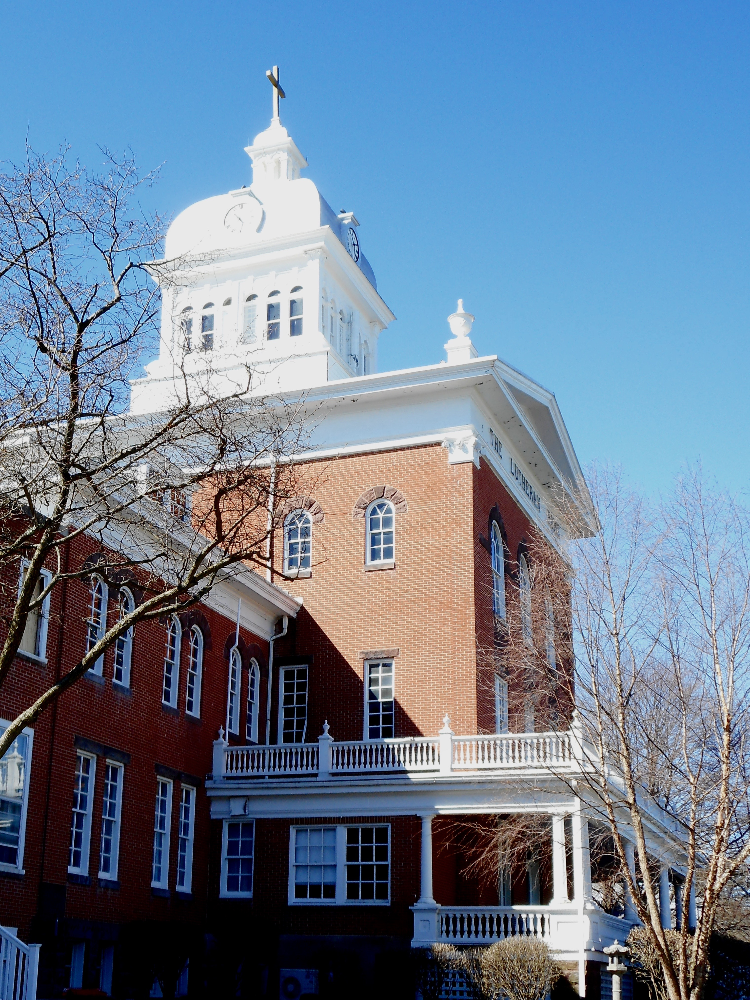
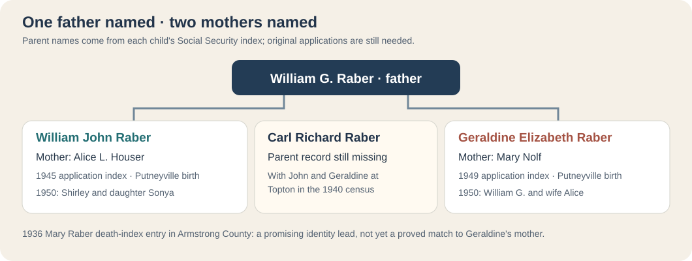

# Raber, Kreischer and Balliet: the records that take Sonya's family back

The three trails meet in the family of **Sonya Raber Balliet and Floyd A. Balliet**. The census and marriage records below add names, work and dated property clues. A dashed link in the diagram means the relationship is still based on Justin's family identification or a strong same-person match; it is not an invitation to fill the gap from a member tree.

| Line | Earliest person connected by the records reviewed here | What the records actually add |
| --- | --- | --- |
| **Raber** | **William G. Raber and Alice L. Houser**, named as William John's parents in a [Social Security applications index](https://www.myheritage.com/research/record-10863-50098875/william-john-raber-in-us-social-security-applications-claims) | [William John, Shirley and Sonya together in 1950](../sources/records/william-shirley-sonya-raber-census-1950.jpg). William was a **silk-mill spinner**. The mill is not named. |
| **Kreischer** | **John Kreischer (1809–1896)**, named retrospectively in the [1915 profile of his grandson](../sources/records/william-h-kreischer-biography-1915-656.jpg) | [1930 census](../sources/records/william-bertha-younger-william-kreischer-census-1930.jpg) directly places elder and younger William H. together. It records the elder's **$2,500 owner-occupied home**, his car-shop shipping job, and the younger William's department-store work. |
| **Balliet** | **Michael and Catherine Balliet**, in the [1870 Dorrance household](../sources/records/michael-catherine-nelson-balliet-census-1870.jpg) with two-year-old Nelson | Michael was a **carpenter** with **$600 reported real estate**. A [1910 census](../sources/records/nelson-amanda-stanley-balliet-census-1910.jpg) names Nelson's son Stanley; the [1920 marriage index](https://www.myheritage.com/research/record-20625-1154827/stanley-d-balliet-and-crystal-m-rinehimer-in-pennsylvania-marriages) names Stanley's parents **Nelson Balliet and Amanda Ruckel**. |

## 1870–1930: the Balliets around Dorrance

The [1870 original, Dorrance Township, page 11, lines 21–28](../sources/records/michael-catherine-nelson-balliet-census-1870.jpg) lists **Michael, 35; Catherine, 35; and six younger Balliets**, ending with Nelson, age two. The census does not print relationships; their position and later records make Nelson their strong probable son. Michael's **$600 real-estate** figure is a census valuation, not an estate appraisal or a measure of wealth passed to Nelson. His occupation is **carpenter**. A member tree proposes Michael's parents as Samuel Balliet and Hannah Seiwell, but an original Michael-as-child record has not been checked; the connected line stops with Michael and Catherine for now.

The [1910 original, Dorrance Township, sheet 7A, lines 19–28](../sources/records/nelson-amanda-stanley-balliet-census-1910.jpg) explicitly calls **Stanley D., 12**, a son of **Nelson N., 42**, and wife **Amanda J., 40**. Nelson and two older sons were recorded as **choppers in lumber woods**; Stanley was a **farm laborer working out**. The [1920 Pennsylvania marriage index](https://www.myheritage.com/research/record-20625-1154827/stanley-d-balliet-and-crystal-m-rinehimer-in-pennsylvania-marriages) names Stanley's parents as **Nelson Balliet and Amanda Ruckel**, and Crystal's as **George Rinehimer and Sarah Stair**. It dates the Stanley–Crystal marriage to **1 November 1920, Luzerne County**. This is an indexed entry; its [original FamilySearch image](https://www.familysearch.org/ark:/61903/3:1:33S7-9PRW-YVL?lang=en) required a sign-in during this pass and was not viewed.

The [1930 Dorrance original, sheet 6A, lines 8–15](../sources/records/stanley-crystal-balliet-census-1930.jpg) shows **Stanley and Crystal** with six children. It lists their home as **rented for $10 per month**. The [original Pennsylvania death index, page 144](../sources/records/stanley-balliet-pa-death-index-1937-p144.png) records Stanley Balliet's death in **Nanticoke on 25 December 1937** and points to certificate **117901**. By the [1940 original](../sources/records/crystal-balliet-household-census-1940.jpg), Crystal was widowed with eleven children at home, including one-year-old Floyd; the home was again recorded as rented at **$10 per month**. Justin says Stanley was Floyd's father, which would make Floyd a posthumous son, but a birth or parent-naming record has yet to establish that independently. The matching rented figures do not show whether they occupied the same dwelling.

## 1909–50: two William Kreischers, then Shirley and Sonya

The [1915 Columbia County biography](../sources/records/william-h-kreischer-biography-1915-656.jpg) names **William Henry born in 1909** as a son of **William H. Kreischer (born 1878) and Bertha Stuart**. Its earlier **John → Henry → William H.** chain is a published retrospective account; John reportedly farmed 80 acres and operated a quarry. The [1930 original, Berwick sheet 15A, lines 7–16](../sources/records/william-bertha-younger-william-kreischer-census-1930.jpg) independently lists **William H., 51, and Bertha, 46**, with their **son William H., 20** and seven other children. The elder William worked in **shipping at a car shop** and reported an **owned home valued at $2,500**. The younger William worked in a **department store sugar department**; Ruth was a **public-school teacher**. The recorded ages and parent names make the 1915 child-to-1930 son match strong.

The [1950 original, Berwick ED 19-9, line 11](../sources/records/william-aletha-kreischer-census-1950.jpg) has **William H., 40**, wife **Alethea, 41**, and a six-year-old son. Along with [Shirley's 2018 obituary](https://familysearch.org/ark:/61903/1:1:61FN-QJ7Z?lang=en), which names William and Aletha as her parents, this is strong continuity with the 1930 younger William; the 1950 sheet itself does not name his parents. An original marriage or death certificate naming them would complete the identity bridge. The 1915 biography's **80 acres** and the 1930 **$2,500 house** refer to *different generations and asset types*; neither proves that land or money was inherited by Shirley.

## 1935–50: three Raber children and the parent bridge

**A striking 1940 snapshot:** On the [original census page for the Lutheran Orphans' Home at Topton](../sources/records/raber-children-topton-census-1940.jpg), **Carl Raber, 9; Geraldine Raber, 6; and John Raber, 10** appear on consecutive lines **76–78**. Each child's 1935 residence is recorded as **Nescopeck, Pennsylvania**. The institution's [later alumni list, page 239](https://www.diakon.org/v3_assets/contentfiles/177/150th-anniversary/A%20Gift%20of%20Love%20-%20low%20res.pdf#page=239) gives their fuller names together: **Carl Richard, Geraldine Elizabeth, and William John Raber**. The page itself says only that they were guests at the home, not why they went there or how long they stayed. Diakon's [institutional history](https://www.diakon.org/about-us/history/historical-overview/) describes care for fatherless or motherless children **and for children who were homeless or destitute**; the word *orphan* in its name cannot establish that a Raber parent had died. William G. and Alice L. appear in the 1950 census.

*Left: detail from the [full 1940 census](../sources/records/raber-children-topton-census-1940.jpg), National Archives. Right: the historic Old Main building photographed in **2017** by Smallbones, [CC0 via Wikimedia Commons](https://commons.wikimedia.org/wiki/File:Lutheran_Home_Topton_PA_nrhp.jpg). The later exterior helps locate the institution; it is not a photo of the children or of the building as they saw it in 1940.*

The [Social Security applications-and-claims index for William John Raber](https://www.myheritage.com/research/record-10863-50098875/william-john-raber-in-us-social-security-applications-claims), reflecting a **July 1945** application, names his father **William G. Raber** and mother **Alice L. Houser**. It reports a **Putneyville, Armstrong County** birth in 1930. The original application was not displayed, so this is a checked federal *index*, not the applicant's handwriting. It gives only **G.** for his father: Justin recalls **George** and a member tree says **Glenmore**. Neither expansion is proved.

The [1950 original, Briar Creek Borough ED 19-38, sheet 3, lines 5–7](../sources/records/william-shirley-sonya-raber-census-1950.jpg) explicitly lists **William J. Raber, 20**, wife **Shirley Y., 18**, and daughter **Sonya Lea, one**. William reported **spinner at a silk mill** and **56 hours worked** the prior week. This establishes Sonya's father directly in a household record and fits Shirley's later obituary. It does not identify the mill as Duplan or give pay or assets.

A separate [1950 Nescopeck household, ED 40-320, sheet 26B](../sources/records/william-alice-raber-census-1950.jpg) lists **William G. Raber, 40**, wife **Alice L., 43**, **daughter Geraldine E., 16**, and **Oliver F. Houser** as William's brother-in-law. Name, age, the Houser relative, and Geraldine's matching name/age/place make a strong bridge from the 1940 Geraldine to this household. William John was already in his own home and is not on that sheet. **Ruth P. Grimes** is labeled William G.'s stepdaughter; her presence suggests a more complex household history than a single undated marriage.

The third child appears on a [1950 Shickshinny original, ED 40-423, sheet 9](../sources/records/carl-edna-raber-census-1950.jpg): **Carl R. Raber, 19**, is married to **Edna R.**, the daughter of household head **Charles S. Switzer**. Carl worked as a **laborer for an anthracite coal company**; Edna did restaurant domestic work. Charles worked as a coal miner. Five-year-old **John E. Andrews** is listed as Charles's grandson; the census alone does not name John's father. Carl's sampled line records **48 weeks of work and $1,200 in employee wages in 1949**, an individual reported amount rather than household wealth. It also records **tenth grade as his highest grade attended**, without marking the grade completed. By this date, the three Topton children were recorded in **three different households**: Geraldine with William G. and Alice, William John with Shirley and Sonya, and Carl with Edna and the Switzers.

**A maternal split changes this story:** Geraldine Elizabeth's [FamilySearch NUMIDENT index](https://www.familysearch.org/ark:/61903/1:1:6K9J-YVYX?lang=en) names **William G. Raber and Mary Nolf** as her parents. It reports her **21 December 1933 Putneyville birth** and a **March 1949** application. William John's [separate application index](https://www.myheritage.com/research/record-10863-50098875/william-john-raber-in-us-social-security-applications-claims) names **William G. Raber and Alice L. Houser**. The shared father name and Putneyville births, plus the Topton and 1950 household sequence, make them **likely paternal half siblings**. Alice was William G.'s wife when Geraldine was called his daughter in 1950; the new index identifies **Mary**, not Alice, as Geraldine's birth mother. The original applications and birth records would strengthen this identification.

An [original Pennsylvania death-index page](../sources/records/mary-raber-pa-death-index-1936-p56.png) has **Mary Raber, Armstrong County, 11 November 1936, certificate 100192**. A [FamilySearch member tree](https://www.familysearch.org/en/tree/person/details/9KP4-CC3) proposes **Mary Grace Nolf Raber** with that same death date, making the index a promising lead for Geraldine's mother. The state index itself does **not** give Mary's maiden name, husband, children or cause of death. An [original 1930 Mahoning Township census](../sources/records/william-mary-raber-census-1930.jpg) shows a **19-year-old William G. Raber** and wife **Mary R., 20**, renting for **$9 monthly**; William was a **railroad laborer**. The place, names and ages make this a candidate earlier household, but the original does **not** supply Mary's maiden name, and its **R.** initial and Pennsylvania birthplace conflict with parts of the member tree's Mary Grace Nolf profile. Neither woman's identity with Geraldine's mother is proved. The member tree also has an infant Carl who died in 1936; he **cannot** be the Carl, age nine, at Topton in 1940.

A [2010 *Times Leader* obituary index for Carl Richard](https://www.familysearch.org/ark:/61903/1:1:QVTY-8NZW?lang=en) names **William and Alice Raber** as his parents and lists **Geraldine Howard and William John Raber** as siblings. This retrospective account strengthens the identification of the Topton trio as one family, but does not say whether Alice was Carl's birth mother or a later parent. It also calls Carl a **foreman** without naming his industry. His original birth or Social Security application would clarify parentage. Neither the obituary nor the census explains why the three children entered the home.

## Records that would move the lines further

1. **Raber:** William John's and Geraldine's original Social Security applications; **Mary Raber's 1936 death certificate 100192** to test whether she was Mary Nolf and what happened; Carl Richard's parent-naming record; the children's Topton admission/discharge files to learn why and when they stayed; and a marriage or birth record to test whether the **1930 William G./Mary R.** couple is the later family. A parent record for William G. could then extend the line and distinguish **George/Glenmore**.
2. **Kreischer:** the younger William and Aletha's marriage return or William's death certificate, plus John Kreischer's deeds, estate or church records to test the 1915 biography's farm and quarry and name his parents.
3. **Balliet:** Stanley's original 1920 marriage return; Michael's childhood census or baptism to test proposed parents **Samuel and Hannah**; Floyd's parent-naming record and an adult record linking him to Sonya and Crystal; the original 1937 death notice/certificate. The 1870, 1910, 1930 and 1940 sheets currently give a strong household sequence through Michael → Nelson → Stanley → Crystal's children, with the exact Floyd-to-adult identification still from family knowledge.

The saved scans are listed with provenance in the [image register](../sources/records/README.md) and [source log](../research/sources.md). They are records of people, homes and work, **not portraits** of the relatives.
