# Raber, Kreischer and Sponenberg: Sonya's Berwick line

For Daniel's earlier work, the 1901 household clues and the separate possible immigrant branch, see the [Sponenberg deep dive](sponenberg-deep-dive.md).

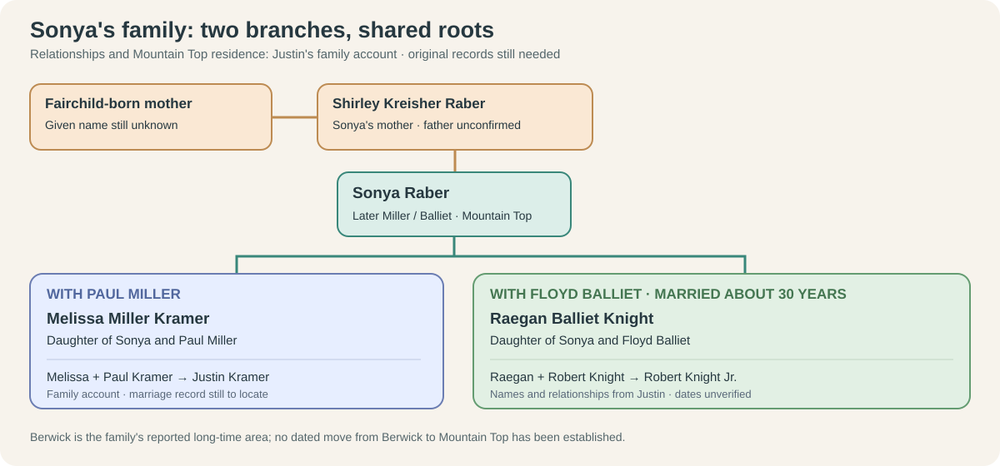

**The record bridge:** [Shirley Yvonne Raber's 2018 obituary](https://familysearch.org/ark:/61903/1:1:61FN-QJ7Z?lang=en) names daughter **Sonya Balliet (Floyd)** and Shirley's parents **William Kreischer and Aletha Sponenberg**. The [1940 census index](https://familysearch.org/ark:/61903/1:1:KQ8L-MP7?lang=en) independently places eight-year-old Shirley with William H. and Alethea Kreischer in Berwick. A [1915 county biography](https://jetty.klnpa.org/_flysystem/fedora/2023-11/historicalbiogra02chic.pdf#page=187) names Aletha's parents and earlier Sponenbergs. The obituary is a family-supplied published account; the biography was contemporary for Edward, retrospective for Daniel.

| Generation going back from Melissa | People | Evidence and limit |
| --- | --- | --- |
| Melissa's mother | **Sonya Raber / Balliet** | The obituary calls her Shirley's daughter and names Floyd; Justin identifies Melissa as Sonya's daughter with Paul Miller. That last link still needs a parent-naming record. |
| Grandmother | **Shirley Yvonne Kreischer Raber (1932–2018)** | Obituary names parents and four children; 1940 census corroborates her childhood household. Records use *Kreischer*; family memory used *Kreisher*. |
| Great-grandparents | **William H. Kreischer Jr. and Aletha Fae Sponenberg** | Obituary and census name the couple; 1915 biography names Aletha as Edward's daughter, born 1908. A second 1915 biography names a Berwick **William Henry**, born 1909, as the elder William H. Kreischer’s son. The age, name, town and later *Jr.* designation make this a strong candidate, but an original parent-naming bridge is still needed. Justin identifies **William John Raber** as Shirley's children's father; a parent-naming record for Sonya remains to be found. |
| Earlier Sponenbergs | **Edward J. Sponenberg + Jennie Edora Mensinger** → **John Leonard Sponenberg + Emma Hartman** → **Daniel Sponenberg + Hannah Shellhammer** | The 1915 biography names them. Hannah's family Bible independently lists John Leonard among Daniel and Hannah's children; the John → Edward link still rests on the biography. |

## Three older branches named in 1915

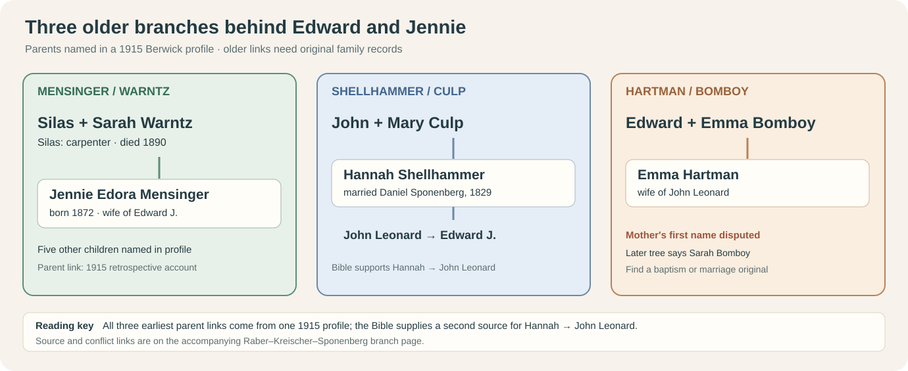

The [1915 profile of Edward J. Sponenberg](../sources/records/edward-sponenberg-biography-1915-187.jpg) extends **three ancestral branches**. It identifies his wife **Jennie Edora Mensinger (born 1872)** as the daughter of **Silas Mensinger and Sarah Warntz**; his grandmother **Hannah Shellhammer** as the daughter of **John Shellhammer and Mary Culp**; and his mother **Emma Hartman** as the daughter of **Edward Hartman and Emma Bomboy**. The author was writing decades after the earlier parents lived, so these are named leads that need direct birth, baptism or marriage records.

| Household | What the 1915 profile adds | Next check |
| --- | --- | --- |
| **Silas + Sarah (Warntz) Mensinger** | Silas worked as a **carpenter**, reportedly throughout his life. Their listed children are **John Franklin, Albert Pierce, Ada Alice, Anna Belle, Jennie Edora and William Jacob**. It reports Silas died **2 April 1890**, age 51, and was buried at **Shaffer Church, Luzerne County**; Sarah died at about 60 and was buried at **Cabin Run, Columbia County**. | Original church baptisms, census households and cemetery registers; neither burial nor the children's complete list is yet independently checked. |
| **John + Mary (Culp) Shellhammer** | Named as parents of **Hannah**, who married Daniel Sponenberg in **1829**. This takes that branch one generation behind Hannah. | A record naming Hannah with these parents, then Mary's own Culp parents. A same-name online genealogy is not enough. |
| **Edward + Emma (Bomboy) Hartman** | Named as parents of **Emma Hartman**, who married John Leonard Sponenberg. | A [separate researcher tree](https://jowest.net/Genealogy/John/Christian/Sponenberg.htm) instead calls her mother **Sarah Bomboy**. Find Emma Hartman's baptism, marriage or death record before choosing the mother's given name. |

The profile describes Edward as especially well known in Berwick through his store purchasing job. That is **the profile writer's assessment**, not a measure of fame or family wealth. It also says he descended from some of the first German settlers **of Columbia County**—**county, not country**—but names none of those immigrants. Its job and burial details give concrete record searches; they do not establish wages, estate size or social standing for the whole family.

It also lists **nine children** of Daniel and Hannah Sponenberg: **James, Mary Jane, Alexander, Fannie M., Legrand, Abraham, Mahala, John Leonard and Dorcas D.** Alexander and Abraham reportedly died young. The profile gives John Leonard and Emma Hartman **two children**, **Edward J.** and **Margaret**. The [family Bible](../sources/records/hannah-sponenberg-family-bible-births.jpg) independently names John Leonard and Legrand in Daniel and Hannah's household; the other listed sibling relationships still need household or vital-record checks.

Paulene Miller Beach separately remembered **Richard and Dale “Spoonenberg”** as childhood neighbors in Berwick. Their [likely household and the unproved possible link to Aletha's line](miller-gower-reese.md#were-the-neighborhood-sponenbergs-related-to-aletha) are shown side by side; shared surname and town alone do not establish a cousin relationship.

## Berwick work and a home

The [printed 1915 biography, page 807](../sources/records/edward-sponenberg-biography-1915-187.jpg) says **Daniel** had common-school education, worked as a canal and bridge contractor in the late 1820s, then farmed. A [contemporary canal commissioners' table, printed page 98](../sources/records/daniel-sponenberg-canal-report-1827-113.jpg) lists a **Daniel Sponenberg** as a successor contractor on the **Susquehanna Division between the Juniata mouth and Northumberland** in December 1827. It supports the occupation, but does not identify him as this same grandfather or verify the biography's distinct **Rupert-to-Berwick** project. The table's costs and payments are not personal profit or family wealth.

The biography says Daniel's son **John L.** attended country schools while working the family farm. Grandson **Edward J.** worked three years in the **American Car and Foundry rolling mill**, then became **Berwick Store Company's purchasing agent**. It reports that Edward built a Berwick home in **1907**. This is evidence of occupation and reported home building, not a deed, price, mortgage or net-worth estimate. Edward and Jennie's daughter **Aletha Fae** is the Aletha named as Shirley's mother in the later obituary.

### The Berwick silk-mill memory

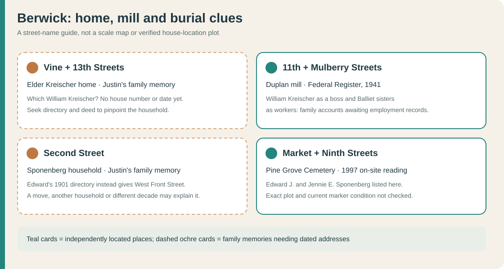

Justin remembers **Sonya's grandfather William Kreischer** as a **boss at the Duplan silk mill**, **Balliet sisters** working there, the older **Kreischers at Vine and 13th Streets**, and **Sponenbergs on Second Street**. A [1941 federal notice](https://www.govinfo.gov/content/pkg/FR-1941-11-20/pdf/FR-1941-11-20.pdf) actually locates **Duplan Corporation at 11th and Mulberry Streets** in Berwick, and a [1943 notice](https://www.govinfo.gov/content/pkg/FR-1943-04-06/pdf/FR-1943-04-06.pdf) lists cotton, silk, rayon, nylon and synthetic-thread work there. That establishes the local workplace and what it made; **the individual jobs and rank are still family accounts**. The [Smithsonian's Duplan history](https://www.cooperhewitt.org/2018/09/13/french-silks-from-pennsylvania/) explains that Jean Duplan opened his first Pennsylvania mill after the **1897 tariff** made importing European silk costly; his firm later ran five Pennsylvania mills. That describes the company's path, not a reason any named relative moved.

The [1901 Berwick directory](../sources/records/sponenberg-berwick-directory-1901-p169.jpg) puts **Edward J. Sponenberg on West Front Street**. Second Street may refer to a different family member or a later move; no address or decade is attached to that memory. Likewise, **Vine/13th** needs a named household and date from a directory or deed before the map can mark a home site. The [1997 Pine Grove on-site reading](https://www.pa-roots.com/columbia/townships/briarcreek/pinegrovemarketstreetcemetery.html) independently places Edward and Jennie's markers at **Market and Ninth**.

## The other side of Shirley's grandparents: a 1915 Kreischer profile

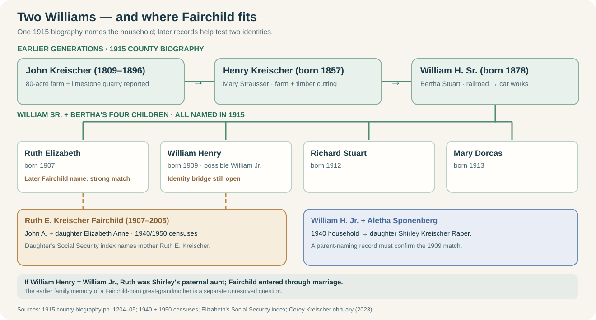

<a href="../sources/records/william-h-kreischer-biography-1915-656.jpg">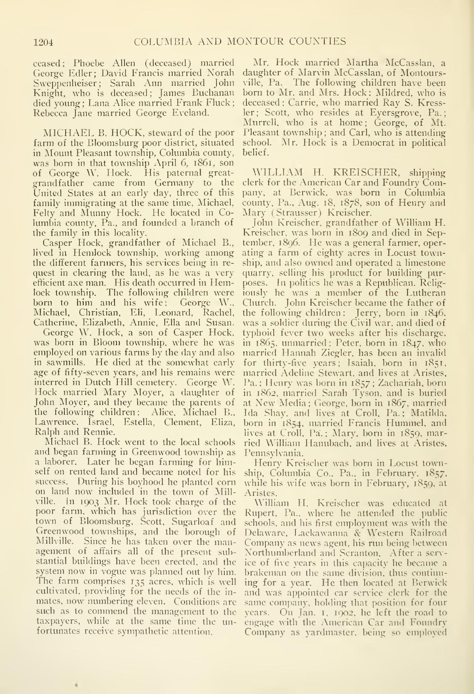</a> <a href="../sources/records/william-h-kreischer-biography-1915-657.jpg">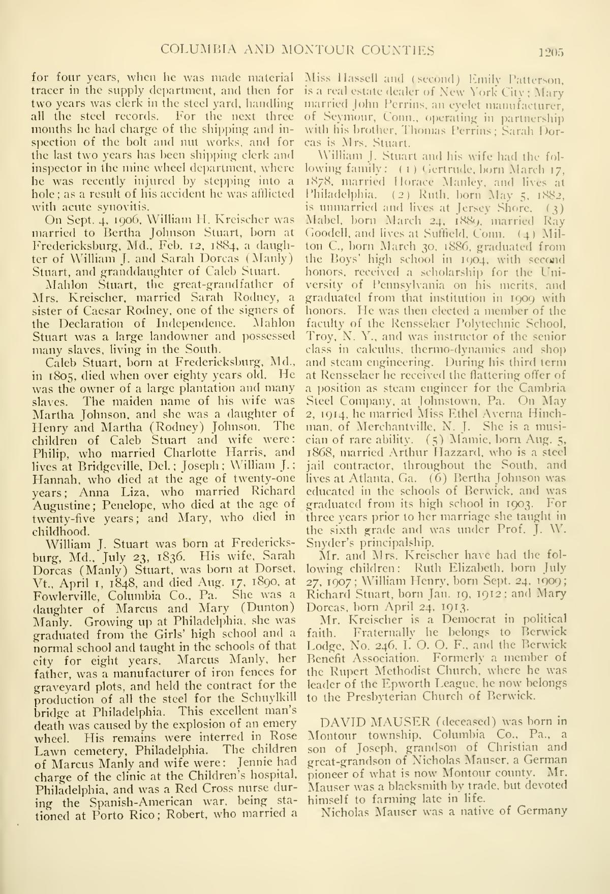</a>

The [printed 1915 profile, pp. 1204–05](../sources/records/william-h-kreischer-biography-1915-656.jpg), describes **William H. Kreischer (born 1878)**, a Berwick shipping clerk at American Car and Foundry, and names his parents **Henry and Mary (Strausser) Kreischer**. It says grandfather **John Kreischer (1809–1896)** farmed **80 acres** in Locust Township and also operated a limestone quarry. The 80 acres are a historical claim about John's farm, **not** a valuation or evidence of inherited wealth. William and **Bertha (Stuart)** Kreischer had four children named by 1915: **Ruth Elizabeth (born 27 July 1907), William Henry (24 September 1909), Richard Stuart (19 January 1912), and Mary Dorcas (24 April 1913)**. A later [burial listing](https://peoplelegacy.com/ruth_e_kreischer_fairchild-482j331) names **Ruth E. Kreischer Fairchild (1907–2005)** at Pine Grove Cemetery Annex in Berwick. A [daughter's Social Security index](https://www.familysearch.org/ark:/61903/1:1:6K9T-47TG?lang=en) now joins **Ruth E. Kreischer** with **John A. Fairchild** directly; the original marriage return remains uninspected. Shirley's father is later called **William H. Jr.**, born about 1909 in the [1940 household](https://familysearch.org/ark:/61903/1:1:KQ8L-MP7?lang=en); [Corey Kreischer's 2023 family obituary](https://www.krinerfuneralhomes.com/obituaries/corey-kreischer) calls him William H. Jr. and names Alethea Sponenberg as his wife. That pattern strongly favors the 1915 William Henry being Shirley's father, but no original record inspected here names the younger man's parents.

The account gives the elder William a change of trade: **public school in Rupert → railroad brakeman and car-service clerk → American Car and Foundry yard and supply work**. It says he developed painful knee inflammation after stepping into a hole in the wheel department; this is the biographer's report, not a medical record. His father Henry reportedly farmed and cut timber under contract for Jackson & Woodin Manufacturing Company. John’s son **Jerry** was said to have served in the Civil War and died of typhoid after discharge; an individual service record is needed to test the story. William's church and Odd Fellows roles show how the writer situated him in Berwick civic life, but do not measure reputation.

The same two pages make striking claims about Bertha Stuart's older family: a Maryland ancestor reportedly held a plantation and enslaved people, and another was said to have married a sister of **Caesar Rodney**. These are **retrospective lineage claims within a family biography**, not yet linked to original deeds, wills or marriage records. They imply neither that Shirley's household inherited land nor that a signer of the Declaration was her direct ancestor.

## Hannah's Bible and a Union cavalry brother

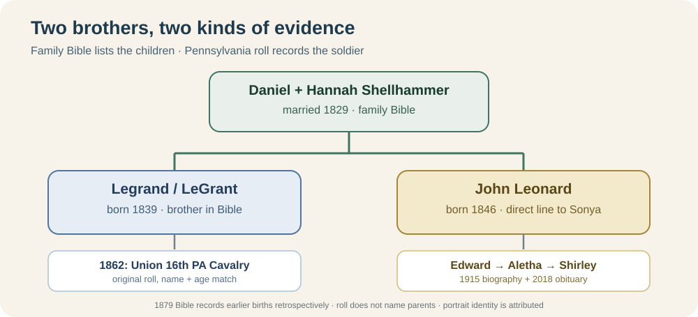

The diagram separates the **Bible's parent–child entries** from the **cavalry roll's soldier entry**. The matching name and age connect the two sources strongly, while the roll itself gives no parent names.

The [photographed family Bible](https://jowest.net/Genealogy/John/Christian/HannahSponenbergBibleBirths.htm), published online with its private owner's attribution, lists **Daniel Sponenberg**, **Hannah Shellhammer**, and sons **Legrand (27 August 1839)** and **John Leonard (28 March 1846)**. Its [marriage page](../sources/records/hannah-sponenberg-family-bible-marriages.jpg) records Daniel and Hannah's **5 February 1829** marriage; its [deaths page](../sources/records/hannah-sponenberg-family-bible-deaths.jpg) records Daniel's death in **1856** and Hannah's in **1889**. The book is dated **1879**, so earlier entries were written after the events. Its names and John Leonard's birth date agree with the 1915 biography, strengthening the brother relationship.

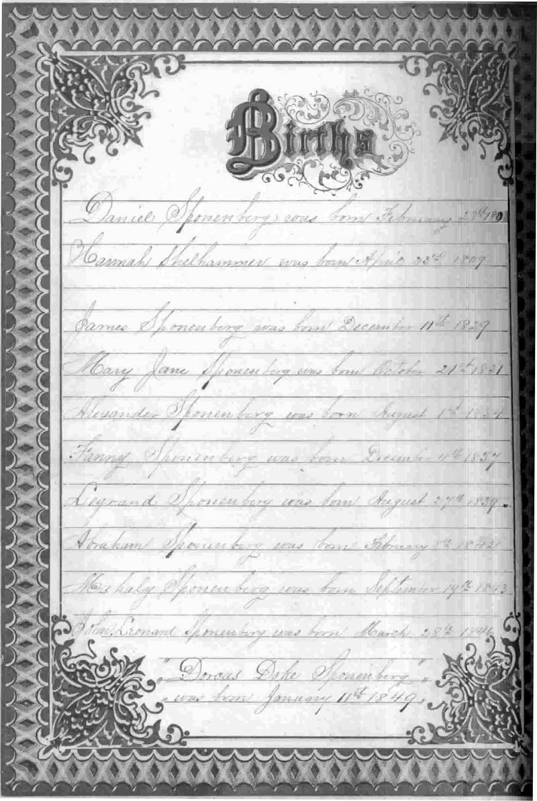

Pennsylvania's [original Company E register](../sources/records/legrant-sponenberg-16th-cavalry-register-1862.jpg) lists **“Sponeberg, Legrant”** (handwriting uncertain), **private, age 23**, mustered **2 October 1862** in the **16th Pennsylvania Cavalry (161st Volunteers)**. Age 23 fits the Bible's 1839 birth. A [published roster transcription](https://www.pa-roots.com/pacw/cavalry/16thcav/16thcavcoe.html) renders the surname **Spomberg** and says he transferred to Company I, date unknown. The [National Park Service unit history](https://www.nps.gov/civilwar/search-battle-units-detail.htm?battleUnitCode=UPA0016RC) confirms this was a **Union** regiment. These sources strongly identify Daniel's son as the soldier; the roll itself does not name his parents or establish any individual battle.

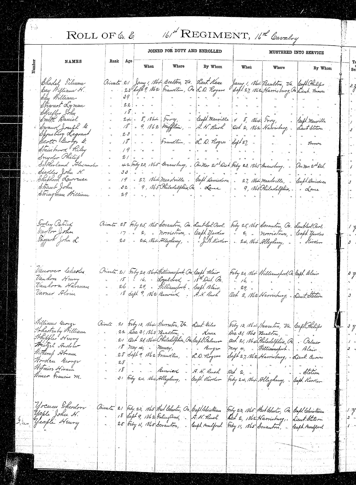

The [family archive that supplied the portrait](https://jowest.net/Genealogy/John/Christian/LegrantSponenbergCivilWar.htm) identifies the rider as Legrant and reports a **1879 pension application**, certificate **365901**. The picture itself has no visible name inscription; its identity and the pension number still need an independent check. Photographer's imprint: **B. Fenstermaker, Berwick**. The regiment's Virginia campaigns give context, not proof that Legrand fought in a named battle.

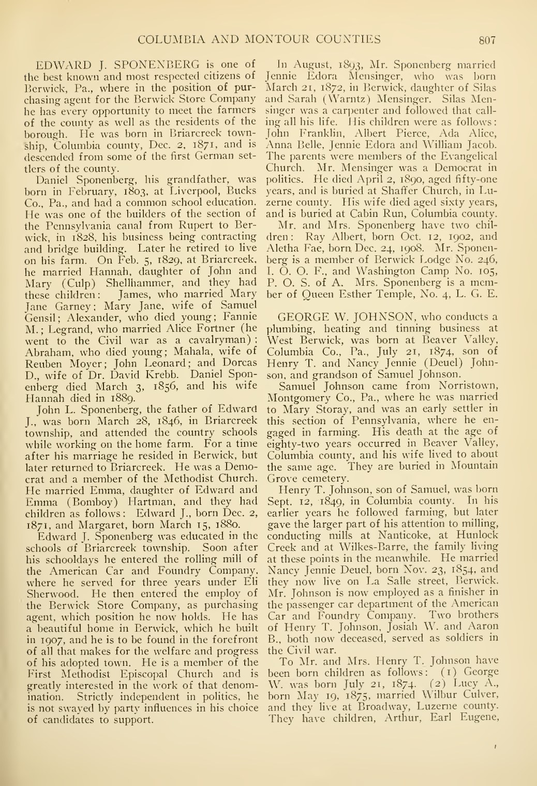

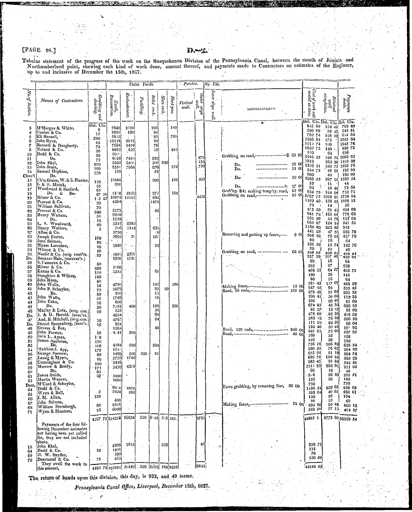

**Place caution:** the biography calls Daniel's 1803 birthplace “Liverpool, Bucks Co.” That pairing is inconsistent with the [Pennsylvania State Archives municipality history](https://www.phmc.state.pa.us/bah/dam/rg/di/IncorporationDatesForMunicipalities/pdfs/perry.pdf?catid=50) for Liverpool in present-day Perry County, laid out in 1808. It may refer to another locality or be a printing error; no Liverpool birthplace is pinned on the map.

## Shirley's family and work

The [2018 obituary](https://familysearch.org/ark:/61903/1:1:61FN-QJ7Z?lang=en) names Shirley's children **Sonya Balliet (Floyd)**, **Bill Raber (Alice)**, **Tom Raber (Pamela)** and **Wendy Corneilous (Tim)**. This resolves Justin's remembered Alice, Bill, Wendy, Tim and Tom: Bill, Tom and Wendy are named as Shirley's children; Alice, Pamela and Tim appear as spouses. The obituary also names Shirley's brothers **Kirby** and **Corey Kreischer**. It calls **Clarence Sassaman** her companion, which does not establish a marriage. It does not name the father of her children. Justin identifies **William John Raber** as Sonya's father, and his father as **William George Raber**. A [FamilySearch member tree](https://www.familysearch.org/en/tree/person/GLDZ-TLJ) also proposes **William John Raber (1930–1995)** as Shirley's spouse. A [separate FamilySearch tree profile](https://ancestors.familysearch.org/en/GHK7-5KP/william-glenmore-raber-1911) attributes William John's father as **William G. Raber** in a Social Security NUMIDENT index, but expands the middle initial to **Glenmore**, conflicting with Justin's **George**. Neither tree profile substitutes for the underlying application or a parent-naming record for Sonya. Keep the grandfather as **William G. (George per family)** until the original record resolves it.

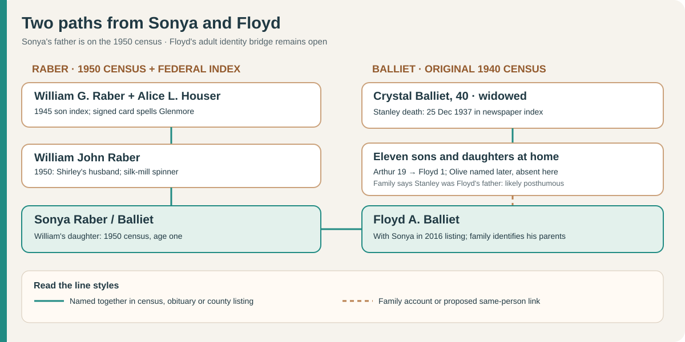

The Raber trail now has **three named generations**: Sonya → William John → William G. The [original 1940 Dorrance census](../sources/records/crystal-balliet-household-census-1940.jpg) confirms **Crystal Balliet and eleven children**, including a one-year-old Floyd; her home was rented at **$10 a month**. Justin identifies **Stanley and Crystal as Sonya's Floyd's parents**. A [newspaper-index transcription](https://genealogytrails.com/penn/luzerne/1937_deaths/a_b_c.html) puts Stanley Balliet's death on **25 December 1937**, making Floyd a likely **posthumous son** if both identifications are correct. No inspected record yet independently joins the census child to **adult Floyd A. with Sonya**. [Focused Balliet and Raber research note](balliet-raber-candidates.md).

Shirley reportedly worked at **Consolidated Cigar** while raising her family, then served as a **Berwick Area School District crossing guard**. She earned a **GED in 1987**, around age 55. The obituary gives no wage, employment dates or estate value.

**A family burial route near Berwick:** Shirley's [2018 obituary](https://www.familysearch.org/ark:/61903/1:1:61FN-QJ7Z?lang=en) explicitly names **Elan Memorial Park**. Contributor memorials also place her parents [William H. Kreischer Jr.](https://www.findagrave.com/memorial/132713568/william_henry-kreischer) and [Aletha Sponenberg Kreischer](https://www.findagrave.com/memorial/132713625/alethea_faye-kreischer) there, both in **Fountain Lawn**. Going back, a [1997 on-site transcription at Pine Grove Cemetery, Market and Ninth Streets](https://www.pa-roots.com/columbia/townships/briarcreek/pinegrovemarketstreetcemetery.html) lists **Edward J. (1871–1959)** and **Jennie E. (1872–1954) Sponenberg** together with **Clark L. (1899–1900)**. Clark's relationship to them is not stated. [Daniel](https://www.findagrave.com/memorial/17023345/daniel-sponenberg), [Hannah](https://www.findagrave.com/memorial/17023365/hannah-sponenberg), and son [John Leonard](https://www.findagrave.com/memorial/17817858/john_leonard-sponenberg) are memorialized at **Briar Creek Union Cemetery**. The on-site transcription identifies the Pine Grove site more firmly than a memorial alone; an exact plot and fresh stone photographs remain open. [Four-cemetery locator](../maps/berwick-family-cemeteries.svg) · [visit guide](../context/family-burial-places.md).

## Sonya's later family

Justin says **Sonya** lives in the **Mountain Top, Pennsylvania** area with husband **Floyd Balliet**, married about 30 years. Their daughter **Raegan Balliet Knight** married **Robert Knight** and has a son **Robert Knight Jr.** Justin identifies **Melissa Miller Kramer** as Sonya's daughter with **Paul Miller**. The 2018 obituary independently places Sonya and Floyd together and names Sonya as Shirley's daughter; exact marriage dates, the children's parent-naming records and move date remain open.

A [2016 Luzerne County Clean and Green listing](https://www.luzernecounty.org/DocumentCenter/View/1684/Clean-and-Green-Program-Information-Attachment-3-of-3-PDF) names **Floyd A. and Sonya L. Balliet** together on a **17-acre parcel** with a **$163,800 assessment**. This is a dated tax snapshot. It does not establish present ownership, sale value, debt, household net worth or how assets passed between generations.

## Where does Fairchild belong?

Justin recalls that **William Kreischer's sister Ruth married a Fairchild**. The 1915 biography places Ruth Elizabeth and William Henry in the **same four-child household**, and the [Ruth E. Kreischer Fairchild burial listing](https://peoplelegacy.com/ruth_e_kreischer_fairchild-482j331) supplies a surname-and-year match. A [1950 Berwick census household](https://www.familysearch.org/ark:/61903/1:1:6XB5-JW4P?lang=en) lists **Ruth Fairchild, 42**, as wife of **John A. Fairchild, 42**, with **Elizabeth A. Fairchild, 12**, listed as John's daughter. A separate [Social Security index entry for Elizabeth Anne Fairchild](https://www.familysearch.org/ark:/61903/1:1:6K9T-47TG?lang=en) names her parents **John A. Fairchild and Ruth E. Kreischer**, explicitly supplying Ruth's maiden surname. It reports Elizabeth's Berwick birth in **1937**, later name **Elizabeth Fairchild Brady**, and death in **1979**; no underlying application image is offered on the page. Together, these records firmly identify John and Ruth as Elizabeth's parents and strongly link the 1950 wife to the 1915 Ruth. On the [saved 1950 sheet](../sources/records/john-ruth-fairchild-household-census-1950.jpg), ED 19-21, sheet 71, lines 27–29, John's job appears as **secretary / fieldman** for a **Pennsylvania Holstein association**. The scan documents dairy-related work, but does not identify him with the Fairchild dairy in Paulene's memoir.

A [1940 Berwick census index](https://www.familysearch.org/ark:/61903/1:1:KQ8L-D8G?lang=en) also puts John, wife Ruth and two-year-old Elizabeth together, giving a two-census household sequence. Its wife is transcribed **“Ruth K.” age 22**, conflicting with the 1915 birth date and her 1950 age 42; this likely reflects an index or original error, but the original 1940 sheet has not been inspected to decide which. A [John Allen Fairchild 1940 draft-card index](https://www.familysearch.org/ark:/61903/1:1:Q2SX-BP7L?lang=en) gives a Berwick-born man of the same age with wife “Ruth K.”; **Allen** is a plausible expansion of John's middle initial, pending the card image and another identity check. Draft registration does not establish military service.

**John's possible earlier household:** [1920](https://www.familysearch.org/ark:/61903/1:1:M61V-PBQ?lang=en) and [1930 Berwick census indexes](https://www.familysearch.org/ark:/61903/1:1:XHD6-L2W?lang=en) place a **John A. Fairchild**, ages 12 then 22, with **William J. and Mary C. Fairchild** (both about 1885-born). The 1920 household also names **Donald W.** and baby **Ruth M.**; 1930 adds **Laura A.** and calls that younger sister **Mary Ruth**. Age, name, place and the two-census sequence make William and Mary **strong candidate parents** of Ruth Kreischer's husband, but neither index names adult John's parents. The younger **Ruth M./Mary Ruth Fairchild is John's sister in these records**, a different person from his future wife Ruth E. Kreischer. Mary's maiden name and a bridge to any nineteenth-century Fairchild family remain open.

A search-index extract of a [June 1934 marriage-license notebook](https://genpa.org/wp-content/uploads/member-collections/fritz-berryman/Pioneer-Families-of-our-County-Columbia-County-PA-by-Kenneth-E.-Yocum-plus-obits-marriages-legal-infoetc.-from-Argus-Weekly_ocr.pdf) appears to pair **John A. Fairchild** with **Ruth E. Kreischer**. The underlying notebook page was **not accessible for inspection**; its June 21 date may be a license-report date, not a ceremony date. Treat it as a targeted lead for the Columbia County marriage return, not as confirmation of their marriage date. If the 1909 William is Shirley's father, Ruth was **Shirley's paternal aunt**, and Fairchild entered this branch through her marriage. The older family memory of a **Fairchild-born great-grandmother** remains unresolved: Shirley's [obituary](https://familysearch.org/ark:/61903/1:1:61FN-QJ7Z?lang=en) and 1940 household name her mother **Aletha Sponenberg**, not a Fairchild. Paulene Miller Beach's [memoir](https://bhaven.org/paulene/life-journey) mentions a **Fairchild dairy** near the *Miller* family, but no record yet joins that business to John, Ruth or Elizabeth.

**Next records:** Shirley's marriage and children's parent-naming records; an original record naming William H. Jr.'s parents to test the 1915 biography; **John and Ruth's original marriage return around 1934, the 1940 census and John's draft-card images, Ruth's obituary and Pine Grove Annex register**; **John's birth/death parent entry and William J.–Mary C. marriage** to test his earlier household; Silas/Sarah's church and census households; Hannah Shellhammer's parent-naming record; Emma Hartman's parent-naming record to resolve **Emma versus Sarah Bomboy**; Elan/Pine Grove/Briar Creek cemetery registers and marker photos; independent birth/marriage/probate bridges for Edward → John L.; Daniel's 1820s canal contracts; Legrand's pension and Company I file; and the identity/location of the separately remembered Fairchild-born ancestor. An [1845 newspaper transcription mentioning a Daniel Sponenberg sheriff's sale](https://jowest.net/Genealogy/John/OldNewsItems.htm) is only a lead until the original notice and this Daniel's identity are checked. It does not yet establish a loss of family land.
