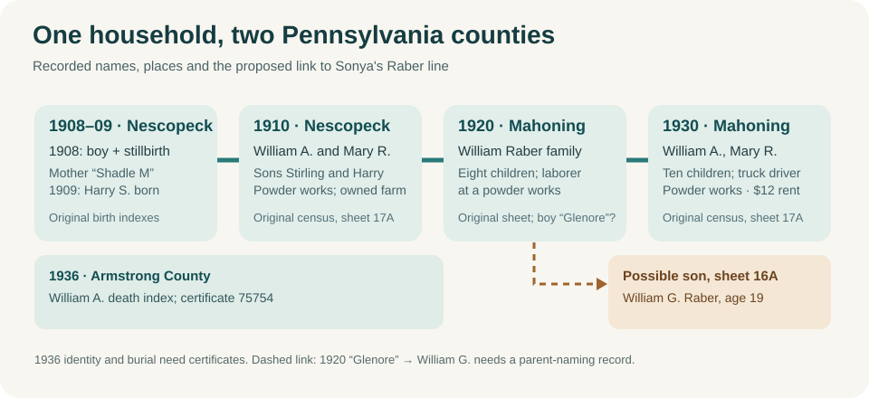
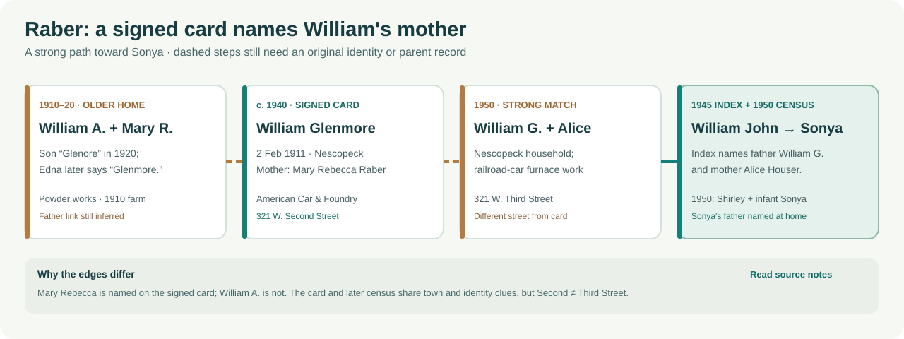

# The Raber–Shadle household: a possible older generation for Sonya

**The stronger bridge:** Sonya's paternal grandfather is recorded as **William G. Raber**, about 40 in [1950](../sources/records/william-alice-raber-census-1950.jpg). A nine-year-old son written approximately **“Glenore”** in a [1920 Mahoning Township original](../sources/records/william-mary-raber-household-census-1920.jpg) is plausibly that William. Both sites indexed the household surname as **Rober**, although the page reads **Raber**. His apparent sister Edna's [2017 obituary](https://hellerfuneralhomellc.com/obituaries/2017/03/27/edna-carrie-burger/) names brother **William Glenmore Raber**. William's **own [signed WWII draft card](https://www.myheritage.com/research/record-20912-3208760/william-glenmore-raber-in-united-states-world-war-ii-draft-registrations)** confirms *Glenmore*, names **mother Mary Rebecca Raber**, and places him in Nescopeck. This is a strong identity bridge from the older household's **Mary R.** and hard-to-read son to the later William G., reinforced by his [1950 William G./Alice household](../sources/records/william-alice-raber-census-1950.jpg) and William John's parent-naming index. No original yet directly names **William A.** as Glenmore's father; Justin's earlier recollection of **George** for the middle name is superseded by the name field on his signed card.

The signed card confirms his mother's full given names and his worksite; the diagram keeps the remaining **William A. → Glenmore father step** dashed. It also separates **321 W. Second** from the later **321 W. Third** address.

| Year and place | What the record says | What it does not say |
| --- | --- | --- |
| **1908, Nescopeck Township** | The [original state birth-index page, printed p. 2907](../sources/records/raber-shadle-birth-index-1908-p2907.png) has **“Raber Boy”** and **“Raber Stillborn”**, both dated **22 February**, mother **“Shadle M”**, Nescopeck Township, certificates **20874** and **20875**. Consecutive certificates and a shared mother/date suggest two births from one pregnancy. The surviving boy is a **candidate** for Stirling, age two in 1910. | Neither index line names the father or the surviving boy. It does not explicitly call the children twins or state whether the stillborn child was a boy or girl. Sterling's later signed card says **1907**, so the boy's identity needs the original certificate. |
| **1909, Nescopeck Township, Luzerne County** | The [Pennsylvania birth-index page](../sources/records/harry-raber-birth-index-1909-p2830.png) records **Harry S. Raber**, born **30 June**, mother **“Shadel M”**, certificate **83128**. | The index supplies neither the father's name nor the mother's full given name. |
| **1910, Nescopeck** | The [original census, sheet 17A, lines 1–4](../sources/records/william-mary-raber-household-census-1910.jpg) places **William A. Raber, 23**, wife **Mary R., 21**, sons **Stirling E., 2**, and **Harry S., 10 months**, together. William reported **laborer at a powder works** and **owned a farm free of mortgage** (columns 26–29: **O / F / F / 9**). Mary's maternity columns appear to say **three children born, two living**. The 1908 two-child index plus Harry's 1909 index could account for those three births and two survivors. | The census does not identify its deceased child, acreage, land value, farm income, a house number or the powder company's name. A matching count does not itself prove the 1908 index entries are hers. |
| **1920, Mahoning Township, Armstrong County** | The [original census sheet 9B, lines 83–92](../sources/records/william-mary-raber-household-census-1920.jpg) names **William Raber, 32**, wife Mary, 30, and **eight children**: Sterling, Harry, a nine-year-old written approximately **“Glenore,”** Creola, Ida, Thelma, Clifford and Mearl. William is a **laborer at a powder works**. The [FamilySearch index](https://www.familysearch.org/ark:/61903/1:1:M6TF-DC9?lang=en) and [MyHeritage index](https://www.myheritage.com/research/record-10133-184674240/glenore-rober-in-1920-united-states-federal-census) both misfile the surname **Rober**. | The son's exact handwritten given name remains difficult; the original gives him no *William* forename or middle initial. The page does not explain why the family moved. |
| **1930, Mahoning** | The [older William A. original sheet 17A](../sources/records/william-mary-shadle-raber-census-1930.jpg) gives wife **Mary R.** and ten younger children: Creola, Ida, Thelma, Clifford, Mearl, Edna, Charles, Irene, Glenn Roy and Oscar. William reported **truck driving at a powder works** and **$12 monthly rent**. A different [sheet 16A original](../sources/records/william-mary-raber-census-1930.jpg) records **William G. Raber, 19**, and wife Mary R., 20, paying **$9 monthly rent**. | The sheet numbers alone do not prove the younger William was the older couple's son or that their homes were adjacent. Neither sheet gives a precise house address. The two rents are separate households, not family net worth. |
| **1936, Armstrong County** | The [original Pennsylvania death-index page](../sources/records/mary-raber-pa-death-index-1936-p56.png) lists **William A. Raber**, death **1 August 1936**, certificate **75754**, in Armstrong County. His name and county agree with the older 1930 household; a [Mt. Zion Cemetery transcription](https://pagenweb.org/~luzerne/township/cemetery/Cemetery.html) also lists a **William A. Raber, 1886–1936**. | Neither item names a spouse, parents, occupation, death cause, or precise burial plot. The cemetery identity is a strong candidate, not yet a verified match to the Armstrong death. |

**A useful collateral branch and a date conflict.** The [1940 census index for Sterling E. Raber](https://www.myheritage.com/research/record-10053-473213956/sterling-e-raber-in-1940-united-states-federal-census) places him in Madison Township, Armstrong County, with wife **Pearl**, son **Eugene** and daughter **Glenda**. Glenda's [2009 obituary](https://www.legacy.com/us/obituaries/leadertimes/name/glenda-bargerstock-obituary?id=43009946) calls her father **Sterling E. Raber**, mother **Pearl H. McGregor**, and paternal grandparents **William and Mary Rebecca Raber**. Her brother Ronald's [2015 funeral-home obituary](https://bauerfuneral.com/viewObit?oID=1618) independently repeats Sterling and Pearl as parents. The unusual name, county, age and family cluster make this a strong match for the Stirling/Sterling in the 1910–20 household; the later obituaries suggest **Rebecca** for that household's **Mary R.**, but are retrospective accounts, not Mary's own record. Glenda's obituary also remembers her as a Kittanning High graduate and long-time cook, a human glimpse of this *collateral* line rather than evidence of Sonya's direct ancestry.

Sterling's [signed WWII registration card, viewed through MyHeritage](https://www.myheritage.com/research/record-20912-13525225/sterling-elsworth-raber-in-united-states-world-war-ii-draft-registrations) spells his middle name **Elsworth** and says he was born **22 February 1907**, in Luzerne County; it names wife **Pearl Helen Raber** at rural route 1, Mahoning, and reports no employer on that form. The **day and month match** the unnamed boy's state index, but the **year differs by one**. The original card confirms this is a source conflict, not merely a MyHeritage transcription error. The 1910 age two favors 1908; neither record by itself explains the discrepancy. **Do not identify certificate 20874 as Sterling's birth until the certificate names him or his parents.** A registration card also does not establish actual military service.

The [2017 obituary for Edna Carrie Raber Burger](https://hellerfuneralhomellc.com/obituaries/2017/03/27/edna-carrie-burger/) calls her a daughter of **William and Mary (Shadle) Raber**, born in **Putneyville in 1922**. It names both **William Glenmore** and many of the same siblings in the 1920 and 1930 indexes. That repeated, unusual sibling cluster makes the household identification strong. It also remembers Edna's work at **Berwick Laundry**, then **Burger's Sawmill** in Briggsville with husband Woodrow, and her volunteer baking for the Nescopeck church and fire company. These are facts about **Edna**, not evidence of William G.'s occupation or inheritance.

**His birth and work on a card he signed:** The [signed draft card](https://www.myheritage.com/research/record-20912-3208760/william-glenmore-raber-in-united-states-world-war-ii-draft-registrations) reports **2 February 1911** in **Nescopeck Township**, age **29** at registration, and **321 W. Second Street, Nescopeck**. For the person who would always know his address, he named **mother Mary Rebecca Raber at 815 E. Second Street**. He reported work for **American Car & Foundry**, at **North and Oak Streets, Berwick**. His [1950 household](../sources/records/william-alice-raber-census-1950.jpg) reports furnace work in a railroad-car shop and a **321 W. Third Street** address. Those are different streets; the records do not establish a move date, title to either property, or uninterrupted employment with one company. His [1930 candidate household](../sources/records/william-mary-raber-census-1930.jpg) calls him a railroad laborer paying **$9 monthly rent**, giving a possible work sequence, not a wage or asset trend. The [FamilySearch tree's](https://ancestors.familysearch.org/en/GHK7-5KP/william-glenmore-raber-1911) 2 February 1911 date now has **first-person support**, although his original birth certificate is still missing. A narrow scan of the [official 1911 Raber index](https://www.pa.gov/content/dam/copapwp-pagov/en/phmc/documents/archives/research-online/documents/1911-R.PDF#page=4) and [1910 page](https://www.phmc.state.pa.us/bah/dam/rg/di/r11_089_BirthIndexes/Birth_1910/1910%20-%20R.pdf#page=3) did not locate a matching registration under the searched spelling; that does not overturn his signed date or rule out a variant entry.

**A burial-name conflict:** The same [Mt. Zion transcription](https://pagenweb.org/~luzerne/township/cemetery/Cemetery.html) calls **Mary F. Raber (1889–1945)** née **Shadle** the wife of **“Wm. P.”** The older William's 1910 and 1930 census entries call him **William A.** and his wife **Mary R.** The names and years are close, but the initials conflict twice. This could be a transcription error, a different couple, or a misidentified census household. **Do not assign Mary F.'s burial or 1945 death to this Mary yet.** A photograph of the inscriptions, the cemetery's original register, and William's 1936 certificate could resolve it. The burial list is a volunteer transcription of records, not a marker photograph.

**Place, work and property story:** The family was in **Nescopeck in 1909–10**, **Mahoning/Putneyville by 1920–30**, and Edna returned to the Nescopeck area later. William's work at a **powder works appears in 1910, 1920 and 1930**: laborer on the first two sheets, truck driver on the third. In **1910** he reported an **owned, unmortgaged farm**; in **1930** he reported **$12 monthly rent**. That is a change in the household's *reported residence tenure*, not proof the farm was lost or that family wealth fell. He might have sold it, kept it while renting elsewhere, or changed property arrangements in another way; deeds and tax rolls are needed. The sheets give no company name, wages, explanation for the county move or exact house address. A photograph of a particular house would therefore be a guess. Use the [home-photo atlas](../context/family-home-photo-atlas.md) for lines that *do* have address-level evidence.

**A reason to investigate the move:** The [Pennsylvania Geological Survey's account of the Wapwallopen powder works](https://elibrary.dcnr.pa.gov/PDFProvider.ashx?PromptToSave=False&Size=1455572&ViewerMode=2&action=PDFStream&chksum=&docID=1741563&docName=v23n1&nativeExt=pdf&overlay=0&revision=0#page=9) says DuPont's mills in southwestern Luzerne County closed in **1912**. A [March 1916 contemporary financial notice](https://fraser.stlouisfed.org/files/docs/publications/cfc/cfc_19160304.pdf) reports a Fort Pitt Powder plant at **Putneyville**, in the Mahoning area. These are **possible workplaces**, not employer records for William. The coincidence of his powder work before and after a county move makes job continuity a sensible hypothesis; the dates of the family's move and his actual employers still need direct proof. Hagley's [circa-1880 photograph of Wapwallopen powder workers](https://www.hagley.org/sites/default/files/dupont-company-wapwallopen-mills-workers-hagley.JPG) shows the local industry decades before William's 1910 census; **none of its people is identified as a Raber**.

**What the site looked like later:** This [1992 state report page](https://elibrary.dcnr.pa.gov/PDFProvider.ashx?PromptToSave=False&Size=1455572&ViewerMode=2&action=PDFStream&chksum=&docID=1741563&docName=v23n1&nativeExt=pdf&overlay=0&revision=0#page=9) reproduces a photograph of the surviving **sulfur-house wall**. Its caption says that a gravel fan at left probably dates from **Tropical Storm Agnes in 1972**. This is a later view of a *possible* workplace area, not a photograph of William, his home, or a verified employer. Pennsylvania Geological Survey, *Pennsylvania Geology*, spring 1992, p. 7; photo credit **Jon D. Inners**. The publication expressly allows reprinting articles with credit.

**Next original to seek:** William Glenmore's birth or marriage record **naming his father**; older William A. and Mary's marriage return to extend the line; and a clear parent-naming record to resolve the 1920 handwriting. William A.'s Pennsylvania death certificate **75754** may name his parents and spouse; a death notice or cemetery register could test the Mt. Zion burial. The original state birth certificate **83128** would confirm Harry's full parent names. A deed or building card can test whether today's structure at **321 W. Second** existed when William lived there. The [source log](../research/sources.md) separates each record from the remaining proposed father link.
