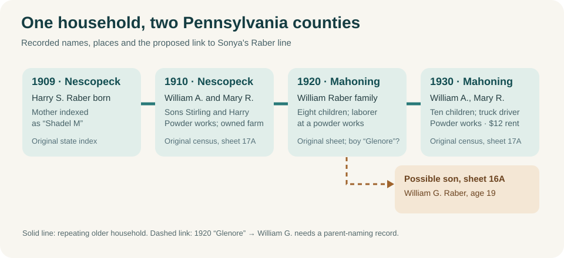
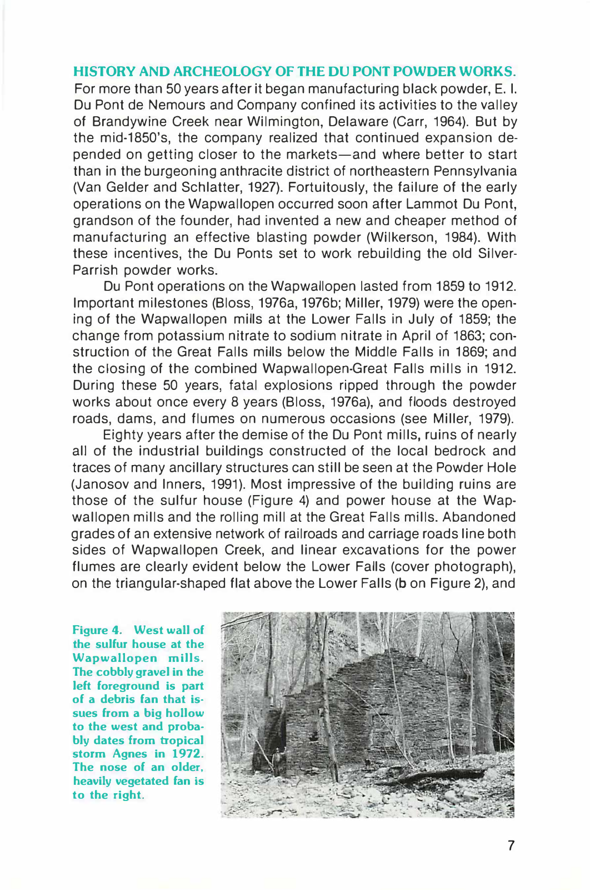

# The Raber–Shadle household: a possible older generation for Sonya

**The promising link:** Sonya's paternal grandfather is recorded as **William G. Raber**, about 40 in [1950](../sources/records/william-alice-raber-census-1950.jpg). A nine-year-old son written approximately **“Glenore”** in a [1920 Mahoning Township original](../sources/records/william-mary-raber-household-census-1920.jpg) is plausibly that William. Both sites indexed the household surname as **Rober**, although the page reads **Raber**. A later [obituary of his apparent sister Edna](https://hellerfuneralhomellc.com/obituaries/2017/03/27/edna-carrie-burger/) names a brother **William Glenmore Raber**. A separate [1930 original sheet](../sources/records/william-mary-raber-census-1930.jpg) places **William G., 19**, with wife Mary R. in *the same township*. These clues fit, but no original birth or marriage record yet joins the 1920 boy to Sonya's grandfather. **Glenmore** is now a better-supported expansion of *G.* than before; Justin's family recollection of **George** remains a conflicting account.

| Year and place | What the record says | What it does not say |
| --- | --- | --- |
| **1909, Nescopeck Township, Luzerne County** | The [Pennsylvania birth-index page](../sources/records/harry-raber-birth-index-1909-p2830.png) records **Harry S. Raber**, born **30 June**, mother **“Shadel M”**, certificate **83128**. | The index supplies neither the father's name nor the mother's full given name. |
| **1910, Nescopeck** | The [original census, sheet 17A, lines 1–4](../sources/records/william-mary-raber-household-census-1910.jpg) places **William A. Raber, 23**, wife **Mary R., 21**, sons **Stirling E., 2**, and **Harry S., 10 months**, together. William reported **laborer at a powder works** and **owned a farm free of mortgage** (columns 26–29: **O / F / F / 9**). Mary's maternity columns appear to say **three children born, two living**, pointing to an unnamed earlier child who died. Harry's name, age and place match the birth index. | The schedule does not give the lost child's name, acreage, land value, farm income, a house number or the powder company's name. |
| **1920, Mahoning Township, Armstrong County** | The [original census sheet 9B, lines 83–92](../sources/records/william-mary-raber-household-census-1920.jpg) names **William Raber, 32**, wife Mary, 30, and **eight children**: Sterling, Harry, a nine-year-old written approximately **“Glenore,”** Creola, Ida, Thelma, Clifford and Mearl. William is a **laborer at a powder works**. The [FamilySearch index](https://www.familysearch.org/ark:/61903/1:1:M6TF-DC9?lang=en) and [MyHeritage index](https://www.myheritage.com/research/record-10133-184674240/glenore-rober-in-1920-united-states-federal-census) both misfile the surname **Rober**. | The son's exact handwritten given name remains difficult; the original gives him no *William* forename or middle initial. The page does not explain why the family moved. |
| **1930, Mahoning** | The [older William A. original sheet 17A](../sources/records/william-mary-shadle-raber-census-1930.jpg) gives wife **Mary R.** and ten younger children: Creola, Ida, Thelma, Clifford, Mearl, Edna, Charles, Irene, Glenn Roy and Oscar. William reported **truck driving at a powder works** and **$12 monthly rent**. A different [sheet 16A original](../sources/records/william-mary-raber-census-1930.jpg) records **William G. Raber, 19**, and wife Mary R., 20, paying **$9 monthly rent**. | The sheet numbers alone do not prove the younger William was the older couple's son or that their homes were adjacent. Neither sheet gives a precise house address. The two rents are separate households, not family net worth. |

The [2017 obituary for Edna Carrie Raber Burger](https://hellerfuneralhomellc.com/obituaries/2017/03/27/edna-carrie-burger/) calls her a daughter of **William and Mary (Shadle) Raber**, born in **Putneyville in 1922**. It names both **William Glenmore** and many of the same siblings in the 1920 and 1930 indexes. That repeated, unusual sibling cluster makes the household identification strong. It also remembers Edna's work at **Berwick Laundry**, then **Burger's Sawmill** in Briggsville with husband Woodrow, and her volunteer baking for the Nescopeck church and fire company. These are facts about **Edna**, not evidence of William G.'s occupation or inheritance.

**The proposed birth date needs checking:** A [FamilySearch member profile](https://ancestors.familysearch.org/en/GHK7-5KP/william-glenmore-raber-1911) gives **2 February 1911** for William Glenmore, but attaches only an index naming the later William John's father as **William G.** I inspected the **Raber surname entries** on the [official 1911 Pennsylvania birth index, PDF p. 4](https://www.pa.gov/content/dam/copapwp-pagov/en/phmc/documents/archives/research-online/documents/1911-R.PDF#page=4) and the [1910 index, PDF p. 3](https://www.phmc.state.pa.us/bah/dam/rg/di/r11_089_BirthIndexes/Birth_1910/1910%20-%20R.pdf#page=3); neither page shows a William/Glenmore with mother Shadle. This limited negative check does **not** disprove his birth or the household link: a birth might be omitted, registered under another spelling, or dated differently. It means the tree's precise date has **no confirmation from those index pages**. A parent-naming marriage, birth certificate or baptism remains the better test.

**Place, work and property story:** The family was in **Nescopeck in 1909–10**, **Mahoning/Putneyville by 1920–30**, and Edna returned to the Nescopeck area later. William's work at a **powder works appears in 1910, 1920 and 1930**: laborer on the first two sheets, truck driver on the third. In **1910** he reported an **owned, unmortgaged farm**; in **1930** he reported **$12 monthly rent**. That is a change in the household's *reported residence tenure*, not proof the farm was lost or that family wealth fell. He might have sold it, kept it while renting elsewhere, or changed property arrangements in another way; deeds and tax rolls are needed. The sheets give no company name, wages, explanation for the county move or exact house address. A photograph of a particular house would therefore be a guess. Use the [home-photo atlas](../context/family-home-photo-atlas.md) for lines that *do* have address-level evidence.

**A reason to investigate the move:** The [Pennsylvania Geological Survey's account of the Wapwallopen powder works](https://elibrary.dcnr.pa.gov/PDFProvider.ashx?PromptToSave=False&Size=1455572&ViewerMode=2&action=PDFStream&chksum=&docID=1741563&docName=v23n1&nativeExt=pdf&overlay=0&revision=0#page=9) says DuPont's mills in southwestern Luzerne County closed in **1912**. A [March 1916 contemporary financial notice](https://fraser.stlouisfed.org/files/docs/publications/cfc/cfc_19160304.pdf) reports a Fort Pitt Powder plant at **Putneyville**, in the Mahoning area. These are **possible workplaces**, not employer records for William. The coincidence of his powder work before and after a county move makes job continuity a sensible hypothesis; the dates of the family's move and his actual employers still need direct proof. Hagley's [circa-1880 photograph of Wapwallopen powder workers](https://www.hagley.org/sites/default/files/dupont-company-wapwallopen-mills-workers-hagley.JPG) shows the local industry decades before William's 1910 census; **none of its people is identified as a Raber**.

**What the site looked like later:** This [1992 state report page](https://elibrary.dcnr.pa.gov/PDFProvider.ashx?PromptToSave=False&Size=1455572&ViewerMode=2&action=PDFStream&chksum=&docID=1741563&docName=v23n1&nativeExt=pdf&overlay=0&revision=0#page=9) reproduces a photograph of the surviving **sulfur-house wall**. Its caption says that a gravel fan at left probably dates from **Tropical Storm Agnes in 1972**. This is a later view of a *possible* workplace area, not a photograph of William, his home, or a verified employer. Pennsylvania Geological Survey, *Pennsylvania Geology*, spring 1992, p. 7; photo credit **Jon D. Inners**. The publication expressly allows reprinting articles with credit.

**Next original to seek:** A birth or marriage record naming the younger William G.'s parents; older William A. and Mary's own marriage return to extend the line; and a clear parent-naming record to resolve the 1920 boy's first/middle names. The original state birth certificate **83128** would confirm Harry's full parent names. The [source log](../research/sources.md) separates each record from the proposed identity bridge.
