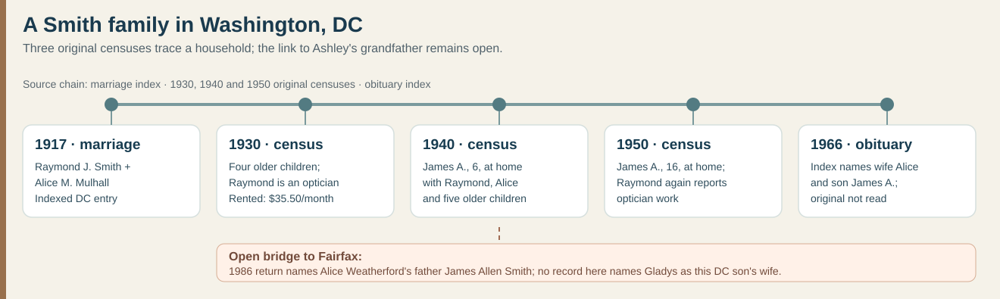
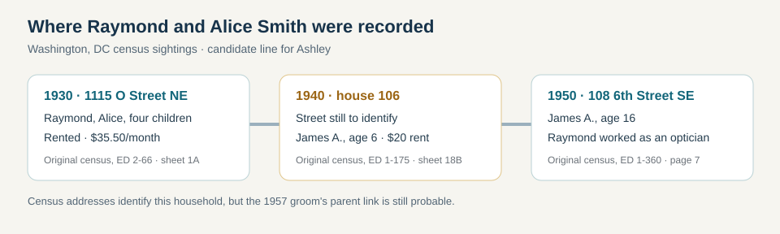

# James Smith's possible Washington, DC, family

Alice's earlier [Mulhall–Corbett evidence guide](smith-mulhall-corbett.md) includes her **1894 DC birth-return index**, **1937 parent-naming Social Security index**, and original **1880–1920** household sheets. They establish her parents **John Thomas Mulhall and Margaret “Maggie” Corbett**; in 1920, **Raymond Smith is explicitly their son-in-law**. Both older adults were DC-born with **Ireland-born parents** according to later censuses; the 1880 sheet names John's parents **John and Mary Mulhall**. The unresolved step is still whether their grandson is **Ashley's** James Allen Smith.

**A much stronger identification:** the [6 November 1957 *Evening Star* marriage-license list](https://www.loc.gov/resource/sn83045462/1957-11-06/ed-1/?sp=77) names **James Allen Smith, 24**, and **Gladys Louise Blevins, 19**. This independently joins the exact full names and makes James's birth about **1933**, matching the [Social Security record](https://www.familysearch.org/ark:/61903/1:1:6K4N-S22V?lang=en) for a James Allen Smith born **14 October 1933 in Washington, DC**, deceased **6 June 1990** with a Fairfax County residence. That federal record names parents **Raymond J. Smith** and **“Allice Maulhall.”** The [shared marker](https://www.findagrave.com/memorial/106660847/james_a-smith) gives Ashley's grandfather **1933–1990**. The combined name, age, city and death years make the identification **highly likely**. The notice does not name the groom's parents or document the wedding itself, so Raymond and Alice remain **probable rather than proved** ancestors pending the original license, James's obituary or death certificate.

| Date | What the candidate family's records say | Limit |
| --- | --- | --- |
| **31 January 1917** | A [District of Columbia marriage index](https://www.familysearch.org/ark:/61903/1:1:XLHF-MHC?lang=en) joins **Raymond J. Smith, 21**, and **Alice M. Mulhall, 22**. This independently supports *Mulhall* as the likely surname behind the Social Security transcription *Maulhall*. | The original register image is restricted to a FamilySearch center or affiliate. The index does not name parents. |
| **January 1920** | The original [page 14B](../sources/records/mulhall-smith-household-census-1920-page1.jpg) and [page 15A](../sources/records/mulhall-smith-household-census-1920-page2.jpg) show **Raymond J. Smith** as **son-in-law** in John and Margaret Mulhall's rented household, followed on the next sheet by **Alice M. Smith**, labeled **daughter**, and young **Margaret B. Smith**, labeled **granddaughter**. Raymond worked as an optician. | This directly joins the couple to Alice's parents and a daughter. It does not itself identify their later son James as the 1957 groom. The two older adults' ages conflict with earlier censuses. |
| **2 April 1930** | The [original DC census sheet](../sources/records/smith-dc-household-census-1930.jpg), district **2-66**, sheet **1A**, lines **21–26**, lists Raymond, **34**, and Alice, **36**, with children **Margaret B., 12; Mary E., 8; William J., 7; and Alice M., 5** at **1115 O Street NE**. The street is written vertically beside their block. Raymond worked as an **optician at an optical company**. They **rented for $35.50 a month**. | James was not born until 1933. One rent entry is neither household wealth nor proof of a later move. This is the candidate DC family, not yet a proved part of Ashley's line. |
| **1940** | The [original DC census sheet](../sources/records/smith-dc-household-census-1940.jpg), enumeration district **1-175**, sheet **18B**, lines **56–63**, lists **Raymond J.** and **Alice M. Smith** with six-year-old son **James A.** and five older children: **Margaret B., Mary E., William J., Alice M. and Charles K.** Their house is numbered **106**; the street name is not written beside this household on the saved sheet. They rented for **$20 a month**. | The census estimates James's birth about **1934**, one year later than the Social Security date. Do not turn 106 into **6th Street SE** without reading the adjoining sheet or a directory. The rent figures alone do not measure changing wealth. |
| **3 April 1950** | The [original DC sheet](../sources/records/smith-dc-household-census-1950.jpg), district **1-360**, page **7**, lines **14–20**, again has Raymond and Alice with **James A., 16**, plus Margaret, Mary, Charles and younger Joseph at **108 6th Street SE**. The enumerator labels the **100 block of 6th Street SE** beside their lines. Raymond reported work as an **optician in a retail eyeglass business**. | A single occupation entry gives no income, business ownership or lifetime career. William and the older Alice are absent from this household, which does not establish where they lived. A [current street-view/property page](https://www.redfin.com/DC/Washington/108-6th-St-SE-20003/home/9900023) shows the address today and reports a 1908 build year; building continuity needs a property card. |
| **July 1950** | A [Social Security application index](https://www.myheritage.com/research/record-10863-57336338/james-allen-smith-in-us-social-security-applications-claims) says James Allen Smith submitted his original application that month, giving a **14 October 1933 Washington birth** and parents **Raymond J. Smith** and **“Allice Maulhall.”** He would have been 16. | This is an index of an application, not its image. It names no job, spouse or later child. Do not infer why he applied or use it alone to identify Gladys's husband. |
| **6 November 1957** | The [original *Evening Star* page, C-9, image 77](../sources/records/james-smith-gladys-blevins-marriage-license-notice-1957.jpg) lists **James Allen Smith, 24**, and **Gladys Louise Blevins, 19**, among DC **marriage licenses**. James lived on Channing Street NW and Gladys on Mellon Street SE. Their ages fit the federal record's 1933 birth and Gladys's 1938 birth. | A published license notice is not a marriage return. It names no parents and does not prove that this groom is Raymond's son; the exact original DC license is the best bridge. |
| **30 January 1966** | An [index to Raymond's 2 February *Evening Star* death notice](https://www.familysearch.org/ark:/61903/1:1:Q53K-2RWC?lang=en) gives this death date and lists wife **Alice Marie**, son **James A.**, and six other named children. | The original notice has not been read; the index does not identify James's wife. Its automated event place reads *Washington Township, Iowa*, inconsistent with the named Washington newspaper, so no locality is inferred from that field. |
| **16 November 1985** | Carolyn Louise Smith's [original Fairfax marriage return](../sources/records/carolyn-smith-james-treme-marriage-1985.jpg) names **James Allen Smith** and **Gladys Louise Smith** as her parents. It verifies one more child in the family later named by Gladys's memorial. | The return does not name James's parents. The FamilySearch index is attached in its public tree to a **1904–1969 James Allen Smith**, inconsistent with the 1933–1990 father; the attachment is not evidence of identity. |

The 1920–50 Smith censuses follow **one Raymond–Alice family** across decades, with son James in 1940 and 1950. Raymond reported optician work in 1920, 1930 and 1950; this does not prove uninterrupted employment. The 1957 notice joins a James Allen Smith of the right age to Gladys Blevins in the same city. It makes the DC son-to-Fairfax-grandfather link substantially stronger, while still lacking a direct parent-naming record for **the 1957 groom**. The [Smith branch](smith.md) keeps Raymond and Alice in a clearly labeled probable layer.

**Best next check:** seek the **1957 DC marriage license or return** naming James's parents, or his **1990 obituary or death certificate** naming Gladys and a parent/sibling. [DC Archives](https://os.dc.gov/service/district-columbia-archives) says its marriage certificates beginning in 1919 are not yet open to the public; ask the archives about the specific 1957 record and eligibility rather than assuming an online image exists. [Virginia's vital-records guide](https://www.vdh.virginia.gov/vital-records/genealogy/) says deaths become public after 25 years and links to an [Ancestry index](https://www.ancestry.com/collections/search/va/doh) including Virginia deaths through 2014. **First verify where James died:** the federal index gives a Fairfax *residence*, not the place of death. An Ancestry search in this Chrome session reached a sign-in screen, so its 1990 entry or certificate was not inspected. Raymond and Alice's 1917 original marriage entry also remains restricted. For the next immigrant generation, confirm the **William–Margaret Corbett** link, find Mary Mulhall's maiden name and an Irish county or arrival record. A surname alone cannot establish a county or ship.
