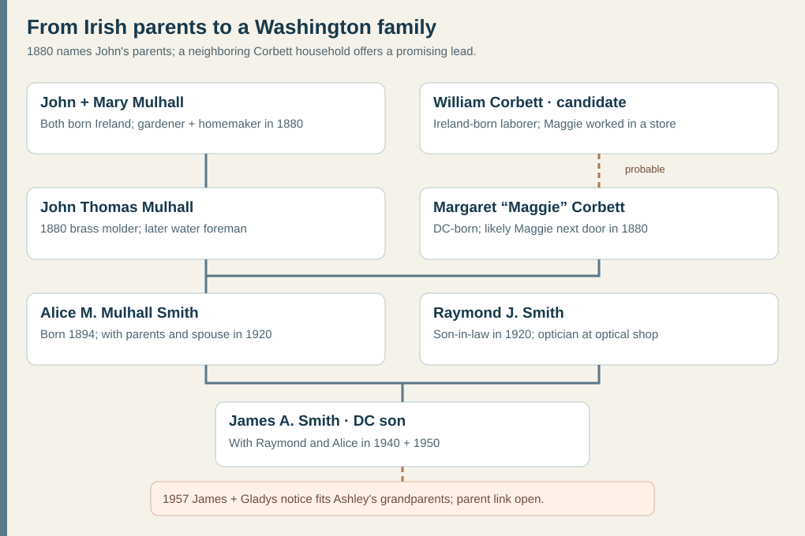

# Alice Mulhall's Washington family — a probable Smith branch

*The 1880 census names John's parents; Alice's birth-return and Social Security indexes name hers. William Corbett is a probable match for Margaret's father. The James-to-Raymond link remains probable for **Ashley's** grandfather: the 1957 marriage-license notice does not name his parents.*

## What the records show

| Checkpoint | Family and work | Evidence and limit |
| --- | --- | --- |
| **1850–70** | Earlier indexed Washington censuses place **John and Mary Mulhall**, both Ireland-born, with **James, 7, born in Ireland**, and infant **Michael, born in Virginia**, in [1850](https://www.familysearch.org/ark:/61903/1:1:MX6M-KYG?lang=en). [1860](https://www.familysearch.org/ark:/61903/1:1:MCV9-27J?lang=en) again has John, Mary and Ireland-born James, plus DC-born **Thomas, Joseph, Eliza and Frank**. [1870](https://www.familysearch.org/ark:/61903/1:1:MN49-L65?lang=en) has John, Mary, Thomas, Joseph, Eliza and Frank in Washington. | The repeated **John–Mary–James** group in 1850–60 and **John–Mary–Joseph–Eliza–Frank** in 1860–80 strongly bridge these households. If the 1850 birthplace entries are right, the family's crossing fell **after James's approximate 1843 Irish birth and before Michael's approximate 1850 Virginia birth**. This is a *birthplace bracket*, not a manifest date. Michael's later whereabouts are unknown. The older **Thomas** could be John T. under another name, or another son; no record yet proves either. |
| **10 June 1880** | The [original DC census sheet](../sources/records/mulhall-corbett-neighbor-households-census-1880.jpg), lines **44–49**, places single **John T. Mulhall, 25**, with Ireland-born parents **John Mulhall, 67**, and **Mary Mulhall, 50**. His father was a **gardener**; John T. was already a **brass molder**. Brothers **Joseph, 23**, and **Frank, 20**, were painters; sister **Eliza, 22**, lived with them. | [FamilySearch 1880 household index and original](https://www.familysearch.org/ark:/61903/1:1:M6CZ-3JM?lang=en). The unusual full name, DC birth and brass trade match the 1900 husband strongly, despite the approximate birth year shifting from **1855** to **1853**. Mary’s maiden name and the parents’ arrival dates are unknown. |
| **27 September 1894** | A daughter later named **Alice M. Mulhall** was born in Washington, DC. Her parents were **John Thomas Mulhall** and **Maggie Corbett**. | [DC birth-return index](https://www.familysearch.org/ark:/61903/1:1:F75L-ZVW?lang=en) gives a female child with surname Mulhall, date and parents, but omits her first name. Its original image requires a FamilySearch center or affiliate. A [1937 Social Security NUMIDENT index](https://www.familysearch.org/ark:/61903/1:1:6K48-HYTQ?lang=en) identifies **Alice Mulhall Smith**, born that exact day in Washington, with parents **John T. Mulhall and Margaret Corbett**. Together these make the 1894 child-to-adult match strong. |
| **1900** | The [original Washington census](../sources/records/mulhall-dc-household-census-1900.jpg), sheet **19B**, lines **72–77**, has **John and Margaret** with children **Eliza, Mary, John T. and Alice**. John was a **brass molder**; the home was **rented**. The three older children were marked **at school**; five-year-old Alice was not marked. | [FamilySearch original](https://www.familysearch.org/ark:/61903/3:1:S3HY-DK5S-QG2?view=index&personArk=%2Fark%3A%2F61903%2F1%3A1%3AMMFH-41R&action=view&cc=1325221&lang=en). No mark for Alice says nothing about her later education. The index calls her six; the handwritten sheet and September birth date make her **five** on the June enumeration day. |
| **1910** | The [original Washington census](../sources/records/mulhall-dc-household-census-1910.jpg), sheet **2B**, lines **75–79**, has **John T., Margaret A., Mary A., John T. and Alice**. John was a **foreman in the District water department**; Mary sold goods in a **dry-goods store** and John Jr. worked as a **printer**. Eliza is absent from this household, with no reason recorded. | [FamilySearch original](https://www.familysearch.org/ark:/61903/3:1:33SQ-GRK3-KHB?view=index&personArk=%2Fark%3A%2F61903%2F1%3A1%3AMKL6-BW1&action=view&cc=1727033&lang=en). An index reads John's age as **38**, inconsistent with the 1900 sheet's **47** and the 1910 handwriting; do not use that derived birth year. |
| **1917–37** | An [indexed DC marriage](https://www.familysearch.org/ark:/61903/1:1:XLHF-MHC?lang=en) joins **Raymond J. Smith and Alice M. Mulhall** on **31 January 1917**. The Social Security index later calls her **Alice Mulhall Smith**, retaining the maiden name and both parents. | The 1917 original image is access restricted. [Raymond, Alice and their son James A.](smith-dc-candidate.md) appear together in original 1940–50 censuses. |
| **15–16 January 1920** | The [original census page 14B](../sources/records/mulhall-smith-household-census-1920-page1.jpg), lines **98–100**, puts **John T. and Margaret Mulhall** in a **rented** Washington home with **Raymond J. Smith, 24**, explicitly called their **son-in-law**. [Page 15A](../sources/records/mulhall-smith-household-census-1920-page2.jpg), lines **1–2**, continues the same family number **337** with **Alice M. Smith, 25**, their **daughter**, and **Margaret B. Smith, 1 year 10 months**, their **granddaughter**. Raymond was an **optician at an optical shop**. | [FamilySearch original, first page](https://www.familysearch.org/ark:/61903/3:1:33S7-9R6Q-NS3?view=index&personArk=%2Fark%3A%2F61903%2F1%3A1%3AMNLL-LRN&action=view&cc=1488411&lang=en). This is a direct in-law and three-generation household link between the Mulhalls and Raymond–Alice Smith, stronger than the marriage index alone. The 1920 ages for both older adults conflict with 1900; no annual income or rent amount is entered. |

Both [1900](../sources/records/mulhall-dc-household-census-1900.jpg) and [1910](../sources/records/mulhall-dc-household-census-1910.jpg) originals say **John and Margaret were born in DC, and each of their parents was born in Ireland**. The 1880 sheet names **John's** parents **John and Mary Mulhall**; their own birthplaces are Ireland. The earlier censuses now give their family an approximate **1843–50 crossing window**, while **Mary's maiden name, Margaret's parents, Irish counties, ships and exact arrival dates remain unverified**. John's 1900 entry reports **May 1853**, versus age 25 in 1880; Margaret's reports **January 1859**. The public tree instead labels John **1859** and Margaret **1861**. Use these as conflicting age reports, not exact vital dates. The 1894 birth return calls Alice's mother **Maggie Corbett**, and Alice's adult Social Security index calls her **Margaret Corbett**, resolving her surname independently of the tree.

**A possible neighbor-to-marriage story:** On that **same 1880 sheet**, lines **38–40**, an Ireland-born laborer **William Corbett, 57**, lived with DC-born daughters **Maggie, 20**, and **Annie, 18**. Maggie worked **in a store**. The Corbett household was enumerated in dwelling **277** and the Mulhalls in **278**, with a Hoff household between them in the enumerator's sequence. The same nickname, maiden surname, approximate age, DC birthplace, Ireland-born father, and immediate proximity make this **a strong candidate** for John's later wife Margaret. Yet the sheet never identifies the two Maggies as the same person, and no marriage record ties Margaret to William. Treat William as **probable**, Annie as a **possible sister**, and the idea that John met his wife next door as a possibility, not a documented memory. [Maggie's 1880 index](https://www.familysearch.org/ark:/61903/1:1:M6CZ-3NP?lang=en) · [original page](../sources/records/mulhall-corbett-neighbor-households-census-1880.jpg).

**An earlier Corbett possibility, not yet a bridge:** An [1860 Washington census index](https://www.familysearch.org/ark:/61903/1:1:MCV9-RG9?lang=en) records **Wm and Bridget Carbet**, both Ireland-born, with DC-born **Margt, 6**, and **Ann, 2**, plus Ireland-born **Mary Early, 60**. The first names, Irish parent and two DC-born daughters resemble the 1880 Corbetts, but Margt and Ann would be about **26 and 22** in 1880, not the recorded **20 and 18**. The 1870 bridge and a parent-naming record are missing. Do not treat Bridget or Mary Early as Margaret Mulhall's ancestors yet; the record only suggests another route to test.

### Tree collision to avoid

The 1850 FamilySearch index has been attached to a member-edited [John Micheal Mulhall profile](https://www.familysearch.org/en/tree/person/details/GC9L-DWK) that claims **County Wicklow** birth and later **Ohio/Ontario** residence. The profile places him in **Ohio in 1860**, while the matching John–Mary–James household appears in **Washington in 1860**; its child list also fails to fit Ireland-born **James, 7** in 1850. Its birthplace field reports sources, but the page does not supply an original record that identifies the **Washington John** with the **Ontario John**. Do not map Wicklow, adopt its Mary Buckley surname, or merge the two men without a direct bridge.

### Where in Ireland?

**No county or townland is established for either the Washington Mulhalls or the candidate Corbetts.** The [1850 Mulhall household](https://www.familysearch.org/ark:/61903/1:1:MX6M-KYG?lang=en) gives *Ireland* for John, Mary and son James, while the [1880 original](../sources/records/mulhall-corbett-neighbor-households-census-1880.jpg) gives the same country for John and Mary and for the neighboring William Corbett. Neither census narrows the birthplace. The 1900/1910 household reports only that Margaret Corbett's parents were Ireland-born. These are distinct lines: their shared Washington neighborhood does not imply a shared Irish county.

The **Wicklow** claim attached to the 1850 index fails the Washington-to-Ontario identity check above. A public surname distribution, same-name Irish baptism or unrelated ship passenger cannot repair that gap. [Irish Genealogy's civil-record guide](https://www.irishgenealogy.ie/civil-records-help/) says full Irish civil registration began in **1864** (non-Catholic marriages in **1845**), after James Mulhall's approximate 1843 birth. A future county test should therefore start with a **person-linked U.S. record** naming a locality or Mary's maiden name, then compare an Irish church baptism or marriage in the [National Library parish registers](https://registers.nli.ie/) and [Irish Genealogy church collections](https://www.irishgenealogy.ie/en/church-records/about/what-church-records-are-available-online). The [National Archives of Ireland](https://genealogy.nationalarchives.ie/) has surviving pre-1851 census fragments, but a same-name entry there would still need a family bridge.

**A passenger lead tested:** MyHeritage's [indexed John Mulhall](https://www.myheritage.com/research/record-10031-442764/john-mulhall-in-passengers-arriving-in-new-york-from-ireland) was reportedly **37** on the *Enterprise* reaching New York **31 October 1848**, a date and age compatible with the Washington father's broad bracket. Focused searches of the same 1846–51 collection for **Mary** and young **James** did not show them on that ship; a separate [Mary Mulhall](https://www.myheritage.com/research/record-10031-442780/mary-mulhall-in-passengers-arriving-in-new-york-from-ireland) of compatible age arrived on the *New World* in September. These indexed people cannot yet be joined to one another or to the DC household. Neither index gives an Irish county. Read the original manifests and nearby passengers before adopting a ship or route; the 1850 Virginia-born infant also allows an earlier crossing.

**A new U.S. identity clue, not an Irish birthplace:** A [4 October 1920 *Washington Herald* notice](https://tile.loc.gov/storage-services/service/ndnp/dlc/batch_dlc_frenchbulldog_ver04/data/sn83045433/00280764127/1920100401/0314.pdf) says a deceased police captain had brothers **Frank Mulhall** and **Thomas Mulhall, a water-department foreman**. The 1860–80 household has Frank and Thomas, while the 1910 father of Alice is indexed **John T.** and recorded as a water-department foreman. This is a promising collateral lead, but it does not yet tell whether Thomas and John T. are the same man or separate brothers; the article's page-one portion and the captain's death record are the next checks. It contains no Irish locality.

Margaret reported **six children born and four living** in both 1900 and 1910. The four named in 1900 were Eliza, Mary, John T. and Alice; the records do not name the other two or tell when they died. This is a family loss recorded in the household count, without enough evidence to tell a more specific story.

**A work story with limits:** John moved from a metal trade in 1900 to a water-department supervisory job by 1910, as the original sheets describe. This is a real occupational change; it does **not** establish that he worked on any particular reservoir or that the household became wealthier. The 1900 and 1920 rent entries give no rent amount. By 1920, two working generations lived in the same rented household: John and son-in-law Raymond, then an optician. This is co-residence, not proof they shared finances.

*A period view of A and 3rd Streets S.E., looking northeast. This is **not** the Mulhall house or a confirmed street where they lived. [Library of Congress catalog and original glass negative](https://www.loc.gov/item/2003675007/), dated about **1900–05**, rights advisory “no known restrictions on publication.”*

**How this may relate to Ashley:** Alice's son **James A. Smith** is named with Raymond and Alice in the [1940 census](../sources/records/smith-dc-household-census-1940.jpg). A [1957 original notice](../sources/records/james-smith-gladys-blevins-marriage-license-notice-1957.jpg) joins a **James Allen Smith, 24**, to **Gladys Louise Blevins, 19**, fitting Ashley's grandparents' names and years. The notice does not name James's parents. Until his 1957 civil return, 1990 obituary or death certificate bridges the groom to the DC son, this **Irish-born great-grandparent generation is a well documented branch of a probable ancestor**, not a proven answer for Ashley's immigration date.
