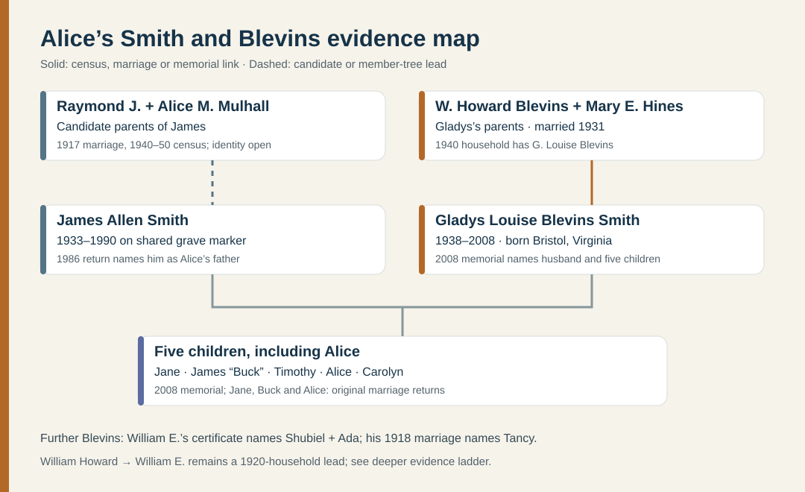
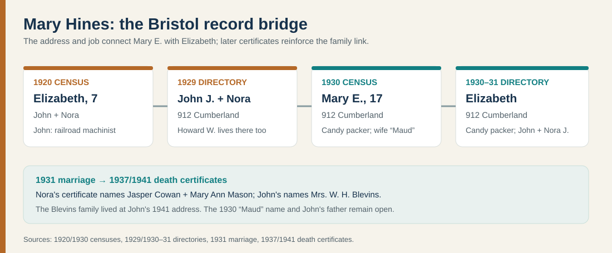
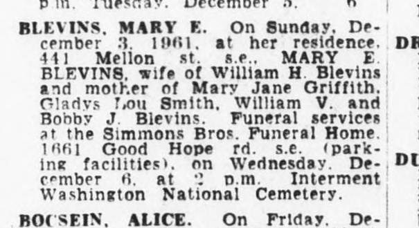
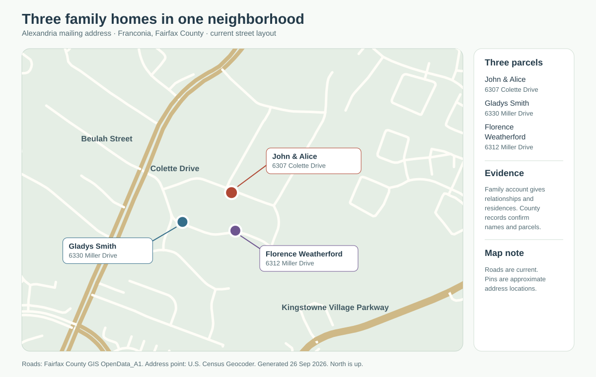

# Smith and Blevins: Alice's family

[Burial places and headstone leads](../context/family-burial-places.md) include Mary Hines Blevins in Suitland and James and Gladys Smith's photographed shared marker in Fairfax.

The [Cowan–Mason branch](cowan-mason.md) follows Nora's **1892 birth register**, her parents Jasper and Mary, their 1900 household, and an earlier Virginia generation. Its [small evidence diagram](../maps/cowan-mason-evidence.svg) shows the links and date conflicts.

The [Washington, DC, Smith candidate](smith-dc-candidate.md) has **two original census sheets** placing a James A. with Raymond and Alice Smith. A newly located [1957 marriage-license notice](https://www.loc.gov/resource/sn83045462/1957-11-06/ed-1/?sp=77) joins **James Allen Smith, 24**, to **Gladys Louise Blevins, 19**, making the identification of the DC son as Ashley's grandfather highly likely. The original marriage return or a parent-naming obituary is still needed to prove the last identity link.

Alice Mulhall's [earlier DC household](smith-mulhall-corbett.md) is documented by **1894 and 1937 parent-naming indexes** and saved **1880–1920 census images**. Her parents were **John Thomas Mulhall and Margaret Corbett**. The 1880 census names John's Ireland-born parents **John and Mary Mulhall**; a neighboring William Corbett and daughter Maggie are promising but unproved matches for Margaret's family. In 1920, **Raymond J. Smith is directly called their son-in-law**, with Alice and their daughter Margaret B. in the same household. This reaches immigrant-born people on a **probable** Ashley branch, but gives no Irish towns or arrival dates.

**Start here:** Alice Marie Smith Weatherford's [1986 marriage return](https://www.familysearch.org/ark:/61903/1:1:QK9V-J612?lang=en) names **James Allen Smith** and **Gladys Louise Blevins** as her parents. A [2008 memorial](https://www.findagrave.com/memorial/45796517/gladys_louise-smith), apparently transcribing Gladys's death notice, names James as her deceased husband and **all five children**. Four original Fairfax marriage returns now independently connect Jane, Buck, Alice and Carolyn to the same parents; Timothy remains supported by the family account and memorial. Memorial dates still deserve confirmation in an original obituary or vital record.

| Generation | What is established | Still open |
| --- | --- | --- |
| **Ashley's grandparents** | James A. Smith **1933–1990** on their [shared grave marker](https://www.findagrave.com/memorial/106660847/james_a-smith); Gladys L. Smith **1938–2008** on the marker and memorial. Gladys's memorial gives **30 May 1938, Bristol, Virginia → 2 November 2008, Fairfax County**. | James's full birth/death dates and both parents' original vital records. A same-name federal record is a strong candidate, below. |
| **Gladys's parents** | The [1940 census household](../sources/records/blevins-household-census-1940.jpg) has one-year-old **G. Louise Blevins** with father **W. Howard Blevins** and mother **Mary H. Blevins**. Their [original 1931 marriage license](../sources/records/william-howard-blevins-mary-hines-marriage-license-1931.jpg) names them **William H. Blevins and Mary E. Hines**. Mary's [original 1961 death notice](../sources/records/mary-hines-blevins-death-notice-1961.jpg) names William and their four children. | William's birth state conflicts between the 1940 census (West Virginia) and the still-uncertain 1920/1930 candidates (Virginia). His parents and exact death date need original records; Mary's death notice gives **3 December 1961**, but her vital record remains unread. |
| **Mary Hines's parents** | The [1920 census](../sources/records/hines-bristol-census-1920.jpg), [1929 directory](../sources/records/hines-bristol-directory-1929.png), [1930 census](../sources/records/hines-bristol-census-1930.jpg) and [1930–31 directory](../sources/records/hines-bristol-directory-1930-31.png) converge on **John J. Hines, Nora J. and daughter Elizabeth/Mary E.** at **912 Cumberland** by 1929–31. John's [1941 death certificate](../sources/records/john-jackson-hines-death-1941.jpg) names his wife **Nora Jane Cowan** and gives **Mrs. W. H. Blevins** as informant at his home, the same street number where Mary E. Blevins lived in 1940. This strengthens the Mary–John link beyond the candy-packer/address match. | The 1930 census calls John's wife **Maud**, while directories and two death certificates call her **Nora**. Whether Maud was another name, a census mistake, or a different woman is unproved. John's birthplace and reported father also conflict across records. |
| **James's probable parents** | A [federal Social Security record](https://www.familysearch.org/ark:/61903/1:1:6K4N-S22V?lang=en) for **James Allen Smith, born 14 October 1933 in Washington, DC, died 6 June 1990**, Fairfax resident, names **Raymond J. Smith** and **“Allice Maulhall.”** [Original 1940 and 1950 censuses](smith-dc-candidate.md) show their son James A. in DC; a [1917 marriage index](https://www.familysearch.org/ark:/61903/1:1:XLHF-MHC?lang=en) spells her surname **Mulhall**. The [1957 original newspaper page](../sources/records/james-smith-gladys-blevins-marriage-license-notice-1957.jpg) now pairs a 24-year-old James Allen Smith with Gladys Louise Blevins. | **Highly likely, not yet proved:** the license list does not name James's parents. Obtain its original civil return or James's obituary/death certificate before treating Raymond and Alice as fully established ancestors. [Evidence timeline](../maps/smith-dc-candidate-timeline.svg). |

## The five children

Gladys's [2008 memorial](https://www.findagrave.com/memorial/45796517/gladys_louise-smith) lists **Jane A. Horesky**, **James H. Smith**, **Timothy A. Smith**, **Alice M. Weatherford**, and **Carolyn L. Treme**, with spouses named as of 2008. Justin calls James Howard **“Buck.”** Original marriage returns separately verify the common parent pair for [Jane in 1976](https://www.familysearch.org/ark:/61903/1:1:QVY5-GZKP?lang=en), [James Howard in 1983](https://www.familysearch.org/ark:/61903/1:1:QV13-2NVL?lang=en), [Carolyn in 1985](../sources/records/carolyn-smith-james-treme-marriage-1985.jpg), and [Alice in 1986](https://www.familysearch.org/ark:/61903/1:1:QK9V-J612?lang=en). Carolyn's return records her Washington, DC, birthplace and James and Gladys as parents. Timothy has the memorial and family account; seek an original record for him. Birth order is not established.

Justin says **Timothy A. Smith** and his niece **Ashley Weatherford** both attended **Virginia Tech**. Their attendance years, studies and graduation status are not yet documented by a university record. [School connections across the family](../context/education-across-generations.md).

## Gladys's siblings and the Tancy clue

The [1940 census](https://www.familysearch.org/ark:/61903/1:1:K4HN-TVW?lang=en) lists **William J.**, **Bobbie J.**, and **M. Jane Blevins** beside G. Louise in William Howard and Mary's Johnson City household. Mary's [5 December 1961 *Evening Star* death notice](https://www.loc.gov/resource/sn83045462/1961-12-05/ed-1/?sp=20) names husband William H. and children **Mary Jane Griffith, Gladys Lou Smith, William V., and Bobby J. Blevins**. This independently connects the childhood household to Gladys's married Smith identity and expands the earlier **M. Jane** to **Mary Jane**. The notice says Mary died **3 December 1961** and was buried at **Washington National Cemetery**. It gives no birth date, and the newspaper's “Gladys Lou” is a name variation alongside her later **Louise** records.

*Original [Library of Congress page B-4, image 20](https://www.loc.gov/resource/sn83045462/1961-12-05/ed-1/?sp=20); saved crop. The [FamilySearch obituary index](https://www.familysearch.org/ark:/61903/1:1:QPBX-168W?lang=en) misplaces “Washington” in Arkansas, so use the newspaper image for place and wording.*

A [Social Security NUMIDENT entry](https://www.familysearch.org/ark:/61903/1:1:6K4X-R1BZ?lang=en) independently names **Bobby Jack Blevins**, born **13 June 1932 in Bristol, Virginia**, and parents **William H. Blevins and Mary E. Hines**; it records his death only as **November 1984**. This strongly matches census **Bobbie J.**, although the 1940 age **six** would make him **seven** at his recorded birth date. Gladys's [2008 memorial](https://www.findagrave.com/memorial/45796517/gladys_louise-smith) calls the brother **William Vernon** and sister **Jane Griffith**. A [member tree](https://www.myheritage.com/research/record-1-OYYV7J5XTEFREVRUIRE7UD4GYZEXYGI-2-7615/myheritage-family-trees) instead calls William **Victor**; the 1961 notice establishes only **V.**, and the 1940 census gives **J.**. His full middle name remains unresolved. Any other siblings need records.

Mary's [1930 Hines household](../sources/records/hines-bristol-census-1930.jpg) lists **Howard, Willard, John Jr., Cecil, and Rex**. The [1920 sheet](../sources/records/hines-bristol-census-1920.jpg) lists Howard, Elizabeth, Willard, John Jr. and Cecil, supporting the same child group across a decade; Rex appears by 1930. These five are **strong candidate siblings** for Gladys's mother. The census relationship labels establish their place in John's household, while the exact mother of each child still needs a birth record.

**Howard after the family home:** The 1929 directory calls **Howard W. Hines** a *coach cleaner* at John and Nora's Cumberland Street address. A [1940 original census](../sources/records/howard-hines-lillie-household-census-1940.jpg) places **Howard W., 29, house painter**, as **son-in-law** in **Allen W. Lillie's** Goodson district home, with Allen's daughter **Gladys Hines**. Howard's [signed 1942 draft card](../sources/records/howard-winston-hines-draft-card-1942.jpg) gives his full middle name **Winston**, a **25 March 1910** birth in **Keokee, Virginia**, and **Mrs. Gladys Hines** as his wife/contact in Bristol. A separate [Army enlistment index](https://www.familysearch.org/ark:/61903/1:1:KMJG-D9J?lang=en) records his **3 December 1942** entry at Abingdon as a **private**, codes his civilian work as construction/maintenance painting, and reports **two years of high school**. By the [1950 Bristol census](../sources/records/howard-hines-household-census-1950.jpg), Howard and Gladys appear with children **Betty J.** and **Howard J.** The repeated name, age, Bristol connection and painter trade strongly identify the 1929 son with the later man; none of these later records explicitly names his parents. The enlistment index does not reveal his unit, deployment or wartime experiences, and the education field is a reported category rather than a school transcript.

**One household, then two recorded losses.** [Nora Jane Cowan Hines's original death certificate](../sources/records/nora-jane-cowan-hines-death-1937.jpg) calls her John J.'s wife and names her parents **Jasper N. Cowan and Mary Ann Mason**. It gives **14 August 1893** as her birth date, **21 February 1937** as her death, and **121 Solar Street, Bristol** as her residence. Her [original 1892 birth register](../sources/records/nora-cowan-birth-register-1892.jpg) instead records **15 August 1892** and parents Jasper and Mary in Washington County; the earlier birth record takes priority, with the discrepancy noted. The death form records a car strike on 16 February, a traumatic liver injury, and death five days later. It does not establish the driver's identity or any legal outcome. John's [1941 Tennessee death certificate](../sources/records/john-jackson-hines-death-1941.jpg) calls him **widowed**, a **Southern Railroad machinist**, and names Nora as his wife. The reported immediate cause was diabetes mellitus. His reported **27 October 1879** birth and **11 May 1941** death are certificate dates; the FamilySearch tree says **10 May**, so use the original unless another record changes it.

**A close Johnson City connection:** The [1940 census](../sources/records/blevins-household-census-1940.jpg), line 32, places **W. Howard and Mary H. Blevins with young Gladys** at **902 East Watauga Avenue**. John's 1941 certificate gives **902 Watauga Avenue** as his residence and **Mrs. W. H. Blevins** as informant. The shared number and street, married name, and known Mary E. Hines marriage make this a strong father–daughter bridge and show John at the same address by his death. The records do not say exactly when he joined the household or whether he had a separate unit there.

**Do not extend John's father yet.** His 1941 certificate reports **James Hines and Elizabeth Akers** as his parents, supplied by the informant. An [attached 1900 Bristol census](https://www.familysearch.org/ark:/61903/1:1:MSZD-FHS?lang=en) instead places a John J. Hines, about 20, as **son of William and Elizabeth Hines**; an [1880 Bristol household](https://familysearch.org/ark:/61903/1:1:MDWX-WGQ?lang=en) contains a one-year-old John with William and Elizabeth, but indexes his relationship as “other.” Ages and Bristol location fit, yet the 1900 census says Tennessee/October 1880 while John's death certificate says Washington County, Virginia/October 1879. **William Calvin Hines**, attached as his father in the public FamilySearch tree, remains a candidate, not an established parent. Find John's birth or marriage record, or a probate naming him, before choosing William over the certificate's James. Elizabeth **Akers** is recorded on the original certificate, but her identity in the earlier census household also needs that bridge.

The [MyHeritage William Elkanah Blevins page](https://www.myheritage.com/research/record-1-OYYV7J5XTEFREVRUIRE7UD4GYZEXYGI-2-5488/myheritage-family-trees) proposes **William Elkanah Blevins (1876–1929)** as William Howard's father and **Mary Elizabeth Earnest** as his mother. A [1929 death certificate](https://www.familysearch.org/ark:/61903/1:1:NSFW-RVB?lang=en) directly identifies **William E.'s parents as Shubiel Blevins and Ada Thompson** and gives **17 May 1876** as his birth date, correcting the tree's March date. A [1918 marriage register](https://www.familysearch.org/ark:/61903/1:1:QKH7-PCBN?lang=en) records **William E. Blevins marrying Tancy B. Barker**. The [original 1920 census sheet](https://www.familysearch.org/ark:/61903/3:1:33S7-9RV4-4L4?view=index&personArk=%2Fark%3A%2F61903%2F1%3A1%3AMN2T-TZX&action=view&cc=1488411&lang=en) puts a boy named Howard with William E., Tancy, Hallie and Maud in Joseph R. Blevins's household. It actually calls Howard **Joseph's nephew** and William E. a **boarder**. **William Howard's link to William E. remains a lead rather than a proved parent-child relationship.** Justin and Ashley recognize Tancy as a likely namesake; if that link holds, she was Gladys's **step-grandmother**. See the [deeper Blevins evidence ladder](blevins-deep-lineage.md) and [colonial James timeline](blevins-colonial-james.md).

The same **unverified member tree** lists William Howard's proposed siblings **Nannie, Edgar, Pearlie, Walter, Maud, Hallie, and infant John** with Mary Earnest; **Herbert, Mabel, and Luther** are listed as children of William Elkanah and Tancy Barker, making them proposed half-siblings. A [cemetery transcription](https://www.newrivernotes.com/smyth-thomas-cemetery/) dates Mary M. E.'s death to **1914**, while the tree says **1916**; her identity and date need an original record. These names are search targets, not a confirmed complete sibling count. [William Howard tree](https://www.myheritage.com/research/record-1-OYYV7J5XTEFREVRUIRE7UD4GYZEXYGI-2-7615/myheritage-family-trees) · [Tancy tree](https://www.myheritage.com/research/record-1-OYYV7J5XTEFREVRUIRE7UD4GYZEXYGI-2-1984/myheritage-family-trees).

**Three similar William H. Blevins identities** need to stay separate:

| Person | 1940 household | Parents and status |
| --- | --- | --- |
| **Gladys's father** | [Johnson City](https://www.familysearch.org/ark:/61903/1:1:K4HN-TV9?lang=en), with **Mary** and young **Gladys** | Parents **unproved**. A [1920 Howard](https://www.familysearch.org/ark:/61903/1:1:MN2T-TZX?lang=en) and [1930 Bristol boarder](https://www.familysearch.org/ark:/61903/1:1:CV9G-ZZM?lang=en) are still candidate earlier records; they report Virginia birth versus his 1940 West Virginia entry. |
| **Excluded namesake** | [Winston-Salem](https://www.familysearch.org/ark:/61903/1:1:KW3H-9XX?lang=en), with **Grace Shuler** | The [1938 marriage](https://www.familysearch.org/ark:/61903/1:1:QVB1-SD52?lang=en) and [1948 death certificate](../sources/records/william-howard-blevins-namesake-death-1948.jpg) name **Joseph Blevins and Emma Trent**. His 6 October 1908 Meadowview birth fits their [1910 Glade Spring child](https://www.familysearch.org/ark:/61903/1:1:MPPL-SYY?lang=en). He is **not Ashley's ancestor**. |
| **Another excluded namesake** | [Fort Oglethorpe, Georgia](https://www.familysearch.org/ark:/61903/1:1:K72Y-D2K?lang=en), with wife **Pauline** and Georgia-born children; [still with Pauline in 1950](https://www.familysearch.org/ark:/61903/1:1:6FQT-JP7B?lang=en) | A [Social Security death entry](https://www.familysearch.org/ark:/61903/1:1:JP1R-T2H?lang=en) and [Georgia grave index](https://www.familysearch.org/ark:/61903/1:1:4KJX-BTZM?lang=en) give **20 October 1910–4 October 1991** for William **Henry** Blevins. His overlapping 1940 household rules him out as Mary's husband. The FamilySearch [profile for Gladys's father](https://www.familysearch.org/en/tree/person/sources/G7H9-6GS) displays a different **9 March 1991** death date without an attached death source; that date still needs verification. |

The overlapping households rule out attaching **Joseph and Emma** or the Georgia man's **1991 death record** to Gladys's father. His own parent-naming and death records are still needed.

## Places, work, and the Miller Drive chapter

**Mary's Bristol childhood, 1920–31:** The [1920 original sheet](../sources/records/hines-bristol-census-1920.jpg) calls John Hines a **railroad-yard machinist** and marks the home as **rented**. The [1929 city directory, printed p. 209](../sources/records/hines-bristol-directory-1929.png) calls **John J. (Nora)** a master mechanic at **912 Cumberland** and places son **Howard W.**, a coach cleaner, there too. The [1930 census, sheet 18B](../sources/records/hines-bristol-census-1930.jpg) lists **John J.**, wife **Maud**, **Mary E.**, and her five brothers at that same street number; John is a **railway-shop mechanic** and Mary a **candy-factory packer**. It marks the house **owned, value $4,000**. The [1930–31 directory, printed p. 258](../sources/records/hines-bristol-directory-1930-31.png) again says **John J. (Nora J.)** at that address and names **Elizabeth** as a **candy packer** there. The shared address and job tie census **Mary E.** to directory **Elizabeth** far more tightly than name and age alone. Neither record explains *Maud* versus *Nora*, and the house value is a census estimate, not family net worth.

This was a railway town: the [Bristol station](https://www.dhr.virginia.gov/historic-registers/102-0011/), built in **1902**, stood near the commercial district during John's mechanic years. The [1927 Bristol Sessions](https://www.loc.gov/static/programs/national-recording-preservation-board/documents/Bristol.pdf) took place while Mary was a teenager, across the Virginia–Tennessee line. These are **local scenes**, not evidence that the family used the station or heard the recordings. The [Bristol Public Library's period-image collection](https://bristol-library.org/wp-content/uploads/Historic-Buildings-General-Small.pdf) includes late-1920s downtown and 1930s station photographs; see the [place guide](../context/virginia-colonial-views.md) for older Virginia images.

William Howard and Mary married in the **Bristol area in 1931**; the 1940 census says their household had been in **Bristol, Virginia, in 1935** and was in **Johnson City, Tennessee, by 1940**. A [possible 1930 Bristol census match](../sources/records/william-howard-blevins-candidate-census-1930.jpg) is **W. Howard Blevins**, 21, boarding with **Robert L. Earnest**. The original sheet calls him a **laborer in a furniture plant**; Gladys's confirmed father was a **furniture-factory varnish sprayer** in 1940. That work continuity strengthens the possible 1930→1940 identity match alongside age, name, place, and the 1931 marriage. *Earnest* matches the proposed maiden name of his mother, but the census calls him a **boarder**, not Robert's relative, and gives **Virginia** as his birthplace versus **West Virginia** in 1940. This is a strong lead for the same worker, **not a proved parent link**. Gladys's memorial says she was born in Bristol in 1938, so the 1935 residence entry is a snapshot rather than proof she lived there before birth. The dates do not explain *why* the family moved. These censuses are household snapshots, not a wealth trend or a complete work history.

**A work and home snapshot:** The [original 1940 Johnson City sheet](../sources/records/blevins-household-census-1940.jpg), lines 32–38, calls W. Howard a **varnish sprayer in a furniture factory**. It records **52 weeks worked and $1,000 in 1939 wages**. The household rented at **$12 per month**. This shows one working year and a rented home during the late Depression; it does not show savings, debts, other household income or the reasons they moved from Bristol. The [Census Bureau's questionnaire](https://www.census.gov/content/dam/Census/programs-surveys/decennial/technical-documentation/questionnaires/1940_population_questionnaire.pdf) defines these as prior-year wages and current monthly rent, not total wealth.

By [1976](https://www.familysearch.org/ark:/61903/1:1:QVY5-GZKP?lang=en) and [1986](https://www.familysearch.org/ark:/61903/1:1:QK9V-J612?lang=en), daughters Jane and Alice gave **6330 Miller Drive** in Fairfax County as home. The county [parcel history](https://icare.fairfaxcounty.gov/ffxcare/search/commonsearch.aspx?mode=address) dates the house to 1960, has a puzzling **1990 $0 “Gladys L Smith heirs of”** entry, and shows a **2010 $360,000 sale** by heirs. Because the memorial puts Gladys's death in **2008**, the 1990 county entry cannot simply be read as her death year. The underlying deeds may explain the title history; they do not show who received sale proceeds. The family says Alice later spent **25+ years in administration at the Washington Navy Yard**, attended **Hayfield High School**, and studied cosmetology; her 1986 return verifies completion of grade 12, but not the named school or job.

**Best next records:** James's 1990 obituary or death certificate; William Howard's birth/1910 household; Shubiel's individual Civil War roster entry; a John–Nora marriage or a child's birth record explaining **Nora/Maud**; Howard Hines's discharge/service file for his actual WWII role; and the 1990/2010 Miller Drive deeds. No Smith or Blevins overseas arrival has been identified. [Immigration guide](ashley-immigration.md) · [generation table](weatherford-smith-generations.md).
