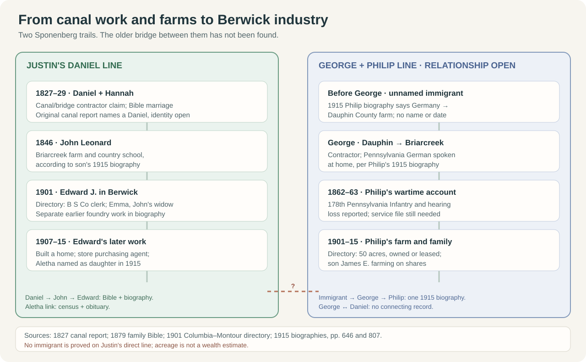
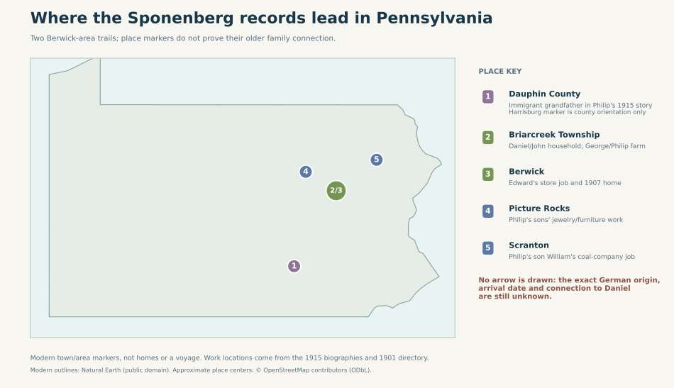
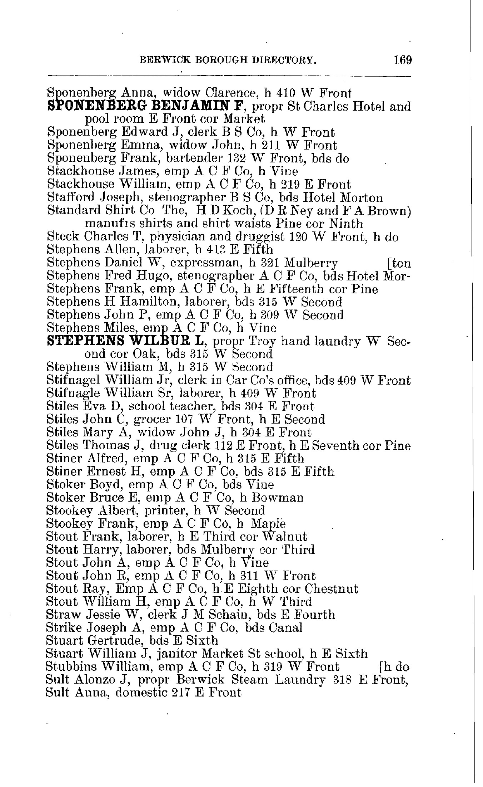
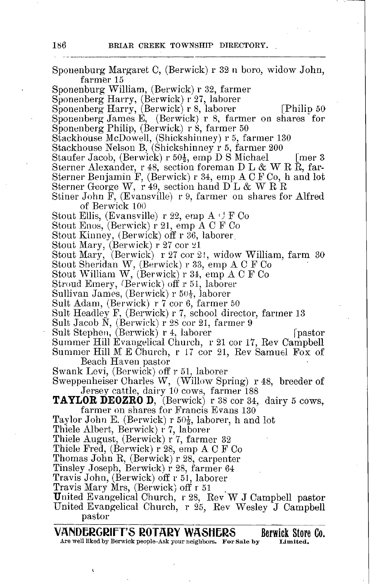

# Sponenbergs around Berwick: work, places and the immigration gap

**How far back?** Justin's line reaches **Daniel Sponenberg (born 1803, died 1856)** and wife **Hannah Shellhammer (1809–1889)** through Hannah's [family Bible](../sources/records/hannah-sponenberg-family-bible-births.jpg), Edward's [1915 family biography](../sources/records/edward-sponenberg-biography-1915-187.jpg), and later records linking Aletha to Shirley and Sonya. Daniel's **parents have not been proved**. A different [1915 biography of Philip Sponenberg](../sources/records/philip-sponenberg-biography-1915-p646.jpg) says Philip's **unnamed grandfather** emigrated from Germany and farmed in Dauphin County. Philip's father **George** has **no proved sibling link to Daniel**, so that immigrant cannot yet be assigned to Justin's direct line. Neither biography gives a ship, crossing date or German hometown. A [researcher tree](https://jowest.net/Genealogy/John/Christian/Sponenberg.htm) proposes an unnamed German-born father and Christena as Daniel's parents, but explicitly labels Christena's parent link unproved.

## Two trails through Pennsylvania

| Trail | What the records say | Confidence |
| --- | --- | --- |
| **Daniel → John Leonard → Edward J. → Aletha** | The [1915 Edward profile](../sources/records/edward-sponenberg-biography-1915-187.jpg) names these generations. Hannah's Bible independently lists **John Leonard**, born 1846, as Daniel and Hannah's son. Edward's daughter Aletha is linked to Shirley Kreischer by a [1940 household](https://familysearch.org/ark:/61903/1:1:KQ8L-MP7?lang=en) and [Shirley's 2018 obituary](https://familysearch.org/ark:/61903/1:1:61FN-QJ7Z?lang=en). | Strong through Aletha; the **John → Edward** link still depends on the retrospective biography. |
| **Unnamed German immigrant → George → Philip → Harry → Lee → Richard and Dale** | Philip's [1915 profile, p. 646](../sources/records/philip-sponenberg-biography-1915-p646.jpg) directly names his father George, the immigrant grandfather, and his son **Harry E.**, a Briarcreek butcher married to Bertha Ashton. A [transcribed 1995 notice](https://jowest.net/Genealogy/John/Christian/SponenbergObituaries.htm) names Harry and Bertha as Lee's parents; [Dale's 2025 family notice](https://www.kelchnerfuneralhome.com/obituaries/dale-sponenberg) names Lee, brother Richard and mother Mary Slusser. | Strong historical description of George → Philip → Harry; later two links rely on notices. The **George ↔ Daniel** join remains a hypothesis. |

Paulene Miller Beach remembered nearby children **Richard and Dale “Spoonenberg.”** Their unusual paired names, town and ages fit Dale's notice well; the reported two-block distance still needs a childhood address check. The [side-by-side tree](../maps/paulene-aletha-sponenberg-question.svg) shows why they may be part of the same wider family without assigning a cousin degree.

## Places named in the records

**Map limit:** The [1915 biographies](../sources/records/README.md) place George's father somewhere in **Dauphin County**, not specifically Harrisburg; that marker only orients the county. The **Briarcreek/Berwick** markers overlap at state scale. **Picture Rocks** and **Scranton** are jobs reported for Philip's children, not a family migration route. Modern place centers come from [OpenStreetMap](../maps/README.md#sponenberg-place-sources); the map draws no unproved voyage or household address.

## Work and a glimpse of daily life

The [1901 Berwick directory, p. 169](../sources/records/sponenberg-berwick-directory-1901-p169.jpg), calls **Edward J. a clerk at “B S Co”** on West Front Street and **Emma the widow of John** at **211 West Front**. Edward's 1915 profile later names Berwick Store Company and says he had spent three years at the **American Car and Foundry rolling mill**, became the store's **purchasing agent**, and built a home in **1907**. The directory helps confirm the store job and that John had died by 1901. It does not establish Edward's pay or whether his later house had a mortgage. The biography writer called him well known because his purchasing job connected him to farmers and borough residents; that is the writer's description, not a measured reputation.

The same page lists **Benjamin F. Sponenberg** running the **St. Charles Hotel and pool room** and **Frank Sponenberg** as a bartender. Their work is documented for Berwick, but neither man's relationship to Edward has been established.

Daniel's biography describes **canal and bridge contracting**, then farming, and says John worked the home farm while attending country schools. A [contemporary 1827 canal report](../sources/records/daniel-sponenberg-canal-report-1827-113.jpg) names a Daniel Sponenberg as a successor contractor on a **different canal stretch** from the one in the biography. It is a valuable name-and-job match, but still needs an identity bridge. Daniel's printed birthplace, **“Liverpool, Bucks Co.”**, is geographically inconsistent and should not be mapped as a precise location.

The [Pennsylvania State Archives canal map guide, p. 53](https://www.phmc.state.pa.us/bah/dam/rg/di/r017_0452_CanalMapBooks/CanalMapDetailedGuide.pdf#page=54) indexes **Map Book 28, sheet 23** as an **undated North Branch map** showing land names including **Daniel Sponenberg** and **Shelhammer**. The [Archives' online index](https://www.phmc.state.pa.us/bah/dam/rg/di/r017_0452_CanalMapBooks/CanalMapsInterface.htm) says books 28–52 are not yet online. This is an unusually specific map to request, but its finding aid gives no acreage, boundary, deed or identity proof.

On the **separate George–Philip trail**, the [1901 Briarcreek directory, p. 186](../sources/records/sponenberg-briarcreek-directory-1901-p186.jpg), lists **Philip farming 50 acres** and **James E. farming “on shares for Philip 50.”** Philip's 1915 profile names James E. as his son. The directory's [own key, p. 17](../sources/records/columbia-montour-directory-1901-key-p17.jpg) says acres after “farmer” can be **owned or leased**; it is not a land value or proof of title. The directory also has **two Harry Sponenberg laborers on different roads**; neither entry alone identifies Philip's son Harry.

Philip's profile says father **George**, born in Dauphin County, moved to **Briarcreek** and worked as a contractor; it calls him a successful and substantial citizen, a **1915 author's assessment** without an estate figure. It says George and Elizabeth Hass spoke **Pennsylvania German at home**. Philip farmed, had ordinary public schooling, and reportedly served in **Company H, 178th Pennsylvania Infantry** in 1862–63. The author says cannon noise damaged his hearing and he transferred to ambulance work; a service or pension file should test that personal detail. The same profile says Philip served on the **county commissioners' board** and was Methodist. His eleven children ranged across farming, butchery, jewelry work at **Picture Rocks**, furniture making, the coal company at **Scranton**, and American Car Company work. Those are individually reported jobs, not evidence of a shared family fortune.

**Next records that could extend the line:** a parent-naming record for Daniel; a deed, will or baptism naming **George and Daniel under the same parents**; **Canal Map Book 28, sheet 23** and matching deed; the original 1850 Daniel household and 1880 John household; Philip's 178th Pennsylvania service/pension file; Berwick Store payroll or a deed for Edward's 1907 house. Until the older link is made, **“when our Sponenbergs arrived in America” remains unanswered**.
