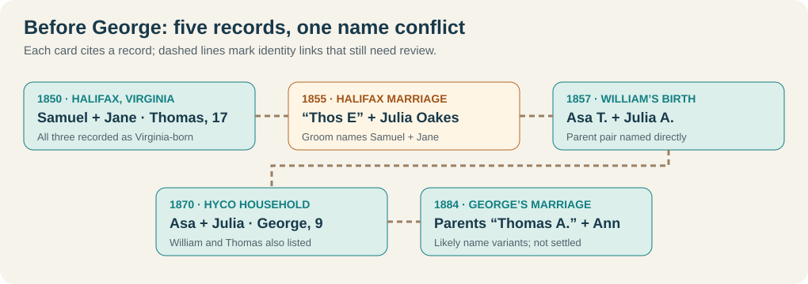
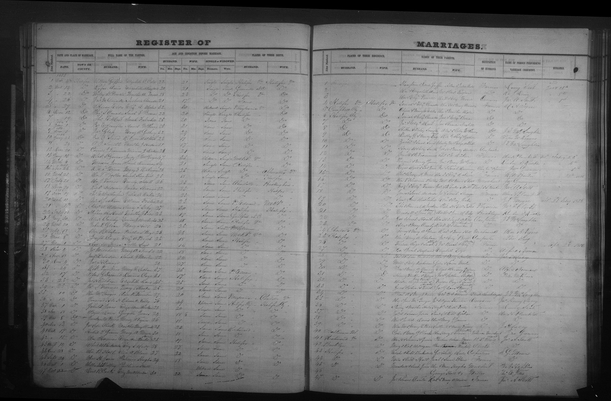

# Weatherfords before George: the Halifax County trail

The [full-size 1855 register](../sources/records/halifax-weatherford-oakes-marriage-register-1855.jpg) is saved with its [FamilySearch source](https://www.familysearch.org/ark:/61903/3:1:3QS7-L9XF-29M3-F?view=index&personArk=%2Fark%3A%2F61903%2F1%3A1%3A68TT-61CV&action=view&lang=en&groupId=M98Y-PF6). It contains many couples on one spread; the index identifies the Weatherford–Oakes entry. Handwriting and the later **Asa T.** naming difference still require close comparison.

**Earliest well-supported household:** In [1850](https://www.familysearch.org/ark:/61903/1:1:M8D3-227?lang=en), **Samuel and Jane Wetherford** lived in Banister district, Halifax County, Virginia. The census calls both **Virginia-born** and lists a 17-year-old **Thomas** in their household. Their birth years are only estimates from census ages: roughly **1810** and **1812**. Neither parent is named in that record. The FamilySearch tree's more exact life dates and Jane's **Ricketts** maiden name remain leads until matched to original records.

| When | What the record actually connects | Confidence |
| --- | --- | --- |
| **1850** | Samuel (40), Jane (38), and Thomas (17) share a Halifax household. Also present: Albert (20), Arabella (15), Rufus (13), Ruffin (11), Rebecca (8); these are household members, **not individually proved children** by this census alone. [1850 schedule](https://www.familysearch.org/ark:/61903/1:1:M8D3-227?lang=en). | **Recorded household** |
| **1855** | A Halifax [marriage register](https://familysearch.org/ark:/61903/1:1:68TT-61CV?lang=en) names **“Thos E Weatherford”**, about 24, son of **Samuel and Jane**, marrying **Julia Oakes**, about 25, daughter of **Edward and Amy Oakes**, on 19 December. The indexed **E** conflicts with later **Asa T.**; inspect the handwritten name before treating the two men as definitively identical. | **Recorded names; identity link probable** |
| **1857** | [William E. Weatherford's birth index](https://familysearch.org/ark:/61903/1:1:X5XM-8Q2?lang=en) names parents **Asa T. and Julia A. Weatherford** in Halifax. | **Recorded parent pair** |
| **1870** | [Nine-year-old George](https://www.familysearch.org/ark:/61903/1:1:MFGS-XLZ?lang=en) lives with indexed **Asa (“Reatherford”) and Julia** in Hyco district, Halifax; William (13) and a younger Thomas (11) are in the child group. The surname is evidently mistranscribed. | **Strong household bridge** |
| **1880–84** | A [Dan River household](https://www.familysearch.org/ark:/61903/1:1:MC51-ZRG?lang=en) lists **A. T., Julia A., and George C.**; George's [1884 marriage](https://www.familysearch.org/ark:/61903/1:1:6NJ1-VGMH?lang=en) calls his parents **Thomas A. and Ann**. The initials, spouse's second given name, and matching George support a **probable** Asa Thomas/Julia Ann reading, but the wording conflicts. | **Strong proposed identity; variant unresolved** |

The 1870 household is the key step missing from the earlier analysis: it follows George backward from the 1880 candidate to Asa and Julia in Halifax. The 1857 William birth corroborates **Asa T. + Julia A.** independent of a member tree. The **1855 “Thos E”** marriage and the **1850 Thomas** likely continue this family, but the original handwriting, differing ages (17 in 1850 versus about 24 in 1855), and 1860 household should be reconciled before calling Samuel George's proven grandfather. [FamilySearch's shared tree](https://www.familysearch.org/en/tree/person/details/LHLS-Z4J) calls the man **Asa Thomas Weatherford (1832–1904)** and connects him to Samuel and Jane; some sources attached there have incompatible 1935–57 death years, so the tree's dates and source attachments cannot be accepted wholesale.

## What was Halifax like?

The [Virginia Department of Historic Resources' county survey](https://dhr.fr.virginia.gov/pdf_files/SpecialCollections/HA-064_HalifaxCountySurvey_2008_HSPC_report.pdf#page=47) describes an agricultural county centered on tobacco in the 1850s, with corn and wheat also grown and the Richmond and Danville Railroad under construction. This is **regional context**, not proof that Samuel grew tobacco, owned land, enslaved people, or worked on the railroad. Their particular work, property, school access, and Civil War experience require individual records.

## How far back does this answer the immigration question?

The [1850 census](https://www.familysearch.org/ark:/61903/1:1:M8D3-227?lang=en) says Samuel and Jane were **born in Virginia around 1810–12**. Thus, **if the 1855 Thomas is George's father**, Ashley's Weatherford branch was in Virginia by the early nineteenth century; George's ancestral immigrant would have arrived **earlier**. Neither Samuel's parents nor an overseas birthplace or passenger record is established. An exact arrival century, country, or named immigrant would be guesswork. The [immigration overview](ashley-immigration.md) separates this branch from the other Ashley lines.

**Best next records:** enlarge and transcribe the [1855 original image](https://www.familysearch.org/ark:/61903/3:1:3QS7-L9XF-29M3-F?view=index&personArk=%2Fark%3A%2F61903%2F1%3A1%3A68TT-61CV&action=view&lang=en); compare the **1860 Asa/Julia household** and the **1884 original marriage**; find Samuel and Jane's original marriage, probate, and land records before assigning either of them parents. [Library of Virginia's Halifax County guide](https://www.lva.virginia.gov/collections/ccmf/VA/VA113) lists the surviving county record series.
