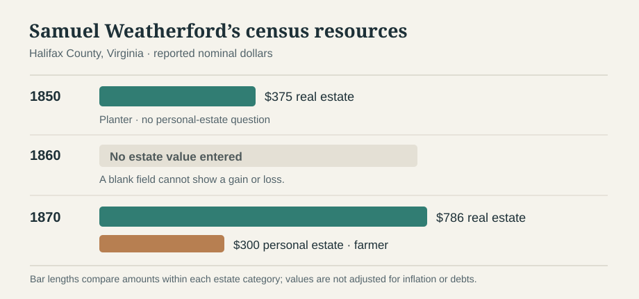
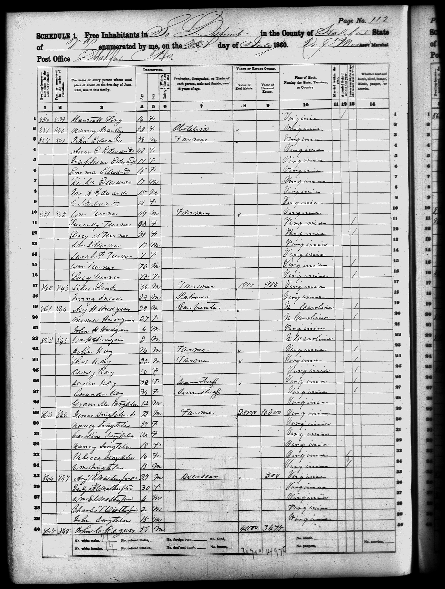

# Weatherfords before George: the Halifax County trail

The [full-size 1855 register](../sources/records/halifax-weatherford-oakes-marriage-register-1855.jpg) is saved with its [FamilySearch source](https://www.familysearch.org/ark:/61903/3:1:3QS7-L9XF-29M3-F?view=index&personArk=%2Fark%3A%2F61903%2F1%3A1%3A68TT-61CV&action=view&lang=en&groupId=M98Y-PF6). It contains many couples on one spread; the index identifies the Weatherford–Oakes entry. Handwriting and the later **Asa T.** naming difference still require close comparison.

**Earliest well-supported household:** In [1850](https://www.familysearch.org/ark:/61903/1:1:M8D3-227?lang=en), **Samuel and Jane Wetherford** lived in Banister district, Halifax County, Virginia. The census calls both **Virginia-born** and lists a 17-year-old **Thomas** in their household. Their birth years are only estimates from census ages: roughly **1810** and **1812**. Neither parent is named in that record. An indexed 1829 marriage supports Jane's **Ricketts** maiden name, though its original image is restricted here.

Justin found [FamilySearch person KH39-V7H](https://www.familysearch.org/en/tree/person/details/KH39-V7H), **Samuel W Weatherford**. **Yes, it is a strong match to this Samuel household:** the profile attaches the same [1850 census](https://www.familysearch.org/ark:/61903/1:1:M8D3-227?lang=en), an [1829 Samuel Weatherford–Jane Ricketts marriage index](https://www.familysearch.org/ark:/61903/1:1:68TK-RBB5?lang=en), and the [1855 marriage naming Samuel and Jane as the groom's parents](https://familysearch.org/ark:/61903/1:1:68TT-61CV?lang=en). It lists **Asa Thomas Weatherford** as their son, the identity we are testing against “Thos E.” **The profile has no parents listed for Samuel**, so it does not itself extend Ashley's Weatherford line before him. Its **1807 birth** conflicts with his census-implied **about 1810**, and its **1885 death** is shown with zero sources on the details screen. Use **c. 1807–1810** as a working birth range, not an exact birthday.

| When | What the record actually connects | Confidence |
| --- | --- | --- |
| **1829** | An [indexed Halifax marriage](https://www.familysearch.org/ark:/61903/1:1:68TK-RBB5?lang=en) names **Samuel Weatherford and Jane Ricketts**, with **James Ricketts** indexed as her father. It says **9 March**, as does a [MyHeritage marriage index](https://www.myheritage.com/research/record-30207-942836-S/jane-ricketts-and-samuel-weatherford-in-virginia-marriages); these may derive from the same record, so are **not independent proofs**. [Samuel's FamilySearch tree](https://www.familysearch.org/en/tree/person/details/KH39-V7H) displays **29 March**. The [original register image](https://www.familysearch.org/ark:/61903/3:1:3QS7-99XF-29MM-X?view=index&personArk=%2Fark%3A%2F61903%2F1%3A1%3A68TK-RBB5&action=view&cc=4149585&lang=en&groupId=M98Y-PFZ) was restricted to an affiliate library/FamilySearch Center in this browser. The couple is a strong match, but the exact day needs the original. | **Indexed record; day conflict** |
| **1850** | Samuel (40), Jane (38), and Thomas (17) share a Halifax household. Also present: Albert (20), Arabella (15), Rufus (13), Ruffin (11), Rebecca (8); these are household members, **not individually proved children** by this census alone. The [original schedule](../sources/records/samuel-jane-weatherford-census-1850.jpg) calls Samuel a **planter** and enters **$375 real estate**. | **Recorded household and census valuation** |
| **1855** | A Halifax [marriage register](https://familysearch.org/ark:/61903/1:1:68TT-61CV?lang=en) names **“Thos E Weatherford”**, about 24, son of **Samuel and Jane**, marrying **Julia Oakes**, about 25, daughter of **Edward and Amy Oakes**, on 19 December. The indexed **E** conflicts with later **Asa T.**; inspect the handwritten name before treating the two men as definitively identical. | **Recorded names; identity link probable** |
| **1857** | [William E. Weatherford's birth index](https://familysearch.org/ark:/61903/1:1:X5XM-8Q2?lang=en) names parents **Asa T. and Julia A. Weatherford** in Halifax. | **Recorded parent pair** |
| **1859** | An [indexed Halifax birth entry](https://www.familysearch.org/ark:/61903/1:1:6ZG1-B6WC?lang=en) names **Jane S. Weatherfore**, born **25 November**, with parents **Saml. and Jane Weatherfore**. Spelling is as indexed; the [original viewer](https://www.familysearch.org/ark:/61903/3:1:3QHN-B3YN-TX9K?view=index&personArk=%2Fark%3A%2F61903%2F1%3A1%3A6ZG1-B6WC&action=view&cc=4231103&lang=en) restricts image download, so its handwriting has not been independently transcribed here. | **Indexed parent–child link** |
| **1860, Asa's household** | The [original Halifax census, p. 112](https://www.familysearch.org/ark:/61903/3:1:33SQ-GBS6-94FN?view=index&personArk=%2Fark%3A%2F61903%2F1%3A1%3AM41H-SQF&action=view&cc=1473181&lang=en), lists an indexed **“Acy T Weatherford,” 29**, **“July A,” 30**, **Wm E, 4**, and **Charles T, 2** together. The man's occupation reads **overseer**; **$300** is entered under *personal estate*, with no real-estate value. The indexes' “Acy” and “July” may be handwriting readings of Asa and Julia, but the names should remain as indexed until independently transcribed. A 15-year-old John Singleton appears on the same household lines; his relationship is unknown. | **Original census household; proposed identity with Asa/Julia** |
| **1860–80, Samuel's household** | Original [1860](../sources/records/samuel-jane-weatherford-census-1860.jpg), [1870](../sources/records/samuel-jane-weatherford-census-1870.jpg) and [1880](../sources/records/samuel-jane-weatherford-census-1880.jpg) sheets continue **Samuel and Jane** in Halifax. His 1860 occupation and estate fields are **blank**; in 1870 he is a **farmer** with **$786 real estate** and **$300 personal estate** entered. In 1880 the sheet calls him a farmer and reports **Virginia as both parents' birthplaces**, without naming them. The 1860/1870 household relationships shown by MyHeritage are computer-inferred, not labels in those censuses. | **Original households and 1870 valuation; unnamed parents** |
| **1870** | [Nine-year-old George](https://www.familysearch.org/ark:/61903/1:1:MFGS-XLZ?lang=en) lives with indexed **Asa (“Reatherford”) and Julia** in Hyco district, Halifax; William (13) and a younger Thomas (11) are in the child group. The surname is evidently mistranscribed. | **Strong household bridge** |
| **1880–84** | A [Dan River household](https://www.familysearch.org/ark:/61903/1:1:MC51-ZRG?lang=en) lists **A. T., Julia A., and George C.**; George's [1884 marriage](https://www.familysearch.org/ark:/61903/1:1:6NJ1-VGMH?lang=en) calls his parents **Thomas A. and Ann**. The initials, spouse's second given name, and matching George support a **probable** Asa Thomas/Julia Ann reading, but the wording conflicts. | **Strong proposed identity; variant unresolved** |

The newly checked **1860 household fills the gap** between the 1857 William birth and 1870 Asa/Julia household: similar adult ages, a **Wm E** of the expected age and the same county make one continuing family highly likely. **Charles T, 2** in 1860 may be the **Thomas, 11** in 1870, but the given names differ and the 1860 census does not label family relationships. The **1855 “Thos E”** marriage and **1850 Thomas** likely continue this family because the bride Julia, ages, place and Samuel/Jane parent names fit, but the groom's name and 1850/1855 age difference remain unresolved. **Samuel is still George's probable, not proved, grandfather.** [FamilySearch's shared tree](https://www.familysearch.org/en/tree/person/details/LHLS-Z4J) calls the man **Asa Thomas Weatherford (1832–1904)**; some sources attached there have incompatible 1935–57 death years, so the tree's exact dates and other attachments cannot be accepted wholesale.

**A later clue to the name conflict:** The likely George's [1937 original death certificate](../sources/records/g-w-weatherford-death-certificate-1937.jpg) reports his father as **Tom Weatherford**, consistent with the **Thomas A.** name on the [1884 original marriage spread](../sources/records/george-ella-weatherford-marriage-register-1884.jpg). George's daughter Novella's [1951 certificate](../sources/records/novella-weatherford-cash-death-certificate-1951.jpg) gives the same George C. and Ella parent pair and the family's Noble address. This strengthens the identification of the 1937 man and the **Thomas** given name; it does not explain the earlier **Asa T. / Thos E.** variants or name Tom's parents.

**MyHeritage comparison:** the [Bonsell member tree](https://www.myheritage.com/research/record-1-OYYV6HQXKGGCX243RW5HJK4OHKJEFDY-20-56805/samuel-w-weatherford-in-myheritage-family-trees) calls Samuel's parents **Jackson Weatherford and Martha “Patsy” McCampbell**; [other submitted trees](https://www.myheritage.com/research/record-1-OYYV6XQDA4EBBYBA3RORZ7X3IROXU2I-4-36581/samuel-weatherford-in-myheritage-family-trees) repeat the pair. These are **research leads**, not multiple independent parental records. The Bonsell record shows no underlying birth, probate or land item proving Samuel was their son, and its full site profile restricts nonmembers. The [original 1880 census](../sources/records/samuel-jane-weatherford-census-1880.jpg) reports **Virginia-born parents**, but cannot select Jackson or Martha by name. A newly checked [1844 Indiana marriage and 1850 household](weatherford-jackson-candidate.md) show why two men named Jackson must not be merged on the strength of a compiled pedigree.

## What the household sheets reveal

| Census | Samuel's work | Estate values entered | Schooling clue |
| --- | --- | --- | --- |
| [1850 original](../sources/records/samuel-jane-weatherford-census-1850.jpg) | **Planter** | **$375 real estate**; no personal-estate question on this schedule | No attendance mark for the listed children in the “within the year” column. |
| [1860 original](../sources/records/samuel-jane-weatherford-census-1860.jpg) | **Blank** | **Blank** real and personal estate fields | The listed children's attendance column appears blank. |
| [1870 original](../sources/records/samuel-jane-weatherford-census-1870.jpg) | **Farmer** | **$786 real estate; $300 personal estate** | No school or literacy conclusion drawn here. |
| [1880 original](../sources/records/samuel-jane-weatherford-census-1880.jpg) | **Farmer**; a health entry appears to read **“Varicose Veins”** | This census did not ask for real or personal estate values. | **Caroline R., 22,** is listed as a daughter with occupation **“at school.”** The column asking attendance within the census year is blank; no school is named. |

These are **nominal values reported by an enumerator**, not assessed net worth, a deed, the size of a farm, or proof of a transfer across generations. The **1860 blanks are missing data, not zero**: they cannot show whether Samuel gained or lost property before the Civil War. A blank school mark means attendance was **not recorded for that census year**; it does not establish that a child never attended, could not read, or lacked access to a school. The 1850 term *planter* does not establish what he grew or whether he enslaved anyone; that question needs an original slave schedule, tax or probate evidence.

**Education and health, 1880:** On the [original Black Walnut district page, lines 22–24](../sources/records/samuel-jane-weatherford-census-1880.jpg), the enumerator marked both **“Cannot read”** and **“Cannot write”** for Samuel and Jane. The same marks appear for Caroline although her occupation says **“at school”**. Record both fields as this enumerator's report, not a conclusion about lifelong ability or the education she received. Samuel's health entry appears to read **“Varicose Veins”**; it is a reported condition on one census, not a medical diagnosis reconstructed from records. His and Jane's own school names remain unknown.

## What was Halifax like?

*A [1939 Library of Congress photograph](https://www.loc.gov/item/2017802158/) shows the county's later tobacco market. It was made roughly **80 years after** Samuel and Jane's 1850 census. It is a picture of the regional economy's later life, **not** a view of their home or work. [Image credit and provenance](../media/README.md#halifax-county-tobacco-town-1939).*

The [Virginia Department of Historic Resources' county survey](https://www.dhr.virginia.gov/pdf_files/SpecialCollections/HA-064_HalifaxCountySurvey_2008_HSPC_report.pdf#page=47) describes an agricultural county centered on tobacco in the 1850s, with corn and wheat also grown and the Richmond and Danville Railroad under construction. This is **regional context**, not proof that Samuel grew tobacco, held title to a specific tract, enslaved people, or worked on the railroad. The census reports real-estate values in 1850 and 1870 but gives no deed, crop, school name, or account of their Civil War experience.

The [saved full 1860 census sheet](../sources/records/asa-julia-weatherford-census-1860.jpg) ([FamilySearch image](https://www.familysearch.org/ark:/61903/3:1:33SQ-GBS6-94FN?view=index&personArk=%2Fark%3A%2F61903%2F1%3A1%3AM41H-SQF&action=view&cc=1473181&lang=en)) calls the likely Asa an **overseer** and lists **$300 personal estate**. It does not name an employer, farm, workers, or a wage. An overseer's work could be tied to agriculture in this setting, but this entry alone does **not** establish that he enslaved anyone or worked on a particular plantation. The amount is not a net-worth estimate or evidence of an inheritance.

## How far back does this answer the immigration question?

The [1850 census](https://www.familysearch.org/ark:/61903/1:1:M8D3-227?lang=en) says Samuel and Jane were **born in Virginia around 1810–12**. Thus, **if the 1855 Thomas is George's father**, Ashley's Weatherford branch was in Virginia by the early nineteenth century; George's ancestral immigrant would have arrived **earlier**. Neither Samuel's parents nor an overseas birthplace or passenger record is established. An exact arrival century, country, or named immigrant would be guesswork. The [immigration overview](ashley-immigration.md) separates this branch from the other Ashley lines.

**To picture the 1740s without moving this family there:** [Virginia's period-view gallery](../context/virginia-colonial-views.md) includes a [1740–70 Williamsburg etching](../media/williamsburg-1740-1770-etching.jpg), [1755 Fry–Jefferson regional map](../media/virginia-fry-jefferson-map-1755.jpg), and [1749 Alexandria plan](../media/alexandria-plan-1749.jpg). These illustrate the colony at different places and dates; **no Weatherford in this proved line has yet been placed in Virginia in 1740**.

**Best next records:** closely transcribe the [1855 original image](https://www.familysearch.org/ark:/61903/3:1:3QS7-L9XF-29M3-F?view=index&personArk=%2Fark%3A%2F61903%2F1%3A1%3A68TT-61CV&action=view&lang=en) and compare the [1884 original marriage](https://www.familysearch.org/ark:/61903/3:1:3QS7-99LX-MC9V?view=index&personArk=%2Fark%3A%2F61903%2F1%3A1%3A6NJ1-VGMH&action=view&lang=en) to resolve the name variants; seek a record linking the 1860 **Charles T** with 1870 **Thomas**. Find Samuel and Jane's original marriage, probate, and land records before assigning either of them parents. [Library of Virginia's Halifax County guide](https://www.lva.virginia.gov/collections/ccmf/VA/VA113) lists surviving record series.
