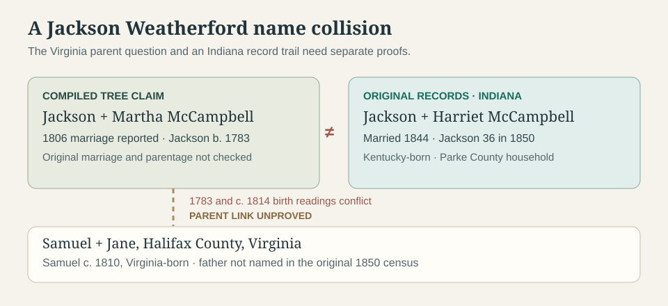

# Which Jackson Weatherford could be Samuel's father?

**The parent link is still unproved.** [Member trees](https://www.ancestry.com/genealogy/records/samuel-w-weatherford-24-1snt9xq) call the Samuel who lived in Halifax County, Virginia, a son of **Jackson Weatherford and Martha “Patsy” McCampbell**. They do not provide a parent-naming record for Samuel. His [1850 original census](../sources/records/samuel-jane-weatherford-census-1850.jpg) reports him born in **Virginia**, about **1810**, living with **Jane**.

| Lead | What can be checked | What remains open |
| --- | --- | --- |
| **An older Jackson + Martha/Patsy McCampbell** | A [compiled McCampbell genealogy](https://www.seekingmyroots.com/members/files/G003505.pdf) reports a **27 March 1806** marriage of Martha and Jackson Wetherford. A [separate compiled pedigree](https://springgrove.foertmeyer.com/registers/Ancestors%20of%20Virginia%20Louise.pdf) places it in Shelby County, Kentucky, and gives Jackson **1783** as a birth year. | The **1806 original marriage** and any document naming their children have not been inspected. The claim that this couple parented Halifax Samuel is still a tree assertion. |
| **Jackson + Harriet McCampbell in Indiana** | The [original Parke County register](../sources/records/jackson-harriet-weatherford-marriage-1844-indiana.jpg) names the couple in a **9 October 1844 license** and says a minister married them **10 October**. Their [original 1850 census](../sources/records/jackson-harriet-wetherford-census-1850-indiana.jpg) records Jackson **36**, Kentucky-born, Harriet **27**, Kentucky-born, and Eliza **1**, Indiana-born, in Washington Township, Parke County. It enters **$1,000 real estate** for Jackson. A [1870 index](https://www.familysearch.org/ark:/61903/1:1:MX6P-86V?lang=en) lists a Jackson **54**, Kentucky-born, with Harriet in the same county. | The 1844 record gives **no age, parents or previous spouse**. The 1850/1870 household match is strong, but its relationship to the older Jackson is unproved. Neither record connects this Indiana couple to Halifax Samuel. |

**Why the distinction matters:** One [compiled pedigree](https://springgrove.foertmeyer.com/registers/Ancestors%20of%20Virginia%20Louise.pdf) assigns both the **1806 Martha marriage** and the **1844 Harriet marriage** to the *same* Jackson, while dating him born **1783**. The Jackson actually recorded with Harriet in **1850** was **36**, implying birth around **1814**; the [1870 entry](https://www.familysearch.org/ark:/61903/1:1:MX6P-86V?lang=en) implies about **1816**. Those two census ages agree with one another and conflict sharply with **1783**. This is evidence of a likely same-name conflation in the pedigree, **not** proof that the older Jackson never existed or that he was not Samuel's father. Another [member tree](https://www.ancestry.com/genealogy/records/samuel-w-weatherford-24-1snt9xq) dates its proposed Jackson's death **1833**, which cannot describe the 1844 Indiana groom if both dates are correct.

**Next record test:** Obtain the original **1806 marriage** and seek an older Jackson's will, estate settlement, deed, or tax entry naming **Samuel**. Then compare that person's locations with Samuel's Virginia birth and his [1829 Halifax marriage lead](https://www.familysearch.org/ark:/61903/1:1:68TK-RBB5?lang=en). The [Parke County 1844 register](../sources/records/jackson-harriet-weatherford-marriage-1844-indiana.jpg) should not be used as evidence for Ashley's ancestor until a parent-child bridge is found.
