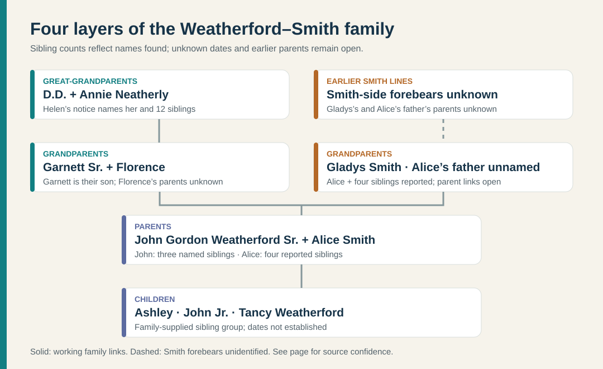
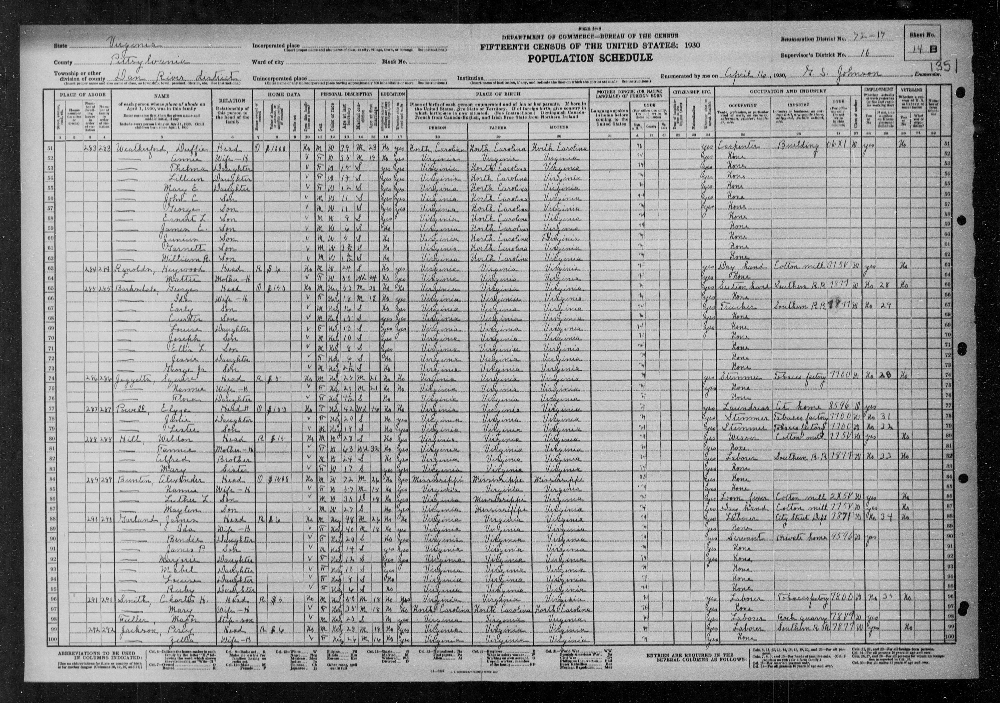
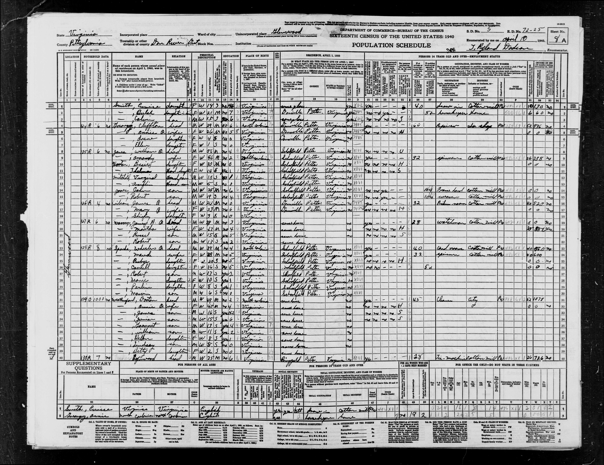

# Weatherford and Smith: generations and siblings

This is the **known family structure**, not a complete legal pedigree. The diagram above summarizes where the lines meet; the [deeper Weatherford diagram](../maps/weatherford-deep-lineage.svg) shows the newly documented earlier generations. “Unknown” means no reliable date or relative was found in the sources reviewed. A person listed as surviving in an old obituary was alive **then**; that does not establish present status. Living relatives' exact birth dates are left unfilled unless a family record is supplied. [Garnett Sr.'s obituary](https://www.washingtonpost.com/archive/local/2007/07/03/obituaries/43ba782a-181c-4c59-a78e-7d361d86bf4a/) · [Helen's obituary](https://www.legacy.com/us/obituaries/godanriver/name/helen-barksdale-obituary?id=33333924) · [Garnett Jr.'s notice](https://www.legacy.com/us/obituaries/washingtonpost/name/garnett-weatherford-obituary?id=5491686) · family account.

## Earlier Weatherford and Neathery layer

Duffy's original [1966 death certificate](https://www.familysearch.org/ark:/61903/3:1:3Q9M-C95D-9HD1?view=index&personArk=%2Fark%3A%2F61903%2F1%3A1%3AQVRZ-2C68&action=view&lang=en) names his parents **George C. Weatherford and Ella Lumpkin**. Annie's original [1969 certificate](https://www.familysearch.org/ark:/61903/3:1:3Q9M-C95D-49MW-W?view=index&personArk=%2Fark%3A%2F61903%2F1%3A1%3AQVYL-N4BR&action=view&lang=en) names **John R. Neathery and Annie Phelps**. These are **Ashley's great-great-grandparents** through Garnett. George's likely 1937 death is now supported by an [original certificate](../sources/records/g-w-weatherford-death-certificate-1937.jpg) and their daughter's [1951 certificate](../sources/records/novella-weatherford-cash-death-certificate-1951.jpg); Ella's dates and Annie Phelps's dates remain open; John Cabell Neathery's original certificate records his 1953 death. [Neathery household evidence](neathery-phelps.md). George and Ella's [1884 marriage register](https://www.familysearch.org/ark:/61903/3:1:3QS7-99LX-MC9V?view=index&personArk=%2Fark%3A%2F61903%2F1%3A1%3A6NJ1-VGMH&action=view&lang=en) gives George's parents as **Thomas A. and Ann Weatherford** and Ella's as **Fayette and Mina Lumpkins**. A [1870 census](https://www.familysearch.org/ark:/61903/1:1:MFGS-XLZ?lang=en) and [1857 birth index](https://familysearch.org/ark:/61903/1:1:X5XM-8Q2?lang=en) strengthen the competing **Asa T./Julia A.** identification. One generation further, an [1850 household](https://www.familysearch.org/ark:/61903/1:1:M8D3-227?lang=en) has Samuel, Jane, and Thomas; their [1855 marriage](https://familysearch.org/ark:/61903/1:1:68TT-61CV?lang=en) calls the groom **“Thos E”**. See the [evidence path](weatherford-early-virginia.md) before adopting these variants as one identity.

## Earlier Hines and Cowan layer on Ashley's maternal side

| Person | Birth and death | Documented relationship; remaining limit |
| --- | --- | --- |
| **John Jackson Hines** | His [original certificate](../sources/records/john-jackson-hines-death-1941.jpg) gives **27 October 1879 – 11 May 1941**; birth in Washington County, Virginia; death in Johnson City, Tennessee. Earlier censuses vary on birth year/state. | Wife **Nora Jane Cowan**. Informant **Mrs. W. H. Blevins** and their shared **902 Watauga Avenue** address strongly connect him to Mary. Certificate says parents **James Hines and Elizabeth Akers**; an attached 1900 Bristol census instead calls a likely John **William Hines's son**. Father unresolved. |
| **Nora Jane Cowan Hines** | [Original birth register](../sources/records/nora-cowan-birth-register-1892.jpg): **15 August 1892**, Washington County; [1937 certificate](../sources/records/nora-jane-cowan-hines-death-1937.jpg): death **21 February 1937**, but birth **14 August 1893**. | John J.'s wife; both records name parents **Jasper and Mary Cowan**; death certificate gives Mary's maiden name **Mason**. The 1930 census's **Maud** name remains unexplained. |
| **Jasper Newton Cowan** | [1942 certificate](../sources/records/jasper-newton-cowan-death-1942.jpg): **31 January 1869 – 7 March 1942**; 1900 census reports June 1867. | Nora's father, married to Mary Ann Mason; 1900 farmer, later mechanic. His certificate names father **Isaac Cowan**. [Cowan–Mason guide](cowan-mason.md). |
| **Mary Ann Mason Cowan** | [Birth index](https://www.familysearch.org/ark:/61903/1:1:X5DT-1PX?lang=en): **6 December 1871**; [death certificate](../sources/records/mary-ann-mason-cowan-death-1950.jpg): **14 December 1950**, but birth in 1872. | Nora's mother; father **Henry Mason** on both records and mother **Frances** on the birth index. The public tree's 1949 death date conflicts with the certificate. |
| **Isaac G. and Elizabeth Cowan; Henry T. and Frances Mason** | Vital dates not yet established from originals. | [1880 Isaac household](https://www.familysearch.org/ark:/61903/1:1:MCR8-PQ9?lang=en) calls Jasper their son. [1880 Henry household](https://www.familysearch.org/ark:/61903/1:1:MC5F-5K2?lang=en) calls Mary his and Frances's daughter. See [visible siblings and limits](cowan-mason.md#siblings-named-on-contemporary-household-sheets). |

Mary's likely older brother **Howard Winston Hines** is a collateral relative in this layer, not another direct ancestor. His [1940 house-painter census](../sources/records/howard-hines-lillie-household-census-1940.jpg), [signed 1942 draft card](../sources/records/howard-winston-hines-draft-card-1942.jpg), [Army enlistment index](https://www.familysearch.org/ark:/61903/1:1:KMJG-D9J?lang=en) and [1950 household](../sources/records/howard-hines-household-census-1950.jpg) follow him from the Bristol family to military entry and back; no record inspected gives his unit or deployment. [Short account](smith.md#gladyss-siblings-and-the-tancy-clue).

## Layer 1 — Ashley's great-grandparents

| Person | Birth | Death | Children or siblings found |
| --- | --- | --- | --- |
| **Doctor Duffy “D.D.” Weatherford** | **31 October 1890**, Caswell County, North Carolina, per [1966 certificate](https://www.familysearch.org/ark:/61903/1:1:QVRZ-2C68?lang=en) | **12 August 1966**, Danville. | Parents **George C. Weatherford and Ella Lumpkin**. **Novella Weatherford Cash** (1887–1951) is a **probable sister**: her original certificate names the same parents. The two have not been found together on a parent-labeled household record. |
| **Annie Lillian Neathery Weatherford** | **13 March 1894**, Pittsylvania County, Virginia, per [1969 certificate](https://www.familysearch.org/ark:/61903/1:1:QVYL-N4BR?lang=en) | **10 August 1969**, Danville. | Parents **John R. Neathery and Annie Phelps** per certificate; brother **Oscar C. Neathery** in the [1900 census](../sources/records/neathery-household-census-1900-sheet2a.jpg). Father's later wife **Mary H. Moring** was probably Annie's stepmother. [Evidence guide](neathery-phelps.md). |
| **Roscoe Gordon Morrison** | **2 February 1903**, Indiana, per [death certificate](../sources/records/roscoe-gordon-morrison-death-1947.jpg) | **2 March 1947**, Fairfax County | Florence's father; sheet-metal contractor. His certificate names **Porter Morrison and Celia** as parents. [Morrison guide](morrison-hollinger.md). |
| **Eleanor Mae Hollinger Morrison** | **13 June 1909**, Pennsylvania, per [death certificate](../sources/records/eleanor-mae-hollinger-morrison-death-1968.jpg) | **22 November 1968**, Fairfax County | Florence's mother; widowed head of the seven-child [1950 household](../sources/records/morrison-household-census-1950.jpg). The [1941 notice](https://www.findagrave.com/memorial/139916983/louisa_e-hollinger) and earlier censuses strongly support **Linaus P. Hollinger and Louisa E. Straub** as her parents; the notice's original has not been inspected. Louisa's [full certificate](../sources/records/louisa-straub-hollinger-death-certificate-1941.jpg) names her father **Nicholas Straub**. |
| **William Howard Blevins** | About **1908**; birth state disputed | FamilySearch tree proposes **9 March 1991** without an attached death source; vital record pending | Gladys's father in the [1940 household](https://www.familysearch.org/ark:/61903/1:1:K4HN-TVW?lang=en); married Mary in [1931](https://www.familysearch.org/ark:/61903/1:1:QKH7-PC1M?lang=en). A [1920 census](https://www.familysearch.org/ark:/61903/1:1:MN2T-TZX?lang=en) places a possible Howard near William E. and Tancy; a [1930 Bristol boarder](https://www.familysearch.org/ark:/61903/1:1:CV9G-ZZM?lang=en) is another candidate. Neither identifies his parents, and birthplace reports conflict. A [Georgia William H. Blevins who died in October 1991](smith.md) is a separate man. [Deeper Blevins guide](blevins-deep-lineage.md). |
| **Mary Elizabeth Hines Blevins** | About **1912**, Virginia per [1940 census](https://www.familysearch.org/ark:/61903/1:1:K4HN-TVW?lang=en) | **3 December 1961**, per her [original death notice](../sources/records/mary-hines-blevins-death-notice-1961.jpg); vital certificate unread | Gladys's mother. The [1920/1930 Bristol censuses](smith.md#places-work-and-the-miller-drive-chapter) and directories link Elizabeth/Mary E. to **John J. Hines**. His [1941 certificate](../sources/records/john-jackson-hines-death-1941.jpg) names wife **Nora Jane Cowan** and informant **Mrs. W. H. Blevins** at the same Johnson City address as Mary's 1940 household. The 1961 notice names husband William and their four children, including Gladys Lou Smith and Mary Jane Griffith. John's wife is called **Maud** only in the 1930 census; her identity as Nora still needs explanation. |
| **James Allen Smith's candidate parents** | **Raymond J. Smith:** about 1895–96; **Alice M. Mulhall:** about 1894–95, from the [1917 marriage index](https://www.familysearch.org/ark:/61903/1:1:XLHF-MHC?lang=en) and censuses. | Raymond's [1966 obituary index](https://www.familysearch.org/ark:/61903/1:1:Q53K-2RWC?lang=en) reports **30 January 1966**; Alice's death requires an original. | A [same-name federal record](https://www.familysearch.org/ark:/61903/1:1:6K4N-S22V?lang=en), [1930–50 DC censuses](smith-dc-candidate.md) and the obituary index trace this family; James A. appears in 1940 and 1950. The record naming that son as **Gladys's husband** is still missing, so these are candidate ancestors. The 1930 household names Margaret, Mary, William and Alice; Charles appears in 1940 and Joseph in 1950. |

The certificates resolve the derivative biographies' **1894–1969 for both** error: those are Annie's years; Duffy's are **1890–1966**. *Doctor* is Duffy's given name, not an occupation. The certificates call her **Lillian**, while a child's later marriage record calls her **Lee**. The marriage record or her birth registration could resolve the middle-name variation. The 1930 census places ten children in Duffy and Annie's Dan River household; it records him as a **building carpenter**, but does not reveal the couple's childhood schools. [1930 census](https://www.familysearch.org/ark:/61903/1:1:CFGY-92M?lang=en).

## Layer 2 — Garnett's generation and the Miller Drive parents

**Garnett Burnell Weatherford Sr.** gave **8 March 1927** and **Pittsylvania County, Virginia**, as his birth date and place on a [1946 draft card](https://www.familysearch.org/ark:/61903/3:1:3Q9M-CSZX-KJ56?view=index&personArk=%2Fark%3A%2F61903%2F1%3A1%3AQ2W5-YQRZ&action=view&lang=en); his obituary instead says **Danville**. He died **27 June 2007**. His [original marriage return](../sources/records/garnett-florence-marriage-1954.jpg) documents a **16 January 1954** wedding to **Florence Ruth Morrison** and types his first name **“Garrett.”** Florence's [obituary transcription](https://www.familysearch.org/ark:/61903/1:1:61JY-8KNX?lang=en) gives **20 May 1937–17 February 2019**; the 1940 and 1950 censuses support the birth year, although the marriage form's age **21** conflicts. Her parents, **Roscoe Gordon Morrison and Eleanor Mae Hollinger**, and seven-child sibling group are documented in the [Morrison guide](morrison-hollinger.md).

Helen's obituary identifies **12 siblings**, including Garnett. Birth order is mostly unknown. Her “survived by” and “predeceased by” wording gives the status **as of 12 March 2007**, not necessarily a present-day status. [Helen's obituary](https://www.legacy.com/us/obituaries/godanriver/name/helen-barksdale-obituary?id=33333924).

### The household when Garnett was three

The [original 1930 census sheet](https://www.familysearch.org/ark:/61903/3:1:33S7-9RZF-DP2?view=index&personArk=%2Fark%3A%2F61903%2F1%3A1%3ACFG1-7N2&action=view&lang=en), **Dan River District, Pittsylvania County, sheet 14B, lines 51–62**, lists **Duffy and Annie** with ten children. All ten are recorded as Virginia-born; Duffy is North Carolina-born, and the sheet calls him a **building carpenter**. The household reports an **owned home valued at $1,000**. That is one reported property value in 1930, not net worth or proof of later inheritance.

| Children named on the 1930 sheet, in order | Age recorded | Approximate birth window from census age |
| --- | ---: | --- |
| Thelma | 15 | c. 1914–15 |
| Lillian | 14 | c. 1915–16 |
| Mary E. | 12 | c. 1917–18 |
| John C. | 11 | c. 1918–19 |
| George | 11 | c. 1918–19; **George Ira's** signed card gives 15 September 1918 |
| **E— L.** (handwriting uncertain; resembles *Ernest*) | 9 | c. 1920–21 |
| James E. | 6 | c. 1923–24 |
| Junius | 5 | c. 1924–25 |
| Garnett | 3 | c. 1926–27; his signed card gives 8 March 1927 |
| William R. | about 1½ | c. 1928–29 |

Thelma, Lillian, Mary, George, James, Garnett and William plausibly match names in the later obituaries; the sheet supplies **ages at one census**, not exact birthdays. **John C.** may be the later “Johnny,” and the unclear **E— L.** may be the later “Emmett” or another child, but those identities need another record. **Junius** may be the same boy called “Junior” in 1940; his connection to the obituary's D.D. Jr. remains open. **Helen**, born in 1931, and other younger children could not appear on this 1930 sheet, so it does not contradict the later 13-child family account.

The [original 1940 census](https://www.familysearch.org/ark:/61903/3:1:3QS7-89MR-3S4F?view=index&personArk=%2Fark%3A%2F61903%2F1%3A1%3AVRBR-3FX&action=view&cc=2000219&lang=en), **Dan River District, sheet 8A, lines 31–39**, names the parents and seven children: **James, 16; a son written *Junior* or *Junius*, 15; Garnett, 13; William, 11; Helen, 8; Lindsay, 5; and Betty, 2**. The 1930 **Junius, 5**, and 1940 **Junior/Junius, 15**, are a strong age-and-household match, although his formal name and relationship to the obituary's “D.D. Jr.” remain unproved. This page independently places **Helen, Lindsay and Betty** in the family after the 1930 snapshot. It reports the family in the **same house in 1935**, an owned home valued at **$1,000** in 1940. Duffy's reported work changed from **building carpenter in 1930** to **“cleaner,” city, in 1940**, with **45 weeks** worked and **$1,078 wages in 1939**. These are two census reports, not a continuous employment or property history; neither proves why his work changed or whether the 1930 and 1940 reported valuations refer to the same property.

| Helen and the people her obituary calls siblings | Birth | Death or last dated evidence |
| --- | --- | --- |
| **Thelma W. Snead** | **15** in the 1930 census, c. **1914–15**; compilation proposes 1914 | Survived Helen in March 2007; compilation proposes **2007**. |
| **Lillian W. Snead** | **14** in the 1930 census, c. **1915–16**; compilation proposes 1915 | Died before March 2007; compilation proposes **1999**. |
| **Mary W. Walker** | Likely **Mary E., 12** in the 1930 household, c. **1917–18** | Died before March 2007. |
| **Betty W. Atkinson** | **2** in the 1940 household, c. **1937–38** | Survived Garnett in June 2007. |
| **Helen Weatherford Barksdale** | **27 September 1931**, Danville | **12 March 2007**. |
| **D.D. Weatherford Jr.** | Unknown; the **Junius/Junior** in 1930/1940 is a lead, not a proved identity | Survived Garnett in June 2007. |
| **Lindsey Weatherford** | Likely **Lindsay, 5** in the 1940 household, c. **1934–35** | Died before March 2007. |
| **James Weatherford** | Likely **James E., 6** in the 1930 household, c. **1923–24** | Died before March 2007. |
| **Emmett Weatherford** | Unknown | Died before March 2007. |
| **William Weatherford** | Likely **William R., about 1½** in the 1930 household, c. **1928–29** | Died before March 2007. |
| **Johnny Weatherford** | Unknown | Died before March 2007. |
| **George Ira Weatherford** | **15 September 1918**, Danville/Pittsylvania area, per [signed draft card](../sources/records/george-ira-weatherford-draft-card-1940.jpg) and [Social Security index](https://www.familysearch.org/ark:/61903/1:1:6K3F-XVMQ?lang=en) | **19 April 1999**, per Social Security index. The index names parents **Duffie Weatherford and Annie L. Neathery**. |
| **Garnett Burnell Weatherford Sr.** | **8 March 1927**, on his 1946 registration | **27 June 2007**. |

The [same unsourced compilation](https://cottagehill.com/southside/f544.htm) supplies Thelma's and Lillian's proposed dates. Their obituary listing confirms only that Thelma was alive and Lillian had died by March 2007. Do not attach precise dates to the other names without distinguishing records.

**George's two households and wartime work.** A [1935 marriage index](https://www.familysearch.org/ark:/61903/1:1:XRMH-58Z?lang=en) pairs George with **Bettie Davis** and names his parents Duffy and Annie Neathery. The [1940 census](https://www.familysearch.org/ark:/61903/1:1:VR15-N6W?lang=en) lists wife **Betty J.** and one-year-old son **Laurence P.** in Danville. His [1940 signed draft card](../sources/records/george-ira-weatherford-draft-card-1940.jpg) gives **Danville Knitting Mills** as employer. An [Army enlistment index](https://www.familysearch.org/ark:/61903/1:1:K8TF-L5V?lang=en) records his **8 August 1944** Richmond enlistment and codes his civilian occupation as a driver. His [1951 divorce abstract](../sources/records/george-ira-betty-davis-divorce-1951.jpg) names **Betty Jane Davis Weatherford**, one minor child, and **AB&W Transit Co.** as his employer. It says they married in October 1935, separated in August 1948, and divorced **5 January 1951**. The marriage index says **25 October**; the divorce abstract says **26 October**. Its **age 37** conflicts with the 1918 birth on the signed card and Social Security index; its online *estimated birth 1898* is an additional indexing error. Do not use either age calculation as a corrected birth year.

A [family-history book with information supplied by Mildred Wilt Weatherford](https://www.waltwarnickwesternmarylandfamilyhistory.com/lee-family-book-1) says George married **Mildred Oletta Wilt on 1 June 1951**, drove for **AB&W/Metro for more than 38 years**, and served in the **84th Infantry Division, 335th Infantry** at the Battle of the Bulge, earning a **Bronze Star**. The enlistment and divorce records independently confirm the **Army start** and **AB&W employer**, but the **unit, battle, medal, service end, long tenure, and Mildred marriage date** still need original records. George's **Army** account belongs to Garnett's brother, not to Garnett's **Navy** service. [Garnett profile](https://www.washingtonpost.com/archive/local/2007/07/03/obituaries/43ba782a-181c-4c59-a78e-7d361d86bf4a/).

**James Allen Smith and Gladys Louise Blevins** are named as Alice's parents on her [1986 marriage return](https://www.familysearch.org/ark:/61903/1:1:QK9V-J612?lang=en); Jane's [1976](https://www.familysearch.org/ark:/61903/1:1:QVY5-GZKP?lang=en) and Buck's [1983](https://www.familysearch.org/ark:/61903/1:1:QV13-2NVL?lang=en) returns repeat the pair. Their [shared grave marker](https://www.findagrave.com/memorial/106660847/james_a-smith) gives **James 1933–1990** and **Gladys 1938–2008**. Her [2008 memorial](https://www.findagrave.com/memorial/45796517/gladys_louise-smith) says **Bristol, Virginia, 30 May 1938 → Fairfax County, 2 November 2008** and names all five children. The family recalled James's death in the 1990s; the marker narrows this to **1990**. The county's puzzling **1990 “Gladys L Smith heirs of”** title entry cannot be taken as Gladys's death date in light of the memorial. [Smith evidence guide](smith.md).

Gladys's [1940 household](https://www.familysearch.org/ark:/61903/1:1:K4HN-TVW?lang=en) lists siblings **William J., Bobbie J., and M. Jane**. Their mother's [original 1961 notice](../sources/records/mary-hines-blevins-death-notice-1961.jpg) names **Mary Jane Griffith**, **Gladys Lou Smith**, **William V.**, and **Bobby J. Blevins**, strengthening the household match and establishing Jane's full given name. A [Social Security record for Bobby Jack Blevins](https://www.familysearch.org/ark:/61903/1:1:6K4X-R1BZ?lang=en) names the same parents and gives **1932–1984**; his birth date and census age disagree by about a year. William's **J./V.** initials conflict across records, and Vernon versus Victor remains unresolved. [Smith branch](smith.md).

## Layer 3 — John and Alice, with their brothers and sisters

Florence's siblings form an additional branch in the preceding generation: **Edwin Wayne, Celia May, Paul Frederick, William G., Catherine Rose and Evelyn Louise Morrison**. Both original household sheets and approximate ages are in the [Morrison guide](morrison-hollinger.md).

| Family | Siblings in this generation | Birth and death information |
| --- | --- | --- |
| **Garnett and Florence's four children** | **Garnett B. “Bee” Weatherford Jr.**, **Stephen W. Weatherford Sr.**, **Elaine M. Weatherford Eldridge**, and **John Gordon Weatherford Sr.** | Garnett Jr. died **31 October 2003**. The younger three survived their father in **2007**; their birth and death dates are not established here. Garnett Jr.'s notice calls him the **older brother** of Stephen, Elaine, and John. [2003 notice](https://www.legacy.com/us/obituaries/washingtonpost/name/garnett-weatherford-obituary?id=5491686) · [2007 obituary](https://www.washingtonpost.com/archive/local/2007/07/03/obituaries/43ba782a-181c-4c59-a78e-7d361d86bf4a/). |
| **James and Gladys's five children** | **Jane A. Horesky**, **James Howard “Buck” Smith**, **Timothy A. Smith**, **Alice M. Weatherford**, and **Carolyn L. Treme**. | All five are named in Gladys's [2008 memorial](https://www.findagrave.com/memorial/45796517/gladys_louise-smith); Jane, Buck and Alice have original marriage returns. Alice's **Maryland** birth state is recorded; Prince George's County is family-supplied. Birth/death dates and birth order are not established here. [Smith branch](smith.md). |

The [2003 Garnett Jr. notice](https://www.legacy.com/us/obituaries/washingtonpost/name/garnett-weatherford-obituary?id=5491686) also names his four children **Cynthia, Christine, Carolyn, and Lisa Weatherford** (some later surnames appear in the notice). They are **John's nieces and Ashley's cousins**, not additional siblings of John or Ashley. Their birth dates and current names have not been checked.

**John's naming story:** The family says Garnett and Florence considered **Duffie**, after Garnett's father **Doctor Duffy Weatherford**, before naming John for President John F. Kennedy. Justin recalls that Florence learned she was pregnant while Kennedy was in the same building. The building and date are unidentified, and the encounter has not been independently documented. See the [full account and source distinction](weatherford.md#why-john-was-named-john).

## Layer 4 — Ashley's generation

John and Alice's children identified by the family are **Ashley Marie Weatherford**, **John Weatherford Jr.**, and **Tancy Weatherford**. Justin says Tancy was named for an older **Blevins-side relative by marriage** known as a great-aunt. **Tancy Blanche Barker Blevins** in a [MyHeritage tree](https://www.myheritage.com/research/record-1-OYYV7J5XTEFREVRUIRE7UD4GYZEXYGI-2-1984/myheritage-family-trees) **sounds like her** to Justin, but the proposed tree would place her as Gladys's **step-grandmother** if its father–son link is correct. The precise kinship and namesake identification need an original record or family document. Birth and death dates and birth order have not been supplied. Ashley is Justin Kramer's wife. [Family account] · [Smith branch](smith.md).

## Next records that would extend both sides

1. Seek Florence's birth certificate to resolve the marriage-age conflict, Porter and Celia Morrison's earlier records, and Eleanor Hollinger's birth or marriage record to independently confirm the strong Linaus–Louisa parent bridge. Locate Nicholas Straub's household and Louisa's birth/arrival records. [Morrison guide](morrison-hollinger.md).
2. Find James's **1990 obituary/death certificate** to test the candidate Raymond Smith/Allice Maulhall parent pair. Obtain William Howard Blevins's birth/1910 household to test the proposed William Elkanah/Mary Earnest link and Tancy Barker's role. Check the **1990 and 2010 Smith deeds** for the county title discrepancy; Gladys's memorial places her death in 2008. [Smith branch](smith.md).
3. Find Duffy and Annie's marriage record and match the older **George/Ella** and **John/Annie Phelps** households. Reconcile the 1884 register's **Thomas A./Ann** with the candidate 1880 census's **A.T./Julia A.** before extending that branch. Date each of Duffy and Annie's 13 children from direct records; several names recur widely.
