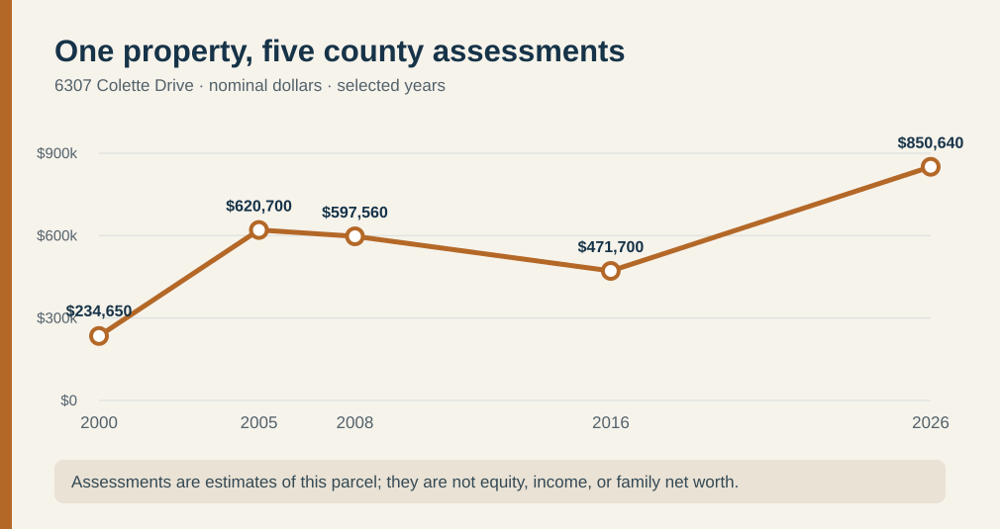

# Weatherford and Smith: Franconia, Fairfax County, Virginia

Start with the [generation-by-generation family guide](weatherford-smith-generations.md) for birth/death status and sibling groups. For work histories, see the separate [Weatherford line](weatherford.md) and [Smith line](smith.md). This page compares their shared neighborhood and property records.

[What Franconia was like while John and Alice grew up](../context/franconia-growing-up.md) summarizes the changing schools, roads, local racing and crime evidence behind their recollections.

## The family so far

- **Ashley Marie Weatherford** is Justin's wife. Her parents are **John Weatherford** and **Alice Smith Weatherford**. [Family-supplied]
- Alice's siblings are **James Howard “Buck” Smith**, **Timothy A. Smith**, **Carolyn L. Treme** and **Jane Ann Horesky**. Gladys's [2008 memorial](https://www.findagrave.com/memorial/45796517/gladys_louise-smith) names all five children; [1976](https://www.familysearch.org/ark:/61903/1:1:QVY5-GZKP?lang=en) and [1983](https://www.familysearch.org/ark:/61903/1:1:QV13-2NVL?lang=en) marriage returns independently link Jane and James Howard to Alice's parents. Justin confirms Buck's nickname; birth order is unknown.
- Alice's [1986 marriage return](https://www.familysearch.org/ark:/61903/3:1:3Q9M-C9TY-595M-1?view=index&personArk=%2Fark%3A%2F61903%2F1%3A1%3AQK9V-J612&action=view&cc=2370234&lang=en) names her parents **James Allen Smith** and **Gladys Louise Blevins**. It records Alice at **6330 Miller Drive** and John at **6312 Miller Drive** immediately before they married. A [shared grave marker](https://www.findagrave.com/memorial/106660847/james_a-smith) gives James **1933–1990** and Gladys **1938–2008**. Gladys's [1940 census family](https://www.familysearch.org/ark:/61903/1:1:K4HN-TVW?lang=en) identifies her Blevins/Hines parents. [Smith branch](smith.md).
- John's parents were **Garnett Burnell Weatherford Sr.** and **Florence Ruth Morrison Weatherford** at **6312 Miller Drive**. The [1986 return](https://www.familysearch.org/ark:/61903/1:1:QK9V-J612?lang=en) names them as John's parents, the county parcel record places both in its title history, and [Garnett's obituary](https://www.washingtonpost.com/archive/local/2007/07/03/obituaries/43ba782a-181c-4c59-a78e-7d361d86bf4a/) names John. The 1986 return spells his middle name **“Bernell,”** while his obituary and [original 1954 marriage form](../sources/records/garnett-florence-marriage-1954.jpg) say **“Burnell.”** The original form itself types his first name **“Garrett”**; matching parents, birthplace and spouse identify the same groom. [Florence's Morrison ancestry](morrison-hollinger.md) now reaches her parents and one more earlier pair.
- John's siblings are **Garnett Weatherford Jr.**, **Steve Weatherford** and **Elaine Weatherford**. Ashley's siblings are **John Weatherford Jr.** and **Tancy Weatherford**. These names and relationships are family-supplied; legal names, birth order and later surnames have not been checked.
- John attended **Edison High School** and Alice attended **Hayfield High School**, according to the family. Graduation years and yearbook entries have not yet been checked. [Family-supplied]
- Justin says John G. Weatherford Sr. was born at **Alexandria Hospital**. No birth record has been checked, and the hospital location should not be confused with the later Fairfax County home. [Family-supplied]
- Alice was born in **Prince George’s County, Maryland** according to the family; her [1986 marriage return](https://www.familysearch.org/ark:/61903/1:1:QK9V-J612?lang=en) independently says **Maryland**, without a county. The return records both Alice and John as having completed **grade 12**. Alice later studied **cosmetology** and John took **some college classes**, according to the family; institutions and dates are unknown.
- Both John Gordon Weatherford Sr. and Alice Marie Smith Weatherford worked for **25 years or more at the Washington Navy Yard**, according to Justin. Alice held an **administrative role**; John worked with **IT equipment**. Dates, job titles and whether their work periods overlapped are still unknown. [Family-supplied]

The [Navy's history of the Yard](https://www.history.navy.mil/browse-by-topic/organization-and-administration/installations/washington-navy-yard.html) traces its change from shipbuilding and ordnance to a largely administrative center. Its [photo collection](https://www.history.navy.mil/content/history/museums/nmusn/explore/photography/washington-navy-yard.html) shows the setting, but no pictured office or person is identified as John or Alice's. The institutional history fits the kinds of work the family describes without verifying their individual assignments.

The [Fairfax County real-estate record](https://icare.fairfaxcounty.gov/ffxcare/search/commonsearch.aspx?mode=address) for **6307 Colette Drive, Alexandria, VA 22315** (parcel **0913 06030010**) lists **John Gordon Weatherford** and **Alice Marie Weatherford** as current owners with a `TR` suffix. This independently supports their full names and the address supplied by the family. It does not establish Alice's maiden name, their parents, or the legal meaning of `TR`; those require family or deed records. The [U.S. Census Geocoder](https://geocoding.geo.census.gov/geocoder/geographies/onelineaddress?address=6307%20Colette%20Dr%2C%20Alexandria%2C%20VA%2022315&benchmark=Public_AR_Current&vintage=Current_Current&format=json) places the address in **Franconia, Fairfax County**. “Alexandria” is its postal city, so histories and school boundaries of the independent City of Alexandria should not be assigned to this household.

The map uses [county road data](https://services1.arcgis.com/ioennV6PpG5Xodq0/arcgis/rest/services/OpenData_A1/FeatureServer/0) and [Census address points](https://geocoding.geo.census.gov/geocoder/). Its three pins are approximate. The family reports the relationships and residences; county parcel histories independently connect each name with its address.

## One property across time

The county describes the parcel as **Glynalta Park, lot 10, block 3**, with a **1989** house on about **half an acre**. Its sales record reports a **valid, verified $255,000 purchase on 22 November 1993** by John G. Weatherford. A **6 May 2022 $0 entry** transfers title from John G. Weatherford to John Gordon Weatherford `TR` and is explicitly marked **“No consideration.”** That entry is a title event, not evidence that the property became worthless or that the family lost wealth. The underlying deeds are book/page **08861-1401** and **27645-0564**; their terms have not been read. [County parcel lookup](https://icare.fairfaxcounty.gov/ffxcare/search/commonsearch.aspx?mode=address), parcel 0913 06030010.

| Assessment year | County total assessment |
| --- | ---: |
| 2000 | $234,650 |
| 2005 | $620,700 |
| 2008 | $597,560 |
| 2016 | $471,700 |
| 2026 | $850,640 |

These are **nominal property assessments**, not John and Alice's income, home equity or net worth. Mortgage balance, other assets and assessment-method changes are unknown. Fairfax County says its annual assessments estimate market value as of January 1. [County assessment explanation](https://www.fairfaxcounty.gov/taxes/real-estate) · [parcel lookup](https://icare.fairfaxcounty.gov/ffxcare/search/commonsearch.aspx?mode=address).

### The two earlier homes

| Family home | What the county record establishes | What it does not establish |
| --- | --- | --- |
| **6330 Miller Drive**, parcel **0913 06030003** | A **1960** house. Alice and Jane gave it as their residence in [1986](https://www.familysearch.org/ark:/61903/1:1:QK9V-J612?lang=en) and [1976](https://www.familysearch.org/ark:/61903/1:1:QVY5-GZKP?lang=en). The parcel's 1990 entry names **“Gladys L Smith heirs of”** as buyer at **$0**; a **valid, verified 2010 sale for $360,000** lists those heirs as sellers. [Parcel lookup](https://icare.fairfaxcounty.gov/ffxcare/search/commonsearch.aspx?mode=address). | Why the county labels a 1990 entry as Gladys's heirs when her memorial says she died in **2008**; heirs' identities, the 1966 buyer, and how proceeds were divided. |
| **6312 Miller Drive**, parcel **0913 06030006** | A **1980** house. A **1980 $104,500 entry** names **Garnett B. Weatherford Sr.** as buyer; a **2013 $0 title entry** goes from Garnett to **Florence Ruth Weatherford `TR`**; a **valid, verified 2019 sale for $645,000** names Florence as seller. [Parcel lookup](https://icare.fairfaxcounty.gov/ffxcare/search/commonsearch.aspx?mode=address). | The deed does not state their relationship, reasons for the 2013 transfer, debts, or inheritance. John identifies them as his parents through the family account. |

The 1990/2013 $0 entries record title changes, not zero-valued homes. All sale prices are nominal dollars from different years and cannot be read as family profit. The underlying deeds and any probate file have not been read.

## What the neighborhood suggests

A [1986 Fairfax County comprehensive plan](https://www.fairfaxcounty.gov/planning-development/sites/planning-development/files/assets/documents/comprehensiveplan/planhistoric/1986/area%204.pdf#page=64) already called **Glynalta Park** an existing subdivision with relatively large lots and sought a density transition next to it. The three known family parcels lie close together, with houses dating to **1960, 1980 and 1989**. This is a concrete picture of the family remaining in one neighborhood across decades, though individual move-in and move-out years are not all known. The county's [historic aerial collection](https://www.fairfaxcounty.gov/maps/aerial-photography) offers 1937 onward views to compare its development.

The school story has a local twist. [Hayfield Secondary School's own history](https://hayfieldss.fcps.edu/about/history) says it opened in 1969; while its building was unfinished, its first high-school students used **Edison High** on a later shift. That links the two schools in the same area's growth, but we do not know whether John or Alice attended during that opening year. [FCPS lists Edison as opening in 1962](https://www.fcps.edu/sites/default/files/media/pdf/cafr2014.pdf). Florence's [1954 marriage form](../sources/records/garnett-florence-marriage-1954.jpg) records her as a **First National Bank bookkeeper**. The family says she later worked at **Burke & Herbert Bank**; her role and dates there are unknown. The [bank traces its Alexandria founding to 1852](https://www.burkeandherbertbank.com/were-celebrating-169-years-of-being-at-your-service/), which supplies employer context, not proof of Florence's later employment.

## Best next connection

The [Smith guide](smith.md) documents Gladys's Blevins/Hines parents. A [1957 original marriage-license notice](../sources/records/james-smith-gladys-blevins-marriage-license-notice-1957.jpg) now pairs James and Gladys, making the Raymond–Alice Mulhall parent identification highly likely. The civil return, James's obituary or death certificate, and the original 1990/2010 Smith deeds are the best ways to settle the remaining identity and property questions. The [Morrison guide](morrison-hollinger.md) documents Florence's parents, six siblings and her father's earlier parent names. Edison/Hayfield yearbooks or diplomas could verify the school accounts; a bank staff directory or family document could date Florence's later job.
