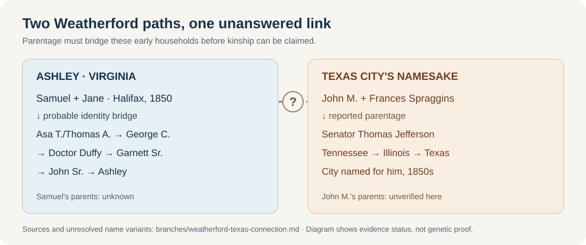

# Are the Texas Weatherfords related to Ashley?

**Answer as of 26 September 2026: possible, but no relationship has been proved.** The best-defined Texas comparison is **Thomas Jefferson “Jefferson” Weatherford (1811–1867)**, the state senator for whom [Weatherford, Texas, was named](https://weatherfordtx.gov/721/Brief-History). A town bearing the surname does not mean its residents descend from him.

*Solid arrows show the stated parent or household path; the dashed gap is a research question, not a family link. Ashley's earliest two steps have the [name/identity conflict explained here](weatherford-early-virginia.md).*

| Ashley's Virginia path | The Texas city's namesake |
| --- | --- |
| **Samuel and Jane Wetherford**, both reported Virginia-born, lived with **Thomas, 17**, in [Halifax County's 1850 census](https://www.familysearch.org/ark:/61903/1:1:M8D3-227?lang=en). A [1855 marriage](https://familysearch.org/ark:/61903/1:1:68TT-61CV?lang=en) names the groom “Thos E Weatherford” and parents Samuel and Jane, but its match to later **Asa T. / Thomas A.** is not fully settled. | The [*Handbook of Texas* biography](https://www.tshaonline.org/handbook/entries/weatherford-thomas-jefferson) identifies Senator **Thomas Jefferson Weatherford** as the son of **John M. Weatherford and Frances Spraggins**, born in **Bedford County, Tennessee, in 1811**. |
| The [1870](https://www.familysearch.org/ark:/61903/1:1:MFGS-XLZ?lang=en) and [1880](https://www.familysearch.org/ark:/61903/1:1:MC51-ZRG?lang=en) households connect **George C. Weatherford** with **Asa T. and Julia** in Virginia. George's [1884 marriage](https://www.familysearch.org/ark:/61903/1:1:6NJ1-VGMH?lang=en) names parents **Thomas A. and Ann**. Later records carry George → Doctor Duffy → Garnett Sr. → John Sr. → Ashley. | Jefferson moved from Tennessee to **Illinois**, then to **Dallas County, Texas, in 1846**. He farmed, operated a sawmill, and served in the Texas Senate. The city was named for him in the 1850s. [*Handbook of Texas*](https://www.tshaonline.org/handbook/entries/weatherford-thomas-jefferson) |

The intriguing overlap is **Virginia**: a [documented genealogist's report](https://familylocket.com/wp-content/uploads/2024/11/Henderson-Weatherford-Research-Report.pdf#page=4) cites a **1790 Pittsylvania County marriage** for **Money/John M. Weatherford and Frances Spraggins**, while Ashley's later George family lived in neighboring Halifax and Pittsylvania counties. The report traces the Texas household through Kentucky, Tennessee, Illinois and Texas. **Shared region and surname cannot identify a common ancestor.** Samuel's parents are unproved, as are John M.'s parents in the records checked for this comparison. A [FamilySearch collaborative tree](https://ancestors.familysearch.org/en/LVFD-HVM/john-w.-weatherford-jr.-1726-1793) proposes earlier ancestors for John M., but the displayed source list does not establish the parent-child link; do not splice it onto Ashley's line.

**A specific cousin theory to test:** an [Ancestry member tree](https://www.ancestry.com/genealogy/records/samuel-w-weatherford-24-1snt9xq) calls Samuel a son of **Jackson Weatherford**. A separate [compiled pedigree](https://springgrove.foertmeyer.com/registers/Ancestors%20of%20Virginia%20Louise.pdf) calls Jackson a son of **Archibald Burton Weatherford** and calls Archibald a brother of the Texas senator's father **John Money Weatherford**. If each parent link were true, the two paths would be cousins. **They are not verified links.** The compiled pedigree says Jackson was born in **1783** to Agnes Jackson, whom it dates as born **1773**, and even places her marriage in **1820** after a stated **1801** death. It also attaches a **1844 Indiana marriage** to a Jackson born in 1783, while [the groom's original 1850 household](weatherford-jackson-candidate.md) records him as **36**. Those incompatible ages strengthen the case that the compiled pedigree merges different Jacksons. They do not identify Samuel's father.

There are multiple early Texas Weatherford families. A [separate 2024 study of Henderson Weatherford](https://familylocket.com/wp-content/uploads/2024/11/Henderson-Weatherford-Research-Report.pdf) found that even his proposed tie to the Dallas County John M. family was **unsupported** after probate, tax, location and DNA analysis. This is a useful warning against treating every Texas Weatherford as one branch; it says nothing directly about Ashley's DNA or kinship.

**What would answer it:** first resolve whether the 1855 **Thomas E.** is the later **Asa T.**; then identify **Samuel Weatherford's parents** from Halifax deeds, probate, tax lists or a marriage record, especially testing the proposed **Jackson** father. Independently verify **John M./Money Weatherford's parentage** from early Pittsylvania, Kentucky and Tennessee records. A named shared ancestor in reliable records would establish the relationship and its degree; until then, “related” is a lead, not a conclusion.

[Compare the original Indiana marriage and census with the older Jackson claim](weatherford-jackson-candidate.md).

The [FamilySearch Samuel W. profile KH39-V7H](https://www.familysearch.org/en/tree/person/details/KH39-V7H) matches the Virginia household and lists **no parents for Samuel**. It therefore neither confirms nor disproves the proposed Jackson/Archibald route to Texas.

Several [MyHeritage member trees](https://www.myheritage.com/research/record-1-OYYV6HQXKGGCX243RW5HJK4OHKJEFDY-20-56805/samuel-w-weatherford-in-myheritage-family-trees) repeat **Jackson and Martha McCampbell** as Samuel's parents, but the record summary supplies no original parent-child evidence. The [1880 census index](https://www.myheritage.com/research/record-10129-86952756/samuel-wetherford-in-1880-united-states-federal-census) gives only **Virginia** for the two unnamed parents' birthplaces. The Texas connection remains open.
