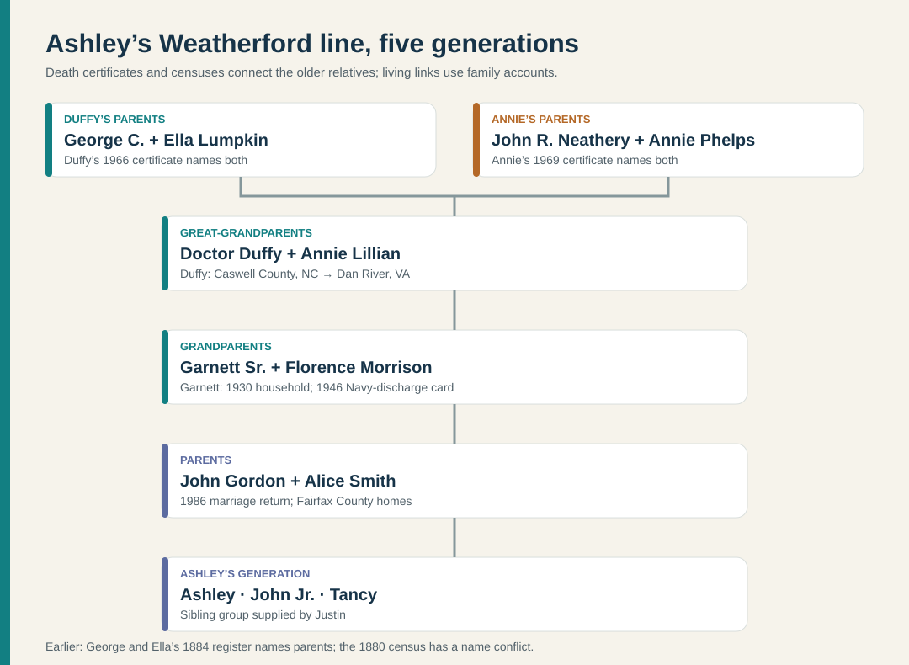

# Weatherford line: Danville to Franconia

For Ashley's immigration question, see [what is known about arrival in America](ashley-immigration.md). The [Halifax County record trail before George](weatherford-early-virginia.md) now reaches a Virginia-born Samuel and Jane in 1850; no identified immigrant or arrival year is established.

For **birth/death status and the complete named sibling groups by generation**, see the [Weatherford–Smith generation guide](weatherford-smith-generations.md) and its family diagram.

**Documented line:** **George C. Weatherford and Ella Lumpkin** → **Doctor Duffy “D.D.” Weatherford and Annie Lillian Neathery** → **Garnett Burnell Weatherford Sr. and Florence Ruth Morrison** → **John Gordon Weatherford** → **Ashley Marie Weatherford**. Original death certificates, a 1930 census, Garnett's Social Security record, and marriage returns establish the older links; John-to-Ashley is family-supplied. See the [generation guide](weatherford-smith-generations.md) for dates and siblings. George and Ella's [1884 marriage register](https://www.familysearch.org/ark:/61903/3:1:3QS7-99LX-MC9V?view=index&personArk=%2Fark%3A%2F61903%2F1%3A1%3A6NJ1-VGMH&action=view&lang=en) also names an earlier parent pair on each side, with a census-name discrepancy to resolve.

The upper links come from the [1966](https://www.familysearch.org/ark:/61903/3:1:3Q9M-C95D-9HD1?view=index&personArk=%2Fark%3A%2F61903%2F1%3A1%3AQVRZ-2C68&action=view&lang=en) and [1969](https://www.familysearch.org/ark:/61903/3:1:3Q9M-C95D-49MW-W?view=index&personArk=%2Fark%3A%2F61903%2F1%3A1%3AQVYL-N4BR&action=view&lang=en) death certificates, plus [Garnett's 1930 household](https://www.familysearch.org/ark:/61903/1:1:CFG1-7N2?lang=en). The recent John–Ashley relationship is the family's account.

## Garnett and Florence

The family's account places John's parents at **6312 Miller Drive**, close to John and Alice's Colette Drive home. The [Fairfax County parcel history](https://icare.fairfaxcounty.gov/ffxcare/search/commonsearch.aspx?mode=address) names **Garnett B. Weatherford Sr.** as a **1980 $104,500 buyer** and **Florence Ruth Weatherford** in a 2013 title entry and a verified **2019 $645,000 sale**. These are nominal property transactions, with no evidence yet of debt or proceeds distribution.

The [original Fairfax marriage certificate](../sources/records/garnett-florence-marriage-1954.jpg) gives a **16 January 1954 ceremony in Alexandria**, after a **14 January license**. It names Florence's parents **Roscoe Gordon Morrison and Eleanor Mae Hollinger**; her [Morrison branch](morrison-hollinger.md) now reaches Roscoe's parents and seven children in the 1950 household. The groom is typed **“Garrett Burnell Weatherford”** on the original, so this spelling is not merely a county-index typo. His matching middle name, parents, birthplace, occupation, spouse and later records identify him as Garnett. The form calls Florence **21**, in conflict with ages **2** and **12** on the 1940 and 1950 censuses and a **1937** birth in her obituary.

Garnett's [Washington Post profile](https://www.washingtonpost.com/archive/local/2007/07/03/obituaries/43ba782a-181c-4c59-a78e-7d361d86bf4a/) says he was born in **Danville, Virginia**, served in the **Navy in the Pacific during World War II**, drove for **Alexandria, Barcroft and Washington (AB&W)** transit for 25 years, then **Metro** for 16 years after Metro took over AB&W in 1973. His [1946 registration card](https://www.familysearch.org/ark:/61903/3:1:3Q9M-CSZX-KJ56?view=index&personArk=%2Fark%3A%2F61903%2F1%3A1%3AQ2W5-YQRZ&action=view&lang=en) gives **8 March 1927** and **Pittsylvania County** as his birth date/place; the county and city descriptions differ and need a birth certificate to reconcile. He died **27 June 2007**. The [City of Alexandria's AB&W history and 1960s bus image](https://media.alexandriava.gov/docs-archives/historic/info/attic/2010/attic20101021bus.pdf) shows what the fleet looked like, while [WMATA confirms the 1973 takeover](https://www.wmata.com/news/metrobus-50th-annivesary.html). The picture is of a company bus, not a verified bus Garnett personally drove.

### Garnett's wartime chapter: established and still missing

The *Post* identifies **Navy service in the Pacific during World War II**. Garnett's [original draft registration](https://www.familysearch.org/ark:/61903/3:1:3Q9M-CSZX-KJ56?view=index&personArk=%2Fark%3A%2F61903%2F1%3A1%3AQ2W5-YQRZ&action=view&lang=en), signed **17 June 1946** when he was 19, lists **“Honorable Discharge Navy”** in the employer field and his mother, **Mrs. D.D. Weatherford**, as a contact at the same Danville rural-route address. That is direct contemporary evidence he had left the Navy by that date; it does **not** give his enlistment date or prove a particular Pacific assignment. His [Social Security application index](https://www.familysearch.org/ark:/61903/1:1:6K3J-667C?lang=en) also names parents **Duffy Weatherford** and **Annie L. Netherley**, and records an April 1942 application, when he was 15. No identified record here names his **ship or shore unit, rank/rating, station, awards, or battles**.

**Family account:** Justin says Garnett **joined the Navy at 17 during World War II and misstated his age to enlist**. His recorded 8 March 1927 birth means he was 17 from March 1944 to March 1945, which is consistent with the recollection, but the 1946 card gives no enlistment date or age declared to the Navy. An enlistment paper or personnel file could test both details. [Family-supplied, 26 September 2026]

**Period illustration, not a Garnett portrait:** These are [USS Wileman sailors celebrating Japan's surrender announcement around 15 August 1945](https://www.ibiblio.org/hyperwar/OnlineLibrary/photos/images/g340000/g343608c.htm). No evidence links Garnett to the pictured men or ship. The [picture guide](../media/README.md#a-navy-scene-from-garnett-srs-era) also lists possible actual-relative photo leads.

The most useful next document is Garnett's **Official Military Personnel File**. The [National Archives says archival files become publicly orderable 62 years after separation](https://www.archives.gov/veterans/military-service-records); a WWII discharge should meet that threshold. Its [description of these files](https://www.archives.gov/publications/prologue/2011/fall/nprc.html) says they can include assignments, ships, rates, foreign stations and awards. An archival copy may have a fee. Once a ship or unit and dates are known, [WWII Navy muster rolls](https://www.archives.gov/publications/ref-info-papers/rip109.pdf) can test his presence; those rolls are organized by ship/unit, so blind searches have limits. A family discharge paper or service photo with a unit marking would also unlock targeted research. No file or roll has yet been obtained for Garnett.

The 1954 marriage certificate records Florence as a **bookkeeper at First National Bank**. The family says she later worked at **Burke & Herbert Bank**; her role and dates there remain unverified. The [bank's own history](https://www.burkeandherbertbank.com/were-celebrating-169-years-of-being-at-your-service/) says it opened in Alexandria in 1852. Garnett's [published death notice](https://www.legacy.com/us/obituaries/washingtonpost/name/garnett-weatherford-obituary?id=2252863) calls him **“Gee Bee”** and names Florence, children **Garnett “Bee” Jr., Stephen W., Elaine M. and John G. Weatherford Sr.** Garnett Jr.'s [own notice](https://www.legacy.com/person/garnett-%28bee%29-b.-weatherford-jr.-5409122) says he died **31 October 2003**; the father's later *Post* profile says **2004**, an apparent error. John's family separately confirms these siblings.

John G. Weatherford Sr. and Alice Marie Smith Weatherford reportedly both spent **at least 25 years at the Washington Navy Yard**. Alice worked in administration and John with IT equipment. This is a family account, not a federal personnel record; the exact offices, dates and duties are unknown. [Family-supplied, 26 September 2026]

Justin also says John Sr. was born at **Alexandria Hospital**. This is a family birthplace detail; no hospital or civil birth record has been checked. The later Miller Drive and Colette Drive homes are in Fairfax County, regardless of their Alexandria postal address. [Family-supplied, 26 September 2026]

### Garnett's brother George: a second transit and military story

George Ira Weatherford's [1940 signed registration](../sources/records/george-ira-weatherford-draft-card-1940.jpg) names his mother and **Danville Knitting Mills**; a separate [Army enlistment index](https://www.familysearch.org/ark:/61903/1:1:K8TF-L5V?lang=en) dates his entry to **8 August 1944**. His [1951 divorce abstract](../sources/records/george-ira-betty-davis-divorce-1951.jpg) independently names **AB&W Transit Co.** as his employer. Thus both George and Garnett are documented in the same bus company, though the records do not say whether they worked together. George's first wife **Betty Jane Davis** and their son **Laurence P.** appear in the 1940 census; a family history later reports George's marriage to **Mildred Wilt**. The same family history, supplied in part by Mildred, reports **84th Infantry Division / 335th Infantry service at the Battle of the Bulge and a Bronze Star**; those particulars still need a military service or award record. [George's short evidence timeline and date conflicts](weatherford-smith-generations.md#layer-2--garnetts-generation-and-the-miller-drive-parents).

[Lewis Hine's 1911 Danville photograph](https://www.loc.gov/item/2018676502/) shows textile workers, including children according to his caption. It conveys the city's earlier industrial setting. The **1911 “Knitting Works”** and George's **1940 “Knitting Mills”** employer have not been shown to be the same business, and none of these workers is identified as family. [Image provenance](../media/README.md#danville-virginia).

### Why John was named John

**Family story, not yet independently documented:** Justin says Garnett and Florence first considered **Duffie** for their son, after Garnett's father **Doctor Duffy Weatherford** (John's grandfather). The family says Florence learned she was pregnant while **John F. Kennedy was in the same building**, and they chose **John** in honor of the president. The [1986 marriage return](https://www.familysearch.org/ark:/61903/3:1:3Q9M-C9TY-595M-1?view=index&personArk=%2Fark%3A%2F61903%2F1%3A1%3AQK9V-J612&action=view&cc=2370234&lang=en) records the name **John Gordon Weatherford** and identifies Garnett and Florence as his parents; Duffy's [1966 death certificate](https://www.familysearch.org/ark:/61903/3:1:3Q9M-C95D-9HD1?view=index&personArk=%2Fark%3A%2F61903%2F1%3A1%3AQVRZ-2C68&action=view&lang=en) and Garnett's childhood census establish the older relationship. Neither record documents the proposed name or Kennedy's presence. The [White House's historical biography](https://obamawhitehouse.archives.gov/1600/presidents/johnfkennedy) dates Kennedy's presidency to **1961–63**; the pregnancy date, building, and occasion remain unknown. The account says only that Kennedy was **in the building**, not that Florence met him. [Family-supplied, 26 September 2026]

## Earlier Danville and North Carolina generations

The [1930 census sheet](https://www.familysearch.org/ark:/61903/3:1:33S7-9RZF-DP2?view=index&personArk=%2Fark%3A%2F61903%2F1%3A1%3ACFG1-7N2&action=view&lang=en) places **three-year-old Garnett** in **Dan River District, Pittsylvania County**, with parents indexed as **Duffie** (39, born North Carolina) and **Annie** (35, born Virginia), plus nine children listed as his siblings. The sheet calls Duffie a **carpenter in building work**. The [1940 census](https://www.familysearch.org/ark:/61903/1:1:VRBR-3FX?lang=en) still places Garnett, his parents and several siblings in Dan River District, and says the household lived in the same house in 1935. Census households show who lived together on those dates, not a complete child list. Helen's [2007 obituary](https://www.legacy.com/us/obituaries/godanriver/name/helen-barksdale-obituary?id=33333924) names 12 siblings overall and confirms Garnett's place in the larger family. Helen attended **Dan River High School**; Garnett's own school remains unknown.

Helen's notice names **12 siblings**, Garnett among them. Alongside the later Navy and transit story, it sketches a young man from a large Danville-area family who eventually settled near Alexandria. The notices do not tell us why or exactly when he left Danville. [Helen's obituary](https://www.legacy.com/us/obituaries/godanriver/name/helen-barksdale-obituary?id=33333924) · [Garnett's obituary](https://www.washingtonpost.com/archive/local/2007/07/03/obituaries/43ba782a-181c-4c59-a78e-7d361d86bf4a/).

The original [1966 death certificate](https://www.familysearch.org/ark:/61903/3:1:3Q9M-C95D-9HD1?view=index&personArk=%2Fark%3A%2F61903%2F1%3A1%3AQVRZ-2C68&action=view&lang=en) expands D.D. to **Doctor Duffy Weatherford**—*Doctor* is his given name, not evidence of a medical profession. It gives birth on **31 October 1890 in Caswell County, North Carolina**, death on **12 August 1966 in Danville**, parents **George C. Weatherford and Ella Lumpkin**, wife **Annie Lillian Neatherly**, and **Danville Traction & Power Co.** in the usual-occupation/business fields; his specific job there is not stated. Son **Emmett L. Weatherford** supplied the personal details. Annie's original [1969 death certificate](https://www.familysearch.org/ark:/61903/3:1:3Q9M-C95D-49MW-W?view=index&personArk=%2Fark%3A%2F61903%2F1%3A1%3AQVYL-N4BR&action=view&lang=en) says she was born **13 March 1894 in Pittsylvania County**, died **10 August 1969 in Danville**, and was the daughter of **John R. Neathery and Annie Phelps**. It calls her occupation “Domestic.” Its informant is also Emmett. The certificates record family-reported birth and parent details, not independent birth registrations.

George and Ella appear in the [Pittsylvania marriage register](https://www.familysearch.org/ark:/61903/3:1:3QS7-99LX-MC9V?view=index&personArk=%2Fark%3A%2F61903%2F1%3A1%3A6NJ1-VGMH&action=view&lang=en) on **2 July 1884**. The register indexes George, about 23, as son of **Thomas A. and Ann Weatherford** and Ella, about 16, as daughter of **Fayette and Mina Lumpkins**. The [1880 census household](https://www.familysearch.org/ark:/61903/1:1:MC51-ZRG?lang=en) instead indexes George's parents **A.T. and Julia A.** The [1870 household](https://www.familysearch.org/ark:/61903/1:1:MFGS-XLZ?lang=en), [1860 original sheet](https://www.familysearch.org/ark:/61903/3:1:33SQ-GBS6-94FN?view=index&personArk=%2Fark%3A%2F61903%2F1%3A1%3AM41H-SQF&action=view&cc=1473181&lang=en) and [1857 birth record for William](https://familysearch.org/ark:/61903/1:1:X5XM-8Q2?lang=en) strongly support one continuing **Asa T. + Julia A.** household; the [1855 marriage](https://familysearch.org/ark:/61903/1:1:68TT-61CV?lang=en) uses **“Thos E”** and names Samuel and Jane as his parents. The [earlier Virginia evidence guide](weatherford-early-virginia.md) shows each bridge and unresolved variant. Duffy's birth in neighboring **Caswell County, NC**, followed by his children's Virginia births and the 1920–40 Pittsylvania households, documents a **North Carolina → Virginia** family move. No personal explanation for that move has been found.

The [Texas comparison](weatherford-texas-connection.md) checks whether Ashley's line connects to the family of the senator for whom Weatherford, Texas, was named. It identifies a cousin theory in online trees, but no proved common ancestor.

## Next records

1. Obtain Florence's birth registration to resolve the **1954 marriage-age conflict**, and a dated bank record to trace her move from **First National** to the family's remembered **Burke & Herbert** job. [Morrison branch](morrison-hollinger.md).
2. Request Garnett's archival Navy personnel file; use any resulting ship/unit and dates to search muster rolls. Seek a contemporary AB&W/Metro employee source to add service dates, routes or photographs. His obituary establishes employer and service, but no specific ship or bus route.
3. Read the [1855 Halifax marriage original](https://www.familysearch.org/ark:/61903/3:1:3QS7-L9XF-29M3-F?view=index&personArk=%2Fark%3A%2F61903%2F1%3A1%3A68TT-61CV&action=view&lang=en) closely to reconcile **Thos E / Asa T**, then seek Samuel and Jane's parents before naming an immigrant. Find Duffy and Annie's own marriage record and John R. Neathery/Annie Phelps records. The [family neighborhood map](../maps/colette-neighborhood.svg) covers the later Fairfax chapter.
