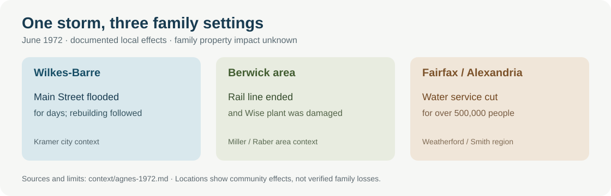

# Agnes in the family's places, June 1972

The remnants of **Hurricane Agnes** brought sustained rain and river flooding across the Mid-Atlantic in **June 1972**. The storm reached several places in this family history, but its effect was different in each. The evidence below describes **communities and services**, not a verified flood loss at a family address. [National Weather Service storm history](https://www.weather.gov/ctp/Agnes).

| Family setting | What happened locally | How to read it for the family |
| --- | --- | --- |
| **Kramer area · Wilkes-Barre, Pennsylvania** | The Susquehanna overtopped local defenses; [Luzerne County Historical Society](https://luzernehistory.omeka.net/exhibits/show/agnes-flood-of-1972) describes destroyed houses and a hospital evacuation. [Wilkes University's photo tour](https://www.wilkes.edu/academics/library/agnes-flood-walking-tour/main-street.aspx) shows **Main Street under water for days**, mud-filled stock during cleanup, and subsequent rebuilding. The [USGS 1972 surveyed flood map](https://pubs.usgs.gov/publication/ofr72119) is the best route for checking a *particular* Wilkes-Barre property. | A major change to the city later Kramer generations knew. We have **no family address matched to the 1972 inundation boundary** and no account of a Kramer home or workplace being damaged. |
| **Miller/Raber area · Berwick and Columbia County, Pennsylvania** | A [Columbia County Historical & Genealogical Society history](https://colcohist-gensoc.org/wp-content/uploads/berwickrr.pdf) says Agnes destroyed much of the already lightly used Susquehanna, Bloomsburg & Berwick Railroad track and ended that line. A [Bloomsburg-area oral-history interview](https://resources.finalsite.net/images/v1754403559/bloomsdk12paus/jqnujeofaxaxaijcbnwd/Floodof1972.pdf) remembers damage to Berwick's **Wise potato-chip plant** and nearby low-lying areas. | The storm damaged local transport and work sites; it did **not** create the railroad's prior decline, which the society traces to the A.C.&F. plant closing in the early 1960s. No Miller or Raber residence, job, or loss has been tied to this damage. |
| **Weatherford/Smith area · Fairfax County and Alexandria, Virginia** | [Fairfax Water](https://www.fairfaxwater.org/news/50th-anniversary-hurricane-agnes) says flooded facilities cut water service to **more than 500,000 people** across Alexandria, Fairfax and Prince William on **22 June**; limited Fairfax service returned within **35 hours**, with full area service in **eight days**. The [Office of Historic Alexandria](https://media.alexandriava.gov/docs-archives/historic/info/attic/2011/attic20110915fourmilerun.pdf) records serious 1972 flooding along **Four Mile Run**. | This shows a region-wide disruption during John and Alice's youth. The Four Mile Run history concerns a **different location** from the family's Fairfax County homes near Franconia; it does not show those homes flooded. Their household's water or travel experience is unrecorded. |

**Where to look next:** match a documented **1972** family address to an original flood-inundation map or contemporary newspaper account; ask relatives whether they remember evacuation, loss of water, interrupted work or cleanup. Later addresses should not be projected back to 1972. The [Wilkes University photo tour](https://www.wilkes.edu/academics/library/agnes-flood-walking-tour/main-street.aspx) and [1972 USGS map](https://pubs.usgs.gov/publication/ofr72119) let readers see the scale of the Wilkes-Barre flood without implying a family home was in it.
