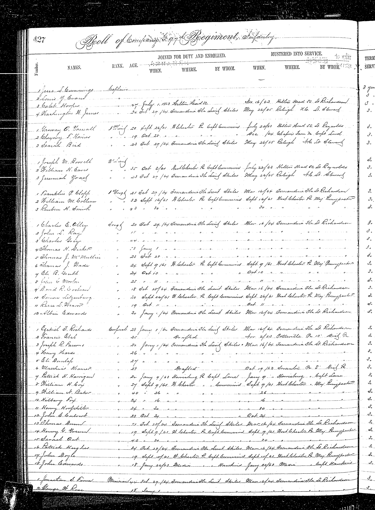

# Civil War question: did the Berwick and Blevins lines oppose each other?

**Answer so far:** Justin's **third-great-grandfather Gad Marshall Miller (1830–1904 in a family genealogy)** is a **strongly identified Union veteran**. The original [1870](../sources/records/marshall-elizabeth-miller-census-1870.jpg) and [1880](../sources/records/marshall-elizabeth-miller-census-1880.jpg) Sugarloaf censuses place **Marshall/Marsall**, **Elizabeth**, and **Amos** together; the 1880 schedule explicitly calls Amos **Marshall's son** and Elizabeth his wife. Amos leads to Lester, Paul, Melissa, and Justin. A [family genealogy](https://cookancestry.com/web/glenn%20cook%20master%20file/2/22298.htm) separately calls Gad a Civil War soldier. Crucially, the [original 1890 Union veterans schedule, image 117](https://www.familysearch.org/ark:/61903/3:1:939V-R9SW-RK?view=index&personArk=%2Fark%3A%2F61903%2F1%3A1%3AK89T-N4L&action=view&cc=1877095&lang=en) lists **Marshall Miller**, **Coles Creek, Columbia County**, as a private in **Company K, 171st Pennsylvania Infantry**. The 1870 sheet itself gives **Coles Creek** as the household's post office. The shared name, age and precise locality connect the veteran strongly to Amos's father, though the veterans schedule does not name his family.

Pennsylvania's [original Company K register](https://www.phmc.state.pa.us/bah/dam/rg/di/r19-65registerpavolunteers/r19-65Regt171/r19-65Regt171%20pg%2053.pdf) records **Marshall Miller, 32**, enrolled **24 October 1862** and mustered **5 November**. Its [facing remarks page](https://www.phmc.state.pa.us/bah/dam/rg/di/r19-65registerpavolunteers/r19-65Regt171/r19-65Regt171%20pg%2054.pdf) says he mustered out with the company **6 August 1863**. The 1890 schedule appears to give **27 October** as enlistment, a small date discrepancy to check against a service card. It also records **fever** and a **regimental hospital** in his disability column; it does not identify a wound or battle. The [National Park Service](https://www.nps.gov/civilwar/search-battle-units-detail.htm?battleUnitCode=UPA0171RIX) identifies the regiment as **Union drafted militia**. The 1890 schedule does not name a wife or child, so the exact same-person link remains an inference, albeit a strong one.

| Line | War-era person | What is established |
| --- | --- | --- |
| **Miller, Berwick side** | Gad Marshall Miller, born about 1830 | The [1880 original](../sources/records/marshall-elizabeth-miller-census-1880.jpg) labels Amos his son; the 1890 veteran **Marshall Miller** lived at Coles Creek and gave **Company K, 171st Pennsylvania**. **Strong same-person match**, though the veterans schedule omits family names. |
| **Kramer, Wilkes-Barre side** | Matthew/Matthias Kramer, born about 1840 | He was old enough, but service is unproved. A **Mathias Kramer** appears in the [original 97th Pennsylvania Company G roll](../sources/records/mathias-kramer-97th-pa-register-63-1863.jpg), aged **28** and **drafted 19 October 1863**; the [facing page](../sources/records/mathias-kramer-97th-pa-register-64-1863.jpg) records promotion to corporal in July 1865 and muster-out that August. The [1900 Wilkes-Barre household](../sources/records/kramer-matthew-lena-census-1900.jpg) reports its Matthew arrived in **1865** and was born **August 1840**. Those dates conflict with identifying the 1863 soldier as him. Keep the soldier separate unless a service, pension or immigration record supplies a bridge. |
| **Raber–Kreischer–Sponenberg side** | **Legrand/LeGrant Sponenberg**, collateral brother of John Leonard | Hannah's [family Bible births page](../sources/records/hannah-sponenberg-family-bible-births.jpg) lists both brothers. The [original Pennsylvania Company E register](../sources/records/legrant-sponenberg-16th-cavalry-register-1862.jpg) lists a 23-year-old **Legrant Sponeberg** as a private in the **Union 16th Pennsylvania Cavalry**, mustered 2 October 1862. Name and age strongly match the brother, though the roll omits his parents. A [family-attributed mounted portrait](../sources/family/legrant-sponenberg-mounted-portrait-attributed.jpg) is preserved, with the rider's identity unproved from the image alone. He is collateral, not Justin's direct ancestor. |
| **Blevins, Ashley's proposed earlier line** | Shubiel/Shubill Blevins | His [original 1941 federal headstone application](../sources/records/shubiel-blevins-headstone-application-1941.jpg) names **private, Company I, 61st North Carolina**, and Laurel Springs Cemetery in Marion, Virginia. This directly documents the Confederate veteran; the parent-child bridge from William E. to Gladys's father remains unproved. The state roster's **volume 14, page 740** and service cards still need reading for individual service details. [Evidence ladder](../branches/blevins-deep-lineage.md). |

**Did they fight each other?** Marshall Miller and Legrand Sponenberg served **Union** Pennsylvania units; Shubiel's headstone application documents **Confederate** 61st North Carolina service. That does not show they met in combat. The [171st Pennsylvania history](https://www.nps.gov/civilwar/search-battle-units-detail.htm?battleUnitCode=UPA0171RIX) places Marshall's regiment in Suffolk, Virginia, then New Bern and Little Washington, North Carolina, through mid-1863; the [16th Pennsylvania Cavalry history](https://www.nps.gov/civilwar/search-battle-units-detail.htm?battleUnitCode=UPA0016RC) places Legrand's regiment chiefly with the Army of the Potomac; the [61st North Carolina history](https://www.nps.gov/civilwar/search-battle-units-detail.htm?battleUnitCode=CNC0061RI) describes the regiment's campaigns. These unit histories establish no shared battle or Shubiel's individual participation. Ashley's descent from him also still has an open parent-child link. Northern residence alone would not prove enlistment or a particular allegiance.

**A tempting Kramer namesake:** On the state roll, Mathias's entry is the **sixth corporal** on printed page **427**, and its facing remarks on page **428** say he was promoted **19 July 1865** and mustered out with the company **28 August 1865**. The roll names no birthplace, parents, spouse or Pennsylvania home. The age **28** in 1863 suggests birth around **1835**, while the later Wilkes-Barre census gives **August 1840** for Matthew. Ages and immigration years can be reported inaccurately, so this is a conflict, not proof of two identities. The [National Park Service's 97th Pennsylvania unit history](https://www.nps.gov/civilwar/search-battle-units-detail.htm?battleUnitCode=UPA0097RI) gives the regiment's wider campaigns; the roll does **not** establish which battles this man personally saw.

 [Full roll and facing remarks](../sources/records/README.md#original-images-and-identified-family-portrait). **Pennsylvania State Archives, printed pp. 427–428; the pictured soldier is an unassigned namesake.**

**Most useful next records:** Gad/Marshall's pension or service card may explain the fever and resolve the 24/27 October date; a record naming Elizabeth Hess would close the last identity gap. Mathias Kramer's 97th Pennsylvania service or pension file could identify his birthplace and family; compare it with Matthew's still-unread 1918 death certificate. Legrand's Company I register and pension file could confirm his transfer and identity. Read Shubill's full North Carolina roster entry at volume 14, page 740 before comparing individual battles.
