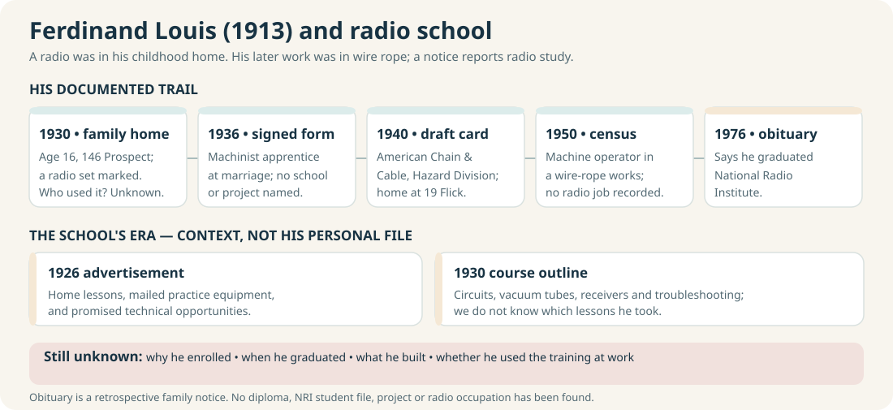

# Education across the family lines

The same school turns up for more than one relative: **Hilda and Ferdinand Louis Kramer** were reported at G.A.R. Memorial High in Wilkes-Barre, while **Ashley Weatherford and her maternal uncle Timothy A. Smith** are both remembered as Virginia Tech students. Justin places Ashley there in **2015–19** and Timothy roughly **30–35 years earlier** (about **1980–89**). These are **family accounts**; programs and graduation status have not been checked. [Virginia Tech's *Bugle* collection](https://vtechworks.lib.vt.edu/collections/1f34f154-c116-4fe7-9d96-8229807040d9) provides contemporary issues to search in those windows.

The [Kramer technical-study thread](#from-radio-study-to-engineering-and-computing) connects Ferdinand Louis's reported radio training with later family-reported degrees at RIT, Penn State, Georgia Tech and Pitt.

| Line and person | What we know | Evidence and limit |
| --- | --- | --- |
| **Weatherford / Smith: Ashley Marie Weatherford and uncle Timothy A. Smith** | Both attended **Virginia Tech** in Blacksburg, according to Justin: Ashley **2015–19**; Timothy **about 1980–89**. [Gladys Smith's memorial](https://www.findagrave.com/memorial/45796517/gladys_louise-smith) independently names Timothy A. among Alice's siblings, supporting the uncle relationship. | **Family account for university and dates**, 27 September 2026. No enrollment, major, degree or yearbook entry yet verified. Timothy's window is inferred from a relative interval, not a stated start or finish year. A web name match alone cannot identify either student. |
| **Weatherford / Smith: John Gordon Weatherford and Alice Marie Smith** | John attended **Edison High School**; Alice attended **Hayfield High School**. Alice later studied **cosmetology**, and John took **some college classes**, according to family accounts. | Their [original 1986 marriage return](https://www.familysearch.org/ark:/61903/3:1:3Q9M-C9TY-595M-1?view=index&personArk=%2Fark%3A%2F61903%2F1%3A1%3AQK9V-J612&action=view&cc=2370234&lang=en) records **grade 12 completed for both**, but does **not name their schools**. Course, institution and graduation details remain unknown. [FCPS's school history](https://hayfieldss.fcps.edu/about/history) explains the brief Edison/Hayfield shared-building period without placing either relative there in that year. |
| **Kramer: Hilda M. Kramer Wolosz and brother Ferdinand Louis Kramer (1913)** | G.A.R.'s [1940 senior yearbook, page 21](https://www.e-yearbook.com/yearbooks/G_A_R_Memorial_High_School_Garchive_Yearbook/1940/Page_21.html) names **Hilda Kramer** in the **Commercial** course. Her [obituary](https://www.legacy.com/us/obituaries/citizensvoice/name/hilda-wolosz-obituary?id=7822560) reports graduation in 1940 and years at Pennsylvania Millers Mutual Insurance. Ferdinand Louis's [1976 obituary clipping](../sources/records/ferdinand-louis-kramer-obituary-1976.jpg) reports graduation from **G.A.R. High** and **National Radio Institute** in Washington, D.C.; no NRI diploma has been found. | Contemporary yearbook OCR plus Hilda's [1940 census](../sources/records/ferdinand-kramer-household-census-1940.jpg), which marks **three high-school years completed** and current attendance. The page image requires site sign-in; the obituary supplies graduation and later employment. Neither a personal course list nor a link from her schooling to that job has been found. Ferdinand's school details remain obituary reports; the institute's mail-based instruction means its D.C. address does not prove that he traveled there. |
| **Kramer: Paul Joseph Kramer** | Justin says his father studied at **LCCC for about two years**, perhaps starting **1983–85**, then earned an **electrical-engineering bachelor's at RIT**; he places Paul at RIT around **1986**. A [Coughlin alumni index](https://coughlinhighschool.org/alumni-list-k.html) separately lists a **Paul Kramer, class of 1982**. | The sequence and degree are a **family account**. Exact LCCC terms, transfer credits and RIT graduation year are open; neither school transcript has been inspected. The Coughlin name match does not itself prove identity. [Recent-generation record paths](recent-generations.md#records-that-would-bring-these-years-into-focus). |
| **Miller / Raber: Melissa Miller Kramer** | Justin says his mother attended **LCCC around 1983–85** and earned an **associate degree** there. | **Family account**; her program, credential wording and graduation year need her diploma or [LCCC transcript](https://www.luzerne.edu/supportservices/registrar/transcripts.jsp). Do not mistake another Melissa Miller's online degree for hers. |
| **Kramer: Alex and Justin, Paul's sons** | Alex began **Penn State electrical engineering in 2014**, completed a four-year bachelor's, then completed a **Georgia Tech electrical-engineering master's** begun about two years later. Justin completed a combined **Pitt computer-science bachelor's and master's, 2017–21**. | Alex's timeline remains **Justin's family account**. Pitt's [2021 commencement program](https://web.archive.org/web/20250208181123/https://www.commencement.pitt.edu/sites/default/files/pitt-commencement-2021_fullprogram_accessible.pdf#page=88) lists Justin under the **M.S. in computer science** and his prior **Pitt B.S., 2020**; a [2020 Pitt article](https://www.pittwire.pitt.edu/pittwire/features-articles/computer-science-club-bridges-gaps-between-students-industry) names his student club role. [Recent-generation scene](recent-generations.md). |
| **Miller / Raber: Marqueen Miller** | A digitized [1956 Berwick High School yearbook page](https://www.myheritage.com/research/record-10568-186808139/berwick-high-school?snippet=17c0f0735761bb46e39cd73c69feb7d3) gives her portrait, nickname **“Queenie,”** football-usher role and a secretarial ambition. | Contemporary page viewed in signed-in MyHeritage; it documents school presence and what she hoped to do, not a later job or graduation date. |
| **Miller / Raber: Paulene Miller Beach and Shirley Kreischer Raber** | [Paulene's memoir](https://bhaven.org/paulene/life-journey) recalls **one school year in Millville** around her mid-teens and a return to Berwick. [Shirley's obituary](https://familysearch.org/ark:/61903/1:1:61FN-QJ7Z?lang=en) says she earned a **GED in 1987** later in life. | First-person memory and family obituary. “Millville” is a place, not yet an identified school building. GED is a later credential, not proof of which high school Shirley previously attended. |
| **Cordaro: Joseph Anthony Cordaro and wife Dina Caucci** | Their [original 1940 West Wyoming census, sheet 15A, lines 13–14](../sources/records/joseph-dina-cordaro-census-1940.jpg) reports **H2** (two years of high school) for Joseph and **8** (eighth grade) for Dina as highest grades completed. | Original enumeration, not a diploma or named school. Their daughter Patricia was born after this census. The fields do not tell us when or why either stopped studying. |

## A radio lesson by mail

**The person-specific link:** Ferdinand Louis's [1976 obituary clipping](../sources/records/ferdinand-louis-kramer-obituary-1976.jpg), also available as a [FamilySearch memory](https://www.familysearch.org/memories/memory/122055961), expressly says he graduated from **G.A.R. High School and National Radio Institute of Washington, D.C.** The same notice calls **19 Flick Street** his home, the address on his [1940 signed draft card](../sources/records/ferdinand-louis-kramer-draft-registration-1940.jpg). These are two dated sightings, not proof of continuous residence. No NRI diploma, enrollment file, completion year, subject list, or project has yet been found. The obituary reports more than 44 years at American Chain & Cable and later Bridon, but gives no radio-related job title. **His reason for enrolling and what he personally built remain unknown.**

**A new check on the timing:** In a [marriage form Ferdinand signed in September 1936](../sources/records/ferdinand-louis-kramer-mary-andrews-marriage-1936.jpg), he described his work as **“machinist apprentice.”** That is a direct work statement, unlike the later obituary's school summary. The form says nothing about NRI, so it cannot date his course or show that radio lessons led to his machine work.

**What he did at work:** His [signed draft card](../sources/records/ferdinand-louis-kramer-draft-registration-1940.jpg), indexed by [MyHeritage](https://www.myheritage.com/research/record-20912-11683440/ferdinand-louis-kramer-in-united-states-world-war-ii-draft-registrations), independently names **American Chain & Cable's Hazard Division** and an East Ross Street worksite. His [1950 census row](https://1950census.archives.gov/iiif/2/1950census%2F43290879-Pennsylvania%2F43290879-Pennsylvania-135713%2F43290879-Pennsylvania-135713-0005.jpg/full/full/0/default.jpg) calls him a **machine operator at a wire-rope works**. A [1952 Hazard wire-rope advertisement](https://illinoismininginstitute.org/wp-content/uploads/proceedings/1952-imi.pdf) shows the company's product, and a [circa-1961 Cornell photograph](https://www.flickr.com/photos/kheelcenter/40225302032) shows its rail siding. These records describe his industrial setting; **none shows a radio, invention, electrical job, or how he used NRI training**.

**The school's contemporary offer:** The [April 1926 *Amazing Stories* advertisement](https://commons.wikimedia.org/wiki/File:Amazing_Stories_v01_n01_front_cover_National_Radio_Institute.jpg) offered lessons **at home**, a mail-in coupon, practice instruments, and technical work prospects. A surviving [1930 NRI *Practical Radio* course](https://www.worldradiohistory.com/Archive-Courses/National_Radio_Institute_Practical_Radio_1930.htm) lists circuits, vacuum tubes, tuning, receivers and amplifiers. That offer could have appealed to a young worker seeking technical skills, but **this is a possible motive, not Ferdinand's stated motive**. These sources show what students *could* study; they do not show his course or a radio he made. The ad's pay claims are marketing, not his wages. The Washington address does not prove he traveled there. Original ad: *Amazing Stories*, vol. 1, no. 1, inside front cover, [public domain in the U.S.](https://commons.wikimedia.org/wiki/File:Amazing_Stories_v01_n01_front_cover_National_Radio_Institute.jpg#Licensing).

**A tangible example, not a Kramer artifact:** An antique-radio collector [photographed a one-tube practice receiver and an NRI lesson-page match](https://people.ohio.edu/postr/bapix/1_tuber.htm). The collector and two radio-club members identify the design with an **early-1930s** course; the kit's maker and original student are not documented. It shows the sort of small circuit a student might wire and test. It does **not** show that Ferdinand took that version of the course, received that kit, or built a radio. The collector's photographs stay at their source site; reuse permission is unstated.

**An NRI document from his era:** The institute's own [1930 anniversary issue of *National Radio News*](https://www.worldradiohistory.com/Archive-National-Radio-News/NRN-1930-01.pdf) calls itself a magazine for **students and graduates** and describes training at home, graduate and employment support, and the new uses of radio in aviation, broadcasting and industry. It gives a plausible *setting* for an ambitious young worker's interest; it never names Ferdinand. The [full magazine archive](https://www.worldradiohistory.com/National_Radio_News.htm) is a place to search for a named project or student notice. So far, there is **no evidence that Ferdinand built a particular receiver or worked in radio**. His documented output was work in the wire-rope industry, but the records do not identify a product he personally designed.

**Archive search checked, 28 September 2026:** The archive's [searchable *National Radio News/Journal* index](https://www.worldradiohistory.com/hd2/IDX-Site-Technical/Engineering-General/Archive-National-Radio-IDX/search.cgi) returned **no result for “Ferdinand Kramer”**. A broader [“Kramer” search](https://www.worldradiohistory.com/hd2/IDX-Site-Technical/Engineering-General/Archive-National-Radio-IDX/search.cgi?zoom_query=kramer&zoom_page=1&zoom_per_page=10&zoom_and=1&zoom_sort=0&zoom_xml=0) returned 11 OCR matches: the visible names were other Kramers, mainly in later issues. This is a negative search of an incomplete, imperfectly indexed collection, **not evidence he did not attend**. The best next item is a family-held NRI diploma, correspondence, lesson envelope, graded assignment or workbench photograph.

## From radio study to engineering and computing

This is a striking **family education thread**, with [Fred / Ferdinand Francis Kramer](../branches/kramer.md) as the generation between Ferdinand Louis and Paul. Ferdinand Louis's 1976 obituary reports **National Radio Institute** graduation, though no school record has been found. Justin says his father **Paul Joseph Kramer** spent roughly **two years at LCCC in the mid-1980s**, then completed an **electrical-engineering bachelor's at Rochester Institute of Technology (RIT)**; he recalls Paul at RIT around **1986**. His mother **Melissa Miller Kramer** also attended LCCC and earned an **associate degree**, though its subject and year are still unknown. [LCCC's own chronology](https://www.luzerne.edu/about/timeline.jsp) records eleven four-year-college transfer agreements by **1980**, showing the *era's* transfer setting without proving how Paul's credits moved. Paul's son **Alex**, Justin's brother, started a **four-year electrical-engineering bachelor's at Penn State in 2014** (completion about **2018**) and began an **electrical-engineering master's at Georgia Tech roughly two years later** (about **2020**). Justin completed a combined **bachelor's and master's in computer science at the University of Pittsburgh, 2017–21**. [Family account, 27 September 2026](../research/sources.md). No record here establishes that Ferdinand's studies directly inspired the later choices. Paul's exact graduation date and Alex's completion/master's dates remain open or approximate; a [Pitt commencement program and interview](recent-generations.md) provide independent records for Justin, while Paul and Alex still lack school records. The visual shows an **interest pattern**, not a proven chain of influence.

## Earlier learning traces without a named school

- **Kramer:** Martin and Lena's [1880 census](../sources/records/kramer-martin-lena-census-1880.jpg) marks daughters Lena and Katie **at school**; the [1900 household](../sources/records/kramer-matthew-lena-census-1900.jpg) marks son William at school. Ferdinand (c. 1882) reported **eighth grade completed** in [1940](../sources/records/ferdinand-kramer-household-census-1940.jpg); Mary Andrews Kramer reported **seventh grade completed** in the sampled [1950 census](https://1950census.archives.gov/iiif/2/1950census%2F43290879-Pennsylvania%2F43290879-Pennsylvania-135713%2F43290879-Pennsylvania-135713-0005.jpg/full/full/0/default.jpg). These fields do not explain why either person's schooling stopped there.
- **Weatherford / Neathery:** Caroline Weatherford's [1880 census](../sources/records/samuel-jane-weatherford-census-1880.jpg) calls her **“at school”** but leaves attendance blank and also marks cannot-read/write; the fields need to be reported together. A likely Annie Phelps [1880 household](../sources/records/phelps-household-census-1880.jpg) marks a daughter at school but has an **A. E. versus A. L.** initial conflict. Oscar Neathery was recorded at school for **nine months** in [1900](../sources/records/neathery-household-census-1900-sheet2a.jpg). None names a school.
- **Raber / Sponenberg:** A [1915 family biography](../sources/records/edward-sponenberg-biography-1915-187.jpg) describes Daniel Sponenberg's **common-school education** and son John L.'s **country-school attendance while farming**. These are retrospective descriptions, not school registers. [Shirley's GED](https://familysearch.org/ark:/61903/1:1:61FN-QJ7Z?lang=en) is a later family-reported milestone.

**Next records that would sharpen the story:** the [Fairfax County Public Library Virginia Room's digitized FCPS yearbooks](https://www.fairfaxcounty.gov/library/branch-out/home-local-history-yearbooks) for Edison and Hayfield; the actual 1982 Coughlin page; a G.A.R. commencement roll for Hilda; and Virginia Tech's [*Bugle* archive](https://vtechworks.lib.vt.edu/collections/1f34f154-c116-4fe7-9d96-8229807040d9) for Ashley's **2015–19** and Timothy's **roughly 1980–89** windows. Look for yearbook and commencement pages, then verify names against independent family identifiers. A yearbook entry proves presence in a publication, while a commencement program, registrar record or diploma is stronger evidence of graduation. [Regional school context](places-and-schools.md) stays separate from each person's attendance.
