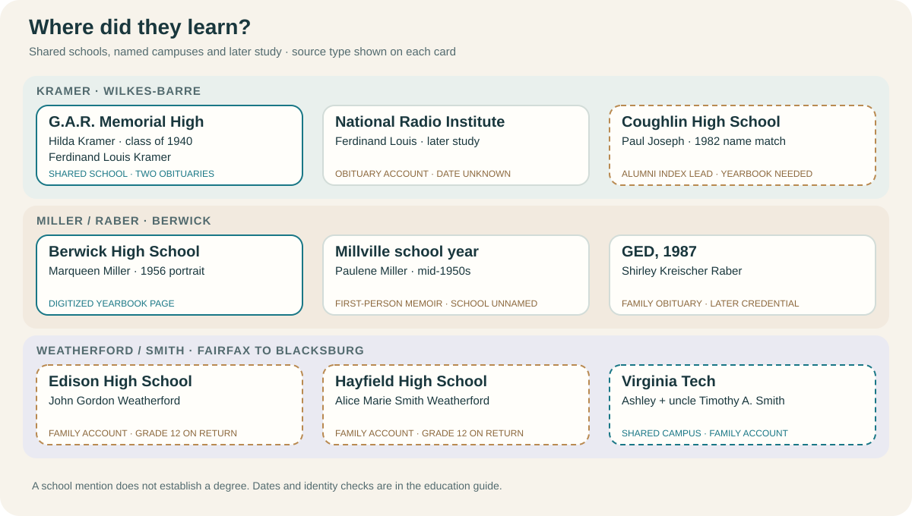

# Education across the family lines

The same school turns up for more than one relative: **Hilda and Ferdinand Louis Kramer** were reported at G.A.R. Memorial High in Wilkes-Barre, while **Ashley Weatherford and her maternal uncle Timothy A. Smith** are both remembered as Virginia Tech students. Justin places Ashley there in **2015–19** and Timothy roughly **30–35 years earlier** (about **1980–89**). These are **family accounts**; programs and graduation status have not been checked. [Virginia Tech's *Bugle* collection](https://vtechworks.lib.vt.edu/collections/1f34f154-c116-4fe7-9d96-8229807040d9) provides contemporary issues to search in those windows.

The [Kramer technical-study thread](#from-radio-study-to-engineering-and-computing) connects Ferdinand Louis's reported radio training with later family-reported degrees at RIT, Penn State, Georgia Tech and Pitt.

| Line and person | What we know | Evidence and limit |
| --- | --- | --- |
| **Weatherford / Smith: Ashley Marie Weatherford and uncle Timothy A. Smith** | Both attended **Virginia Tech** in Blacksburg, according to Justin: Ashley **2015–19**; Timothy **about 1980–89**. [Gladys Smith's memorial](https://www.findagrave.com/memorial/45796517/gladys_louise-smith) independently names Timothy A. among Alice's siblings, supporting the uncle relationship. | **Family account for university and dates**, 27 September 2026. No enrollment, major, degree or yearbook entry yet verified. Timothy's window is inferred from a relative interval, not a stated start or finish year. A web name match alone cannot identify either student. |
| **Weatherford / Smith: John Gordon Weatherford and Alice Marie Smith** | John attended **Edison High School**; Alice attended **Hayfield High School**. Alice later studied **cosmetology**, and John took **some college classes**, according to family accounts. | Their [original 1986 marriage return](https://www.familysearch.org/ark:/61903/3:1:3Q9M-C9TY-595M-1?view=index&personArk=%2Fark%3A%2F61903%2F1%3A1%3AQK9V-J612&action=view&cc=2370234&lang=en) records **grade 12 completed for both**, but does **not name their schools**. Course, institution and graduation details remain unknown. [FCPS's school history](https://hayfieldss.fcps.edu/about/history) explains the brief Edison/Hayfield shared-building period without placing either relative there in that year. |
| **Kramer: Hilda M. Kramer Wolosz and brother Ferdinand Louis Kramer (1913)** | G.A.R.'s [1940 senior yearbook, page 21](https://www.e-yearbook.com/yearbooks/G_A_R_Memorial_High_School_Garchive_Yearbook/1940/Page_21.html) names **Hilda Kramer** in the **Commercial** course. Her [obituary](https://www.legacy.com/us/obituaries/citizensvoice/name/hilda-wolosz-obituary?id=7822560) reports graduation in 1940 and years at Pennsylvania Millers Mutual Insurance. Ferdinand Louis's [1976 obituary clipping](../sources/records/ferdinand-louis-kramer-obituary-1976.jpg) reports **G.A.R. High** and later **National Radio Institute** study, naming its Washington, D.C. location. | Contemporary yearbook OCR plus Hilda's [1940 census](../sources/records/ferdinand-kramer-household-census-1940.jpg), which marks **three high-school years completed** and current attendance. The page image requires site sign-in; the obituary supplies graduation and later employment. Neither a personal course list nor a link from her schooling to that job has been found. Ferdinand's school details remain obituary reports; the institute's mail-based instruction means its D.C. address does not prove that he traveled there. |
| **Kramer: Paul Joseph Kramer** | Justin says his father attended **RIT around 1986** and completed an **electrical-engineering degree**. A [Coughlin alumni index](https://coughlinhighschool.org/alumni-list-k.html) separately lists a **Paul Kramer, class of 1982**, matching the Coughlin school and approximate years in the shared family chat. | RIT study and degree are a **family account**; his exact graduation year is not supplied and no transcript or commencement record checked. Coughlin is a promising **namesake lead**, not a verified yearbook page or proved identity. |
| **Kramer: Alex and Justin, Paul's sons** | Alex began **Penn State electrical engineering in 2014**, completed a four-year bachelor's, then completed a **Georgia Tech electrical-engineering master's** begun about two years later. Justin completed a combined **Pitt computer-science bachelor's and master's, 2017–21**. | **Family account from Justin**. Alex's estimated **2018** bachelor's completion and **2020** master's start are calculated from the reported intervals, not university records. |
| **Miller / Raber: Marqueen Miller** | A digitized [1956 Berwick High School yearbook page](https://www.myheritage.com/research/record-10568-186808139/berwick-high-school?snippet=17c0f0735761bb46e39cd73c69feb7d3) gives her portrait, nickname **“Queenie,”** football-usher role and a secretarial ambition. | Contemporary page viewed in signed-in MyHeritage; it documents school presence and what she hoped to do, not a later job or graduation date. |
| **Miller / Raber: Paulene Miller Beach and Shirley Kreischer Raber** | [Paulene's memoir](https://bhaven.org/paulene/life-journey) recalls **one school year in Millville** around her mid-teens and a return to Berwick. [Shirley's obituary](https://familysearch.org/ark:/61903/1:1:61FN-QJ7Z?lang=en) says she earned a **GED in 1987** later in life. | First-person memory and family obituary. “Millville” is a place, not yet an identified school building. GED is a later credential, not proof of which high school Shirley previously attended. |
| **Cordaro: Joseph Anthony Cordaro and wife Dina Caucci** | Their [original 1940 West Wyoming census, sheet 15A, lines 13–14](../sources/records/joseph-dina-cordaro-census-1940.jpg) reports **H2** (two years of high school) for Joseph and **8** (eighth grade) for Dina as highest grades completed. | Original enumeration, not a diploma or named school. Their daughter Patricia was born after this census. The fields do not tell us when or why either stopped studying. |

## A radio lesson by mail

The [April 1926 *Amazing Stories* advertisement](https://commons.wikimedia.org/wiki/File:Amazing_Stories_v01_n01_front_cover_National_Radio_Institute.jpg) offered radio lessons **at home**, a mail-in coupon, and practice instruments. It shows the kind of technical training the institute sold, alongside optimistic claims of high weekly pay. **It is advertising, not Ferdinand Louis's course material, attendance record, or wage evidence.** The page predates his undated NRI study; his [obituary](../sources/records/ferdinand-louis-kramer-obituary-1976.jpg) identifies the school but not a course, campus visit, completion date, or radio occupation. Original ad: *Amazing Stories*, vol. 1, no. 1, inside front cover; extracted by AdamBMorgan, [public domain in the U.S.](https://commons.wikimedia.org/wiki/File:Amazing_Stories_v01_n01_front_cover_National_Radio_Institute.jpg#Licensing).

## From radio study to engineering and computing

This is a striking **family education thread**, with [Fred / Ferdinand Francis Kramer](../branches/kramer.md) as the generation between Ferdinand Louis and Paul. Ferdinand Louis's 1976 obituary reports **National Radio Institute** study. Justin says his father **Paul Joseph Kramer** attended **Rochester Institute of Technology (RIT), New York, around 1986** and completed an **electrical-engineering degree** there. Paul's son **Alex**, Justin's brother, started a **four-year electrical-engineering bachelor's at Penn State in 2014** (completion about **2018**) and began an **electrical-engineering master's at Georgia Tech roughly two years later** (about **2020**). Justin completed a combined **bachelor's and master's in computer science at the University of Pittsburgh, 2017–21**. [Family account, 27 September 2026](../research/sources.md). The subjects move from radio technology toward electrical engineering and software, making an engaging through-line. No record here establishes that Ferdinand's studies directly inspired the later choices. Paul's exact graduation date and Alex's completion/master's dates remain open or approximate; school records have not been checked. The visual shows an **interest pattern**, not a proven chain of influence.

## Earlier learning traces without a named school

- **Kramer:** Martin and Lena's [1880 census](../sources/records/kramer-martin-lena-census-1880.jpg) marks daughters Lena and Katie **at school**; the [1900 household](../sources/records/kramer-matthew-lena-census-1900.jpg) marks son William at school. Ferdinand (c. 1882) reported **eighth grade completed** in [1940](../sources/records/ferdinand-kramer-household-census-1940.jpg); Mary Andrews Kramer reported **seventh grade completed** in the sampled [1950 census](https://1950census.archives.gov/iiif/2/1950census%2F43290879-Pennsylvania%2F43290879-Pennsylvania-135713%2F43290879-Pennsylvania-135713-0005.jpg/full/full/0/default.jpg). These fields do not explain why either person's schooling stopped there.
- **Weatherford / Neathery:** Caroline Weatherford's [1880 census](../sources/records/samuel-jane-weatherford-census-1880.jpg) calls her **“at school”** but leaves attendance blank and also marks cannot-read/write; the fields need to be reported together. A likely Annie Phelps [1880 household](../sources/records/phelps-household-census-1880.jpg) marks a daughter at school but has an **A. E. versus A. L.** initial conflict. Oscar Neathery was recorded at school for **nine months** in [1900](../sources/records/neathery-household-census-1900-sheet2a.jpg). None names a school.
- **Raber / Sponenberg:** A [1915 family biography](../sources/records/edward-sponenberg-biography-1915-187.jpg) describes Daniel Sponenberg's **common-school education** and son John L.'s **country-school attendance while farming**. These are retrospective descriptions, not school registers. [Shirley's GED](https://familysearch.org/ark:/61903/1:1:61FN-QJ7Z?lang=en) is a later family-reported milestone.

**Next records that would sharpen the story:** the [Fairfax County Public Library Virginia Room's digitized FCPS yearbooks](https://www.fairfaxcounty.gov/library/branch-out/home-local-history-yearbooks) for Edison and Hayfield; the actual 1982 Coughlin page; a G.A.R. commencement roll for Hilda; and Virginia Tech's [*Bugle* archive](https://vtechworks.lib.vt.edu/collections/1f34f154-c116-4fe7-9d96-8229807040d9) for Ashley's **2015–19** and Timothy's **roughly 1980–89** windows. Look for yearbook and commencement pages, then verify names against independent family identifiers. A yearbook entry proves presence in a publication, while a commencement program, registrar record or diploma is stronger evidence of graduation. [Regional school context](places-and-schools.md) stays separate from each person's attendance.
