# Faces and places across the family lines

The image's **date and identification** matter as much as its appearance. A “family portrait” is an actual or family-attributed relative; a “place view” shows a setting; a “period advertisement” shows what an institution offered or claimed. Only the first category depicts a possible relative. Click any thumbnail for the saved image. The [picture guide](../media/README.md) has provenance and reuse notes.

For Justin, Ashley and their parents, see the [recent-generation timeline and place images](recent-generations.md). It separates person-specific records from family accounts; no authenticated portrait of those six has been added yet.

For actual **house exteriors**, open the [Sponenberg family-homes gallery](family-homes.md): two homes attributed to Edward's uncle James C., a possible Legrant farmhouse, and Edward and Jennie's documented East Second Street address with a modern view link. The source photos are externally hosted and their dates are unknown.

| Image | What it lets us see |
| --- | --- |
|  | **Hilda Kramer Wolosz — named portrait.** A [FamilySearch contributor tagged the image](https://www.familysearch.org/memories/memory/122056242); her [obituary](https://www.legacy.com/us/obituaries/citizensvoice/name/hilda-wolosz-obituary?id=7822560) independently names Ferdinand and Rose as her parents. **Photo date and original inscription unknown.** |
|  | **National Radio Institute, 1926 — period advertisement.** This [public-domain *Amazing Stories* page](https://commons.wikimedia.org/wiki/File:Amazing_Stories_v01_n01_front_cover_National_Radio_Institute.jpg) shows a mail coupon and equipment used to sell home study. [Ferdinand Louis's obituary](../sources/records/ferdinand-louis-kramer-obituary-1976.jpg) reports later NRI study, but no course date, in-person trip, or radio income. The ad's pay claims are **marketing**. [Short explanation](education-across-generations.md#a-radio-lesson-by-mail). |
|  | **Legrant Sponenberg — attributed portrait.** A [family archive](https://jowest.net/Genealogy/John/Christian/LegrantSponenbergCivilWar.htm) calls him the rider; the [1862 roll](../sources/records/legrant-sponenberg-16th-cavalry-register-1862.jpg) supports service but does **not authenticate the likeness**. The studio imprint says **B. Fenstermaker, Berwick**. |
|  | **Cordaro group — people unnamed.** Justin identifies the photo as family and guessed 1930s; its style suggests a broad **c. 1915–35** range. No person, studio or exact place is established. [Identification work](../branches/cordaro-passport-lead.md). |
| <a href="../sources/records/antonio-pietra-cordaro-household-census-1920.jpg">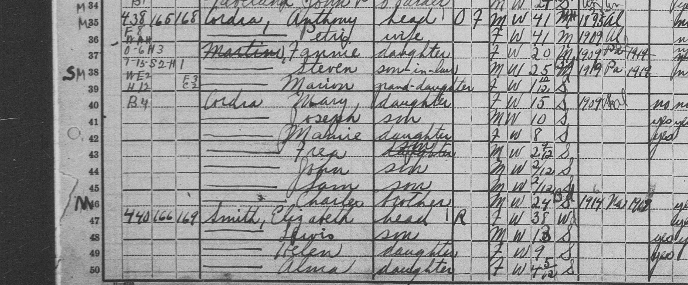</a> | **The coal miner's household, 1920.** At **438 Holden**, Anthony and Pietra lived with Joseph, Mamie and extended family. Their home was reported **owned free of mortgage**; Anthony and his listed brother Charles were coal miners. [Three-census story](../branches/cordaro-passport-lead.md#holden-street-across-three-census-years). |
| <a href="../sources/records/antonio-pietra-cordaro-household-census-1930.jpg">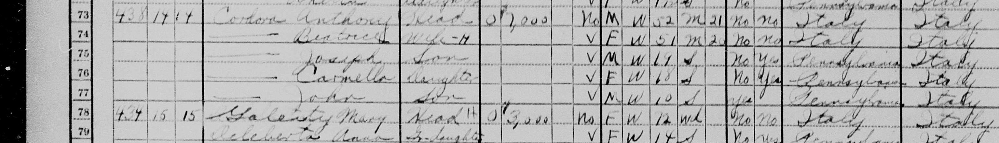</a> | **Still at 438, 1930.** The Anthony/Beatrice household lists Joseph, Carmella and John; the home is marked owned, **$2,000** reported value. Beatrice/Pietra and Carmella/Mamie name differences are preserved as research questions. [Compare 1920–40](../maps/cordaro-holden-households-1920-1940.svg). |
|  | **Two Cordaro addresses, 1940.** The original places Mamie and John at **438 Holden** with an owned-home entry, and Joseph and Dina at **440** with rent. [Compare the addresses](../branches/cordaro-passport-lead.md#holden-street-across-three-census-years); the deed chain and old building's survival remain unverified. |
|  | **Unadingen St. Georg — modern place view.** [Rauenstein's 2020 CC BY-SA 3.0 photo](https://commons.wikimedia.org/wiki/File:Unadingen,_Kirche_St._Georg.jpg) shows the [village church](https://unadingen.de/kirche/). Its tower is roughly 1500s; the nave was rebuilt in the 1930s. Bernhard and Maria's [1812–78 records](../branches/kramer-unadingen-household.md) are tied to this village, but no family's presence in this particular photo or exact historic building fabric is documented. |
|  | **Knittelsheim mill — modern place view.** A 2026 [CC BY-SA photograph by Achim Lammerts](https://commons.wikimedia.org/wiki/File:2026-09-02_Knittelsheimer_M%C3%BChle_(Z5-10899E)_by_Achim_Lammerts.jpg) shows a former mill locality linked in the [Disqué/Schaaf study](../branches/disque-schaaf.md). It does **not** show the building as it looked in the 1700s. |
|  | **Wilkes-Barre, c. 1930–45.** A [public-domain postcard](https://commons.wikimedia.org/wiki/File:Public_Square_looking_towards_East_Market_Street,_Wilkes-Barre,_Pa_(78881).jpg) shows the city during later Kramer generations. It is **not their recorded home or workplace**. |
|  | **Danville, 1911.** [Lewis Hine's photograph](https://www.loc.gov/item/2018674865/) gives a vivid view of a local industry near the [Neathery and Weatherford](../branches/weatherford.md) generations. **No worker is identified as family**; Duffy's recorded 1930 job was carpentry. |
|  | **Washington, c. 1900–05.** The [Library of Congress view](https://www.loc.gov/item/2003675007/) shows **A and 3rd Streets SE** during Alice Mulhall's childhood in the city. Her [probable family](../branches/smith-mulhall-corbett.md) is **not placed on this block**. |
|  | **Washington Navy Yard, sometime 1980–2006.** [Carol M. Highsmith's Library of Congress photograph](https://www.loc.gov/item/2011634490/) shows the site where Justin says **John Weatherford Sr. worked with IT equipment and Alice worked in administration** for many years. Their departments, buildings and dates there have **not** been verified; they are not visible in this aerial. |

## Artifacts that show their lives

These are scans of a family item or a historical document, **not photographs of the person**. Each thumbnail opens the saved image; the branch notes explain the record and its limits.

| Artifact | The human detail it preserves |
| --- | --- |
| <a href="../sources/records/emil-hilda-bosch-kramer-household-census-1910.jpg">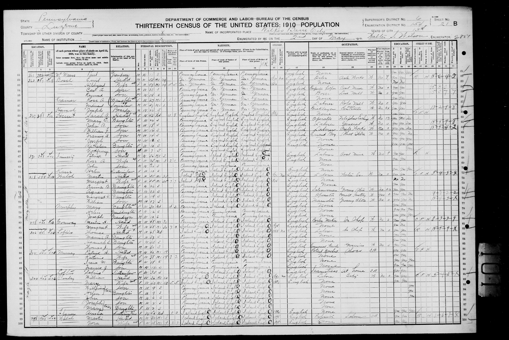</a> | **An early shared home, 1910.** Rose and Ferdinand Kramer lived with her parents at **363 Park Avenue** a year after their [marriage](../sources/records/ferdinand-rose-bosch-marriage-docket-1909.jpg). Ferdinand worked in a rope mill; Emil was an axle-works oiler. The [1900 census](../sources/records/emil-hilda-bosch-household-census-1900.jpg) shows Rose working as a paper-box maker in her parents' rented home at the same number. These scans show **people and work on paper, not the house's exterior**. [Two-home visual](../branches/other-paternal-lines.md#a-shared-boschkramer-home-on-park-avenue). |
|  | **Calogera Cordaro, 1900 — an Italian birth act.** Antonio, a farm worker, registered his daughter three days after she was born to Pietra Magro. Her probable later name **Fannie Mattina** emerges from matching parents and her exact 1909 arrival day on a [1952 citizenship card](../sources/records/fannie-mattina-naturalization-index-1952.jpg). [Cross-record story](../branches/cordaro-passport-lead.md#fannie-crosses-the-same-street). |
| <a href="../sources/records/edward-mary-kennedy-census-1900-sheet-22a.jpg">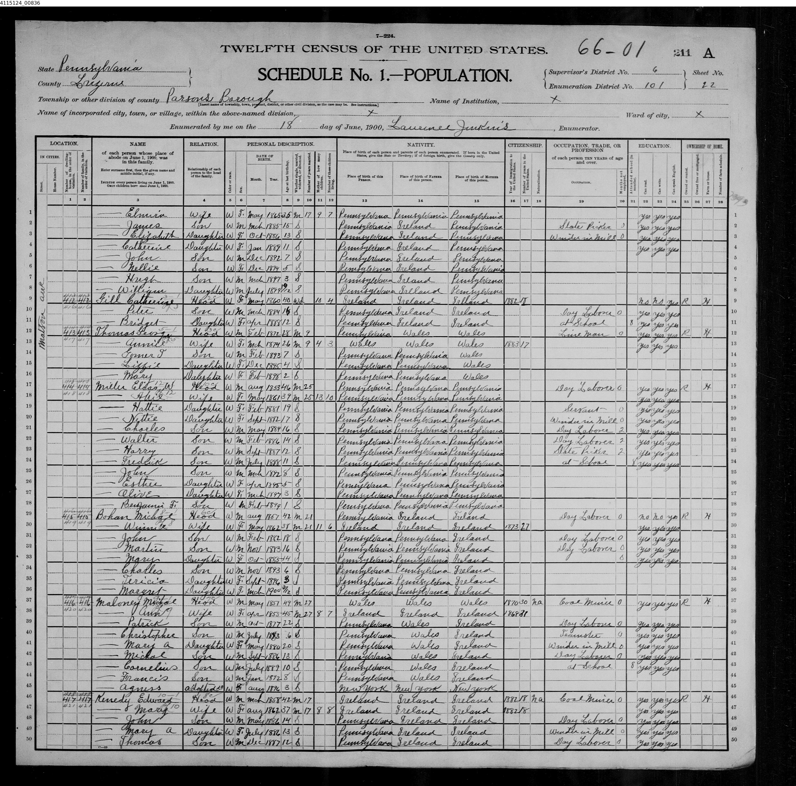</a> | **Edward and Mary Kennedy, 1900 — original census.** The household continues on [sheet 22B](../sources/records/edward-mary-kennedy-census-1900-sheet-22b.jpg): eight children in Parsons and Edward's coal-mining job. Daughter Mary A. is a strong match to later Mary Kennedy Andrews, supported by brothers named in her 1929 notice; the mother's proposed **Durkin** surname is not on the sheet. [Family guide](../branches/andrews-kennedy.md). |
| <a href="../sources/records/mary-andrews-death-index-1929.png">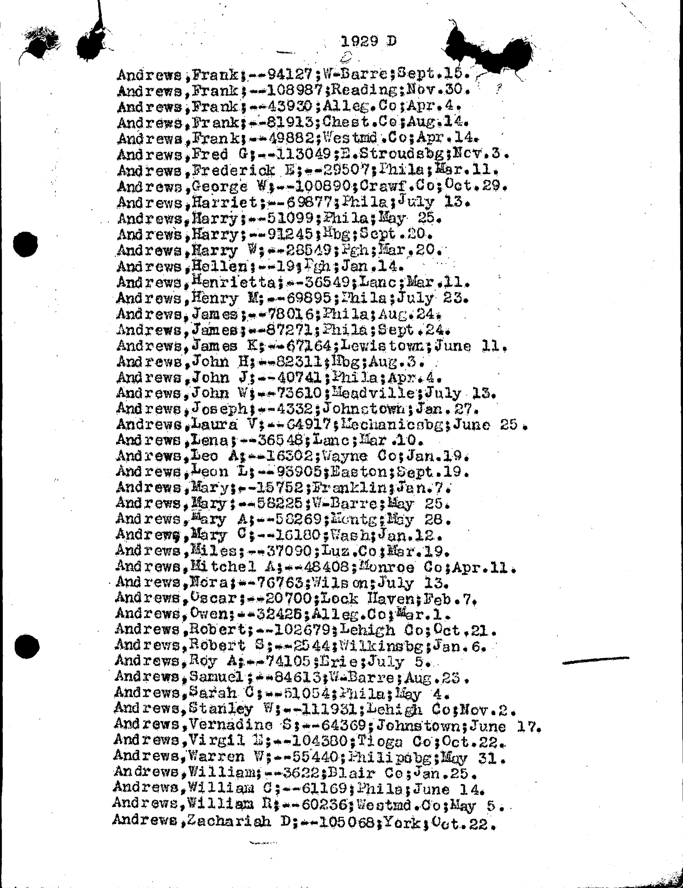</a> | **Mary Kennedy Andrews, 1929 — state index.** The dated entry, joined to a [transcribed *Wilkes-Barre Record* notice](https://www.findagrave.com/memorial/126529268/mary-andrews) naming her six children, explains why Frank was widowed in 1930. [Two 1920 census pages](../branches/andrews-kennedy.md) show the family before her death. The original newspaper, full certificate, illness and exact Flick Street house are still to be checked. |
|  | **Hannah Sponenberg's family Bible, dated 1879.** Its handwritten [births, marriage and deaths pages](../sources/records/README.md) name sons **Legrand** and **John Leonard** and record the parents' 1829 marriage. Someone kept the family dates together, but the earlier entries were retrospective and the writer is unidentified. [Family analysis](../branches/raber-kreisher-fairchild.md#hannahs-bible-and-a-union-cavalry-brother). |
|  | **Edward Sponenberg's 1915 biography.** The writer describes a move from rolling-mill work to **Berwick Store Company purchasing**, a home built in **1907**, and his grandfather Daniel's canal contracting. It calls him descended from early German settlers **of Columbia County**, without naming them, and praises his local reputation. These are the **writer's claims**, while the jobs and older kin need their own checks. [Read the account](../branches/sponenberg-deep-dive.md). |
|  | **James and An Blevin, Oyster Bay, 1686/7 — printed deed.** This [1916 town-book transcription](https://archive.org/download/oysterbaytownrec01coxj/oysterbaytownrec01coxj.pdf#page=455) calls James a **sailor**, shows the couple's marks, and reserves one field from his £14 land sale. It is **not a portrait or the manuscript original**. Whether this couple later appears in Westerly, and whether Ashley descends from either, remain open. [Northeast evidence](../branches/blevins-rhode-island-lead.md). |
| <a href="../sources/records/philip-sponenberg-biography-1915-p646.jpg">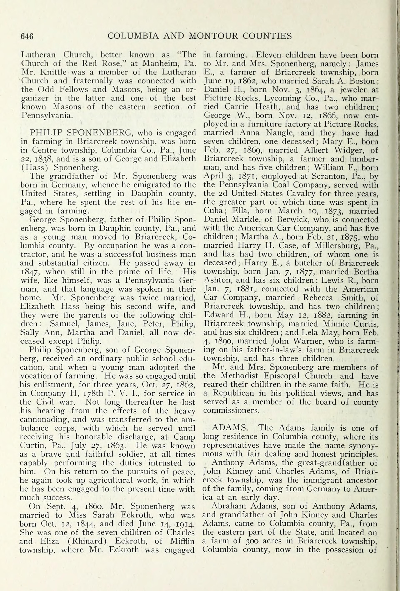</a> | **Philip Sponenberg's 1915 biography.** The writer says his unnamed grandfather came from Germany, his father George worked as a contractor, and the family spoke Pennsylvania German at home. This is a **separate possible branch**: George has not been proved a brother of Justin's ancestor Daniel. [Read the two-track account](../branches/sponenberg-deep-dive.md). |
| <a href="../sources/records/james-e-sponenberg-biography-1915-409.jpg">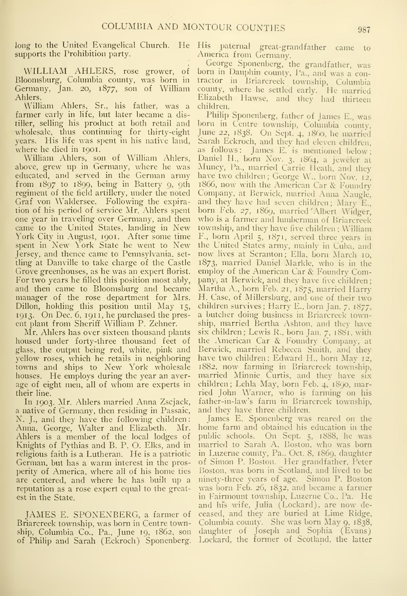</a> | **James E. Sponenberg, 1915.** Philip's son is described as a **Briarcreek farmer** with a wife, four daughters and Grace Lutheran Church membership; the [second page](../sources/records/james-e-sponenberg-biography-1915-410.jpg) finishes the household. The immigration story repeats the **same volume's** unnamed German ancestor on the separate George–Philip branch. [Family guide](../branches/sponenberg-deep-dive.md). |
|  | **William H. Kreischer, 1915.** Two pages trace an older **farm and limestone quarry**, timber and railroad work, then William's **American Car and Foundry** career and reported knee injury. His [second page](../sources/records/william-h-kreischer-biography-1915-657.jpg) names son William Henry, born 1909; the son's identity with Shirley's father is **strongly suggested, not yet independently parent-named**. [Visual and story](../branches/raber-kreisher-fairchild.md#the-other-side-of-shirleys-grandparents-a-1915-kreischer-profile). |
| <a href="../sources/records/john-ruth-fairchild-household-census-1950.jpg">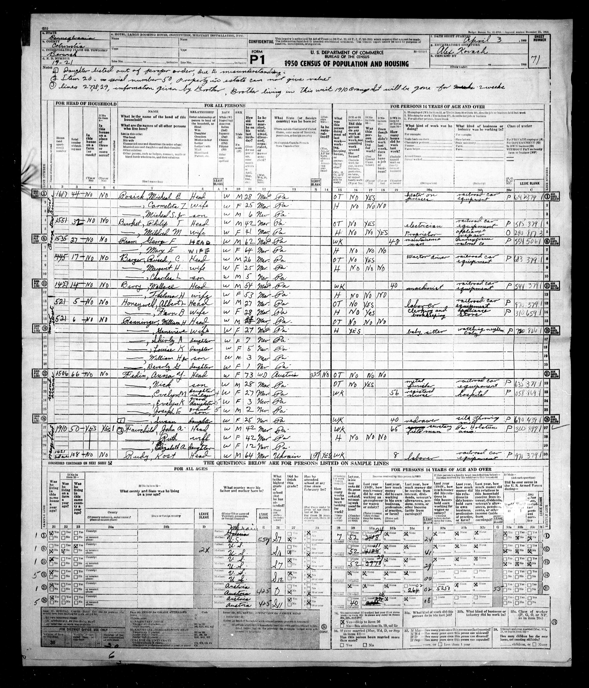</a> | **John and Ruth Fairchild, 1950.** A Berwick census sheet places them with daughter **Elizabeth** and records John's work as a **secretary / fieldman for a Pennsylvania Holstein association**. [Elizabeth's later Social Security index](https://www.familysearch.org/ark:/61903/1:1:6K9T-47TG?lang=en) names her mother **Ruth E. Kreischer**. This is a household and work clue, **not a photograph of the three people** or proof that John ran Paulene's Fairchild dairy. [Family story](../branches/raber-kreisher-fairchild.md#where-does-fairchild-belong). |
| <a href="../sources/records/crystal-balliet-household-census-1940.jpg">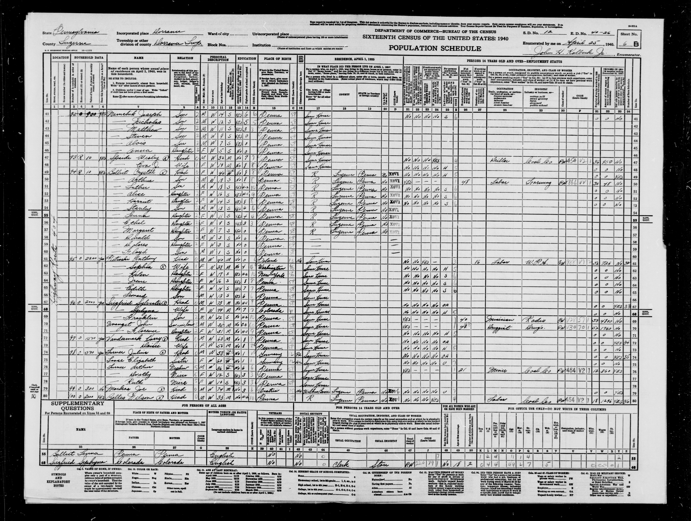</a> | **Crystal Balliet's household, 1940.** The original sheet shows a **widowed mother and eleven children** in one rented Dorrance Township home. Son Arthur reported farm labor. Justin identifies the one-year-old Floyd as **Sonya's Floyd's family line**; a later parent record is still needed to document the identity independently. [Household story](../branches/balliet-raber-candidates.md#the-balliet-household-in-an-original-census). |
| <a href="../sources/records/stanley-balliet-pa-death-index-1937-p144.png">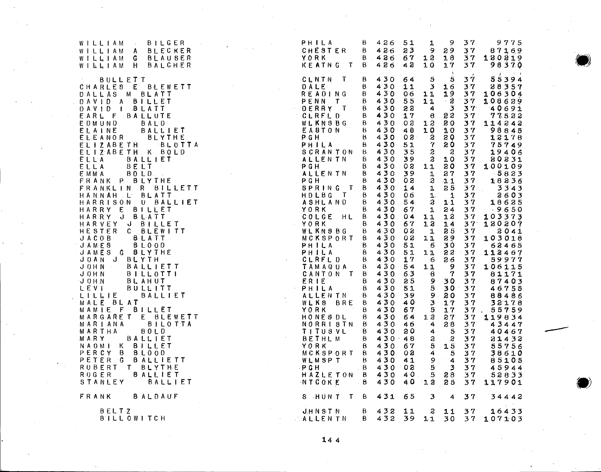</a> | **Stanley Balliet, Christmas Day 1937.** The state index fixes his death in **Nanticoke** on **25 December** and gives certificate **117901**. Put beside Crystal's 1940 census, it tells a difficult household transition; the document itself does **not** say why he died or name Floyd's father. [Date and family account](../branches/balliet-raber-candidates.md#the-balliet-household-in-an-original-census). |
| <a href="../sources/records/william-shirley-sonya-raber-census-1950.jpg">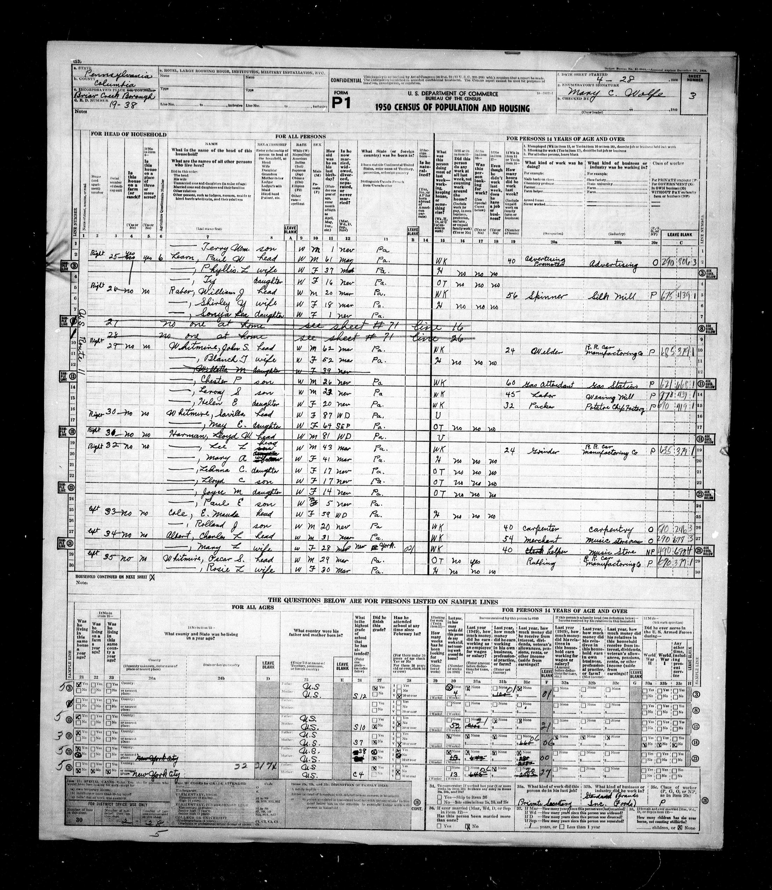</a> | **Sonya's childhood household, 1950.** The original Briar Creek sheet names her as **William J. and Shirley Y. Raber's daughter** and records William's work as a **silk-mill spinner**. This is a direct family link and a workplace clue, not a family portrait or proof of employment at a named mill. [Three-line record trail](../branches/raber-kreischer-balliet-record-trail.md). |
| <a href="../sources/records/william-bertha-younger-william-kreischer-census-1930.jpg">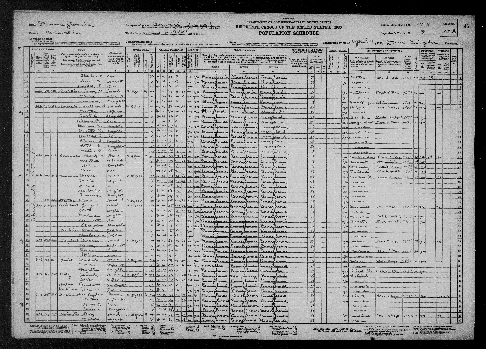</a> | **Two William Kreischers, 1930.** Father and son appear together on the Berwick sheet. It separates their work: elder William in **car-shop shipping**, younger William in a **department-store sugar department**; the elder reported a **$2,500 owned home**. The scanned page is a dated record, not an image of their home. [Lineage and limits](../branches/raber-kreischer-balliet-record-trail.md). |
| <a href="../sources/records/caucci-coal-1946-manager.jpg">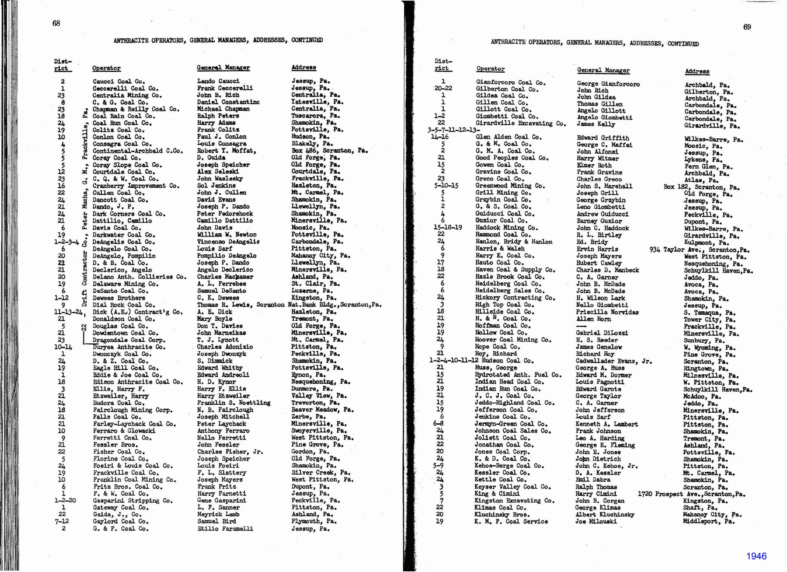</a> | **Caucci Coal Co., 1946 — work record.** Pennsylvania's [mines report](https://northernfield.info/Documents/doc01/1946.pdf) names **Lando Caucci** as general manager and its [production table](../sources/records/caucci-coal-1946-production.jpg) records **nine workers**. It is a glimpse of a local coal operation, **not a photo of Lando** or proof he owned it or was Dina's brother. [Caucci line](../branches/caucci-belardinelli.md#a-small-coal-operation-in-the-same-households-orbit). |
| <a href="../sources/records/joseph-caucci-draft-card-1942.jpg">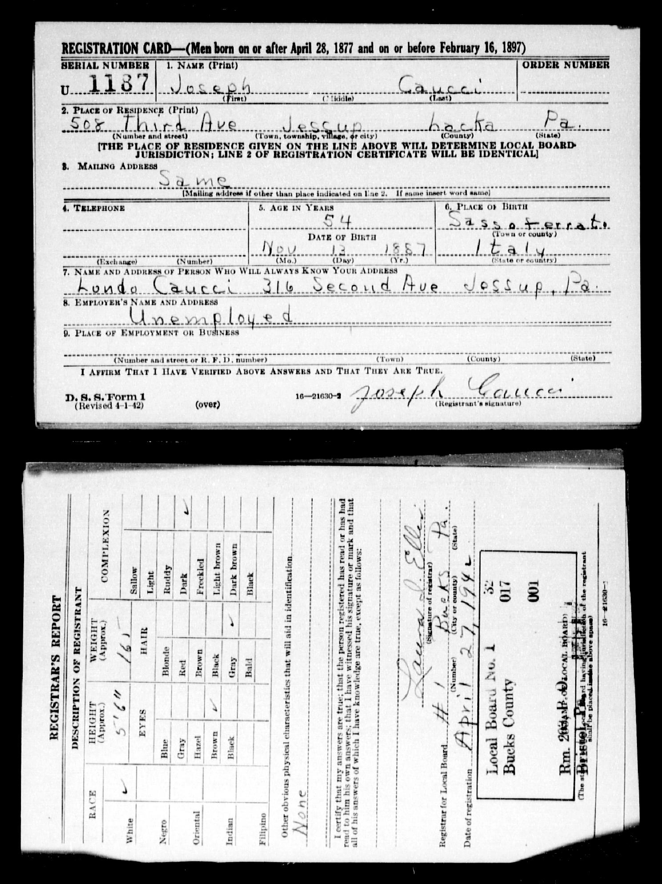</a> | **Joseph Caucci, 1942 — a stated hometown.** His signed card says **Sassoferrato, Marche** and names **Londo** in Jessup as his contact. That supports the Winton household identification; a direct record joining Dena to this Joseph remains to find. [Origin clues](../branches/caucci-belardinelli.md#an-origin-clue-on-each-side-of-the-couple). |
| <a href="../sources/records/anna-belardinelli-1913-passenger-manifest.jpg">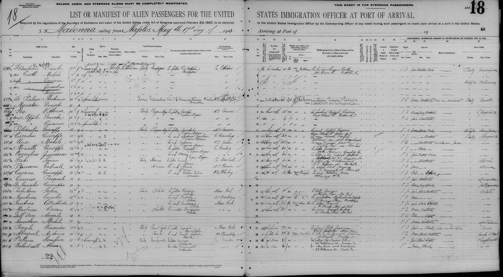</a> | **Anna Belardinelli, 1913 — passenger candidate.** The *Madonna* manifest lists Sassoferrato as her last home and a sister near Scranton as destination. A later marriage or child record must show whether she was **Dena's mother**. [Origin clues](../branches/caucci-belardinelli.md#an-origin-clue-on-each-side-of-the-couple). |
|  | **Family-held Italian passport.** Justin's photograph preserves a Sutera birth and residence entry and the bearer’s parents as written. [Read the Italian fields in English](../sources/family/italian-passport-translation.md). The cursive holder name remains uncertain, so the booklet is **not assigned to Antonio Cordaro**. Beside it, [Antonio's signed 1927 petition](../sources/records/antonio-cordaro-petition-1927.jpg) independently names his wife, five children and reported 1906 crossing. [Identity analysis](../branches/cordaro-passport-lead.md). |
| <a href="../sources/records/ferdinand-rose-kramer-household-census-1930.jpg">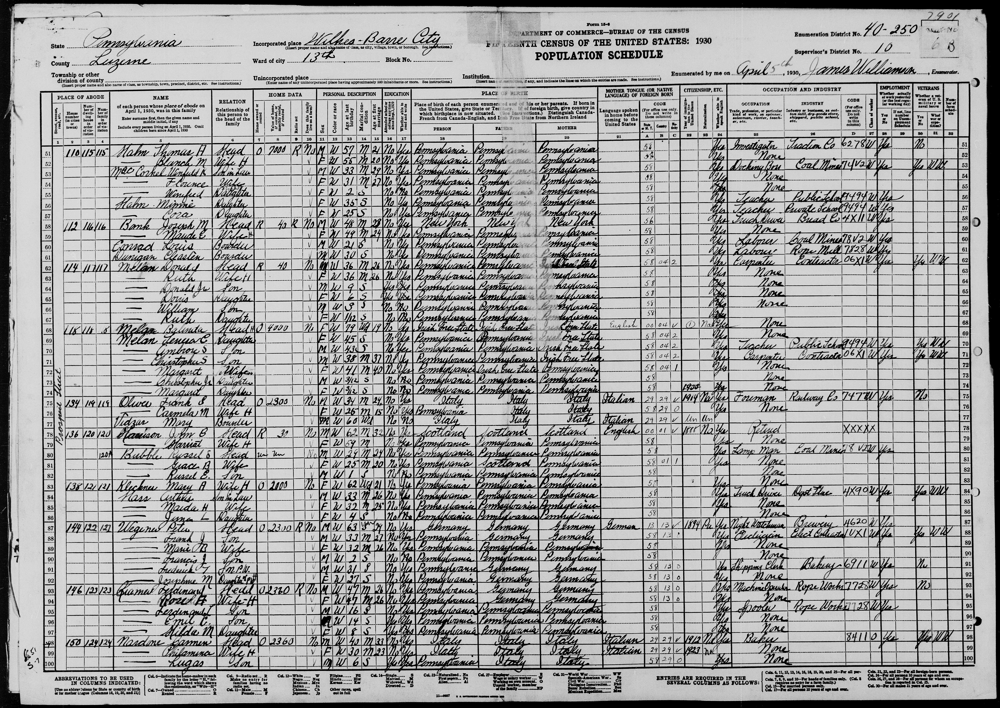</a> | **A radio at 146 Prospect in 1930.** The original census places 16-year-old Ferdinand Louis with Ferdinand, Rose, Emil and Hilda in the older father's **owned $2,300 home** and marks a **radio set**. It makes radio part of his documented teenage setting, but does not say who listened, repaired or bought it. [Radio study and the open motive question](education-across-generations.md#a-radio-lesson-by-mail). |
| <a href="../sources/records/ferdinand-louis-kramer-obituary-1976.jpg">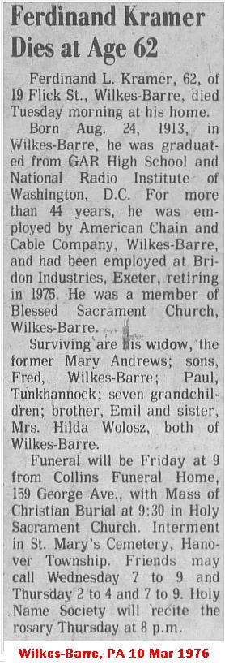</a> | **Ferdinand Louis Kramer's 1976 obituary.** This family notice says he **graduated from G.A.R. High School and National Radio Institute**, then worked for decades at **American Chain & Cable** and finally Bridon. It does not explain **why** he chose radio training or identify anything he built; school and employment files have not independently checked every detail. [Kramer profile](../branches/kramer.md). |
|  | **Ferdinand Louis's signed card, about 1940.** [MyHeritage's original-image viewer](https://www.myheritage.com/research/record-20912-11683440/ferdinand-louis-kramer-in-united-states-world-war-ii-draft-registrations) supplied the scan. It gives **19 Flick Street**, wife **Mary Veronica**, and **American Chain & Cable's Hazard Division** on East Ross Street. This is a personal work and home record, **not a service record or evidence of radio inventions**. [Home atlas](family-home-photo-atlas.md). |
|  | **A young couple's 1936 signatures.** On the [original Luzerne County form](https://www.familysearch.org/ark:/61903/3:1:33SQ-GPR7-9Q3P?lang=en), Ferdinand says **machinist apprentice**; Mary gives **71 Flick Street** and her father Frank signs consent. Their parents' names are written here, with Rose Bosch marked deceased. The form documents their situation at marriage, **not an NRI enrollment date**. [Short family scene](../branches/kramer.md#people-and-work). |
| <a href="../sources/records/frank-andrews-children-census-1930.jpg">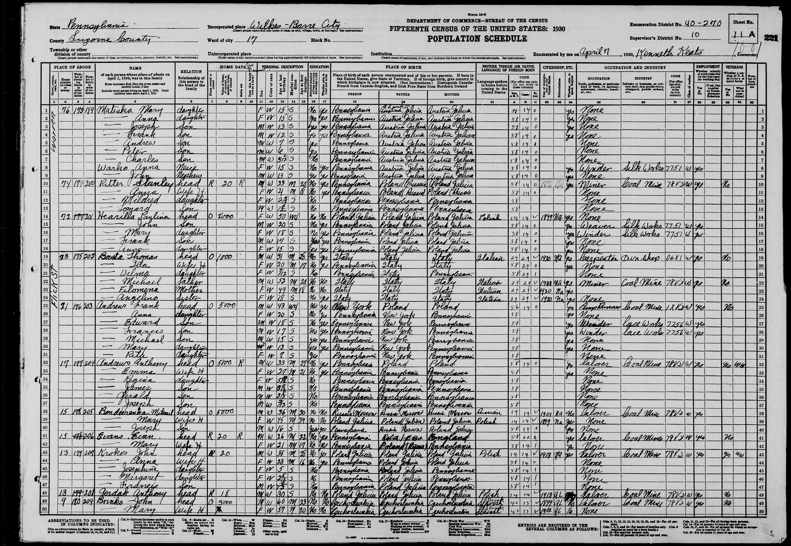</a> | **A widowed father's six children, 1930.** The [original census](https://www.familysearch.org/ark:/61903/3:1:33SQ-GRCJ-42Q?view=index&personArk=%2Fark%3A%2F61903%2F1%3A1%3AXH7Z-F3D&action=view&lang=en) names Mary and Rita among Frank Andrews's daughters at **71 Flick Street**; he reported coal-mine pump work and an owned house. This is a document image, **not a photograph of the home or children**. [Two-household story](../branches/andrews-kennedy.md). |
| <a href="../sources/records/garnett-florence-marriage-1954.jpg">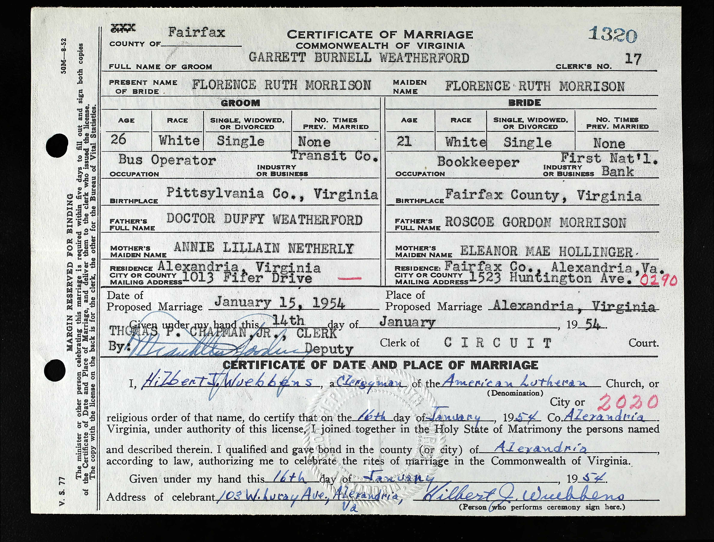</a> | **Garnett Weatherford and Florence Morrison's 1954 marriage return.** It names their parents and calls Florence a **bank bookkeeper** near the start of their life together. The groom's name is typed **Garrett** and her recorded age conflicts with childhood censuses, reminders to read even a signed form critically. [Generation notes](../branches/weatherford-smith-generations.md). |

**A personality clue from someone who knew her:** [Paulene Miller Beach's memoir](https://bhaven.org/paulene/life-journey) remembers her mother **Mabel/Pearl Wilson Miller** with deep affection and describes her cleaning and ironing work, family music, and a later island cruise sent by son Paul. Those are **Paulene's memories**, not a neutral character assessment or proof of the cruise itinerary. The [Miller family page](../branches/miller-gower-reese.md#small-stories-paulene-preserved) preserves the details and the records that can check its dates.

**What to look for next:** A labeled family album, workplace newsletter, school yearbook with a verified name, or a property photograph with a dated address could turn these broad settings into personal stories. The [record-image gallery](../sources/records/README.md) contains original documents that identify occupations and households; a record scan is not a photograph of the person.
