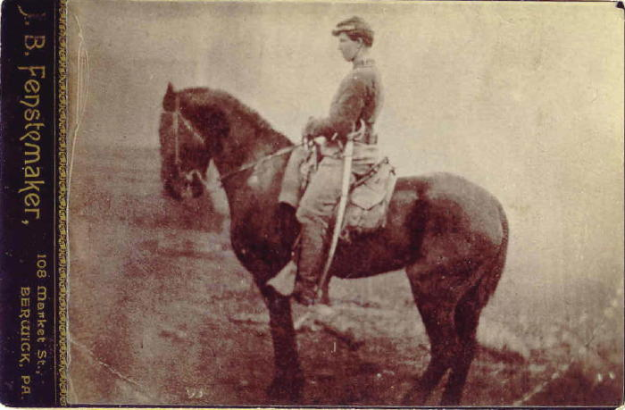
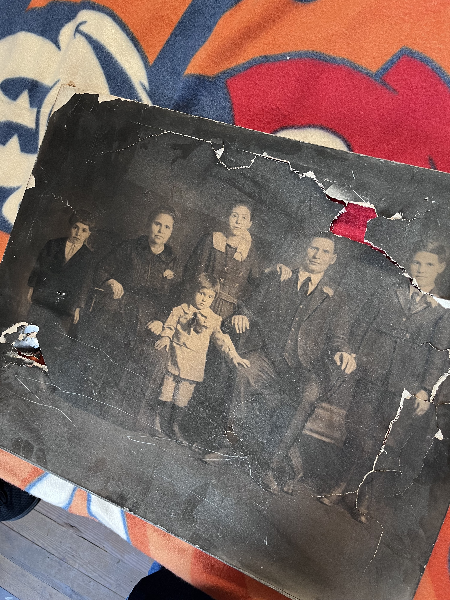
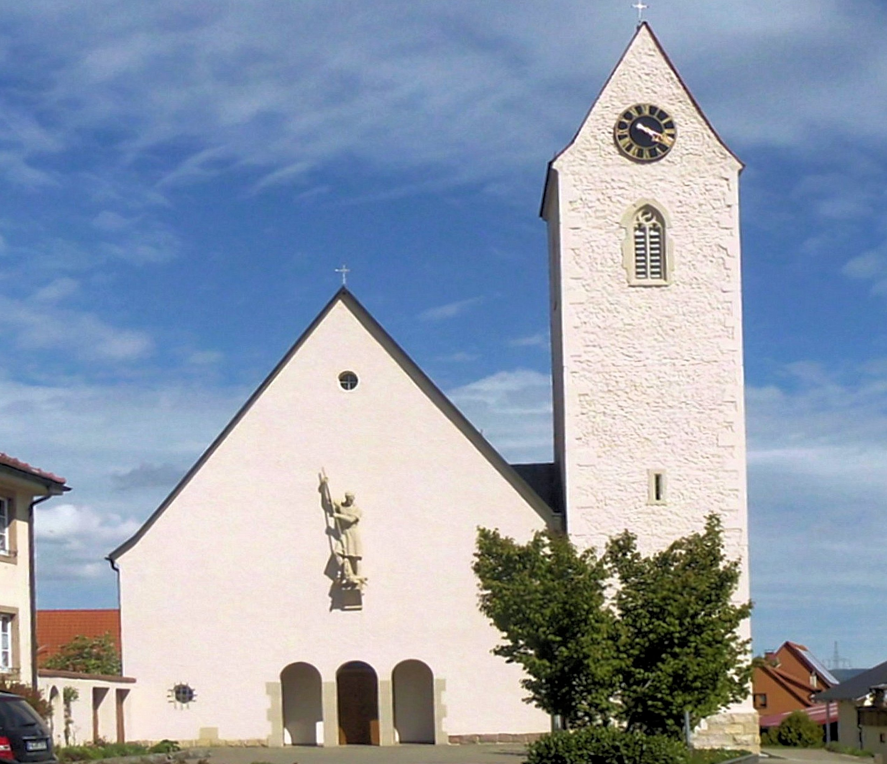
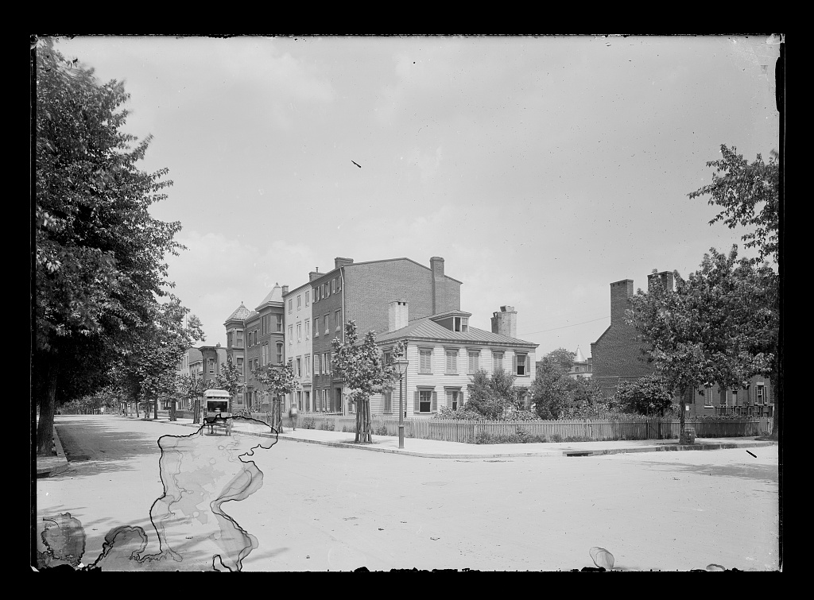

# Faces and places across the family lines

The image's **date and identification** matter as much as its appearance. A “family portrait” is an actual or family-attributed relative; a “place view” shows a setting; a “period advertisement” shows what an institution offered or claimed. Only the first category depicts a possible relative. Click any thumbnail for the saved image. The [picture guide](../media/README.md) has provenance and reuse notes.

| Image | What it lets us see |
| --- | --- |
|  | **Hilda Kramer Wolosz — named portrait.** A [FamilySearch contributor tagged the image](https://www.familysearch.org/memories/memory/122056242); her [obituary](https://www.legacy.com/us/obituaries/citizensvoice/name/hilda-wolosz-obituary?id=7822560) independently names Ferdinand and Rose as her parents. **Photo date and original inscription unknown.** |
|  | **National Radio Institute, 1926 — period advertisement.** This [public-domain *Amazing Stories* page](https://commons.wikimedia.org/wiki/File:Amazing_Stories_v01_n01_front_cover_National_Radio_Institute.jpg) shows a mail coupon and equipment used to sell home study. [Ferdinand Louis's obituary](../sources/records/ferdinand-louis-kramer-obituary-1976.jpg) reports later NRI study, but no course date, in-person trip, or radio income. The ad's pay claims are **marketing**. [Short explanation](education-across-generations.md#a-radio-lesson-by-mail). |
|  | **Legrant Sponenberg — attributed portrait.** A [family archive](https://jowest.net/Genealogy/John/Christian/LegrantSponenbergCivilWar.htm) calls him the rider; the [1862 roll](../sources/records/legrant-sponenberg-16th-cavalry-register-1862.jpg) supports service but does **not authenticate the likeness**. The studio imprint says **B. Fenstermaker, Berwick**. |
|  | **Cordaro group — people unnamed.** Justin identifies the photo as family and guessed 1930s; its style suggests a broad **c. 1915–35** range. No person, studio or exact place is established. [Identification work](../branches/cordaro-passport-lead.md). |
|  | **Unadingen St. Georg — modern place view.** [Rauenstein's 2020 CC BY-SA 3.0 photo](https://commons.wikimedia.org/wiki/File:Unadingen,_Kirche_St._Georg.jpg) shows the [village church](https://unadingen.de/kirche/). Its tower is roughly 1500s; the nave was rebuilt in the 1930s. Bernhard and Maria's [1812–78 records](../branches/kramer-unadingen-household.md) are tied to this village, but no family's presence in this particular photo or exact historic building fabric is documented. |
|  | **Knittelsheim mill — modern place view.** A 2026 [CC BY-SA photograph by Achim Lammerts](https://commons.wikimedia.org/wiki/File:2026-09-02_Knittelsheimer_M%C3%BChle_(Z5-10899E)_by_Achim_Lammerts.jpg) shows a former mill locality linked in the [Disqué/Schaaf study](../branches/disque-schaaf.md). It does **not** show the building as it looked in the 1700s. |
|  | **Wilkes-Barre, c. 1930–45.** A [public-domain postcard](https://commons.wikimedia.org/wiki/File:Public_Square_looking_towards_East_Market_Street,_Wilkes-Barre,_Pa_(78881).jpg) shows the city during later Kramer generations. It is **not their recorded home or workplace**. |
|  | **Danville, 1911.** [Lewis Hine's photograph](https://www.loc.gov/item/2018674865/) gives a vivid view of a local industry near the [Neathery and Weatherford](../branches/weatherford.md) generations. **No worker is identified as family**; Duffy's recorded 1930 job was carpentry. |
|  | **Washington, c. 1900–05.** The [Library of Congress view](https://www.loc.gov/item/2003675007/) shows **A and 3rd Streets SE** during Alice Mulhall's childhood in the city. Her [probable family](../branches/smith-mulhall-corbett.md) is **not placed on this block**. |
|  | **Washington Navy Yard, sometime 1980–2006.** [Carol M. Highsmith's Library of Congress photograph](https://www.loc.gov/item/2011634490/) shows the site where Justin says **John Weatherford Sr. worked with IT equipment and Alice worked in administration** for many years. Their departments, buildings and dates there have **not** been verified; they are not visible in this aerial. |

**What to look for next:** A labeled family album, workplace newsletter, school yearbook with a verified name, or a property photograph with a dated address could turn these broad settings into personal stories. The [record-image gallery](../sources/records/README.md) contains original documents that identify occupations and households; a record scan is not a photograph of the person.
