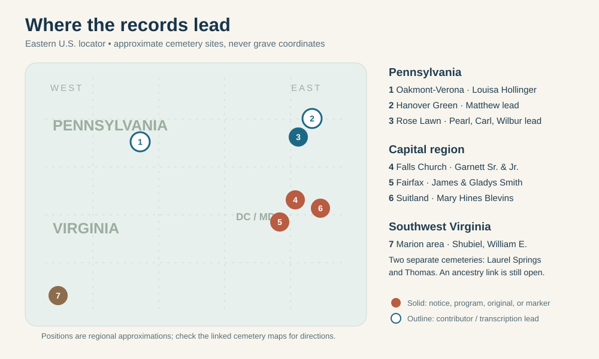

# Family burial places: a visit guide

The [Berwick-area close-up](../maps/berwick-family-cemeteries.svg) separates four cemeteries that overlap at the scale of the eastern U.S. map.

**As checked 27 September 2026.** A death notice, funeral program, or photographed marker can establish a burial more firmly than a user-edited memorial. The map marks **cemeteries or towns**, not individual plots. A cemetery name is not a headstone sighting; ask the office for a section, lot, and grave before a visit. Links below lead to the evidence and, where available, a photographed marker.

## Ashley's Weatherford, Smith, Blevins, and Morrison lines

| Person | Place to look | What supports it / what is still needed |
|---|---|---|
| **Mary Elizabeth Hines Blevins** (d. 1961), Gladys Smith's mother | **Washington National Cemetery**, [Suitland, Maryland](https://www.cemetery.com/washington-national-cemetery-md) | Her [contemporary *Evening Star* death notice](https://www.loc.gov/resource/sn83045462/1961-12-05/ed-1/?sp=20) explicitly names the cemetery. A [contributor memorial](https://www.findagrave.com/memorial/88291876/mary_e-blevins) says **Section R**; confirm the lot/grave with the office. Its one photo is **not established as a headstone image**. Ask whether William H. was later interred there. |
| **Garnett Burnell Weatherford Sr.** (d. 2007), Ashley's grandfather | **National Memorial Park**, [Falls Church, Virginia](https://www.dignitymemorial.com/funeral-homes/virginia/falls-church/national-funeral-home/4927/cemetery) | His [published family notice](https://www.legacy.com/us/obituaries/washingtonpost/name/garnett-weatherford-obituary?id=2252863) specifies interment. His [memorial](https://www.findagrave.com/memorial/27709126/garnett_burnell-weatherford) reports **Section X, Lot 962, site 1** and has three photos; check the inscription and office plot record before a visit. |
| **Florence Ruth Morrison Weatherford** (d. 2019), Ashley's grandmother | **National Memorial Park**, Falls Church | Her [memorial](https://www.findagrave.com/memorial/197126757/florence_r-weatherford) transcribes a 2019 *Washington Post* notice that specifies interment here and identifies Garnett and their children. It reports **Section X, Lot 962, site 2**, next to Garnett's reported site. **No marker photo** is attached; seek the original notice and cemetery confirmation. |
| **Garnett “Bee” Weatherford Jr.** (d. 2003), John's brother | **National Memorial Park**, Falls Church | His [published notice](https://www.legacy.com/us/obituaries/washingtonpost/name/garnett-weatherford-obituary?id=5491686) specifies interment; his [memorial](https://www.findagrave.com/memorial/27317215/garnett_b-weatherford) reports **Section X, Lot 964, site 4** and a photographed inscription. This is near his parents' reported lot, but the precise layout needs an office check. |
| **Elaine M. Weatherford Eldridge** (d. 2012), John's sister | **National Memorial Park**, Falls Church **lead** | Her [memorial](https://www.findagrave.com/memorial/175700609/elaine_m-eldridge) reports **Section X, Lot 963, site 2**, with two photos. Florence's transcribed 2019 notice also says Elaine predeceased her. Obtain Elaine's original death notice or cemetery record to confirm the identification and plot. |
| **James Allen Smith** (1933–1990) and **Gladys Louise Blevins Smith** (1938–2008), Ashley's maternal grandparents | **Fairfax Memorial Park**, [Fairfax, Virginia](https://fmpark.funeralnetcustomsolutions.com/about-us/map-directions/) | James's [memorial and photographed shared marker](https://www.findagrave.com/memorial/106660847/james_a-smith) show both names and years; his contributor-entered plot is **Section 4**. [Gladys's memorial](https://www.findagrave.com/memorial/45796517/gladys_louise-smith) names the same cemetery and links him as spouse. Confirm the lot/grave with the office before visiting. The marker does not show full dates or parentage. |
| **Louisa E. Straub Hollinger** (d. 1941), Florence's **probable maternal grandmother** | **Oakmont-Verona Cemetery**, [Oakmont, Pennsylvania](https://www.findagrave.com/cemetery/45672/oakmont-verona-cemetery) | A [memorial transcribes her 1941 Pittsburgh death notice](https://www.findagrave.com/memorial/139916983/louisa_e-hollinger), which says interment in “Oakmont Cemetery”; the memorial places her in Oakmont-Verona and has two photos, whose contents still need inspection. Her [original death certificate](../sources/records/louisa-straub-hollinger-death-certificate-1941.jpg) fixes the identity and date, but the link through Eleanor to Ashley still needs the original parent-naming bridge. The memorial supplies a grave GPS point; verify on site. |
| **Shubiel / Shubal Blevins** (d. 1913), older **candidate** Blevins branch | **Laurel Springs Cemetery**, Marion, Smyth County, Virginia | His [original federal headstone application](../sources/records/shubiel-blevins-headstone-application-1941.jpg) names this cemetery and his Confederate unit; a [local cemetery transcription](https://www.newrivernotes.com/smyth-laurel-springs-cemetery/) lists him. The application is **not** a current photograph of the installed stone. The index's “Texas” burial is an error: the form says **Virginia**. Ashley's William Howard → William Elkanah parent-child link remains unproved. |
| **William Elkanah Blevins** (d. 1929) and **Mary M. E. Blevins** (d. 1914 per transcription), older candidate branch | **Thomas Cemetery**, Smyth County, Virginia | [Local transcription](https://www.newrivernotes.com/smyth-thomas-cemetery/) lists both. William's [original death certificate](https://www.familysearch.org/ark:/61903/1:1:NSFW-RVB?lang=en) names Shubiel and Ada as his parents, but does not itself establish the burial. Mary's identity as his first wife and the tree's conflicting 1916 death year need an original record. Obtain grave photos and cemetery records. |

**Three different capital-area cemeteries:** Mary is in the **Suitland, MD** cemetery; Garnett Sr. and Jr. are reported at **Falls Church, VA**; James and Gladys Smith are recorded at **Fairfax, VA**. “National Memorial Park” is not Washington National Cemetery. [Washington National location](https://www.cemetery.com/washington-national-cemetery-md) · [National Memorial Park location/map](https://www.dignitymemorial.com/funeral-homes/virginia/falls-church/national-funeral-home/4927/cemetery) · [Fairfax Memorial Park directions](https://fmpark.funeralnetcustomsolutions.com/about-us/map-directions/).

## Justin's Kramer, Cordaro, and Miller lines

| Person | Place to look | What supports it / what is still needed |
|---|---|---|
| **Martin Mathias “Matthew” Kramer** (d. 1918), likely the Wilkes-Barre household head | **Hanover Green Cemetery**, Hanover Township, Pennsylvania | A [contributor memorial](https://www.findagrave.com/memorial/124590191/martin_mathias-kramer) names the cemetery and has three photos of unverified subject; the [state death index](https://www.phmc.state.pa.us/bah/dam/rg/di/r11_090_DeathIndexes/Death_1918/D-18%20K-L.pdf) independently gives a Matthias Kramer death in Wilkes-Barre on 15 July 1918. The certificate, inscription, and Matthew/Matthias identity match still require checking before treating this as a proved ancestor's grave. |
| **Antonio Cordaro** (1878–1940) and **Pietra Magro Cordaro** (1879–1930), Justin's immigrant great-great-grandparents | **Saint Cecilia's Cemetery**, [Exeter, Pennsylvania](https://www.findagrave.com/cemetery/275371/saint-cecilia's-cemetery) **lead** | [Antonio's](https://www.findagrave.com/memorial/153512121/antonio-cordaro) and [Pietra's](https://www.findagrave.com/memorial/153512074/pietra_a-cordaro) contributor memorials give the same cemetery and link them as spouses. Their names, years, and Luzerne County location fit the [original 1899 marriage and 1927 petition](../branches/cordaro-passport-lead.md); a [Mary Cordaro Pardi memorial](https://www.findagrave.com/memorial/153511892/mary-pardi) in the same cemetery gives **1904**, fitting daughter Maria's age on the 1909 passenger list, but her identity is not independently proved. The memorial pages each offer **Request Headstone Photo**; none yet verifies a marker or plot. Obtain Pennsylvania death certificates and cemetery registers before treating this as a confirmed family plot. |
| **Velma “Pearl” Wilson Miller** (1919–2008), Justin's maternal great-grandmother | **Rose Lawn / Roselawn Cemetery**, Berwick, Pennsylvania | Her [family funeral program](https://bhaven.org/uploads/3/4/0/3/34038663/vol14sec2.pdf#page=1) explicitly gives the burial place. **Plot and marker photo not located.** |
| **Carl Eugene Miller** (1948–2001), Pearl and Lester's son | **Roselawn Cemetery**, Berwick | A [veterans' burial listing](https://www.interment.net/united-states/pennsylvania/veterans-burials/records.php?page=1482) names Carl E. and the cemetery; a [parent-naming Social Security index](https://www.familysearch.org/ark:/61903/1:1:6K9G-Y87C?lang=en) strongly identifies him. The derivative grave entry conflicts with Social Security on his exact death day. Seek the cemetery register, VA burial record, and stone image. |
| **Wilbur Clayton Miller** (d. 1923), earlier Berwick Miller branch | **Roselawn Cemetery**, Berwick **lead** | A [Find a Grave index via FamilySearch](https://www.familysearch.org/ark:/61903/1:1:QVV4-SZYW?lang=en) gives original cemetery place Berwick, Pennsylvania, but its normalized location wrongly jumps to **Northern Ireland**. The family-tree death date differs by two days. Check the original death certificate and marker before planning a specific plot. |
| **Shirley Yvonne Kreischer Raber** (d. 2018), Justin's maternal great-grandmother | **Elan Memorial Park**, [Lime Ridge / Bloomsburg area, Pennsylvania](https://liferemembered.com/memorial-parks/elan-memorial-park) | Her [published obituary, preserved by FamilySearch](https://www.familysearch.org/ark:/61903/1:1:61FN-QJ7Z?lang=en), explicitly says burial at Elan. The [matching memorial](https://www.findagrave.com/memorial/194994430/shirley-yvonne-raber) gives no plot or grave GPS and offers a headstone-photo request. Ask the operator for her section, lot and marker status. |
| **Stanley D. Balliet** (d. 1937) and **Crystal M. Balliet** (d. 1973), Floyd's family-identified parents | **Stairville Cemetery**, Dorrance Township, Pennsylvania | The [cemetery transcription](https://pagenweb.org/~luzerne/township/cemetery/stairville.htm) lists both in **Section 1, Row 3** with Stanley D. Jr. nearby; [Pennsylvania's original death index](../sources/records/stanley-balliet-pa-death-index-1937-p144.png) confirms Stanley's **25 December 1937** death in Nanticoke. This locates a promising family marker group, but a current marker photo, grave lot and Floyd's parent-naming record remain open. |
| **William H. Kreischer Jr.** (d. 1976) and **Aletha Fae Sponenberg Kreischer** (d. 1998), Shirley's parents | **Elan Memorial Park**, Lime Ridge **leads** | Their [William](https://www.findagrave.com/memorial/132713568/william_henry-kreischer) and [Aletha](https://www.findagrave.com/memorial/132713625/alethea_faye-kreischer) memorials both report **Fountain Lawn**. Shirley's obituary independently names them as parents, and the [1915 biography](../branches/raber-kreisher-fairchild.md) names Aletha's father Edward. A shared lawn does not prove adjacent graves; obtain original burial records and inspect any marker images. |
| **Edward J. Sponenberg** (d. 1959) and **Jennie Edora Mensinger Sponenberg** (d. 1954), Aletha's parents | **Pine Grove Cemetery, Market and Ninth Streets, Berwick** | A [1997 on-site partial transcription](https://www.pa-roots.com/columbia/townships/briarcreek/pinegrovemarketstreetcemetery.html) records their stones as **Edward J. (1871–1959)** and **Jennie E. (1872–1954)**; it also lists **Clark L. Sponenberg (1899–1900)** nearby without saying how he is related. Justin remembers this as the cemetery across from Domino's. **Exact plot and present marker condition are unchecked.** Pine Grove Cemetery and its annex are distinct sites; the on-site reading identifies the Market/Ninth site. |
| **Daniel Sponenberg** (d. 1856), **Hannah Shellhammer Sponenberg** (d. 1889), and their son **John Leonard Sponenberg** (d. 1887) | **Briar Creek Union Cemetery**, Briar Creek **leads** | [Daniel](https://www.findagrave.com/memorial/17023345/daniel-sponenberg), [Hannah](https://www.findagrave.com/memorial/17023365/hannah-sponenberg), and [John Leonard](https://www.findagrave.com/memorial/17817858/john_leonard-sponenberg) have memorials at this cemetery, also called **Housenick / Saint Peter's Union**. Hannah's [family Bible](../branches/raber-kreisher-fairchild.md) independently identifies Daniel and John but does not state their burial places. Memorials list photos; inspect the actual stones and confirm their locations with a cemetery transcription or register. |

**Open searches:** No cemetery has yet been established for Patricia Cordaro Kramer, her parents Joseph Cordaro and Dina Caucci, the three Ferdinands, or the Disqué/Raber/Kreischer generations. A death town, last residence, or family-tree “burial” field is not enough to place a marker. For the [Unadingen Bernhard Kramer household](../branches/kramer-unadingen-household.md), [1874/1875 church burial indexes](https://www.familysearch.org/ark:/61903/1:1:WFDG-3LT2?lang=en) record **parish burials**, not an identified surviving grave; that German line's connection to Pennsylvania also remains unproved.

## Best next checks before a headstone trip

1. **Capital area:** confirm Mary's reported **Section R** and full lot with [Washington National](https://www.cemetery.com/washington-national-cemetery-md); ask National Memorial Park to verify **Weatherford Section X, Lots 962–964** and inspect its memorial photos; confirm **Section 4** and the lot for James/Gladys with [Fairfax Memorial Park](https://fmpark.funeralnetcustomsolutions.com/about-us/map-directions/).
2. **Pennsylvania:** request a Rose Lawn lot search for Pearl, Carl, and Wilbur; ask **Elan** for Shirley's plot and to verify William/Aletha in Fountain Lawn; inspect Pine Grove and Briar Creek inscriptions and registers for the Sponenbergs; check Matthew's photographed memorial against the 1918 death certificate; verify Louisa's Oakmont photos; and test **Saint Cecilia's** Antonio/Pietra/Mary Cordaro memorials against death certificates and registers.
3. **Southwest Virginia:** use Shubiel's application plus the Laurel Springs and Thomas transcriptions to locate markers; photograph the full stone and neighboring names. Record plot/row, the cemetery's exact name, transcription, photo date, and who identified the person.

The [source ledger](../research/sources.md) keeps the underlying records and conflicts. If a marker has no photo, [Find a Grave's photo-request guide](https://support.findagrave.com/hc/en-us/articles/53933342930579-Photo-Request-Basics) may help once the correct memorial and cemetery are known; its memorial text is a clue to compare with original records.
