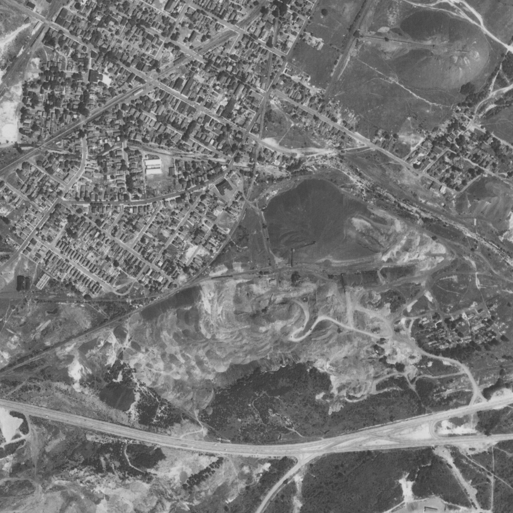
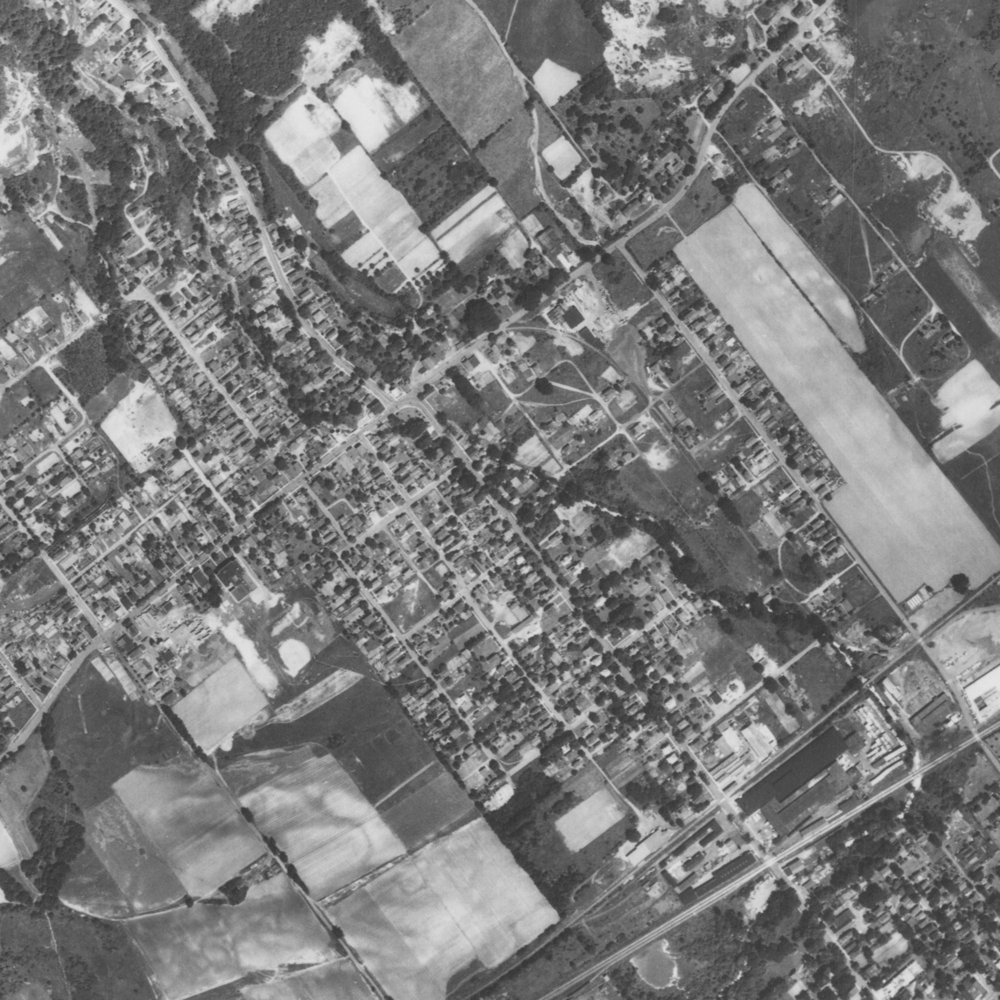
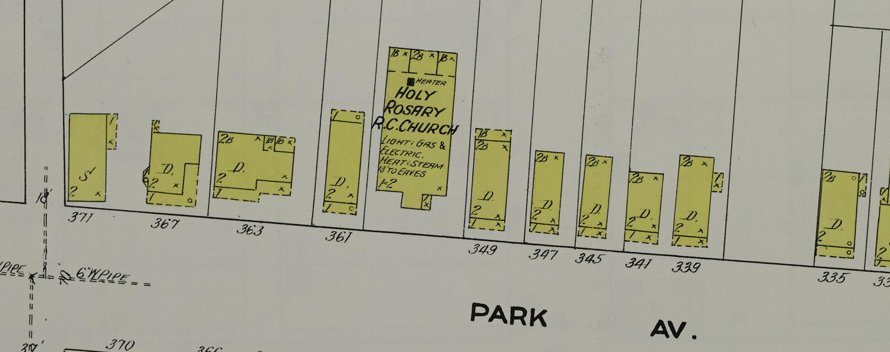
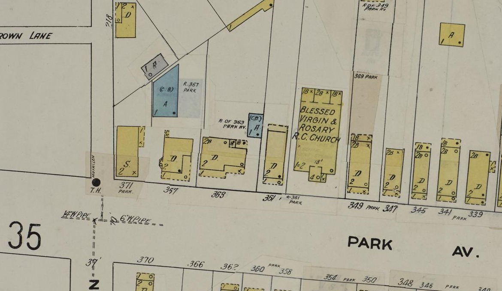
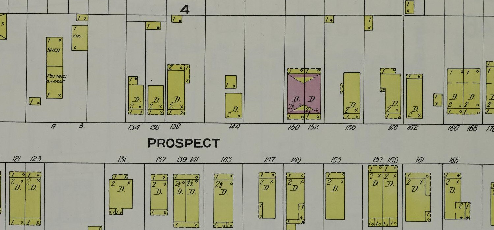
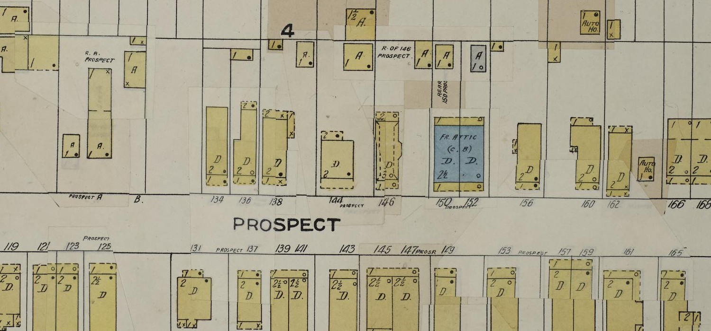

# Family homes: addresses and pictures to compare

**Start with the dated record, then open the picture.** These are places connected to relatives, not a claim that every present building is the one they knew. The links marked *today* lead to outside photo galleries or street views; no listing photographs are copied into this repository. The [Sponenberg house page](family-homes.md) has three more family-attributed old house photographs.

| Family and recorded period | Address evidence | See the place today | What the photo can show |
| --- | --- | --- | --- |
| **Mulhall, 1879–1920 candidate branch** | DC [HistoryQuest's original building record](../sources/records/annie-mulhall-house-dc-historyquest-1879.json) names **Annie M. Mulhall** as original owner of **520 Fifth St. SE, Washington** in **1879**; a [1920 obituary index](https://www.myheritage.com/research/record-12003-543780621/james-e-mulhall-in-united-states-obituary-index-from-oldnewscom) places police captain **James E. Mulhall** there at death. The [1866 marriage reference](https://msa.maryland.gov/megafile/msa/stagsere/se1/se27/000100/000110/pdf/se27-0110.pdf#page=131) suggests Annie was his wife. [Four-record visual](../maps/annie-mulhall-house-record-trail.svg) · [family story](../branches/smith-mulhall-corbett.md#a-named-house-on-fifth-street). | [Current exterior and interior gallery](https://www.redfin.com/DC/Washington/520-5th-St-SE-20003/home/9897584) · [architectural history](https://sah-archipedia.org/buildings/DC-01-CN39) · [map](https://www.google.com/maps/search/?api=1&query=520+5th+St+SE+Washington+DC+20003) | The official historic-building dataset identifies an extant **1879 two-story brick dwelling**, with Owen Donnelly as builder and **$1,600 estimated construction cost**. The current exterior appears at the same mapped historic building, but remodeled interiors do not show how the Mulhalls lived. The marriage identity and captain's connection to Ashley's line need more evidence. Neither construction cost nor modern sale price is household net worth. |
| **Frank Mulhall, 1920 candidate collateral branch** | The [4 October 1920 *Washington Herald*, p. 3](https://tile.loc.gov/storage-services/service/ndnp/dlc/batch_dlc_frenchbulldog_ver04/data/sn83045433/00280764127/1920100401/0314.pdf) lists Captain James's brother **Frank** at **411 Fifth St. SE, Washington**. [Two-address visual](../maps/mulhall-fifth-street-house-evidence.svg) · [family story](../branches/smith-mulhall-corbett.md#a-named-house-on-fifth-street). | [Current site photo gallery](https://www.redfin.com/DC/Washington/411-5th-St-SE-20003/home/9896106) · [map](https://www.google.com/maps/search/?api=1&query=411+5th+St+SE+Washington+DC+20003) | [DC HistoryQuest](../sources/records/frank-mulhall-address-dc-historyquest-1961.json) dates the present **411** building to **1961**. These modern photos show the address, **not Frank's 1920 house**. The notice identifies a residence, not ownership, and his link to Ashley's direct line is still conditional. |
| **Bosch, 1890–98** | [1890–95 directory](https://www.myheritage.com/research/record-10705-189068458/emil-bosch-in-us-city-directories): **52 Main St., Ashley, PA**, meat market and home. [1896–98 directory](https://www.myheritage.com/research/record-10705-189068459/emil-bosch-in-us-city-directories): **13 Jones St., Wilkes-Barre**, home. [Four-address visual](../maps/bosch-park-avenue-to-prospect.svg). | [1891 Ashley Main Street map](../media/ashley-main-street-sanborn-1891.jpg) · [full plate](../sources/records/sanborn-ashley-main-street-1891-plate3.jpg) | The map shows the **business street**, but its building numbers cannot yet be securely matched to directory **52 Main**. Do not label any pictured footprint as Emil's shop or infer home ownership from the directory's generated tag. |
| **Bosch → Kramer, 1900–10** | **363 Park Ave., Wilkes-Barre, PA.** The [1900 original census](../sources/records/emil-hilda-bosch-household-census-1900.jpg) places Emil, Hilda and daughter Rose there in a **rented** home. The [1910 original](../sources/records/emil-hilda-bosch-kramer-household-census-1910.jpg) again lists 363, now including married daughter **Rose and Ferdinand Kramer**; the [preceding sheet](../sources/records/bosch-park-avenue-census-1910-previous-sheet.jpg) names Park Avenue. [Household visual](../maps/bosch-park-avenue-to-prospect.svg). | [1910 house footprint](../media/park-avenue-1910-sanborn-detail.jpg) · [1950 revised footprint](../media/park-avenue-1950-sanborn-detail.jpg) · [current 353–363 church-property photo gallery](https://www.jjnre.com/sold/353-363-park-avenue-wilkes-barre-pa-18702-11-4190.html) · [parish's approx. 1910 Holy Rosary photo](https://www.standrewwilkesbarre.org/about-our-parish) | **The 1910 Sanborn map actually labels a separate dwelling at 363**, between 367 and 361, immediately west of the church. The 1950 revised map again labels a dwelling at 363, without proving the structure was unchanged. The church's period photo shows the setting, **not an identified Bosch house**; the modern listing combines multiple addresses. [Map comparison below](#363-park-avenue-a-mapped-house-beside-holy-rosary). |
| **Bosch → Kramer, 1911–51** | **146 Prospect St., Wilkes-Barre, PA.** A [directory group](https://www.myheritage.com/research/record-10705-189068462/emil-bosch-in-us-city-directories) first lists **Emil Bosch in 1911**; a [1914 transcription](https://pagenweb.org/~luzerne/towns/donnacd.htm) lists older **Ferdinand (c. 1882)**. The [original 1930 census](../sources/records/ferdinand-rose-kramer-household-census-1930.jpg) confirms **146 Prospect** for Ferdinand, Rose, **Ferdinand Louis (16)**, Emil and Hilda; Ferdinand reported an **owned $2,300 home** and a **radio set**. The [1940 census](../sources/records/ferdinand-kramer-household-census-1940.jpg) reports **$2,400** there; Emil's [draft card](../sources/records/emil-carl-kramer-draft-registration-1940.jpg), [1948 directory](https://westpittstonhistory.org/wp-content/uploads/2021/08/1948-Bell-Telephone-Directory-Pittston-_-Nearby-Points.pdf), and [1951 certificate](../sources/records/ferdinand-kramer-1882-death-certificate-1951.jpg) repeat 146. | [1910 Sanborn detail](../media/prospect-street-1910-sanborn-detail.jpg) · [1950 Sanborn detail](../media/prospect-street-1950-sanborn-detail.jpg) · [current photo gallery](https://www.redfin.com/PA/Wilkes-Barre/146-Prospect-St-18702/home/135059789) · [alternate property page](https://www.realtor.com/realestateandhomes-detail/146-Prospect-St_Wilkes-Barre_PA_18702_M49159-64178) | The **1910 map labels 144 and 150 Prospect but no 146** between them; **1911** is now the earliest directory sighting at 146. The **1950 revision maps a two story dwelling** there. A missing 1910 map label does not prove a 1910–11 construction date; address assignment or map omission remain possible. Redfin says **1930** built; Realtor says **1909**. Neither proves today's photographed structure is the family-era one. The census values are household reports, not deeds or a precise wealth trend. |
| **Andrews → Kramer, 1929–76** | Mary's [1929 death certificate](https://www.findagrave.com/memorial/126529268/mary-andrews/photo#view-photo=218591682) and [original notice](https://www.findagrave.com/memorial/126529268/mary-andrews/photo#view-photo=218591721) both put Mrs. Frank Andrews at **21 Flick St.** **71 Flick St., Parsons, PA:** the [1930 original](../sources/records/frank-andrews-children-census-1930.jpg) lists widowed coal-mine pump runner **Frank Andrews** and six children, including **Mary and Rita**, and says he owned a **$5,000** house. Mary repeated 71 Flick on her [1936 marriage application](../sources/records/ferdinand-louis-kramer-mary-andrews-marriage-1936.jpg). The [1940 census](../sources/records/ferdinand-mary-kramer-census-1940.jpg) and Ferdinand Louis's [signed draft card](../sources/records/ferdinand-louis-kramer-draft-registration-1940.jpg) place his young family at **19 Flick St.**; the [original 1950 census](../sources/records/ferdinand-louis-mary-kramer-census-1950.jpg) independently repeats **19 Flick** with Mary, Fred, Paul and her father Frank Andrews; his [1976 obituary](../sources/records/ferdinand-louis-kramer-obituary-1976.jpg) again says **19 Flick**. [Household visual](../maps/andrews-flick-households.svg). | [21 Flick on a current map](https://www.google.com/maps/search/?api=1&query=21+Flick+St+Wilkes-Barre+PA) · [71 Flick on a current map](https://www.google.com/maps/search/?api=1&query=71+Flick+St+Wilkes-Barre+PA+18705) · [current 19 Flick property photo](https://www.zillow.com/homedetails/19-Flick-St-Wilkes-Barre-PA-18705/53510710_zpid/) · [19 Flick street imagery](https://www.google.com/maps/search/?api=1&query=19+Flick+St+Wilkes-Barre+PA+18705) | **The 1929 number is corroborated, but 21 → 71 → 19 still needs deed, directory or building-card research.** Three sightings of 19 (1940, 1950 and 1976) do not prove continuous residence or the present building's age. Frank's reported home value and Ferdinand's rent describe different households. |
| **Sponenberg/Mensinger, 1901–50** | Emma Sponenberg's [1901 directory](../sources/records/sponenberg-berwick-directory-1901-p169.jpg) says **211 W. Front St.**; an [1896 Sanborn detail](../media/sponenberg-emma-west-front-1896-sanborn-detail.jpg) maps a two-story dwelling at that number. Edward and Jennie's later **505 E. Second St., Berwick mailing address / Salem Twp., PA** is in the [1927/32 directories](https://www.myheritage.com/research/record-10705-2100012/edward-j-sponenberg-in-us-city-directories) and [1940 original census, sheet 4B](../sources/records/edward-jennie-sponenberg-census-1940.jpg); Edward reported the same house in 1935. | [1896 map of Emma's block](../sources/records/sanborn-berwick-west-front-1896-plate4.jpg) · [current 505 E. Second street-view page](https://www.zillow.com/homedetails/505-E-2nd-St-Berwick-PA-18603/299280889_zpid/) · [older, family-attributed homes of Edward's uncles](family-homes.md) | The **1896 map predates Emma's directory** and names no resident; it cannot prove the same structure stood in 1901. The present 505 structure and Edward's reported **1907** house remain unjoined. A **1919 Sanborn 505** appears on the Columbia side of a boundary, but Edward's 1940 census is in **Luzerne's Salem Township**. That map cannot yet identify his house. |
| **Cordaro/Magro, 1920–50** | **438–440 Holden St., West Wyoming, PA in 1920–40.** [1920](../sources/records/antonio-pietra-cordaro-household-census-1920.jpg): Anthony/Pietra at 438, home reported **owned free of mortgage**, Anthony coal miner. [1930](../sources/records/antonio-pietra-cordaro-household-census-1930.jpg): Anthony/Beatrice at 438, home **owned, $2,000** reported value, Joseph coal-mine laborer. [1940](../sources/records/joseph-dina-cordaro-census-1940.jpg): Mamie and brother John at 438 (**owned, $2,000**); Joseph and Dina at 440 (**$15 monthly rent**). [1950 sheets 8–9](../sources/records/joseph-dina-cordaro-census-1950.jpg) place John/Anna and Joseph/Dina in separate dwellings numbered **440**, with a likely Mamie/Melanie at **438**; the vertical street name appears **Ensign**, not Holden, and needs confirmation before a modern pin. [1920–40 housing visual](../maps/cordaro-holden-households-1920-1940.svg) · [1950 two-household visual](../maps/cordaro-households-1950.svg) · [short story](../branches/cordaro-passport-lead.md#two-cordaro-households-and-two-patricias-1950). | [Present 438 Holden house photo](https://www.realtor.com/realestateandhomes-detail/438-Holden-St_Wyoming_PA_18644_M46030-31084) · [parcel facts](https://www.redfin.com/PA/Wyoming/438-Holden-St-18644/home/134024604) | Redfin calls today's **438 Holden** parcel **two-family**, built **1920**; the censuses do not prove one structure survived, a title transfer, or why Pietra was entered as Beatrice in 1930. The 1950 street label must be reconciled with the 1940 address before using a current 438 or 440 photograph for that year. Mamie/Carmella/Melanie still needs an explicit alias record. The modern postal label says *Wyoming*; the originals say *West Wyoming*. |
| **Mattina/Cordaro, 1916–52** | Fanny Cordaro's [1916 marriage docket](../sources/records/stephen-mattina-fanny-cordaro-marriage-1916.jpg) names parents Anthony and Petra. She, Stephen and daughter Marion lived with those parents at **438 Holden in 1920**. The [1930 original](../sources/records/steve-fannie-mattina-household-census-1930.jpg) puts their family at **417 Holden**, reported **owned, $4,600 value**. The [1940](../sources/records/steve-fannie-mattina-household-census-1940.jpg) and [1950](../sources/records/steve-fannie-mattina-household-census-1950.jpg) originals and Fannie's [1952 citizenship card](../sources/records/fannie-mattina-naturalization-index-1952.jpg) put her at **419 Holden**; 1940 records **$15 monthly rent**. [Journey visual](../maps/calogera-fannie-journey-1900-1952.svg) · [short story](../branches/cordaro-passport-lead.md#fannie-crosses-the-same-street). | [Current 417 Holden: 41-photo gallery](https://www.redfin.com/PA/West-Wyoming/417-Holden-St-18644/home/134069708) · [current 419 Holden view](https://www.realtor.com/realestateandhomes-detail/419-Holden-St_Wyoming_PA_18644_M44209-67513) · [street map](https://www.google.com/maps/search/?api=1&query=417+Holden+St+West+Wyoming+PA+18644) | Both listing pages report **1900** construction, but no deed, building card or dated period photo yet proves either pictured structure matches the family-era one. The 1930 value was reported on a census, and the move to a rented house has no established reason. |
| **Raber, about 1940–50** | William Glenmore Raber's [signed WWII card](https://www.myheritage.com/research/record-20912-3208760/william-glenmore-raber-in-united-states-world-war-ii-draft-registrations) gives **321 W. Second St., Nescopeck, PA** and names mother **Mary Rebecca Raber at 815 E. Second St.** The [1950 William G./Alice original](../sources/records/william-alice-raber-census-1950.jpg) lists **321 W. Third St.** for a strongly matching household; Second and Third must not be merged. Neither record says who owned either property. | [321 W. Second current photo/property page](https://www.zillow.com/homedetails/321-W-2nd-St-Nescopeck-PA-18635/53548523_zpid/) · [alternate parcel facts](https://www.redfin.com/PA/Nescopeck/321-W-2nd-St-18635/home/133895913) · [815 E. Second on map](https://www.google.com/maps/search/?api=1&query=815+E+2nd+St+Nescopeck+PA+18635) | Redfin's **1930** build year makes the pictured 321 W. Second structure a *possible* survivor from William's residence, not a confirmed family house. Check a building card, deed and dated photo; the two 321 addresses could represent a move, street-label error or later renumbering. No verified historic image of 815 E. Second was found. |
| **Miller, 1940–50** | **1912 Fairview Ave., Berwick, PA** in the [1940 index](https://www.myheritage.com/research/record-10053-108307645/marqueen-miller-in-1940-united-states-federal-census) and [1950 original census](../sources/records/miller-berwick-household-census-1950-sheet15.jpg). Paulene remembered **1908 Fairview Ave.** in her [memoir](https://bhaven.org/paulene/life-journey). | [1912 Fairview today](https://www.zillow.com/homedetails/1912-Fairview-Ave-Berwick-PA-18603/52130468_zpid/) · [1908 Fairview today](https://www.zillow.com/homedetails/1908-Fairview-Ave-Berwick-PA-18603/52130466_zpid/) | **Do not caption either current building as the childhood house.** Listing facts date today's 1912 building to **1993** and 1908's mobile home to **1975**. The old home may have been replaced, and the memoir/census address difference remains unexplained. |
| **Blevins/Hines, 1940–41** | **902 E. Watauga Ave., Johnson City, TN.** The [1940 census](../sources/records/blevins-household-census-1940.jpg) records W. Howard and Mary Blevins with Gladys there; Mary's father John Hines's [1941 death certificate](../sources/records/john-jackson-hines-death-1941.jpg) gives the same street and number. | [Current street-view image](https://www.realtor.com/realestateandhomes-detail/902-E-Watauga-Ave_Johnson-City_TN_37601_M86275-62193) | Realtor's **1935** construction year makes continuity *plausible*, but does not independently prove the same house survives or show how it looked in 1940. |
| **Weatherford/Cash, 1937–51** | **824 Noble, Danville, VA.** [George's 1937 certificate](../sources/records/g-w-weatherford-death-certificate-1937.jpg) calls it **Noble Street**; his daughter [Novella Cash's 1951 certificate](../sources/records/novella-weatherford-cash-death-certificate-1951.jpg) says **Noble Avenue**. Wife **Ella** and daughter/informant **Mrs. C. E. Cash** help join the records despite George's **G. W. / George C.** initial conflict. The certificates show a shared address at two dates, not who held title. | [Present-day 824 Noble property and street-view page](https://www.zillow.com/homedetails/824-Noble-Ave-Danville-VA-24540/96781453_zpid/) · [Danville map](https://www.google.com/maps/search/?api=1&query=824+Noble+Ave+Danville+VA+24540) | Zillow gives no construction year; neither it nor the certificates proves today's visible structure was present in 1937. The city holds [land records from 1841](https://www.danville-va.gov/501/Land-Records), a route to test ownership and address continuity. |
| **Smith and Weatherford, 1980s onward** | **6330 and 6312 Miller Dr., Franconia/Fairfax County, VA.** Alice and John's [1986 marriage return](https://www.familysearch.org/ark:/61903/1:1:QK9V-J612?lang=en) names those two addresses; [Fairfax parcel history](https://icare.fairfaxcounty.gov/ffxcare/search/commonsearch.aspx?mode=address) names Garnett and Florence at 6312 and the Smith title trail at 6330. The same [parcel search](https://icare.fairfaxcounty.gov/ffxcare/search/commonsearch.aspx?mode=address) and Justin's family account identify John and Alice with **6307 Colette Dr.** later. | [6312 Miller: 49-photo property gallery](https://www.realtor.com/realestateandhomes-detail/6312-Miller-Dr_Alexandria_VA_22315_M59529-31579) · [6330 Miller: street-view image](https://www.realtor.com/realestateandhomes-detail/6330-Miller-Dr_Alexandria_VA_22315_M60816-21731) · [6307 Colette: street-view image](https://www.redfin.com/VA/Alexandria/6307-Colette-Dr-22315/home/9785106) · [Fairfax neighborhood map](../maps/colette-neighborhood.svg) | The three addresses describe nearby generations, not a single house. 6312 was built **1980**, 6330 **1960**, and 6307 Colette **1989** according to the property pages. The 6312 gallery is from a later listing; it cannot show how the home looked while Florence lived there. Look for family snapshots for period interiors or exterior changes. |

## Addresses that need a better pin

### Parsons and Flick Street on 26 June 1950

The [1950 census now directly repeats **19 Flick Street**](../sources/records/ferdinand-louis-mary-kramer-census-1950.jpg) for Ferdinand Louis, Mary, Fred and Paul Kramer. This [26 June USDA aerial tile](https://www.pasda.psu.edu/pennpilot/era1950/luzerne_1950/luzerne_1950_photos_tif/luzerne_062650_arb_1f_16.tif.zip) overlaps today's 19 Flick map location and shows the Parsons streets and nearby industrial landscape from their era. The detail is an approximate neighborhood crop; **no individual roof is identified as number 19**. Compare a georeferenced period street/parcel plan and building card before connecting a roof to the current [19 Flick exterior](https://www.zillow.com/homedetails/19-Flick-St-Wilkes-Barre-PA-18705/53510710_zpid/).

### West Wyoming on 26 June 1950

This [USDA photograph in Penn State's PennPilot archive](https://www.pasda.psu.edu/pennpilot/era1950/luzerne_1950/luzerne_1950_photos_tif/luzerne_062650_arb_1f_11.tif.zip) shows the wider West Wyoming area a few weeks after the [Cordaro 1950 census](../branches/cordaro-passport-lead.md#two-cordaro-households-and-two-patricias-1950). Its mapped tile overlaps the modern 438 Holden point, but the crop is **neighborhood context, not a located Cordaro roof**. Resolving the census street label and comparing a georeferenced parcel map are required before drawing a house marker on this photograph.

### 363 Park Avenue: a mapped house beside Holy Rosary

| 1910: during the Bosch–Kramer census years | Revised to February 1950: later address footprint |
| --- | --- |
|  |  |

The [1910 original map](https://www.loc.gov/resource/g3824wm.g3824wm_g08049191002/?sp=39) finally gives the Bosch household's **363 Park Avenue** address a mapped footprint. It is **its own building**, between numbers 367 and 361, next to Holy Rosary. Both the [1900 and 1910 household records](../sources/records/README.md#bosch-and-kramer-at-363-park-avenue-190010) name 363; the 1910 map matches the later census year. The [1950 revised map](https://www.loc.gov/resource/g3824wm.g3824wm_g08049195002/?sp=41) still shows a numbered dwelling, plus a rear outbuilding marked “R. of 363 Park Av.” A matching number and footprint do **not** establish uninterrupted building survival, ownership, or what the facade looked like. The [parish's period church photo](https://www.standrewwilkesbarre.org/about-our-parish) and [modern combined-property gallery](https://www.jjnre.com/sold/353-363-park-avenue-wilkes-barre-pa-18702-11-4190.html) should be viewed as **block context**, not portraits of the Bosch house. Next: find the parcel/deed or historic assessment record and a photograph that actually includes number 363. Both map details are cropped from saved Library of Congress Sanborn plates, public domain.

### A street before the Kramer house number appears

On the [Library of Congress's 1910 Wilkes-Barre Sanborn map, volume 2, plate 34](https://www.loc.gov/resource/g3824wm.g3824wm_g08049191002/?sp=37), the side of Prospect Street later associated with **146** has buildings numbered **144** and **150–152**, with no **146** label or building footprint between them. A [1911 city directory](https://www.myheritage.com/research/record-10705-189068462/emil-bosch-in-us-city-directories) then places **Emil Bosch** at **146 Prospect**; a [1914 transcription](https://pagenweb.org/~luzerne/towns/donnacd.htm) puts the older Ferdinand there. The [1950 revised plate 34](https://www.loc.gov/resource/g3824wm.g3824wm_g08049195002/?sp=39) explicitly labels a **two story dwelling at 146** and an outbuilding or rear structure marked **“R. of 146 Prospect.”** This is a mapped building during the family's recorded residence, not a picture of the people or proof that today's photographed structure is identical. The map and directory make **1910–11 numbering or construction worth testing**, but a missing 1910 footprint might reflect map coverage or omission. Ask the city or county for the earliest property card and deed; the competing **1909/1930** listing years remain unverified. Both displayed details are crops of the [1910](../sources/records/sanborn-wilkes-barre-prospect-1910-plate34.jpg) and [1950](../sources/records/sanborn-wilkes-barre-prospect-1950-plate34.jpg) full plates. Maps: Sanborn Map Company; Library of Congress Geography and Map Division, public domain.

- **Older Wilkes-Barre Kramers:** directory transcriptions put Matthias/Matthew's household at **22 Susquehanna** in the 1880s–90s and **17 Susquehanna** in 1900–04. A digitized street plan or original directory is needed to determine whether the street was renumbered or the family moved. [Directory trail](../branches/kramer.md#people-and-work).
- **Edward Sponenberg before Second Street:** the [1901 directory](../sources/records/sponenberg-berwick-directory-1901-p169.jpg) says **West Front Street** but has no house number for Edward; **211 W. Front belongs to his mother Emma's entry**. The **1910** Salem Township sheet identifies Edward, Jennie, Ray and Elsie and says Edward **owned a mortgaged home**; it gives no street address. It cannot identify his 1907-built house. [Detailed house account](family-homes.md).
- **Italian and German ancestors:** Milocca/Sutera and Unadingen records establish villages, not present-day house numbers. The [Sicily map](../maps/cordaro-sutera-places.svg) and [European places map](../maps/europe-family-places.svg) are the honest visual scale until a cadastral, church, or household record gives a plot.
- **Raber, Kreischer, Balliet and older Miller branches:** Justin's family account places older Kreischers near **Vine/13th Street** and Sponenbergs on **Second Street** in Berwick, but supplies neither house numbers nor years for those recollections. The older [Raber–Shadle household](../branches/raber-shadle-household.md) is recorded in **Nescopeck in 1910** and **Mahoning Township in 1920–30**. Its [1930 original](../sources/records/william-mary-shadle-raber-census-1930.jpg) gives **$12 rent** but no house number; the younger [William G./Mary R. candidate](../sources/records/william-mary-raber-census-1930.jpg) rented for **$9** in the same township on a different sheet. William Glenmore's own 1940 card now gives two **Nescopeck Second Street addresses**, listed above; [Carl's 1950 sheet](../sources/records/carl-edna-raber-census-1950.jpg) gives Shickshinny and a coal job. None establishes ownership or that a modern structure is the one the family occupied. The [Raber/Kreischer/Balliet original-record trail](../branches/raber-kreischer-balliet-record-trail.md) has further households and jobs; deeds and building cards are the next photo bridge.
- **Other Mulhall/Corbett, Morrison and Neathery/Phelps households:** Annie's **520 Fifth Street SE** house is now documented above. The other [DC](../branches/smith-mulhall-corbett.md), [Indiana](../branches/morrison-hollinger.md) and [Virginia/North Carolina](../branches/neathery-phelps.md) censuses and land records have not established another confidently readable, still-matchable house number. Street handwriting in John T. Mulhall's census needs an independent directory check. The [1885 Phelps land papers](../sources/records/README.md) describe land interests, not a modern street address.

**Next record to seek:** original deed and tax/building history for **146 Prospect, 505 E. Second, 438 Holden, 1912 Fairview, and 902 E. Watauga**. Date-stamped family photographs, insurance maps, local historical society photo collections and Sanborn maps could then connect a building to the household rather than merely matching a modern address. [Research questions](../research/open-questions.md).

**Chrome download check, 28 September 2026:** Eleven family-record JPGs checked in Justin's Downloads folder had SHA-256 matches in this repo, so no duplicate copies were added. The latest four unnamed `image - 2026-09-28T06...` files match the saved [1900 Bosch household](../sources/records/emil-hilda-bosch-household-census-1900.jpg), [1910 Bosch/Kramer sheet](../sources/records/emil-hilda-bosch-kramer-household-census-1910.jpg), [1910 preceding sheet](../sources/records/bosch-park-avenue-census-1910-previous-sheet.jpg), and [1909 Ferdinand/Rose marriage docket](../sources/records/ferdinand-rose-bosch-marriage-docket-1909.jpg). Earlier matches include the [1930 William G./Mary R. Raber census](../sources/records/william-mary-raber-census-1930.jpg) and [1950 Carl/Edna Raber census](../sources/records/carl-edna-raber-census-1950.jpg). A current house picture without a dated address and building-continuity check would be a guess.
