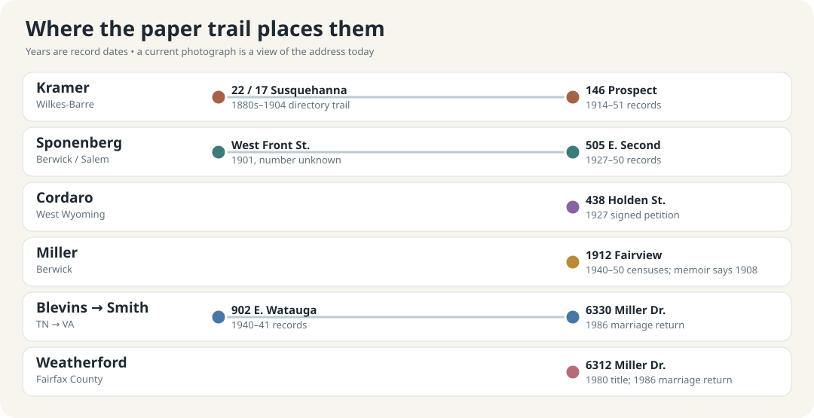

# Family homes: addresses and pictures to compare

**Start with the dated record, then open the picture.** These are places connected to relatives, not a claim that every present building is the one they knew. The links marked *today* lead to outside photo galleries or street views; no listing photographs are copied into this repository. The [Sponenberg house page](family-homes.md) has three more family-attributed old house photographs.

| Family and recorded period | Address evidence | See the place today | What the photo can show |
| --- | --- | --- | --- |
| **Kramer, 1914–51** | **146 Prospect St., Wilkes-Barre, PA.** The [1914 directory](https://pagenweb.org/~luzerne/towns/donnacd.htm) lists older **Ferdinand (c. 1882)** there; his [1940 census](../sources/records/ferdinand-kramer-household-census-1940.jpg), Emil's [draft card](../sources/records/emil-carl-kramer-draft-registration-1940.jpg), [1948 directory](https://westpittstonhistory.org/wp-content/uploads/2021/08/1948-Bell-Telephone-Directory-Pittston-_-Nearby-Points.pdf), and [1951 certificate](../sources/records/ferdinand-kramer-1882-death-certificate-1951.jpg) repeat it. The **1930** Ferdinand Louis household is established, but its street/house-number match needs a separate check. | [Current exterior/interior gallery](https://www.redfin.com/PA/Wilkes-Barre/146-Prospect-St-18702/home/135059789) · [alternate property page](https://www.realtor.com/realestateandhomes-detail/146-Prospect-St_Wilkes-Barre_PA_18702_M49159-64178) | Redfin says **1930** built; Realtor says **1909**. Their conflict, and the 1914 directory, mean neither year should be used to assert that the pictured structure was the Kramers' earliest house. Exterior and interior are modern views. |
| **Kramer, 1936–40** | **71 Flick St., Parsons, PA** was **Mary Andrews's** stated home on her [1936 marriage application](../sources/records/ferdinand-louis-kramer-mary-andrews-marriage-1936.jpg). By the [1940 census](../sources/records/ferdinand-mary-kramer-census-1940.jpg), Mary, Ferdinand Louis and their infant son lived at **19 Flick St.**; the sheet reports **$5 monthly rent**. Ferdinand's [signed draft card](../sources/records/ferdinand-louis-kramer-draft-registration-1940.jpg) repeats 19 Flick. MyHeritage's card index misreads “Flick” as “Fick.” | [71 Flick on a current map](https://www.google.com/maps/search/?api=1&query=71+Flick+St+Wilkes-Barre+PA+18705) · [current 19 Flick property photo](https://www.zillow.com/homedetails/19-Flick-St-Wilkes-Barre-PA-18705/53510710_zpid/) · [19 Flick map and street imagery](https://www.google.com/maps/search/?api=1&query=19+Flick+St+Wilkes-Barre+PA+18705) | The records give **two house numbers on Flick Street**; whether the household moved or the street was renumbered is unresolved. The 1940 household explicitly rented; the current 19 Flick image does not establish that its building was there in 1940. A period photo or building card is still needed. |
| **Sponenberg/Mensinger, 1927–50** | **505 E. Second St., Berwick mailing address / Salem Twp., PA.** The [1927/32 directories](https://www.myheritage.com/research/record-10705-2100012/edward-j-sponenberg-in-us-city-directories) and newly saved [1940 original census, sheet 4B, lines 50–53](../sources/records/edward-jennie-sponenberg-census-1940.jpg) name Edward, Jennie, Ray and Dorothy there. Edward reported the same house in 1935. The [1910 original](../sources/records/edward-jennie-sponenberg-census-1910.jpg) instead locates their family in Salem Township **without a street number**. | [Current street-view property page](https://www.zillow.com/homedetails/505-E-2nd-St-Berwick-PA-18603/299280889_zpid/) · [older, family-attributed homes of Edward's uncles](family-homes.md) | Whether today's structure is Edward's house, or the house his [1915 biography](../sources/records/edward-sponenberg-biography-1915-187.jpg) says he built in **1907**, is unresolved. The 1910 census's **308/309** are enumeration dwelling/family numbers, **not 308 or 309 Second Street**. |
| **Cordaro/Magro, 1927** | **438 Holden St., West Wyoming, PA.** Antonio Cordaro's [signed naturalization petition](../sources/records/antonio-cordaro-petition-1927.jpg) puts him there with wife Pietra and their five named children. It does not say they owned the house. | [Present house photo and property page](https://www.realtor.com/realestateandhomes-detail/438-Holden-St_Wyoming_PA_18644_M46030-31084) · [property details](https://www.redfin.com/PA/Wyoming/438-Holden-St-18644/home/134024604) | Redfin's public facts give a **1920** build year, consistent with the 1927 address, but a dated deed or historic photo is needed to prove this is the same structure Antonio saw. The modern postal label says *Wyoming*; the petition says *West Wyoming*. |
| **Miller, 1940–50** | **1912 Fairview Ave., Berwick, PA** in the [1940 index](https://www.myheritage.com/research/record-10053-108307645/marqueen-miller-in-1940-united-states-federal-census) and [1950 original census](../sources/records/miller-berwick-household-census-1950-sheet15.jpg). Paulene remembered **1908 Fairview Ave.** in her [memoir](https://bhaven.org/paulene/life-journey). | [1912 Fairview today](https://www.zillow.com/homedetails/1912-Fairview-Ave-Berwick-PA-18603/52130468_zpid/) · [1908 Fairview today](https://www.zillow.com/homedetails/1908-Fairview-Ave-Berwick-PA-18603/52130466_zpid/) | **Do not caption either current building as the childhood house.** Listing facts date today's 1912 building to **1993** and 1908's mobile home to **1975**. The old home may have been replaced, and the memoir/census address difference remains unexplained. |
| **Blevins/Hines, 1940–41** | **902 E. Watauga Ave., Johnson City, TN.** The [1940 census](../sources/records/blevins-household-census-1940.jpg) records W. Howard and Mary Blevins with Gladys there; Mary's father John Hines's [1941 death certificate](../sources/records/john-jackson-hines-death-1941.jpg) gives the same street and number. | [Current street-view image](https://www.realtor.com/realestateandhomes-detail/902-E-Watauga-Ave_Johnson-City_TN_37601_M86275-62193) | Realtor's **1935** construction year makes continuity *plausible*, but does not independently prove the same house survives or show how it looked in 1940. |
| **Smith and Weatherford, 1980s** | **6330 and 6312 Miller Dr., Franconia/Fairfax County, VA.** Alice and John's [1986 marriage return](https://www.familysearch.org/ark:/61903/1:1:QK9V-J612?lang=en) names those two addresses; [Fairfax parcel history](https://icare.fairfaxcounty.gov/ffxcare/search/commonsearch.aspx?mode=address) names Garnett and Florence at 6312 and the Smith title trail at 6330. | [Miller Drive map and street-level imagery](https://www.google.com/maps/search/?api=1&query=6312+Miller+Dr+Alexandria+VA+22315) · [Fairfax neighborhood map](../maps/colette-neighborhood.svg) | These are family residences, not properties to assign to unrelated nearby listings. County records report the 6312 house as **1980** and 6330 as **1960**; look for family snapshots for period interiors or exterior changes. |

## Addresses that need a better pin

- **Older Wilkes-Barre Kramers:** directory transcriptions put Matthias/Matthew's household at **22 Susquehanna** in the 1880s–90s and **17 Susquehanna** in 1900–04. A digitized street plan or original directory is needed to determine whether the street was renumbered or the family moved. [Directory trail](../branches/kramer.md#people-and-work).
- **Edward Sponenberg before Second Street:** the [1901 directory](../sources/records/sponenberg-berwick-directory-1901-p169.jpg) says **West Front Street** but has no house number. The newly saved **1910** Salem Township sheet identifies Edward, Jennie, Ray and Elsie and says Edward **owned a mortgaged home**; it gives no street address. It cannot identify his 1907-built house. [Detailed house account](family-homes.md).
- **Italian and German ancestors:** Milocca/Sutera and Unadingen records establish villages, not present-day house numbers. The [Sicily map](../maps/cordaro-sutera-places.svg) and [European places map](../maps/europe-family-places.svg) are the honest visual scale until a cadastral, church, or household record gives a plot.
- **Raber, Kreischer, Balliet and older Miller branches:** Justin's family account places older Kreischers near **Vine/13th Street** and Sponenbergs on **Second Street** in Berwick, but supplies neither house numbers nor years for those recollections. The [Raber/Kreischer/Balliet original-record trail](../branches/raber-kreischer-balliet-record-trail.md) has households and jobs; a dated directory or deed must provide a safe photo match.
- **Mulhall/Corbett, Morrison and Neathery/Phelps branches:** their [DC](../branches/smith-mulhall-corbett.md), [Indiana](../branches/morrison-hollinger.md) and [Virginia/North Carolina](../branches/neathery-phelps.md) censuses and land records put them in meaningful neighborhoods or districts, but this pass has not established a confidently readable, still-matchable house number. Street handwriting in the Mulhall census needs an independent directory check. The [1885 Phelps land papers](../sources/records/README.md) describe land interests, not a modern street address.

**Next record to seek:** original deed and tax/building history for **146 Prospect, 505 E. Second, 438 Holden, 1912 Fairview, and 902 E. Watauga**. Date-stamped family photographs, insurance maps, local historical society photo collections and Sanborn maps could then connect a building to the household rather than merely matching a modern address. [Research questions](../research/open-questions.md).
